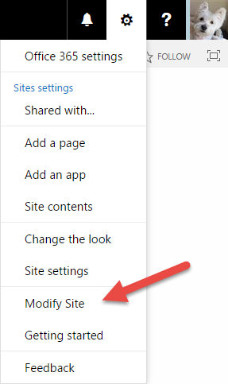

Custom actions in the SharePoint Add-in model
=============================================

Summary
-------

The approach you take to modify list item menus and the ribbon in SharePoint is different in the new SharePoint Add-in model than it was with Full Trust Code. In a typical Full Trust Code (FTC) / Farm Solution scenario, list item menus and ribbon modifications were defined in XML (custom actions), packaged in features, and deployed via SharePoint Solutions.

In an SharePoint Add-in model scenario, you use the SharePoint Client-side Object Model (CSOM) or REST API to create custom actions that modify list item menus and the ribbon. This pattern is commonly referred to as the *remote provisioning pattern*.

High-level guidelines
---------------------

As a rule of a thumb, we would like to provide the following high-level guidelines for creating and deploying custom actions in the new SharePoint Add-in model.

- Custom actions may be used to modify list item menus and the ribbon.
- You cannot hide menu items using a custom action directly from an Add-in that implements a custom action.
	+ This is because the [HideCustomAction Element (MSDN API Documentation)](https://msdn.microsoft.com/en-us/library/office/ms414790.aspx) is not available in the SharePoint ECMA Clients-ide Object Model (CSOM) - [UserCustomAction properties (MSDN API Documentation)](https://msdn.microsoft.com/en-us/library/microsoft.sharepoint.client.usercustomaction_properties.aspx), or the SharePoint/Office 365 REST APIs - [SP.UserCustomActionCollection object (sp.js) (MSDN API Documentation)](https://msdn.microsoft.com/en-us/library/office/jj247124.aspx).
	+ If you need to hide menu items, you must use a custom action to embed JavaScript or customized CSS in SharePoint pages. The JavaScript or CSS embedded in the SharePoint pages hides the menu item.
- Use the SharePoint Client-side Object Model (CSOM), and/or the SharePoint/Office 365 REST APIs to implement custom actions.

**Getting started**

The following sample demonstrates how to add a custom action to the site settings menu in the host web, how to show a dialog in a custom action, how to hide a dialog that hosts a page from a remote add-in web, and how to use a custom action to create lists and set the theme of a web.

- [Provisioning.SiteModifier (O365 PnP Sample)](https://github.com/SharePoint/PnP/tree/master/Samples/Provisioning.SiteModifier)

	Here you can see the link the custom action in the sample adds to the Site Settings menu.
	
	
	
	Here you can see the popup window opened via the Modify Site link.
	
	

Related links
=============

- [User controls and Web controls (SharePoint Add-in Recipe)](user-controls-and-web-controls-sharepoint-add-in.md)
- Guidance articles at [http://aka.ms/OfficeDevPnPGuidance](http://aka.ms/OfficeDevPnPGuidance "Guidance Articles")
- References in MSDN at [http://aka.ms/OfficeDevPnPMSDN](http://aka.ms/OfficeDevPnPMSDN "References in MSDN")
- Videos at [http://aka.ms/OfficeDevPnPVideos](http://aka.ms/OfficeDevPnPVideos "Videos")

Related PnP samples
===================

- [Provisioning.SiteModifier (O365 PnP Sample)](https://github.com/SharePoint/PnP/tree/master/Samples/Provisioning.SiteModifier)
- Samples and content at [http://aka.ms/OfficeDevPnP](http://aka.ms/OfficeDevPnP)

Applies to
==========
- Office 365 Multi Tenant (MT)
- Office 365 Dedicated (D)
- SharePoint 2013 on-premises
