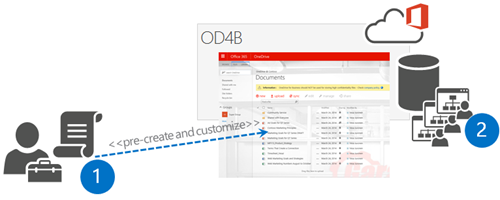

# Customize OneDrive for Business sites

OneDrive for Business sites can be customized in Office 365 or with the add-in model in general, based on company requirements. Actual techniques to perform this customization are different than in the on-premises scenario because only add-in model techniques can be used. 

> [!IMPORTANT]
> This applies to **only** the *classic* OneDrive for Business experience in SharePoint Online. If you are using the new default experience, this is not supported. Modern or new experiences of OneDrive for Business do not support custom branding. Tenant administrators can control the default experience from the SharePoint Online administrative settings.
> 
> Patterns for Dedicated and on-premises are identical with the add-in model techniques, but there are differences in the possible technologies that can be used.

## Why customize OneDrive for Business sites?

There are numerous aspects to applying customizations to OneDrive for Business (OD4B) sites. You can customize these sites because they are SharePoint sites, but you should always consider the short-term and long-term impact of the customizations. 

Following are the high-level guidelines for customizing OneDrive for Business sites: 

- Apply branding customizations by using Office 365 themes or the SharePoint site theming engine. 

- If theme engines are not enough, you can adjust some CSS settings by using alternate CSS options.
 
- Avoid customizing OD4B sites by using custom master pages because this causes you additional long-term costs and challenges with future updates.
 
  - In most cases, you can achieve all common branding scenarios with themes and alternate CSS.
  - If you choose to use custom master pages, be prepared to apply changes to the sites when major functional updates are applied to Office 365.

- You can use JavaScript embedding to modify or hide functionalities from the site.

- You can use CSOM to control, for example, language or regional settings in the OD4B sites (see new APIs).

- We do not recommend using content types and site columns in OD4B sites. Use OD4B sites for personal unstructured data and documents. Use team sites and collaboration sites for company data and documents, where you can use whatever information management policies and metadata you want.

Customizations are definitely supported in Office 365, and you can keep on using them with OD4B sites. We just want to ensure that you consider the impact of these customizations from an operational and maintenance perspective. This is not really specific for SharePoint, but rather a rule of thumb for any IT solution built with any platform. 

Following is an example of an OD4B site that has been customized using the previous guidelines. In this case, the end result has been achieved with a combination of Office 365 themes, a site theme, and use of the JavaScript embedding pattern.

## Challenge with applying OneDrive for Business site customizations

Each OneDrive for Business site currently uses the same architecture as that of a personal site or My Sites, which was used in SharePoint 2007 and SharePoint 2010. This means that each OneDrive for Business site is their own site collection, and we do not have any centralized location to apply branding or any other customizations.

The classic solution that was used to apply needed configurations to the OneDrive for Business sites was based on feature stapling at the farm level. This meant that you deployed a farm solution to your SharePoint farm and used the Feature Framework to associate your custom feature to be activated each time a My Site was created, which was then responsible for applying needed customizations. 

This approach does not work in Office 365 because it requires a farm solution to be deployed, and that is impossible with Office 365 sites. Therefore, we need to look at alternatives to apply the needed changes to the sites.

In Office 365, there is no centralized event raised that we could attach our custom code to when an OD4B site is created. Therefore, we need to think about alternative solutions, which is quite common with add-in model approaches. Do not get stuck on old models; think about how to achieve the same end result using new APIs and technologies. From a requirement perspective, it does not really matter how we apply the customizations to the sites, as long as they are applied, because the business requirement is not to use feature stapling, it’s to apply needed customizations by using whatever technical mechanism is supported. 

## Options for applying customizations

There are four different mechanisms to apply centralized customizations to OD4B sites in Office 365. You could also consider a manual option as the fifth one, but in the case of having hundreds or thousands of OD4B sites, using the manual option is not realistic. The options are:
 
- Office 365 suite level settings (Office 365 themes and other settings)
- Hidden app part with user context
- Pre-create and apply configuration
- Remote timer job based on user profile updates

Each of these options has advantages and disadvantages, and the right option depends on your detailed business requirements. You can also apply some settings from the Office 365 suite level, but you would be looking for some more specifics, so actual customizations are needed. 

### Office 365 suite level settings

Office 365 is much more than just SharePoint. You can find additional services that are not based on the SharePoint architecture, such as Delve and Yammer. This means that the enterprise branding and configuration is not just about controlling what we have in the SharePoint sites; rather, we should be thinking about the overall end user experience and how we can provide consistent configurations across different services.

A classic example of these enterprise requirements is branding, and for that we already have Office 365 theming introduced, which can be used to control some level of branding. 

The following diagram shows the current settings for Office 365 theming, which can be applied across all Office 365 services.

Because by default Office 365 theme settings control the OD4B site suite bar, you will most likely use these options together with other options to ensure that you can provide at least the right branding elements across your OD4B sites. Notice that when you change, for example, the Office 365 theme settings in the Office 365 admin tool, it does take quite a long time to get the settings applied for OD4B sites, so be patient. 

### Hidden app part with user context

This approach uses a centralized landing page as the location for starting the needed customization process. This means that you need one centralized location, such as a company intranet home page, where users always land when they open their browser. This is a pretty typical process for mid-sized and larger enterprises where the corporate landing page is controlled by using Group Policy settings in Active Directory. This ensures that end users cannot override the default welcome page of the company domain-joined browsers.

When a user arrives on the intranet site, a hidden app part on the page starts the customization process. It can actually be responsible for the entire OD4B site creation as well because normally a user would have to visit the OD4B site once before the site creation process starts. The hidden app part hosts a page from the provider-hosted add-in hosted in Azure. This page is then responsible for starting the customization process.

Let’s have a closer look at the logical design of this approach.

1. Place hidden app part on centralized site where end users land. Typically this is the corporate intranet front page.

2. App part is hosting a page from the provider-hosted add-in, where in the server-side code, we initiate the customization process by adding needed metadata to the Azure Storage Queue. This means that this page only receives the customization request, but does not actually apply any changes to keep the processing time normal.

3. This is the actual Azure Storage Queue, which receives the messages to queue for processing. This way we can handle the customization controlling process asynchronously so that it does not really matter how long the end user stays on the front page of the intranet. If the customization process was synchronous, we would be dependent on the end user keeping the browser open in the intranet front page until page execution was finalized. This would definitely not be an optimal end user experience. 

4. WebJob is hooked to follow the Azure Storage Queue, which is called when a new item is placed in the storage queue. This WebJob receives the needed parameters and metadata from the queued message to access the right site collection. WebJob uses an app-only token and has been granted the needed permissions to manipulate site collections at the tenant level.

5. Actual customizations are applied one-by-one to the sites of the users who visit the intranet front page to start the process.

This is the most reliable process for ensuring that there are accurate configurations in the OD4B sites. You can easily add customization versioning logic to the process, which applies any needed updates to the OD4B sites when there is an update needed and the user visits the intranet front page next time. This option does, however, require that you have that centralized location where your end users are landing.

If you are familiar with classic SharePoint development models with farm solutions, this process is similar to one-time executing timer jobs.

### Pre-create and apply configuration

This option relies on the pre-creation of the OD4B sites before users access them. This can be achieved by using relatively new API that provides us a way to create OD4B sites for specific users in a batch process by using either CSOM or REST. The needed code can be initiated by using a PowerShell script or by writing actual code that calls the remote APIs. 

1. Administrator uses the remote creation APIs to create OD4B sites for users and applies the needed customizations to the OD4B sites as part of the script process.

2. Actual OD4B sites are created to Office 365 for specific users and associated to their user profiles.

While this is a reliable process, you have to manage new persons and updates manually, which could mean more work than using the hidden app part approach. Nevertheless, this is a valid approach and is especially useful if you are migrating from some other file sharing solution to the OD4B and want to avoid users needing to access the OD4B site one time before actual site creation is started.

### Remote timer job based on user profile updates

This approach means scanning through user profiles and checking to whom the OD4B site has been created and then applying the changes to the sites as needed. This would mean scheduled jobs running outside of SharePoint, which periodically check status and perform needed customizations. Scheduled jobs could be running as WebJobs in Azure or as PowerShell scripts in your own Windows scheduler. Obviously, the scale of the deployment has a huge impact on the chosen scheduling option.

1. Scheduled task is initiated, which accesses user profiles to check who has the OD4B site provisioned. 

2. Actual sites are customized one-by-one based on the business requirements.

One of the key downsides of this option is that there can clearly be a situation where a user can access the OD4B sites before the customizations have been applied. At the same time, this option is an interesting add-on for other options to ensure that end users have not changed any of the required settings on the sites or to check that the OD4B site content aligns with the company policies.

## See also

- [Customizing OneDrive for Business sites with app model (MSDN blog article)](https://blogs.msdn.microsoft.com/vesku/2015/01/05/customizing-onedrive-for-business-sites-with-app-model/)
- [Classic app part and sync process for OD4B site customization (GitHub)](https://github.com/SharePoint/PnP/tree/master/Solutions/Provisioning.OneDrive)
- [Pre-create OD4B sites for users](https://github.com/SharePoint/PnP/tree/master/Samples/Provisioning.OneDriveProvisioning)
- [SharePoint site branding and page customization solutions](sharepoint-site-branding-and-page-customization-solutions.md)    
- [Branding and site provisioning solutions for SharePoint](branding-and-site-provisioning-solutions-for-sharepoint.md)