# Customize the UX by using SharePoint provider-hosted add-ins

Customize SharePoint UX components remotely by using provider-hosted add-ins. 

_**Applies to:** Office 365 | SharePoint 2013 | SharePoint Online_

This article describes samples that show best practices for customizing SharePoint UX components, including the following scenarios:

- Page manipulation (adding and modifying a wiki page).
    
- Showing add-ins and data in modal dialog boxes.
    
- Creating personalized UI elements.
    
- Client-side rendering (deploying JSLink files that customize the rendering of fields in SharePoint lists).
    
- Web Part and add-in part manipulation (remotely provision and run an add-in script part in a provider-hosted add-in).
    
- Data aggregation and caching (using HTML5 local storage and HTTP cookies to reduce the number of service calls to SharePoint).

## Page manipulation
<a name="bmPageManipulate"> </a>

The [Core.ModifyPages](https://github.com/SharePoint/PnP/tree/dev/Samples/Core.ModifyPages) sample includes two page manipulation scenarios:

- Create a wiki page.
    
- Modify the layout of a wiki page. 
    
This sample uses the default site pages library and existing out-of-the-box layouts. You can also update it to use a custom wiki page library and custom layouts. The add-in UI includes two buttons that create both wiki pages, and two links for viewing the wiki pages you create.

**Figure 1. Start page for the page manipulation sample**

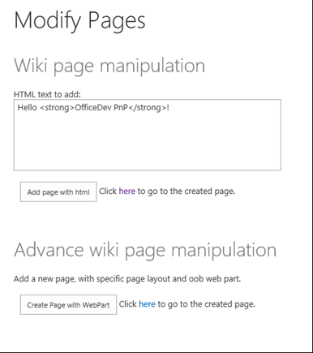

The sample code for the first scenario determines whether you've already created the wiki page. If not, it adds the file to the site pages library and returns its URL.

> [!NOTE] 
> The code in this article is provided as-is, without warranty of any kind, either express or implied, including any implied warranties of fitness for a particular purpose, merchantability, or non-infringement.

```
var newpage = pageLibrary.RootFolder.Files.AddTemplateFile(newWikiPageUrl, TemplateFileType.WikiPage);
ctx.Load(newpage);
ctx.ExecuteQuery();
wikiPageUrl = String.Format("sitepages/{0}", wikiPageName);
```

In both scenarios, the sample adds the HTML entered via the text box on the start page by using the **AddHtmlToWikiPage** method in a helper class named **LabHelper**. This method inserts the HTML from the form inside the _WikiField_ field of the wiki page.

```
public void AddHtmlToWikiPage(ClientContext ctx, Web web, string folder, string html, string page)
        {
            Microsoft.SharePoint.Client.Folder pagesLib = web.GetFolderByServerRelativeUrl(folder);
            ctx.Load(pagesLib.Files);
            ctx.ExecuteQuery();

            Microsoft.SharePoint.Client.File wikiPage = null;

            foreach (Microsoft.SharePoint.Client.File aspxFile in pagesLib.Files)
            {
                if (aspxFile.Name.Equals(page, StringComparison.InvariantCultureIgnoreCase))
                {
                    wikiPage = aspxFile;
                    break;
                }
            }

            if (wikiPage == null)
            {
                return;
            }

            ctx.Load(wikiPage);
            ctx.Load(wikiPage.ListItemAllFields);
            ctx.ExecuteQuery();

            string wikiField = (string)wikiPage.ListItemAllFields["WikiField"];

            Microsoft.SharePoint.Client.ListItem listItem = wikiPage.ListItemAllFields;
            listItem["WikiField"] = html;
            listItem.Update();
            ctx.ExecuteQuery();
        }
```

The sample code for the second scenario creates a new **WebPartEntity** instance. It then uses methods in a helper class to populate the Web Part with XML. The XML displays a promoted links list, including both [http://www.bing.com](http://www.bing.com) and the home page of the [OfficeDev/PnP GitHub](https://github.com/SharePoint/PnP) repository.

```
WebPartEntity wp2 = new WebPartEntity();
wp2.WebPartXml = new LabHelper().WpPromotedLinks(linksID, string.Format("{0}/Lists/{1}", 
                                                                Request.QueryString["SPHostUrl"], "Links"), 
                                                                string.Format("{0}/{1}", Request.QueryString["SPHostUrl"], 
                                                                scenario2PageUrl), "$Resources:core,linksList");
wp2.WebPartIndex = 1;
wp2.WebPartTitle = "Links";

new LabHelper().AddWebPartToWikiPage(ctx, ctx.Web, "SitePages", wp2, scenario2Page, 2, 1, false);
new LabHelper().AddHtmlToWikiPage(ctx, ctx.Web, "SitePages", htmlEntry.Text, scenario2Page, 2, 2);

this.hplPage2.NavigateUrl = string.Format("{0}/{1}", Request.QueryString["SPHostUrl"], scenario2PageUrl);
```

The helper code displays the promoted links with a table inside an **XsltListViewWebPart** Web Part.

**Figure 2. Second wiki page with XsltListViewWebPart and promoted links table**

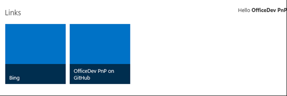

The **WpPromotedLinks** object on the **LabHelper** instance contains XML that defines the appearance of the Web Part that will be embedded into the wiki page. The **AddWebPartToWikiPage** method then inserts the newly defined Web Part inside a new `div` tag on the wiki page.

```
XmlDocument xd = new XmlDocument();
            xd.PreserveWhitespace = true;
            xd.LoadXml(wikiField);

            // Sometimes the wikifield content seems to be surrounded by an additional div. 
            XmlElement layoutsTable = xd.SelectSingleNode("div/div/table") as XmlElement;
            if (layoutsTable == null)
            {
                layoutsTable = xd.SelectSingleNode("div/table") as XmlElement;
            }

            XmlElement layoutsZoneInner = layoutsTable.SelectSingleNode(string.Format("tbody/tr[{0}]/td[{1}]/div/div", row, col)) as XmlElement;
            // - space element
            XmlElement space = xd.CreateElement("p");
            XmlText text = xd.CreateTextNode(" ");
            space.AppendChild(text);

            // - wpBoxDiv
            XmlElement wpBoxDiv = xd.CreateElement("div");
            layoutsZoneInner.AppendChild(wpBoxDiv);

            if (addSpace)
            {
                layoutsZoneInner.AppendChild(space);
            }

            XmlAttribute attribute = xd.CreateAttribute("class");
            wpBoxDiv.Attributes.Append(attribute);
            attribute.Value = "ms-rtestate-read ms-rte-wpbox";
            attribute = xd.CreateAttribute("contentEditable");
            wpBoxDiv.Attributes.Append(attribute);
            attribute.Value = "false";
            // - div1
            XmlElement div1 = xd.CreateElement("div");
            wpBoxDiv.AppendChild(div1);
            div1.IsEmpty = false;
            attribute = xd.CreateAttribute("class");
            div1.Attributes.Append(attribute);
            attribute.Value = "ms-rtestate-read " + wpdNew.Id.ToString("D");
            attribute = xd.CreateAttribute("id");
            div1.Attributes.Append(attribute);
            attribute.Value = "div_" + wpdNew.Id.ToString("D");
            // - div2
            XmlElement div2 = xd.CreateElement("div");
            wpBoxDiv.AppendChild(div2);
            div2.IsEmpty = false;
            attribute = xd.CreateAttribute("style");
            div2.Attributes.Append(attribute);
            attribute.Value = "display:none";
            attribute = xd.CreateAttribute("id");
            div2.Attributes.Append(attribute);
            attribute.Value = "vid_" + wpdNew.Id.ToString("D");

            ListItem listItem = webPartPage.ListItemAllFields;
            listItem["WikiField"] = xd.OuterXml;
            listItem.Update();
            ctx.ExecuteQuery();
```

## Showing add-ins and data in modal dialog boxes
<a name="bmPageManipulate"> </a>

The [Core.Dialog](https://github.com/SharePoint/PnP/tree/dev/Scenarios/Core.Dialog) sample shows two methods for embedding modal dialog box links. These links display a provider-hosted add-in page into a SharePoint host site. The add-in uses the client object model (CSOM) to create the custom action and JavaScript to start and display information inside the dialog box. Because some of this information comes from the host site, it also uses the JavaScript object model (JSOM) to retrieve information from the host site. And because the add-in is running in a different domain than the SharePoint host site, it also uses the SharePoint cross-domain library to make the calls to the host site.

> [!NOTE] 
> For more information about using the cross-domain library in this scenario, see [Access SharePoint 2013 data from add-ins using the cross-domain library](http://msdn.microsoft.com/library/bc37ff5c-1285-40af-98ae-01286696242d%28Office.15%29.aspx).

The start page is the page that appears in the dialog box. To handle any differences in display given the display context (dialog box versus full-page), the add-in determines whether it's being displayed in a dialog box. It does this by using a query string parameter that is passed along with the links that start the dialog boxes.

```
private string SetIsDlg(string isDlgValue)
        {
            var urlParams = HttpUtility.ParseQueryString(Request.QueryString.ToString());
            urlParams.Set("IsDlg", isDlgValue);
            return string.Format("{0}://{1}:{2}{3}?{4}", Request.Url.Scheme, Request.Url.Host, Request.Url.Port, Request.Url.AbsolutePath, urlParams.ToString());
        }
```

You could, for example, choose to display certain UI elements (like buttons) or even different page layouts, depending on whether or not the content is being displayed in a dialog box.

The start page UI presents two options for creating links to the dialog box, along with a list of all the lists on the host web. It also presents **OK** and **Cancel** buttons that you can use in the dialog box context to close the dialog box and/or prompt additional actions in the add-in.

When you choose the **Add menu item** button, the add-in creates a **CustomActionEntity** object that starts the dialog box. It then uses the [OfficeDevPnP Core extension](https://github.com/SharePoint/PnP/tree/dev/OfficeDevPnP.Core) method named **AddCustomAction** to add the new custom action to the **Site Settings** menu.

```
StringBuilder modelDialogScript = new StringBuilder(10);
modelDialogScript.Append("javascript:var dlg=SP.UI.ModalDialog.showModalDialog({url: '");
modelDialogScript.Append(String.Format("{0}", SetIsDlg("1")));
modelDialogScript.Append("', dialogReturnValueCallback:function(res, val) {} });");       

// Create a custom action.
CustomActionEntity customAction = new CustomActionEntity()
{
  Title = "Office AMS Dialog sample",                
  Description = "Shows how to start an add-in inside a dialog box.",
  Location = "Microsoft.SharePoint.StandardMenu",
  Group = "SiteActions",
  Sequence = 10000,
  Url = modelDialogScript.ToString(),
};

// Add the custom action to the site.
cc.Web.AddCustomAction(customAction);
```

The **AddCustomAction** method adds the custom action to the **UserCustomActions** collection that is associated with the SharePoint site.

```
var newAction = existingActions.Add();
            newAction.Description = customAction.Description;
            newAction.Location = customAction.Location;
            if (customAction.Location == JavaScriptExtensions.SCRIPT_LOCATION)
            {
                newAction.ScriptBlock = customAction.ScriptBlock;
            }
            else
            {
                newAction.Sequence = customAction.Sequence;
                newAction.Url = customAction.Url;
                newAction.Group = customAction.Group;
                newAction.Title = customAction.Title;
                newAction.ImageUrl = customAction.ImageUrl;
                if (customAction.Rights != null)
                {
                    newAction.Rights = customAction.Rights;
                }
            }
            newAction.Update();
            web.Context.Load(web, w => w.UserCustomActions);
            web.Context.ExecuteQuery();
```

When you choose the **Add page with script editor web part** button, the add-in uses the methods **AddWikiPage** and **AddWebPartToWikiPage** to create a wiki page inside the site pages library and add a configured Script Editor Web Part to the page.

```
string scenario1Page = String.Format("scenario1-{0}.aspx", DateTime.Now.Ticks);
string scenario1PageUrl = cc.Web.AddWikiPage("Site Pages", scenario1Page);
cc.Web.AddLayoutToWikiPage("SitePages", WikiPageLayout.OneColumn, scenario1Page);
WebPartEntity scriptEditorWp = new WebPartEntity();
scriptEditorWp.WebPartXml = ScriptEditorWebPart();
scriptEditorWp.WebPartIndex = 1;
scriptEditorWp.WebPartTitle = "Script editor test"; 
cc.Web.AddWebPartToWikiPage("SitePages", scriptEditorWp, scenario1Page, 1, 1, false);
```

The **AddWikiPage** method loads the site pages library. If the wiki page specified by the add-in [OfficeDevPnP core](https://github.com/SharePoint/PnP/tree/dev/OfficeDevPnP.Core) doesn't already exist, it creates the page.

```
public static string AddWikiPage(this Web web, string wikiPageLibraryName, string wikiPageName)
        {
            string wikiPageUrl = "";


            var pageLibrary = web.Lists.GetByTitle(wikiPageLibraryName);

            web.Context.Load(pageLibrary.RootFolder, f => f.ServerRelativeUrl);
            web.Context.ExecuteQuery();

            var pageLibraryUrl = pageLibrary.RootFolder.ServerRelativeUrl;
            var newWikiPageUrl = pageLibraryUrl + "/" + wikiPageName;

            var currentPageFile = web.GetFileByServerRelativeUrl(newWikiPageUrl);

            web.Context.Load(currentPageFile, f => f.Exists);
            web.Context.ExecuteQuery();

            if (!currentPageFile.Exists)
            {
                var newpage = pageLibrary.RootFolder.Files.AddTemplateFile(newWikiPageUrl, TemplateFileType.WikiPage);

                web.Context.Load(newpage);
                web.Context.ExecuteQuery();

                wikiPageUrl = UrlUtility.Combine("sitepages", wikiPageName);
            }

            return wikiPageUrl;
        }
```

The **AddWebPartToWikiPage** method inserts the newly defined Web Part inside a new `<div>` tag on the wiki page. It then uses JSOM and the cross-domain library to retrieve the information that populates the list of SharePoint lists on the host web.

```
function printAllListNamesFromHostWeb() {
        var context;
        var factory;
        var appContextSite;
        var collList;

        context = new SP.ClientContext(appWebUrl);
        factory = new SP.ProxyWebRequestExecutorFactory(appWebUrl);
        context.set_webRequestExecutorFactory(factory);
        appContextSite = new SP.AppContextSite(context, spHostUrl);

        this.web = appContextSite.get_web();
        collList = this.web.get_lists();
        context.load(collList);

        context.executeQueryAsync(
            Function.createDelegate(this, successHandler),
            Function.createDelegate(this, errorHandler)
        );
```

## Personalized UI elements
<a name="bmPersonalized"> </a>

The [Branding.UIElementPersonalization](https://github.com/SharePoint/PnP/tree/dev/Samples/Branding.UIElementPersonalization) sample shows how to use embedded JavaScript and values stored in user profiles and SharePoint lists to personalize UI elements on the host web. It also uses HTML5 local storage to minimize calls to the host site.

The sample's start page prompts you to add one of three strings (XX, YY, or ZZ) to the **About Me** section of your user profile page.

The add-in has already deployed three images and a SharePoint list that contains titles and URLs for each image, along with an additional field that ties each image to one of the three strings. After you choose the **Inject customization** button, the add-in embeds the personalize.js file into the user custom actions collection.

```
public void AddPersonalizeJsLink(ClientContext ctx, Web web)
        {
            string scenarioUrl = String.Format("{0}://{1}:{2}/Scripts", this.Request.Url.Scheme,
                                                this.Request.Url.DnsSafeHost, this.Request.Url.Port);
            string revision = Guid.NewGuid().ToString().Replace("-", "");
            string personalizeJsLink = string.Format("{0}/{1}?rev={2}", scenarioUrl, "personalize.js", revision);

            StringBuilder scripts = new StringBuilder(@"
                var headID = document.getElementsByTagName('head')[0]; 
                var");

            scripts.AppendFormat(@"
                newScript = document.createElement('script');
                newScript.type = 'text/javascript';
                newScript.src = '{0}';
                headID.appendChild(newScript);", personalizeJsLink);
            string scriptBlock = scripts.ToString();

            var existingActions = web.UserCustomActions;
            ctx.Load(existingActions);
            ctx.ExecuteQuery();

            var actions = existingActions.ToArray();
            foreach (var action in actions)
            {
                if (action.Description == "personalize" &amp;&amp;
                    action.Location == "ScriptLink")
                {
                    action.DeleteObject();
                    ctx.ExecuteQuery();
                }
            }

            var newAction = existingActions.Add();
            newAction.Description = "personalize";
            newAction.Location = "ScriptLink";
            
            newAction.ScriptBlock = scriptBlock;
            newAction.Update();
            ctx.Load(web, s => s.UserCustomActions);
            ctx.ExecuteQuery();
        }
```

Because SharePoint team sites by default use the [Minimal Download Strategy (MDS)](http://msdn.microsoft.com/en-us/library/office/dn456544%28v=office.15%29.aspx), the code in the personalize.js file first attempts to register itself with MDS. This way, when you load the page that contains the JavaScript, the MDS engine starets the main function (**RemoteManager_Inject**). If MDS is disabled, this function starts right away.

```
// Register script for MDS, if possible.
RegisterModuleInit("personalize.js", RemoteManager_Inject); //MDS registration
RemoteManager_Inject(); //non-MDS run

if (typeof (Sys) != "undefined" &amp;&amp; Boolean(Sys) &amp;&amp; Boolean(Sys.Application)) {
    Sys.Application.notifyScriptLoaded();h
}

if (typeof (NotifyScriptLoadedAndExecuteWaitingJobs) == "function") {
    NotifyScriptLoadedAndExecuteWaitingJobs("scenario1.js");
}
// The RemoteManager_Inject function is the entry point for loading the other scripts that perform the customizations. When a given script depends on another script, be sure to load the dependent script after the one on which it depends. This sample loads the JQuery library before the personalizeIt function that uses JQuery.
function RemoteManager_Inject() {

    var jQuery = "https://ajax.aspnetcdn.com/ajax/jQuery/jquery-2.0.2.min.js";

    // Load jQuery. 
    loadScript(jQuery, function () {

        personalizeIt();

    });
}
```

The **personalizeIt()** function checks HTML5 local storage before it looks up user profile information. If it goes to user profile information, it stores the information that it retrieves in HTML5 local storage.

```
function personalizeIt() {
    clientContext = SP.ClientContext.get_current();

    var fileref = document.createElement('script');
    fileref.setAttribute("type", "text/javascript");
    fileref.setAttribute("src", "/_layouts/15/SP.UserProfiles.js");
    document.getElementsByTagName("head")[0].appendChild(fileref);

    SP.SOD.executeOrDelayUntilScriptLoaded(function () {        

        // Get localstorage values if they exist.
        buCode = localStorage.getItem("bucode");
        buCodeTimeStamp = localStorage.getItem("buCodeTimeStamp");

        // Determine whether the page already has embedded personalized image.
        var pageTitle = $('#pageTitle')[0].innerHTML;
        if (pageTitle.indexOf("img") > -1) {
            personalized = true;
        }
        else {
            personalized = false;
        }        

        // If nothing is in localstorage, get profile data, which will also populate localstorage.
        if (buCode == "" || buCode == null) {
            getProfileData(clientContext);
            personalized = false;
        }
        else {
            // Check for expiration.            
            if (isKeyExpired("buCodeTimeStamp")) {                
                getProfileData(clientContext);

                if (buCode != "" || buCode != null) {
                    // Set timestamp for expiration.
                    currentTime = Math.floor((new Date().getTime()) / 1000);
                    localStorage.setItem("buCodeTimeStamp", currentTime);

                    // Set personalized to false so that the code can check for a new image in case buCode was updated.
                    personalized = false;
                }
            }            
        }

        // Load image or make sure it is current based on the value in AboutMe.
        if (!personalized) {
            loadPersonalizedImage(buCode);
        }


    }, 'SP.UserProfiles.js');
}
```

The personalize.js file also contains code that checks to determine whether the local storage key has expired. This isn't built into HTML5 local storage.

```
// Check to see if the key has expired
function isKeyExpired(TimeStampKey) {

    // Retrieve the example setting for expiration in seconds.
    var expiryStamp = localStorage.getItem(TimeStampKey);

    if (expiryStamp != null &amp;&amp; cacheTimeout != null) {

        // Retrieve the timestamp and compare against specified cache timeout settings to see if it is expired.
        var currentTime = Math.floor((new Date().getTime()) / 1000);

        if (currentTime - parseInt(expiryStamp) > parseInt(cacheTimeout)) {
            return true; //Expired
        }
        else {
            return false;
        }
    }
    else {
        //default 
        return true;
    }
}
```

## Client-side rendering
<a name="bmPersonalized"> </a>

The [Branding.ClientSideRendering](https://github.com/SharePoint/PnP/tree/dev/Samples/Branding.ClientSideRendering) sample shows how to use a provider-hosted add-in to remotely provision SharePoint artifacts and JSLink files that use client-side rendering to customize the look and behavior of SharePoint list fields. JSLink files and client-side rendering give you control over how controls on a SharePoint page (list views, list fields, and add and edit forms) are rendered. This control can reduce or eliminate the need for custom field types. Client-side rendering makes it possible to remotely control list field appearance remotely.

The sample combines the JSLink samples from the [Client-side rendering (JSLink) code samples](http://code.msdn.microsoft.com/office/Client-side-rendering-JS-2ed3538a) into a single provider-hosted add-in for SharePoint that provisions the JSLink files. Client-side rendering enables you to use standard web technologies, such as HTML and JavaScript, to define the rendering logic of custom and predefined field types.

When you start the sample, the start page prompts you to provision all the samples.

**Figure 3. Start page of the client-side rendering sample**

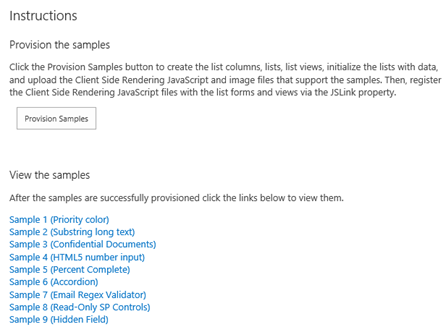

When you choose **Provision Samples**, the add-in deploys an image as well as all the SharePoint lists, list views, list items, forms, and JavaScript files that are used in each sample. The add-in creates a folder named JSLink-Samples in the Style Library, and then uploads the JavaScript files into that folder. The **UploadFileToFolder** method does the work of uploading and checking in each JavaScript file.

```
public static void UploadFileToFolder(Web web, string filePath, Folder folder)
        {
            using (FileStream fs = new FileStream(filePath, FileMode.Open))
            {
                FileCreationInformation flciNewFile = new FileCreationInformation();

                flciNewFile.ContentStream = fs;
                flciNewFile.Url = System.IO.Path.GetFileName(filePath);
                flciNewFile.Overwrite = true;

                Microsoft.SharePoint.Client.File uploadFile = folder.Files.Add(flciNewFile);
                uploadFile.CheckIn("CSR sample js file", CheckinType.MajorCheckIn);

                folder.Context.Load(uploadFile);
                folder.Context.ExecuteQuery();
            }
        }
```

### Sample 1: Apply formatting to a list column

Sample 1 shows how to apply formatting to a list column based on the field value. Priority field values of 1 (High), 2 (Normal), and 3 (Low) are displayed in red, orange, and yellow.

**Figure 4. Custom list field display**

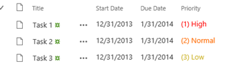

The following JavaScript overrides the default field display and creates a new display template for the **Priority** list field. The technique in the anonymous function that loads the contextual information about the field whose display you want to override is used in all the samples.

```
(function () {

    // Create object that has the context information about the field that you want to render differently.
    var priorityFiledContext = {};
    priorityFiledContext.Templates = {};
    priorityFiledContext.Templates.Fields = {
        // Apply the new rendering for Priority field in List View.
        "Priority": { "View": priorityFiledTemplate }
    };

    SPClientTemplates.TemplateManager.RegisterTemplateOverrides(priorityFiledContext);

})();

// This function provides the rendering logic for list view.
function priorityFiledTemplate(ctx) {

    var priority = ctx.CurrentItem[ctx.CurrentFieldSchema.Name];

    // Return HTML element with appropriate color based on the Priority column's value.
    switch (priority) {
        case "(1) High":
            return "<span style='color :#f00'>" + priority + "</span>";
            break;
        case "(2) Normal":
            return "<span style='color :#ff6a00'>" + priority + "</span>";
            break;
        case "(3) Low":
            return "<span style='color :#cab023'>" + priority + "</span>";
    }
}
```

### Sample 2: Shorten long text

Sample 2 shows you how to truncate long text stored in the **Body** field of an **Announcements** list. The full text displays as a popup that appears whenever you hover over a list item, as shown in Figure 8.

**Figure 5. Shortened list field display showing popup**

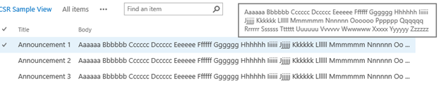

The following JavaScript shortens the **Body** field text and causes the full text to appear as a popup via the **title** attribute on the **span** tag.

```
function bodyFiledTemplate(ctx) {

    var bodyValue = ctx.CurrentItem[ctx.CurrentFieldSchema.Name];

    // This regex expression is used to delete HTML tags from the Body field.
    var regex = /(<([^>]+)>)/ig;

    bodyValue = bodyValue.replace(regex, "");

    var newBodyValue = bodyValue;

    if (bodyValue &amp;&amp; bodyValue.length >= 100)
    {
        newBodyValue = bodyValue.substring(0, 100) + " ...";
    }

    return "<span title='" + bodyValue + "'>" + newBodyValue + "</span>";

}
```

### Sample 3: Display an image with a document name

Sample 3 shows you how to display an image next to a document name inside a document library. A red badge appears whenever the **Confidential** field value is set to **Yes**, as shown in Figure 6. 

**Figure 6. Image display next to document name**

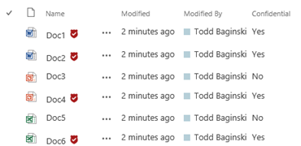

The following JavaScript checks the **Confidential** field value and then customizes the **Name** field display based on the value of another field. The sample uses the image that is uploaded when you choose **Provision Samples**. 

```
function linkFilenameFiledTemplate(ctx) {

    var confidential = ctx.CurrentItem["Confidential"];
    var title = ctx.CurrentItem["FileLeafRef"];

    // This Regex expression use to delete extension (.docx, .pdf ...) form the file name.
    title = title.replace(/\.[^/.]+$/, "")

    // Check confidential field value.
    if (confidential &amp;&amp; confidential.toLowerCase() == 'yes') {
        // Render HTML that contains the file name and the confidential icon
        return title + "&amp;nbsp;";
    }
    else
    {
        return title;
    }
}
```

### Sample 4: Display a bar chart

Sample 4 shows you how to display a bar chart in the **% Complete** field of a task list. The appearance of the bar chart depends on the value of the **% Complete** field, as shown in Figure 10. Note that a bar chart will also appear in the forms for creating and editing task list items.

The following code creates the bar chart display and associates it with the view and display forms (**percentCompleteViewFiledTemplate**) and then with the new and edit forms (**percentCompleteEditFiledTemplate**).

```
// This function provides the rendering logic for View and Display forms.
function percentCompleteViewFiledTemplate(ctx) {

    var percentComplete = ctx.CurrentItem[ctx.CurrentFieldSchema.Name];
    return "<div style='background-color: #e5e5e5; width: 100px;  display:inline-block;'> \
            <div style='width: " + percentComplete.replace(/\s+/g, '') + "; background-color: #0094ff;'> \
            &amp;nbsp;</div></div>&amp;nbsp;" + percentComplete;

}

// This function provides the rendering logic for New and Edit forms.
function percentCompleteEditFiledTemplate(ctx) {

    var formCtx = SPClientTemplates.Utility.GetFormContextForCurrentField(ctx);

    // Register a callback just before submit.
    formCtx.registerGetValueCallback(formCtx.fieldName, function () {
        return document.getElementById('inpPercentComplete').value;
    });

    return "<input type='range' id='inpPercentComplete' name='inpPercentComplete' min='0' max='100' \
            oninput='outPercentComplete.value=inpPercentComplete.value' value='" + formCtx.fieldValue + "' /> \
            <output name='outPercentComplete' for='inpPercentComplete' >" + formCtx.fieldValue + "</output>%";
}
```

**Figure 7. Bar chart displayed in the % Complete field**

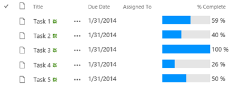

### Sample 5: Change the rendering template

Sample 5 shows you how to change the rendering template for a list view. This view displays list item titles that expand like accordions when you select them. The expanded view shows you additional list item fields, as shown in Figure 8.

**Figure 8. Collapsed and expanded list item views**

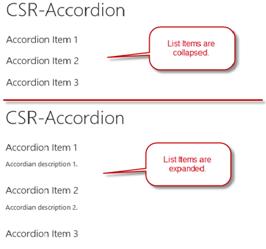

The following code sets up the template and registers it with the list template. It sets up the overall layout, and then uses the **OnPostRender** event handler to register the JavaScript function that executes when the list is rendered. This function associates the event with the CSS and event handling that implements the accordion functionality.

```
(function () {

    // jQuery library is required in this sample.
    // Fallback to loading jQuery from a CDN path if the local is unavailable
    (window.jQuery || document.write('<script src="//ajax.aspnetcdn.com/ajax/jquery/jquery-1.10.0.min.js"><\/script>'));

    // Create object that has the context information about the field that you want to render differently.
    var accordionContext = {};
    accordionContext.Templates = {};

    // Be careful when adding the header for the template, because it will break the default list view render.
    accordionContext.Templates.Header = "<div class='accordion'>";
    accordionContext.Templates.Footer = "</div>";

    // Add OnPostRender event handler to add accordion click events and style.
    accordionContext.OnPostRender = accordionOnPostRender;

    // This line of code tells the TemplateManager that you want to change all the HTML for item row rendering.
    accordionContext.Templates.Item = accordionTemplate;

    SPClientTemplates.TemplateManager.RegisterTemplateOverrides(accordionContext);

})();

// This function provides the rendering logic.
function accordionTemplate(ctx) {
    var title = ctx.CurrentItem["Title"];
    var description = ctx.CurrentItem["Description"];

    // Return whole item html
    return "<h2>" + title + "</h2><p>" + description + "</p><br/>";
}

function accordionOnPostRender() {

    // Register event to collapse and expand when selecting accordion header.
    $('.accordion h2').click(function () {
        $(this).next().slideToggle();
    }).next().hide();

    $('.accordion h2').css('cursor', 'pointer');
}
```

### Sample 6: Validate field values

Sample 6 shows you how to use regular expressions to validate field values supplied by the user. A red error message appears when the user types an invalid email address into the **Email** field text box. This happens when the user either creates or edits a list item, as shown in Figure 9.

**Figure 9. Error message for invalid field text input**

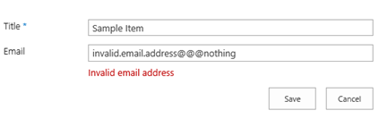

The following code sets up the template with a placeholder for displaying the error message and registers the callback functions that fire whenever the user tries to submit the forms. The first callback returns the value of the **Email** column, and the second callback uses regular expressions to validate the string value.

```
function emailFiledTemplate(ctx) {

    var formCtx = SPClientTemplates.Utility.GetFormContextForCurrentField(ctx);

    // Register a callback just before submit.
    formCtx.registerGetValueCallback(formCtx.fieldName, function () {
        return document.getElementById('inpEmail').value;
    });

    // Create container for various validations.
    var validators = new SPClientForms.ClientValidation.ValidatorSet();
    validators.RegisterValidator(new emailValidator());

    // Validation failure handler.
    formCtx.registerValidationErrorCallback(formCtx.fieldName, emailOnError);

    formCtx.registerClientValidator(formCtx.fieldName, validators);

    return "<span dir='none'><input type='text' value='" + formCtx.fieldValue + "'  maxlength='255' id='inpEmail' class='ms-long'> \
            <br><span id='spnError' class='ms-formvalidation ms-csrformvalidation'></span></span>";
}

// Custom validation object to validate email format.
emailValidator = function () {
    emailValidator.prototype.Validate = function (value) {
        var isError = false;
        var errorMessage = "";

        //Email format Regex expression
        var emailRejex = /\S+@\S+\.\S+/;

        if (!emailRejex.test(value) &amp;&amp; value.trim()) {
            isError = true;
            errorMessage = "Invalid email address";
        }

        // Send error message to error callback function (emailOnError).
        return new SPClientForms.ClientValidation.ValidationResult(isError, errorMessage);
    };
};

// Add error message to spnError element under the input field element.
function emailOnError(error) {
    document.getElementById("spnError").innerHTML = "<span role='alert'>" + error.errorMessage + "</span>";
}
```

### Sample 7: Make list item edit fields read-only

Sample seven shows you how to make list item edit form fields read-only. The read-only fields show with no editing controls, as shown in Figure 10.

**Figure 10. Read-only field on a custom list edit form**

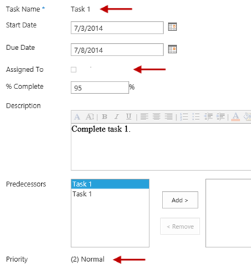

The following code example modifies the **Title**, **AssignedTo**, and **Priority** fields in the list item edit form so that they show the field values only with no editing controls. The code shows how to handle the parsing requirements for different field types.

```
function readonlyFieldTemplate(ctx) {

    // Reuse SharePoint JavaScript libraries.
    switch (ctx.CurrentFieldSchema.FieldType) {
        case "Text":
        case "Number":
        case "Integer":
        case "Currency":
        case "Choice":
        case "Computed":
            return SPField_FormDisplay_Default(ctx);

        case "MultiChoice":
            prepareMultiChoiceFieldValue(ctx);
            return SPField_FormDisplay_Default(ctx);

        case "Boolean":
            return SPField_FormDisplay_DefaultNoEncode(ctx);

        case "Note":
            prepareNoteFieldValue(ctx);
            return SPFieldNote_Display(ctx);

        case "File":
            return SPFieldFile_Display(ctx);

        case "Lookup":
        case "LookupMulti":
                return SPFieldLookup_Display(ctx);           

        case "URL":
            return RenderFieldValueDefault(ctx);

        case "User":
            prepareUserFieldValue(ctx);
            return SPFieldUser_Display(ctx);

        case "UserMulti":
            prepareUserFieldValue(ctx);
            return SPFieldUserMulti_Display(ctx);

        case "DateTime":
            return SPFieldDateTime_Display(ctx);

        case "Attachments":
            return SPFieldAttachments_Default(ctx);

        case "TaxonomyFieldType":
            //Re-use JavaScript from the sp.ui.taxonomy.js SharePoint JavaScript library
            return SP.UI.Taxonomy.TaxonomyFieldTemplate.renderDisplayControl(ctx);
    }
}

// User control needs specific formatted value to render content correctly.
function prepareUserFieldValue(ctx) {
    var item = ctx['CurrentItem'];
    var userField = item[ctx.CurrentFieldSchema.Name];
    var fieldValue = "";

    for (var i = 0; i < userField.length; i++) {
        fieldValue += userField[i].EntityData.SPUserID + SPClientTemplates.Utility.UserLookupDelimitString + userField[i].DisplayText;

        if ((i + 1) != userField.length) {
            fieldValue += SPClientTemplates.Utility.UserLookupDelimitString
        }
    }

    ctx["CurrentFieldValue"] = fieldValue;
}

// Choice control needs specific formatted value to render content correctly.
function prepareMultiChoiceFieldValue(ctx) {

    if (ctx["CurrentFieldValue"]) {
        var fieldValue = ctx["CurrentFieldValue"];

        var find = ';#';
        var regExpObj = new RegExp(find, 'g');

        fieldValue = fieldValue.replace(regExpObj, '; ');
        fieldValue = fieldValue.replace(/^; /g, '');
        fieldValue = fieldValue.replace(/; $/g, '');

        ctx["CurrentFieldValue"] = fieldValue;
    }
}

// Note control needs specific formatted value to render content correctly.
function prepareNoteFieldValue(ctx) {

    if (ctx["CurrentFieldValue"]) {
        var fieldValue = ctx["CurrentFieldValue"];
        fieldValue = "<div>" + fieldValue.replace(/\n/g, '<br />'); + "</div>";

        ctx["CurrentFieldValue"] = fieldValue;
    }
} 
```

### Sample 8: Hide fields

Sample 8 shows you how to hide fields in list item new and edit forms. The sample hides the **Predecessors** field when a user creates or edits a task list item.

This sample deploys as the edit and new form for a list called **CSR-Hide-Controls list**. For information about how to view the form after you deploy the sample, see [Branding.ClientSideRendering](https://github.com/SharePoint/PnP/tree/dev/Samples/Branding.ClientSideRendering).

The following code finds the **Predecessors** field in the HTML of the form and hides it. The field remains present in the HTML, but the user can't see it in the browser.

```
(function () {

    // jQuery library is required in this sample.
    // Fallback to loading jQuery from a CDN path if the local is unavailable.
    (window.jQuery || document.write('<script src="//ajax.aspnetcdn.com/ajax/jquery/jquery-1.10.0.min.js"><\/script>'));

    // Create object that has the context information about the field that we want to render differently.
    var hiddenFiledContext = {};
    hiddenFiledContext.Templates = {}; 
    hiddenFiledContext.Templates.OnPostRender = hiddenFiledOnPreRender;
    hiddenFiledContext.Templates.Fields = {
        // Apply the new rendering for Predecessors field in New and Edit forms.
        "Predecessors": {
            "NewForm": hiddenFiledTemplate,
            "EditForm": hiddenFiledTemplate
        }
    };

    SPClientTemplates.TemplateManager.RegisterTemplateOverrides(hiddenFiledContext);

})();


// This function provides the rendering logic.
function hiddenFiledTemplate() {
    return "<span class='csrHiddenField'></span>";
}

// This function provides the rendering logic.
function hiddenFiledOnPreRender(ctx) {
    jQuery(".csrHiddenField").closest("tr").hide();
}

```

## Web part and add-in part manipulation
<a name="bmPersonalized"> </a>

The [Core.AppScriptPart](https://github.com/SharePoint/PnP/tree/dev/Samples/Core.AppScriptPart) sample shows how to use add-in script parts to embed scripts running in a provider-hosted add-in on a SharePoint page. This sample shows how to modify the UI of a page on the host site by deploying an add-in script part and adding it to a SharePoint page from the webpart gallery.

An add-in script part is like a web part in that you can add it to a SharePoint page from the web part gallery, but in this case the .webpart file embeds a JavaScript file that runs remotely in a provider-hosted add-in. The add-in script part runs inside a  `<div>` tag on the SharePoint page and therefore provides a more responsive design and experience than you get with add-in parts that run in IFrames.

The start page includes a **Run Scenario** button that deploys the add-in script part to the web part gallery. The following code example constructs a **FileCreationInformationObject** instance that contains the contents of the .webpart file and then uploads the new file into the web part gallery. Note that you can also run this code automatically when the add-in part installs or as part of the site collection provisioning process.

```
var spContext = SharePointContextProvider.Current.GetSharePointContext(Context);
using (var clientContext = spContext.CreateUserClientContextForSPHost())
{
    var folder = clientContext.Web.Lists.GetByTitle("Web Part Gallery").RootFolder;
    clientContext.Load(folder);
    clientContext.ExecuteQuery();

    // Upload the OneDrive for Business Usage Guidelines.docx.
    using (var stream = System.IO.File.OpenRead(Server.MapPath("~/userprofileinformation.webpart")))
    {
        FileCreationInformation fileInfo = new FileCreationInformation();
        fileInfo.ContentStream = stream;
        fileInfo.Overwrite = true;
        fileInfo.Url = "userprofileinformation.webpart";
        File file = folder.Files.Add(fileInfo);
        clientContext.ExecuteQuery();
    }

    // Update the group for uplaoded web part.
    var list = clientContext.Web.Lists.GetByTitle("Web Part Gallery");
    CamlQuery camlQuery = CamlQuery.CreateAllItemsQuery(100);
    Microsoft.SharePoint.Client.ListItemCollection items = list.GetItems(camlQuery);
    clientContext.Load(items);
    clientContext.ExecuteQuery();
    foreach (var item in items)
    {
        // Random group name to differentiate it from the rest.
        if (item["FileLeafRef"].ToString().ToLowerInvariant() == "userprofileinformation.webpart")
        {
            item["Group"] = "add-in Script Part";
            item.Update();
            clientContext.ExecuteQuery();
        }
    }

    lblStatus.Text = string.Format("add-in script part has been added to web part gallery. You can find 'User Profile Information' script part under 'Add-in Script Part' group in the <a href='{0}'>host web</a>.", spContext.SPHostUrl.ToString());
}
```

After you finish this step, you can locate the **User profile information** add-in script part inside a new **Add-in Script Part** category in the web part gallery. After you add the add-in script part to the page, the remotely running JavaScript controls the display of the information on the page.

When you view the add-in script part in edit mode, you'll see that it embeds the JavaScript file that is running remotely. The userprofileinformation.js script uses the JSON to get user profile information from the host site. 

```
function sharePointReady() {
  clientContext = SP.ClientContext.get_current();

  var fileref = document.createElement('script');
  fileref.setAttribute("type", "text/javascript");
  fileref.setAttribute("src", "/_layouts/15/SP.UserProfiles.js");
  document.getElementsByTagName("head")[0].appendChild(fileref);

  SP.SOD.executeOrDelayUntilScriptLoaded(function () {

    //Get Instance of People Manager Class       
    var peopleManager = new SP.UserProfiles.PeopleManager(clientContext);

    //Get properties of the current user
    userProfileProperties = peopleManager.getMyProperties();
    clientContext.load(userProfileProperties);
    clientContext.executeQueryAsync(Function.createDelegate(this, function (sender, args) {
      var firstname = userProfileProperties.get_userProfileProperties()['FirstName'];
      var name = userProfileProperties.get_userProfileProperties()['PreferredName'];
      var title = userProfileProperties.get_userProfileProperties()['Title'];
      var aboutMe = userProfileProperties.get_userProfileProperties()['AboutMe'];
      var picture = userProfileProperties.get_userProfileProperties()['PictureURL'];

      var html = "<div><h2>Welcome " + firstname + "</h2></div><div><div style='float: left; margin-left:10px'><b>Name</b>: " + name + "<br /><b>Title</b>: " + title + "<br />" + aboutMe + "</div></div>";

      document.getElementById('UserProfileAboutMe').innerHTML = html;
    }), Function.createDelegate(this, function (sender, args) {
      console.log('The following error has occurred while loading user profile property: ' + args.get_message());
    }));
  }, 'SP.UserProfiles.js');
}

```

## Provisioning publishing features
<a name="bmPersonalized"> </a>

The [Provisioning.PublishingFeatures](https://github.com/SharePoint/PnP/tree/dev/Scenarios/Provisioning.PublishingFeatures) sample shows how to do common tasks with publishing sites that are hosted on Office 365; for example, provisioning and using page layouts, master pages, and themes, or embedding JavaScript in page layouts. It also shows how to apply filters that control what site templates are available for subsites and what page layouts are available on the host web.

The provider-hosted add-in uses CSOM to provision commonly used UI elements on publishing sites, and it uses JavaScript to create more dynamic experiences in page layouts that you can deploy to publishing sites. It also shows the differences between using master pages and themes in publishing sites.

**Important:**  To make the functionality in this sample work, you need to activate the publishing features on your site. For information, see [Enable publishing features](https://support.office.com/en-us/article/Enable-publishing-features-479677a6-8b33-4ac7-907d-071c1c7e4518?CorrelationId=22291615-2acd-46be-8813-9e6c48d01a32&amp;ui=en-US&amp;rs=en-US&amp;ad=US).

The sample start page presents you with three scenarios for customizing the UI of publishing sites: 

- Deploy page layouts.
    
- Deploy master pages and themes.
    
- Filter the available page layouts and site templates on the host site.

### Scenario 1: Deploy pages

Scenario 1 shows you how to deploy a custom page layout. The **Deploy page layouts** button shown in Figure 11 creates a new page layout and a page that uses that layout.

**Figure 11. Button to deploy page layouts**

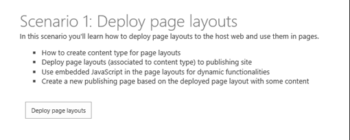

You can view the new page by going to the newly created demo page on your host site, which contains embedded JavaScript and displays user profile information.

The sample displays this user's information on the page. It also adds a page, although in this case it uses a **PublishingPageInformation** object to create the new page.

The sample adds a new page layout by uploading a file to the master page gallery and assigning it the page layout content type. The following code takes the path to a *.aspx file (which you can deploy as a resource in your Visual Studio 2013 project) and adds it as a page layout in the master page gallery.

```
// Get the path to the file that you are about to deploy.
            List masterPageGallery = web.GetCatalog((int)ListTemplateType.MasterPageCatalog);
            Folder rootFolder = masterPageGallery.RootFolder;
            web.Context.Load(masterPageGallery);
            web.Context.Load(rootFolder);
            web.Context.ExecuteQuery();

            var fileBytes = System.IO.File.ReadAllBytes(sourceFilePath);

            // Use CSOM to upload the file.
            FileCreationInformation newFile = new FileCreationInformation();
            newFile.Content = fileBytes;
            newFile.Url = UrlUtility.Combine(rootFolder.ServerRelativeUrl, fileName);
            newFile.Overwrite = true;

            Microsoft.SharePoint.Client.File uploadFile = rootFolder.Files.Add(newFile);
            web.Context.Load(uploadFile);
            web.Context.ExecuteQuery();

            // Check out the file if needed.
            if (masterPageGallery.ForceCheckout || masterPageGallery.EnableVersioning)
            {
                if (uploadFile.CheckOutType == CheckOutType.None)
                {
                    uploadFile.CheckOut();
                }
            }

            // Get content type for ID to assign associated content type information.
            ContentType associatedCt = web.GetContentTypeById(associatedContentTypeID);

            var listItem = uploadFile.ListItemAllFields;
            listItem["Title"] = title;
            listItem["MasterPageDescription"] = description;
            // Set the item as page layout.
            listItem["ContentTypeId"] = Constants.PAGE_LAYOUT_CONTENT_TYPE;
            // Set the associated content type ID property
            listItem["PublishingAssociatedContentType"] = string.Format(";#{0};#{1};#", associatedCt.Name, associatedCt.Id);
            listItem["UIVersion"] = Convert.ToString(15);
            listItem.Update();

            // Check in the page layout if needed.
            if (masterPageGallery.ForceCheckout || masterPageGallery.EnableVersioning)
            {
                uploadFile.CheckIn(string.Empty, CheckinType.MajorCheckIn);
                listItem.File.Publish(string.Empty);
            }
            web.Context.ExecuteQuery();
```

You can verify that your new page is using the new page layout by going to the **Pages** library of the host site.

### Scenario 2: Deploy master pages and themes

Scenario 2 shows you how to deploy and set master pages and themes for the host site from a provider-hosted add-in. When you choose **Deploy master and use it** on the sample start page, the sample deploys and applies a custom master page to the host site. You can see the new master page by going to the home page of the site.

The sample adds a new master page by uploading a *.master file to the master page gallery and assigning it the master page content type. The following code takes the path to a *.master file (which you can deploy as a resource in your Visual Studio 2013 project) and adds it as a master page in the master page gallery.

```
string fileName = Path.GetFileName(sourceFilePath);

            // Get the path to the file that you are about to deploy.
            List masterPageGallery = web.GetCatalog((int)ListTemplateType.MasterPageCatalog);
            Folder rootFolder = masterPageGallery.RootFolder;
            web.Context.Load(masterPageGallery);
            web.Context.Load(rootFolder);
            web.Context.ExecuteQuery();

            // Get the file name from the provided path.
            var fileBytes = System.IO.File.ReadAllBytes(sourceFilePath);

            // Use CSOM to upload the file.
            FileCreationInformation newFile = new FileCreationInformation();
            newFile.Content = fileBytes;
            newFile.Url = UrlUtility.Combine(rootFolder.ServerRelativeUrl, fileName);
            newFile.Overwrite = true;

            Microsoft.SharePoint.Client.File uploadFile = rootFolder.Files.Add(newFile);
            web.Context.Load(uploadFile);
            web.Context.ExecuteQuery();


            var listItem = uploadFile.ListItemAllFields;
            if (masterPageGallery.ForceCheckout || masterPageGallery.EnableVersioning)
            {
                if (uploadFile.CheckOutType == CheckOutType.None)
                {
                    uploadFile.CheckOut();
                }
            }

            listItem["Title"] = title;
            listItem["MasterPageDescription"] = description;
            // Set content type as master page.
            listItem["ContentTypeId"] = Constants.MASTERPAGE_CONTENT_TYPE;
            listItem["UIVersion"] = uiVersion;
            listItem.Update();
            if (masterPageGallery.ForceCheckout || masterPageGallery.EnableVersioning)
            {
                uploadFile.CheckIn(string.Empty, CheckinType.MajorCheckIn);
                listItem.File.Publish(string.Empty);
            }
            web.Context.Load(listItem);
            web.Context.ExecuteQuery();
```

The next step is to set the URL of the new master page as the value for both the **MasterUrl** and **CustomMasterUrl** properties of the **Web** object that represents the site. The sample handles this with a single method that fetches the URL of the new master page in the master page gallery and then assigns that value to the **Web.MasterUrl** and **Web.CustomMasterUrl** properties.

```
// Assign master page to the host web.
                clientContext.Web.SetMasterPagesForSiteByName("contoso.master", "contoso.master");

```

When you choose **Deploy theme and use it**, the sample deploys and applies a custom theme to the host site. The sample sets the color palette, background image, and font scheme of the theme by adding a new theme with those values (which you can deploy as resources inside your Visual Studio 2013 project) to the theme gallery. The following code creates the new theme.

```
List themesOverviewList = web.GetCatalog((int)ListTemplateType.DesignCatalog);
           web.Context.Load(themesOverviewList);
           web.Context.ExecuteQuery(); 
                ListItemCreationInformation itemInfo = new ListItemCreationInformation();
                Microsoft.SharePoint.Client.ListItem item = themesOverviewList.AddItem(itemInfo);
                item["Name"] = themeName;
                item["Title"] = themeName;
                if (!string.IsNullOrEmpty(colorFileName))
                {
                    item["ThemeUrl"] = UrlUtility.Combine(rootWeb.ServerRelativeUrl, string.Format(Constants.THEMES_DIRECTORY, Path.GetFileName(colorFileName)));
                }
                if (!string.IsNullOrEmpty(fontFileName))
                {
                    item["FontSchemeUrl"] = UrlUtility.Combine(rootWeb.ServerRelativeUrl, string.Format(Constants.THEMES_DIRECTORY, Path.GetFileName(fontFileName)));
                }
                if (!string.IsNullOrEmpty(backgroundName))
                {
                    item["ImageUrl"] = UrlUtility.Combine(rootWeb.ServerRelativeUrl, string.Format(Constants.THEMES_DIRECTORY, Path.GetFileName(backgroundName)));
                }
                item["DisplayOrder"] = 11;
                item.Update();
                web.Context.ExecuteQuery();
```

The next step is to set this new theme as the theme for the site. The following code does this by fetching the theme from the theme gallery and then applying its values to the host site.

```
 CamlQuery query = new CamlQuery();
                // Find the theme by themeName.
                string camlString = string.Format(CAML_QUERY_FIND_BY_FILENAME, themeName);
                query.ViewXml = camlString;
                var found = themeList.GetItems(query);
                rootWeb.Context.Load(found);
                LoggingUtility.Internal.TraceVerbose("Getting theme: {0}", themeName);
                rootWeb.Context.ExecuteQuery();
                if (found.Count > 0)
                {
                    ListItem themeEntry = found[0];

                    / /Set the properties for applying the custom theme that was just uploaded.
                    string spColorURL = null;
                    if (themeEntry["ThemeUrl"] != null &amp;&amp; themeEntry["ThemeUrl"].ToString().Length > 0)
                    {
                        spColorURL = UrlUtility.MakeRelativeUrl((themeEntry["ThemeUrl"] as FieldUrlValue).Url);
                    }
                    string spFontURL = null;
                    if (themeEntry["FontSchemeUrl"] != null &amp;&amp; themeEntry["FontSchemeUrl"].ToString().Length > 0)
                    {
                        spFontURL = UrlUtility.MakeRelativeUrl((themeEntry["FontSchemeUrl"] as FieldUrlValue).Url);
                    }
                    string backGroundImage = null;
                    if (themeEntry["ImageUrl"] != null &amp;&amp; themeEntry["ImageUrl"].ToString().Length > 0)
                    {
                        backGroundImage = UrlUtility.MakeRelativeUrl((themeEntry["ImageUrl"] as FieldUrlValue).Url);
                    }

                    // Set theme for demonstration.
                    // TODO: Why is shareGenerated false? If deploying to root an inheriting, then maybe use shareGenerated = true.
                    web.ApplyTheme(spColorURL,
                                        spFontURL,
                                        backGroundImage,
                                        false);
                    web.Context.ExecuteQuery();
```

### Scenario 3: Filter available page layouts and site templates

Scenario 3 shows you how to limit the options that users have when they apply templates to new sites, and layouts to new pages. When you choose **Apply filters to host web** on the sample start page, the sample sets a custom page layout as the default and one additional page layout as the only other option for any new pages that a user creates. The sample also reduces the number of available options for users when they create new subsites. Figure 12 shows what the site template selection box looks like both before and after the filters have been applied.

**Figure 12. Site template selection before and after sample filters have been applied**

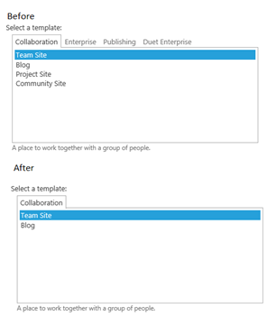

The sample sets both the default and available page layouts by passing the associated *.aspx files to methods to extension methods, as shown in the code.

```
                List<string> pageLayouts = new List<string>();
                pageLayouts.Add("ContosoLinksBelow.aspx");
                pageLayouts.Add("ContosoLinksRight.aspx");
                clientContext.Web.SetAvailablePageLayouts(clientContext.Web, pageLayouts);

                // Set default page layout for the site
                clientContext.Web.SetDefaultPageLayoutForSite(clientContext.Web, "ContosoLinksBelow.aspx");

```
The sample sets the available site templates by doing something similar. In this case it passes the **WebTemplateEntity** instances that define each site template to an extension method called **SetAvailableWebTemplates**.

```
List<WebTemplateEntity> templates = new List<WebTemplateEntity>();
                templates.Add(new WebTemplateEntity() { LanguageCode = "1035", TemplateName = "STS#0" });
                templates.Add(new WebTemplateEntity() { LanguageCode = "", TemplateName = "STS#0" });
                templates.Add(new WebTemplateEntity() { LanguageCode = "", TemplateName = "BLOG#0" });
                clientContext.Web.SetAvailableWebTemplates(templates);

```

All three of these extension methods - **SetAvailablePageLayouts**, **SetDefaultPageLayoutForSite**, and **SetAvailableWebTemplates** - work in the same way. They create XML documents that contain key/value pairs that define the available and default layouts and the available templates. They then pass these documents to an additional extension method called **SetPropertyBagValue**. This method is implemented in [OfficeDevPnPCore extension](hhttps://github.com/SharePoint/PnP-sites-core). After it sets up the appropriate property bags, these property bags are then used to filter options in the interface.

Of the three methods, **SetAvailableWebTemplates** shows the full pattern.

```
public static void SetAvailableWebTemplates(this Web web, List<WebTemplateEntity> availableTemplates)
        {
            string propertyValue = string.Empty;

            LanguageTemplateHash languages = new LanguageTemplateHash();
            foreach (var item in availableTemplates)
            {
                AddTemplateToCollection(languages, item);
            }

            if (availableTemplates.Count > 0)
            {
                XmlDocument xd = new XmlDocument();
                XmlNode xmlNode = xd.CreateElement("webtemplates");
                xd.AppendChild(xmlNode);
                foreach (var language in languages)
                {
                    XmlNode xmlLcidNode = xmlNode.AppendChild(xd.CreateElement("lcid"));
                    XmlAttribute xmlAttribute = xd.CreateAttribute("id");
                    xmlAttribute.Value = language.Key;
                    xmlLcidNode.Attributes.SetNamedItem(xmlAttribute);

                    foreach (string item in language.Value)
                    {
                        XmlNode xmlWTNode = xmlLcidNode.AppendChild(xd.CreateElement("webtemplate"));
                        XmlAttribute xmlAttributeName = xd.CreateAttribute("name");
                        xmlAttributeName.Value = item;
                        xmlWTNode.Attributes.SetNamedItem(xmlAttributeName);
                    }
                }
                propertyValue = xmlNode.OuterXml;
            }
            // Save the XML entry to property bag.
            web.SetPropertyBagValue(AvailableWebTemplates, propertyValue);
            // Set that templates are not inherited.
            web.SetPropertyBagValue(InheritWebTemplates, "False");

```

The **InheritWebTemplates** property bag makes sure that any templates that are normally inherited from the parent site also are ignored when you create subsites.

## Additional resources
<a name="bk_addresources"> </a>

- [UX Components in SharePoint 2013 and SharePoint Online](ux-components-in-sharepoint-2013-and-sharepoint-online.md)
    
- [Provisioning.Pages](https://github.com/SharePoint/PnP/tree/master/Samples/Provisioning.Pages)
    
- [Branding.ApplyBranding](https://github.com/SharePoint/PnP/tree/master/Samples/Branding.ApplyBranding)
