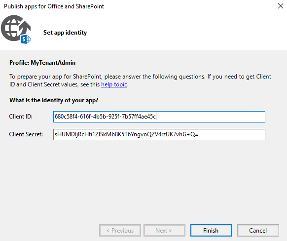

# Developing using Tenant permissions with App-Only in SharePoint Online

The developer experience has changed for SharePoint **Provider-hosted Add-ins** that require **Tenant permission in combination with app-only**. This article walks you through the new experience for developing and debugging these solutions.

_**Applies to:** Provider Hosted Add-ins for SharePoint Online_

## Understanding the Problem

In Visual Studio, you navigate to Debug, start debugging, and receive a message that "**Your tenant administrator has to approve this app**" as shown below.

The reason why you can't click **trust it** is because Visual Studio is working against the dev site collection you've specified in your project settings but tenant level permissions with app-only can only be granted via [trusting it against your tenant administration site](https://msdn.microsoft.com/pnp_articles/how-to-provide-add-in-app-only-tenant-administrative-permissions-in-sharepoint-online).

## Walkthrough

### Step 1: Create a new service principal

Navigate to a site collection in your tenant and generate a new client ID and Secret. (for example, `https://contoso.sharepoint.com/_layouts/15/appregnew.aspx`). In this page click **Generate** for both the **Client ID**, **Client Secret** Fields and supply the remaining fields. While you're developing the add-in, ensure you use `localhost` including the port as the App Domain. You should have something similar as below.

### Step 2: Grant Tenant Permissions

To do this step, you must be a SharePoint Online Administrator.

Navigate to the SharePoint Admin Center (for example, `https://contoso-admin.sharepoint.com/_layouts/15/appinv.aspx`) and grant the tenant permissions

### Step 3: Update your manifest and web.config

In the Visual Studio solution, update the manifest and **web.config** with the client ID created in step 1.

### Step 4: Package the app and add the .app file to the App catalog

Right click on the SharePoint Add-in project and click publish.

Supply the **Client ID** and **Client Secret** created in Step 1.

Since you want to debug the add-in, ensure that you supply `https://localhost` including the port as shown below.

Now deploy the add-in in the app catalog site.

### Step 5: Install your add-in in your developer site collection

Navigate to the developer site and add the app. Click on **App Details**.

If you selected on the app tile, you'll have to select on "**Find out why**" and request your app

Once the request has been submitted, the status will be in a pending state until the SharePoint Administrator or the app catalog Administrator approves the request. To approve the request, navigate to the app catalog, select App Requests, and approve the request.

Once the request has been approved, the add-in may now be installed.

### Step 6: Debug your Add-in

In Visual Studio, right-click your web project and select **Debug** Start new instance. Once started, navigate to your site and launch the add-in.

> [!NOTE]
>
> - If for some reason your app package file changes you'll need to redeploy it to the app catalog and re-install it to your development site collection
> - If you're add-in has an appinstalled event receiver you'll need to ensure that you've done step 6 before you do step 5

## See also

- [Add-in app only tenant administrative permissions in SharePoint Online](https://msdn.microsoft.com/pnp_articles/how-to-provide-add-in-app-only-tenant-administrative-permissions-in-sharepoint-online)
- [Add-in permissions in SharePoint 2013](https://msdn.microsoft.com/library/office/fp142383.aspx)
- [Explore the app manifest structure and the package of a SharePoint Add-in](https://msdn.microsoft.com/library/office/fp179918.aspx)
