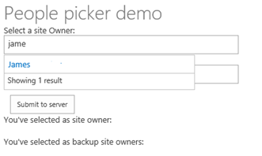
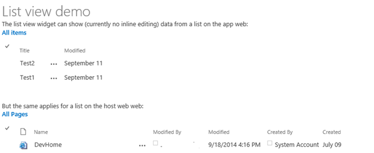

# Display information from a host site by using Office Web Widgets

Implement Office Web Widget controls in a SharePoint provider-hosted add-in to display information from a host site.

_**Applies to:** Office 365 | SharePoint 2013 | SharePoint Online_

You can use Office Web Widgets to display information from a SharePoint-hosted site in the context of a provider-hosted add-in. Office Web Widgets are a set of controls that are designed to look and behave like SharePoint-hosted controls. The controls are provided as a [NuGet](https://www.nuget.org/) package, which provides the [Office Web Widgets library](http://www.nuget.org/packages/Microsoft.Office.WebWidgets.Experimental/).

**Caution:**  Office Web Widgets are a third-party feature. Because they have some limitations, use them with caution. For more information, see:

The [Core.OfficeWebWidgets](https://github.com/SharePoint/PnP/tree/dev/Components/Core.OfficeWebWidgets) sample shows you how to implement the people picker and list view controls that are included in the Office Web Widgets library. This sample add-in inserts the controls into the HTML of the start page, and then configures the controls using the app.js JavaScript file that is located in the project's Scripts folder.

The sample start page shows the people picker control. This page allows you to add multiple users, and it contains two text boxes for user input.

**Figure 1. People picker demo start page**



The following code from the Default.aspx file of the web project includes the people picker control inside a  `<div>` tag.

```
<div id="peoplePickerBackupSiteOwners" data-office-control="Office.Controls.PeoplePicker" data-office-options=
      '{ "placeholder" : "Please choose one or more backup site owner", 
      "allowMultipleSelections" : true,
      "onChange" : handleSiteOwnerBackupChange}'>
</div>

```

The start page also displays the list view control, which can display lists from both the host web and the add-in web of the SharePoint site.

**Figure 2. List view control start page**



The following HTML from the Default.aspx file includes two  `<div>` tags for displaying the two instances of the list view control.

```
The list view widget can show (currently no inline editing) data from a list on the add-in web:<br />
<div id="listViewAppWeb"></div>
        <br /><br />
        But the same applies for a list on the host web web:<br />
        <div id="listViewHostWeb"></div>
```

The following code from the app.js file creates the two instances of the list view control.

```
 var listViewAppWeb = new Office.Controls.ListView(document.getElementById("listViewAppWeb"),
          {
                     listUrl: appWebUrl + "/_api/web/lists/getbytitle('Announcements')"
           });

var listViewHostWeb = new Office.Controls.ListView(document.getElementById("listViewHostWeb"),
           {
                     listUrl: spHostUrl + "/_api/web/lists/getbytitle('Site Pages')"
           });
```

## Additional resources
<a name="bk_addresources"> </a>

- [UX Components in SharePoint 2013 and SharePoint Online](ux-components-in-sharepoint-2013-and-sharepoint-online.md)
