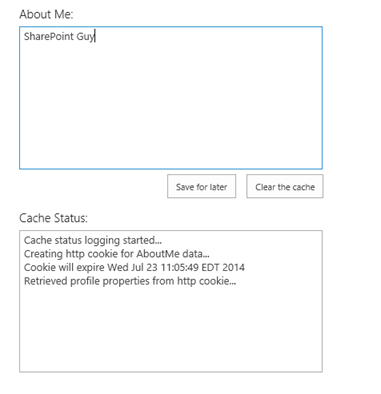

# Improve performance in SharePoint provider-hosted add-ins

You can improve the performance of your SharePoint provider-hosted add-in by limiting the number and frequency of remote calls to SharePoint. Too many calls to the host site degrades performance. To limit the number of remote calls, you can implement either HTTP cookies or HTML5 local storage.

The [Performance.Caching](https://github.com/SharePoint/PnP/tree/dev/Samples/Performance.Caching) sample shows you how to use HTTP cookies and HTML5 local storage to cache data. The sample includes two provider-hosted add-ins that allow you to view the **About Me** section of your user profile, add data, and save it for later. The add-in does not update user profile information; it caches it so that it can be used later. 

One sample uses HTTP cookies to cache the data, and the other uses HTML5 local storage.

## Use HTTP cookies for caching

The start page of the HTTP cookie sample displays information from the **About Me** section of your user profile in a text box. A second text box tells you whether a new cookie was created and when the existing cookie will expire. The information stored in cookies can't be larger than 4095 bytes.

**Data rendered in the HTTP cookie caching sample**



The app.js file, which is located in the Scripts folder of the web project, defines the behavior of the **Save for later** button. The code first verifies that cookies are enabled in the browser by setting a test cookie. If cookies are enabled, the code determines whether the user profile information is already stored in a cookie. If it isn't, it uses JSON to look up the **About Me** information, store it in a cookie, and then display the information in the browser.

The following function sets the cookie and its expiration date.

```js
function setCookie(key, value, expiry, path, domain, secure) {
    var todaysDate = new Date();
    todaysDate.setTime(todaysDate.getTime());

    if (expiry == "") { expiry = "1"; }

    // The following line sets for n number of days. For hours, remove * 24. For minutes, remove * 60 * 24.
    if (expiry) {
        expiry = expiry * 1000 * 60 * 60 * 24;
    }

    var newExpiry = new Date(todaysDate.getTime() + (expiry));

    document.cookie = key + "=" + escape(value) +
        ( ( expiry ) ? ";expires=" + newExpiry : "" ) +
        ( ( path ) ? ";path=" + path : "" ) +
        ( ( domain ) ? ";domain=" + domain : "" ) +
        ((secure) ? ";secure" : "");

    cachingStatus += "\n" + "Creating http cookie for AboutMe data...";
    cachingStatus += "\n" + "Cookie will expire " + newExpiry;
    $('#status').text(cachingStatus);
}

```

## Use HTML5 local storage for caching

The start page of the HTML5 local storage sample displays information from the **About Me** section of your user profile information about the cached data. The text box displays this information as well as the expiration time (if any) of the cached information.

The app.js file, which is located in the Scripts folder of the web project, defines the behavior of the **Save for later** button. The add-in first verifies that local storage is enabled by using the following function.

```js
isHtml5StorageSupported = function () {
    try {
        return 'localStorage' in window &amp;&amp; window['localStorage'] !== null;
    } catch (e) {
        return false;
    }
    return false;
}

```

<br/>

If local storage is supported, the function determines whether the user profile information is already stored there. If it isn't, it uses JSOM to look up the **About Me** information, to store it locally, and then to display the information in the browser. The following code stores the **About Me** information in a key named `aboutMeValue`.

```js
var aboutMeValue = personProperties.get_userProfileProperties()['AboutMe'];
    $('#aboutMeText').val(aboutMeValue);

    // Add to local storage.
    localStorage.setItem("aboutMeValue", aboutMeValue);
    setLocalStorageKeyExpiry("aboutMeValue");

    cachingStatus += "\n" + "Populated local storage with profile properties...";
    $('#status').val(cachingStatus);

```

<br/>

The **Clear the cache** button removes that key, looks up the **About Me** information in your user profile, and creates a fresh local storage key to store that information. The add-in doesn't set an expiration time by default, but the app.js file does contain the following function, which sets an expiration time for the cached data.

```js
function setLocalStorageKeyExpiry(key) {

    // Check for expiration config values.
    var expiryConfig = localStorage.getItem(expiryConfigKey);
    
    // Check for existing expiration stamp.
    var existingStamp = localStorage.getItem(key + expiryKeySuffix);    

    // Override cached setting if a user has entered a value that is different than what is stored.
    if (expiryConfig != null) {
                
        var currentTime = Math.floor((new Date().getTime()) / 1000);
        expiryConfig = parseInt(expiryConfig);
        
        var newStamp = Math.floor((currentTime + expiryConfig));
        localStorage.setItem(key + expiryKeySuffix, newStamp);
        
        // Log status to window.        
        cachingStatus += "\n" + "Setting expiration for the " + key + " key...";
        $('#status').val(cachingStatus);
    }    
    else {
       
    }
}

```

Before looking for the information stored in the local storage key, the code uses the **isKeyExpired** function to determine whether the key is expired. For more information, see [Customize the UX by using SharePoint provider-hosted add-ins](customize-the-ux-by-using-sharepoint-provider-hosted-add-ins.md).

## See also
  
- [Branding.UIElementPersonalization](https://github.com/SharePoint/PnP/tree/dev/Samples/Branding.UIElementPersonalization) 
- [Performance.Caching](https://github.com/SharePoint/PnP/tree/dev/Samples/Performance.Caching)
- [UX components in SharePoint and SharePoint Online](ux-components-in-sharepoint-2013-and-sharepoint-online.md)