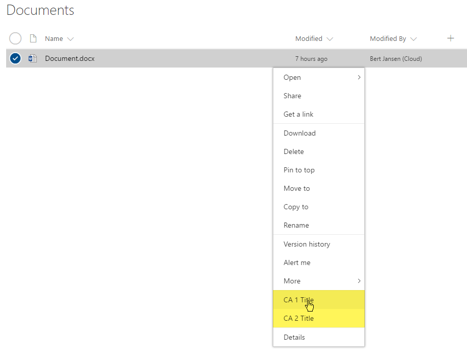
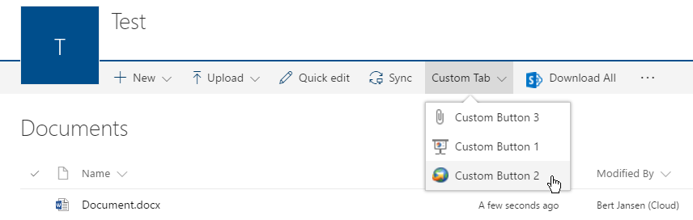
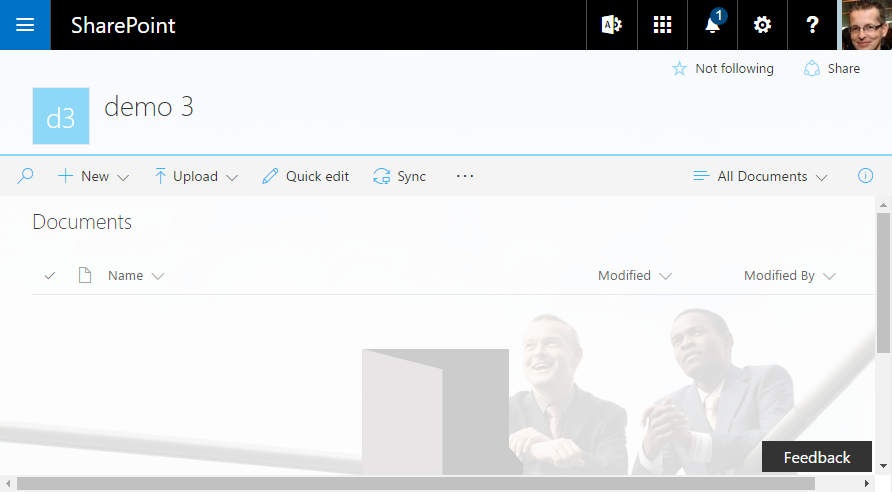
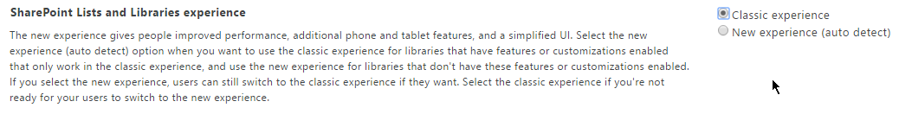
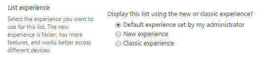

# Customizing "modern" lists and libraries

In 2016, the SharePoint Online team released "modern" document lists and libraries, which bring a better user experience that is faster, more intuitive, and responsive. **The "modern" experiences have many benefits, and we highly recommend using them**. If your current customizations do not yet work with the "modern" experience, it's time to revisit those so your users can benefit from these great improvements:

 - "Modern" document libraries have an updated user interface that offers an experience similar to OneDrive, so it’s more intuitive to create a new folder and upload files in the browser.
 
 - You can select **Pin to top** to add documents “above the fold” in any onscreen view.
 
 - Copying isn’t new, but the copy and move gestures are intelligent about displaying your information architecture and letting you create new folders on the fly.
 
 - You may not have to make as many copies anymore. Document libraries are intelligent about remembering other files you’ve been using in SharePoint, so you can import other files from other libraries as links, without having to duplicate files between multiple sites.
 
 - The new document libraries let you group files directly in the main page without selecting a separate admin screen. You can also drag to change the size of your columns, as well as sort, filter, and group from any column header.
 
 - Mobile browsers have the same features as the desktop, making SharePoint productive for every user, whether they interact via mouse, keyboard, touch, or screen reader.
 
 - You can now edit metadata directly from the main view in the information panel. No more clicking into multiple screens to apply an update!
 
 - Thanks to Office Online integration, you can navigate a complete document preview at the top of the information panel. The panel offers metadata, including the history of recent activity, updates to the file, and who received a share to the file.

This article focuses on the extensibility options within the "modern" library and list experiences. However, if you want to learn more about the functionalities offered by the "modern" experiences, see the following resources:

- [Modern document libraries in SharePoint](https://blogs.office.com/2016/06/07/modern-document-libraries-in-sharepoint)
- [Modern SharePoint lists are here—including integration with Microsoft Flow and PowerApps](https://blogs.office.com/2016/07/25/modern-sharepoint-lists-are-here-including-integration-with-microsoft-flow-and-powerapps)
- [Differences between the new and classic experiences for lists and libraries](https://support.office.com/en-us/article/Differences-between-classic-and-new-experiences-for-lists-and-document-libraries-30e1aab0-a5cc-4363-b7f2-09e2ae07d4dc?ui=en-US&rs=en-US&ad=US)

In the remainder of this article, we'll use "modern" for the new user experience and "classic" for the legacy user experience. 

> [!IMPORTANT]
> We're not deprecating the "classic" experience; both "classic" and "modern" will coexist.


<a name="customizationoptions"> </a>
## Overview of customization options

"Modern" lists and libraries do not support as many customization options as "classic" lists and libraries. In this article, we provide details and examples of the supported options. The SharePoint team is working to support more options in the future. The following list gives a quick overview of the supported capabilities for "modern" lists and libraries:
 
 - Subset of user custom actions
 - Custom branding
 - PowerApps and Flow integration

Numerous customizations are currently not supported for "modern" lists and libraries:
 
 - JSLink-based field customizations (see Note on *SharePoint Framework Extensions*)
 - JSLink-based view customizations (see Note on *SharePoint Framework Extensions*)
 - Custom CSS via AlternateCSSUrl web property
 - Custom JavaScript embedded via user custom actions (see Note on *SharePoint Framework Extensions*)
 - Custom master pages (more extensive branding will be supported later using alternative options)
 - Customization via InfoPath
 - Minimal Download Strategy (MDS)
 - SharePoint server publishing

> [!NOTE]
> In June 2017 [SharePoint Framework extensions went into developer preview](https://dev.office.com/blogs/announcing-availability-of-sharepoint-framework-extensions-developer-preview). Using these SharePoint Framework Extensions, you can control the rendering of a field via custom code, and you can create user custom actions that execute your custom code. To learn more, see [Overview of SharePoint Framework Extensions](http://aka.ms/spfx-extensions). 

<a name="supportedcustomactions"> </a>
## User custom actions

The "modern" experiences allow certain user custom actions to be surfaced in the new user interface, but not all user action configurations that are supported by "classic" mode are supported in the "modern" experience. The following table gives a high level overview of the supported custom action locations and how they're surfaced in the "modern" UI:

|**User custom action location**|**Visible in "modern" UI**|
|:-----|:-----|
| `EditControlBlock` | Yes, these entries show up as custom menu items.|
| `CommandUI.Ribbon` | Yes, these entries show up as toolbar items. |
| All other locations (for example `scriptlink`) | Sorry, these user custom actions won't work. |

> [!NOTE]
> These custom actions show up in "modern" lists and libraries only when you are on "classic" sites with "modern" UI enabled. By default, they don't show up on "modern" sites because it's not possible to add user custom actions to "modern" sites because they have the NoScript option enabled. However, you can disable NoScript on "modern" sites to achieve the same behavior for "modern" lists and libraries across "classic" and "modern" sites.

<a name="editcontrolblockcustomactions"> </a>
### EditControlBlock user custom actions 

Adding custom links to the context menu can be done by using the `EditControlBlock` as the location for your custom action. The following PnP provisioning XML creates two custom entries. 

```XML
<pnp:ProvisioningTemplate ID="EditControlBlockSamples" Version="1" xmlns:pnp="http://schemas.dev.office.com/PnP/2015/12/ProvisioningSchema">
  <pnp:CustomActions>
    <pnp:SiteCustomActions>
      <pnp:CustomAction Name="CA_1" Description="ca 1" Location="EditControlBlock" RegistrationType="List" RegistrationId="101" Title="CA 1 Title" Sequence="3000" Url="https://contoso.azurewebsites.net/pages/index.aspx" Enabled="true"/>
      <pnp:CustomAction Name="CA_2" Description="ca 2" Location="EditControlBlock" RegistrationType="ContentType" RegistrationId="0x0101" Title="CA 2 Title" Sequence="4000" Url="https://contoso.azurewebsites.net/pages/index.aspx" Enabled="true"/>
    </pnp:SiteCustomActions>
  </pnp:CustomActions>
</pnp:ProvisioningTemplate>
```

You can apply this [PnP provisioning template](https://msdn.microsoft.com/en-us/pnp_articles/pnp-provisioning-engine-and-the-core-library) to a site using the PnP Core library or [PnP PowerShell](http://aka.ms/sppnp-powershell). We've opted to show the PowerShell approach in this article. A first step is to [install the PnP PowerShell module](https://github.com/SharePoint/PnP-PowerShell). After that's done, save the PnP provisioning XML to a file, and the two simple lines of PnP PowerShell are enough to apply the template:

```PowerShell

# Connect to a previously created Modern Site
$cred = Get-Credential
Connect-PnPOnline -Url https://[tenant].sharepoint.com/sites/siteurl -Credentials $cred

# Apply the PnP provisioning template
Apply-PnPProvisioningTemplate -Path c:\customaction_modern_editcontrolblock.xml -Handlers CustomActions

```

If you refresh the "modern" view of a document library on your site, you'll see the new entries appear.

*Figure 1. Custom EditControlBlock actions visible in the menu*




> [!NOTE]
> - If you're trying this on a ["modern" team site](modern-experience-customizations-customize-sites.md) where you disabled the NoScript option, use the April 2017 or later version from PnP-PowerShell. Alternatively, use the current dev version.
> - If you want to use this sample for a list, set the `RegistrationId` attribute to 100.

<a name="ribboncustomactions"> </a>
### CommandUI.Ribbon user custom actions 

If you want to extend the toolbar in the "modern" list and library experiences, you can do so by adding a user custom action targeting the CommandUI.Ribbon location as shown in this PnP provisioning XML sample.

```XML
<pnp:ProvisioningTemplate ID="CommandUIRibbonSamples" Version="1" xmlns:pnp="http://schemas.dev.office.com/PnP/2015/12/ProvisioningSchema">
  <pnp:CustomActions>
    <pnp:SiteCustomActions>
      <pnp:CustomAction Name="CA_4" Description="ca 4" Location="CommandUI.Ribbon" RegistrationType="List" RegistrationId="101" Title="CA 4 Title" Sequence="6000" Enabled="true">
        <pnp:CommandUIExtension>
          <CommandUIDefinitions>
            <CommandUIDefinition Location="Ribbon.Documents.Copies.Controls._children">
              <Button
                Id="Ribbon.Documents.Copies.OfficeDevPnPDownloadAll"
                Command="OfficeDevPnP.Cmd.DownloadAll"
                Image16by16="/_layouts/15/images/sharepointfoundation16.png"
                LabelText="Download All"
                Description="Download all files separately"
                ToolTipTitle="Download All"
                ToolTipDescription="Download all files separately"
                TemplateAlias="o1"
                Sequence="15"/>
            </CommandUIDefinition>
          </CommandUIDefinitions>
          <CommandUIHandlers>
            <CommandUIHandler
              Command="OfficeDevPnP.Cmd.DownloadAll"
              CommandAction="https://contoso.azurewebsites.net/pages/index.aspx" />
          </CommandUIHandlers>
        </pnp:CommandUIExtension>
      </pnp:CustomAction>
      <pnp:CustomAction Name="CA_6" Description="ca 6" Location="CommandUI.Ribbon" RegistrationType="ContentType" RegistrationId="0x0101" Title="CA 6 Title" Sequence="5000" Enabled="true">
        <pnp:CommandUIExtension>
            <CommandUIDefinitions>
              <CommandUIDefinition Location="Ribbon.Tabs._children">
                <Tab Id="Custom Tab" Title="Custom Tab" Description="Custom Tab">
                  <Scaling Id="Custom Tab.Scaling">
                    <MaxSize Id="Custom Group.Scaling.MaxSize" GroupId="Custom Group" Size="TwoLarge" />
                    <MaxSize Id="Custom Group 2.Scaling.MaxSize" GroupId="Custom Group 2" Size="OneLarge" />
                    <Scale Id="Custom Group.Scaling.Scale" GroupId="Custom Group" Size="TwoLarge" />
                    <Scale Id="Custom Group 2.Scaling.Scale" GroupId="Custom Group 2" Size="OneLarge" />
                  </Scaling>
                  <Groups Id="Custom Tab.Groups">
                    <Group Id="Custom Group 2" Title="Custom Group 2" Description="Custom Group 2" Sequence="7888" Template="Ribbon.Templates.OneLarge">
                      <Controls Id="Custom Group 2.Controls">
                        <Button Id="CustomButton3" LabelText="Custom Button 3" Image16by16="/_layouts/15/images/attach16.png" Image32by32="/_layouts/15/images/attach16.png" ToolTipTitle="Custom Button 3" ToolTipDescription="Custom Button 3" Command="CustomButton3.Command" TemplateAlias="c3" />
                      </Controls>
                    </Group>
                    <Group Id="Custom Group" Title="Custom Group 1" Description="Custom Group 1" Sequence="10000" Template="Ribbon.Templates.TwoLarge">
                      <Controls Id="Custom Group 1.Controls">
                        <Button Id="CustomButton1" LabelText="Custom Button 1" Image16by16="/_layouts/15/images/itslidelibrary.png" Image32by32="/_layouts/15/images/itslidelibrary.png" ToolTipTitle="Custom Button 1" ToolTipDescription="Custom Button 1" Command="CustomButton1.Command" TemplateAlias="c1" />
                        <Button Id="CustomButton2" LabelText="Custom Button 2" Image16by16="/_layouts/15/images/dldsln16.png" Image32by32="/_layouts/15/images/dldsln16.png" ToolTipTitle="Custom Button 2" ToolTipDescription="Custom Button 2" Command="CustomButton2.Command" TemplateAlias="c2" />
                      </Controls>
                    </Group>
                  </Groups>
                </Tab>
              </CommandUIDefinition>
              <CommandUIDefinition Location="Ribbon.Templates._children">
                <GroupTemplate Id="Ribbon.Templates.TwoLarge">
                  <Layout Title="TwoLarge" LayoutTitle="TwoLarge"> 
                    <Section Alignment="Top" Type="OneRow"> 
                      <Row> 
                        <ControlRef DisplayMode="Large" TemplateAlias="c1" /> 
                        <ControlRef DisplayMode="Large" TemplateAlias="c2" /> 
                      </Row> 
                    </Section> 
                  </Layout> 
                </GroupTemplate>
              </CommandUIDefinition>
              <CommandUIDefinition Location="Ribbon.Templates._children">
                <GroupTemplate Id="Ribbon.Templates.OneLarge">
                  <Layout Title="OneLarge" LayoutTitle="OneLarge"> 
                    <Section Alignment="Top" Type="OneRow"> 
                      <Row> 
                        <ControlRef DisplayMode="Large" TemplateAlias="c3" /> 
                      </Row> 
                    </Section> 
                  </Layout> 
                </GroupTemplate>
              </CommandUIDefinition>
            </CommandUIDefinitions>
            <CommandUIHandlers>
              <CommandUIHandler Command="CustomButton1.Command" CommandAction="https://contoso.azurewebsites.net/pages/index.aspx" />
              <CommandUIHandler Command="CustomButton2.Command" CommandAction="http://www.bing.com" />
              <CommandUIHandler Command="CustomButton3.Command" CommandAction="http://dev.office.com/sharepoint" />
            </CommandUIHandlers>
        </pnp:CommandUIExtension>
      </pnp:CustomAction>
    </pnp:SiteCustomActions>
  </pnp:CustomActions>
</pnp:ProvisioningTemplate>
```

<br/>

After adding these user custom actions, you'll see them appear on the toolbar. Notice that custom tabs are transformed into a drop-down menu.

*Figure 2. Custom action visible on the toolbar*



<br/>

> [!NOTE]
> - If you're trying this on a ["modern" team site](modern-experience-customizations-customize-sites.md) where you disabled the NoScript option, use the April 2017 or later version from PnP-PowerShell. Alternatively use the current dev version.
> - If you want to use this sample for a list, set the `RegistrationId` attributes to 100, and use the following XML for the CA_4 user custom action.
>
   ```XML
	<CommandUIDefinition Location="Ribbon.Templates._children">
	  <Button
	    Id="Ribbon.Templates.OfficeDevPnPDownloadAll"
	    Command="OfficeDevPnP.Cmd.DownloadAll"
	    Image16by16="/_layouts/15/images/sharepointfoundation16.png"
	    LabelText="Download All"
	    Description="Download all files separately"
	    ToolTipTitle="Download All"
	    ToolTipDescription="Download all files separately"
	    TemplateAlias="o1"
	    Sequence="15"/>
	</CommandUIDefinition>
   ```

<a name="customactionlimitations"> </a>
### User custom action limitations 

When developing user custom actions that need to work in "modern" experiences, consider the following limitations:
 
 - You can't completely control the order in which the user custom actions show up; the user custom actions are added in the order the `_api/web/Lists(guid'listid')/CustomActionElements` returns the user custom actions, and this API currently does not take into account the sequence attributes. Buttons defined inside a custom tab can be ordered by adding them in the correct order in the CommandUIDefinition xml. Our sample shows Button 3 as first and that's because of the order in the XML.
 
 - Grouping of user custom actions inside a custom tab is driven by the presence of `Button` elements whenever there's either multiple `Tab` or `Group` elements in the returned user custom action element xml.
 
 - Command actions cannot contain JavaScript. For example, using `CommandAction="javascript:alert('My custom Action');"` means that the user custom action will not show up.
 
 - Using the `ScriptLink` or `ScriptBlock` properties is not possible because they can only be used with the user custom action location `ScriptLink`, which is not supported.
 
 - Using image maps (for example, `Image16by16="/_layouts/15/1033/images/formatmap16x16.png?rev=33" Image16by16Left="-144" Image16by16Top="-107"`) does not work; you'll need to specify individual images. Also note that only 16 x 16 images are relevant.

<a name="themingimpact"> </a>
## Custom branding

If your site happens to use a custom theme, this custom theme is respected in the "modern" list and library experiences as shown in the following sample:

*Figure 3. Modern list with custom branding coming from custom theme*



<a name="configuremodernlibrariesandlists"> </a>
## Configure the end user experience

You have multiple options to control whether the "modern" or "classic" library and list experience is used. 

### Tenant level configuration
If you want to completely disable the "modern" experience, it's best to use the tenant setting for this. Go to your tenant admin center (for example, contoso-admin.sharepoint.com), go to Settings, and select the "classic" experience:

*Figure 4. SharePoint lists and libraries experience settings in the SharePoint Admin UI*



> [!NOTE]
> - When you switch between **New experience (auto detect)** and **Classic experience**, the change is not immediately visible.
> - When you select **New experience (auto detect)**, you always see the **Return to classic SharePoint** option. This is by design given that today not all functionalities of "classic" lists and libraries are implemented in the "modern" lists and libraries. There's no option to change this behavior.

### Site/Web level configuration
You can prevent a site collection or web from using the "modern" experience by enabling a feature:

- For site collection control, use the site collection scoped feature with ID **E3540C7D-6BEA-403C-A224-1A12EAFEE4C4**. 
- For web control, use the web scoped feature with ID **52E14B6F-B1BB-4969-B89B-C4FAA56745EF**. 

Use the following [PnP PowerShell](http://aka.ms/sppnp-powershell) to enable/disable the needed features:

```PowerShell
# Connect to a site
$cred = Get-Credential
Connect-PnPOnline -Url https://[tenant].sharepoint.com/sites/siteurl -Credentials $cred

# Prevent modern lists and libraries at site collection level
Enable-PnPFeature -Identity E3540C7D-6BEA-403C-A224-1A12EAFEE4C4 -Scope Site 
# And again enable modern lists and libraries at site collection level
#Disable-PnPFeature -Identity E3540C7D-6BEA-403C-A224-1A12EAFEE4C4 -Scope Site 

# Prevent modern lists and libraries at web level
#Enable-PnPFeature -Identity 52E14B6F-B1BB-4969-B89B-C4FAA56745EF  -Scope Web 
# And again enable modern lists and libraries at web
#Disable-PnPFeature -Identity 52E14B6F-B1BB-4969-B89B-C4FAA56745EF  -Scope Web 
```

### List/Library configuration
If you want to control the experience at the library level, you can go to **List settings** > **Advanced settings**, and change the behavior:

*Figure 5. List experience configuration in the SharePoint tenant level settings in Admin UI*



The same can also be done by using CSOM as shown in this snippet:

```C#
// Load the list you want to update
var list = context.Web.Lists.GetByTitle(title);
context.Load(list);
context.ExecuteQuery();

// Possible options are Auto (= what it's defined at tenant level), NewExperience (= "modern") and ClassicExperience
list.ListExperienceOptions = ListExperience.ClassicExperience;

// Persist the changes
list.Update();
context.ExecuteQuery();
```

> [!NOTE]
> - The settings at the library level *override* the settings at the web, site, or tenant level. This also implies that you could pilot the "modern" list and library experience to a subsite of sites by having the "modern" experience turned off at the tenant level but enabled at the list level on the pilot sites.
> - When you've manually chosen "classic" (that is, not due to list, site, web, or tenant "classic" enforcement), you'll see the link **Exit classic experience** appearing under the left navigation (as of July 2017). Selecting this brings you back to the "modern" experience.
> - If you're not able to get the "modern" experience to appear, inspect the cookies being passed to SharePoint because it is possible that the opt out of "modern" experiences cookie (splnu with value set to 0) is still present. Clearing the browser cookies should fix this.

<a name="autodetect"> </a>
## When does the built-in auto-detect automatically switch rendering back to "classic"?

SharePoint uses an auto-detect system to automatically switch the rendering of a list to "classic", assuming that you do not disable the "modern" experience for your list by using the site, web, or list scoped overrides explained in the previous section. This auto-detect system automatically switches you back to "classic" whenever SharePoint detects that your list is using features that are not (yet) supported in "modern".

Following are the settings that are evaluated as part of the auto-detect system and which make the list render in "classic" mode:

- If the requested list form page has zero or more than one web part on it.

- (**Until July 2017**) If the web scoped feature "Metadata Navigation and Filtering" is enabled. We're [rolling out managed metadata navigation support for "modern" lists and libraries](https://techcommunity.microsoft.com/t5/SharePoint-Blog/SharePoint-filters-pane-updates-filtering-and-metadata/ba-p/74162).

- If the available web part is an **XSLTListViewWebPart** (default way to render the list) and:
	- There's a non-standard JSLink or XslLink value set for the web part properties.
	- The page is shown in a dialog (IsDlg=1).
	- The list is not based on one of the following types: Document library (101), Picture library (109), Web page library (119), or Generic list (100). **As of August 2017**, Announcements (104) and Links (103) do render using the "modern" UI.
	- The JSLink property is set on one of the fields to render.
	- One of the fields to render is of type **BCS external data**, **Geolocation**, **OutcomeChoice**, or one of these publishing field types **Image**, **Html**, or **SummaryLinks**.
	- There are list scoped user custom actions that have their ScriptSrc property set.

- If the available web part is a **ListFormWebPart** and: 
	- The page is shown in a dialog (IsDlg=1). 
	- It's a "New" form page for a document library.  
	- The fields to render are not any of these supported types: **Attachments**, **TaxonomyField**, **Boolean**, **Choice**, **Currency**, **DateTime**, **File**, **Lookup**, **MultiChoice**, **MultiLine** except when Append with versioning is on, **Number**, **Text**, **User**, or **Url**.

### Programmatically detect if your library/list will be shown using "modern" or "classic" 

The previous section explained the reasoning behind our auto-detect mechanism, but luckily there's an easy way for you as a developer to understand how a library/list will be rendered. Getting this information is as simple as getting the value of the **PageRenderType** file property, which you can obtain by using CSOM or REST. The following samples show how to first load the page that is rendering the list, and then get the **PageRenderType**:

#### CSOM sample

```C#
using (var cc = new ClientContext(siteUrl))
{
    cc.Credentials = new SharePointOnlineCredentials(userName, password);
    
    // Load the AllItems.aspx file from the list
    File file = cc.Web.GetFileByServerRelativeUrl("/sites/dev/ECMTest/Forms/AllItems.aspx");
    cc.Load(file, f => f.PageRenderType);
    cc.ExecuteQuery();

    // Check page render type
    Console.WriteLine($"Status = {file.PageRenderType}");
}
```

<br/>

> [!NOTE]
> The PageRenderType property was introduced in [January 2017 CSOM release (16.1.6112.1200)](https://dev.office.com/blogs/new-sharepoint-csom-version-released-for-Office-365-january-2017).

<br/>

#### REST request

```Html
GET _api/web/getfilebyserverrelativeurl('/sites/dev/ECMTest/Forms/AllItems.aspx')/pageRenderType
```

The REST call gets you the integer value, which is explained in the following table.

Value | Reason
:------:|-------
0 | Undefined = 0, (there's not enough information to know the render mode)
1 | MultipeWePart
2 | JSLinkCustomization
3 | XslLinkCustomization
4 | NoSPList
5 | HasBusinessDataField
6 | HasTaskOutcomeField
7 | HasPublishingField
8 | HasGeolocationField
9 | HasCustomActionWithCode
10 | HasMetadataNavFeature 
11 | SpecialViewType
12 | ListTypeNoSupportForModernMode
13 | AnonymousUser
14 | ListSettingOff
15 | SiteSettingOff
16 | WebSettingOff
17 | TenantSettingOff
18 | CustomizedForm
19 | DocLibNewForm
20 | UnsupportedFieldTypeInForm
21 | InvalidFieldTypeInForm 
22 | InvalidControModeInForm
23 | CustomizedPage
24 | ListTemplateNotSupported
100 | Modern


## Additional considerations

We'll gradually introduce more customization options for "modern" list and library experiences. These will be aligned with the release of additional SharePoint Framework capabilities. Currently, there's no exact schedule available, but we'll update the "modern" experience articles whenever new capabilities are released.

## Additional resources

- [Customizing the "modern" experiences in SharePoint Online](modern-experience-customizations.md)
- [Switch the default experience for lists or document libraries from new or classic](https://support.office.com/en-us/article/Switch-the-default-experience-for-lists-or-document-libraries-from-new-or-classic-66dac24b-4177-4775-bf50-3d267318caa9)
- [Modern document libraries in SharePoint](https://blogs.office.com/2016/06/07/modern-document-libraries-in-sharepoint)
- [Modern SharePoint lists are here—including integration with Microsoft Flow and PowerApps](https://blogs.office.com/2016/07/25/modern-sharepoint-lists-are-here-including-integration-with-microsoft-flow-and-powerapps) 
- [Differences between the new and classic experiences for lists and libraries](https://support.office.com/en-us/article/Differences-between-the-new-and-classic-experiences-for-lists-and-libraries-30e1aab0-a5cc-4363-b7f2-09e2ae07d4dc?ui=en-US&rs=en-US&ad=US)
