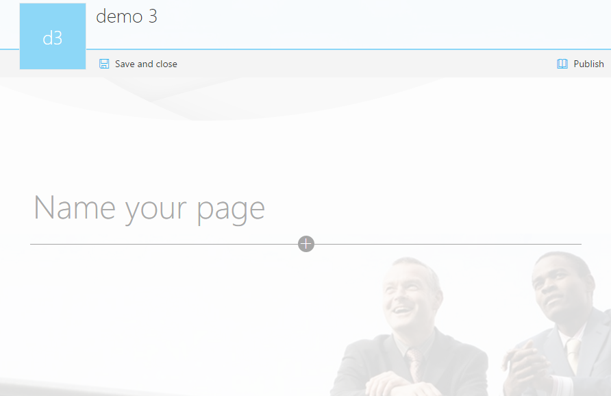
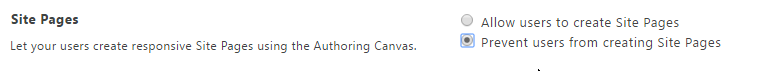
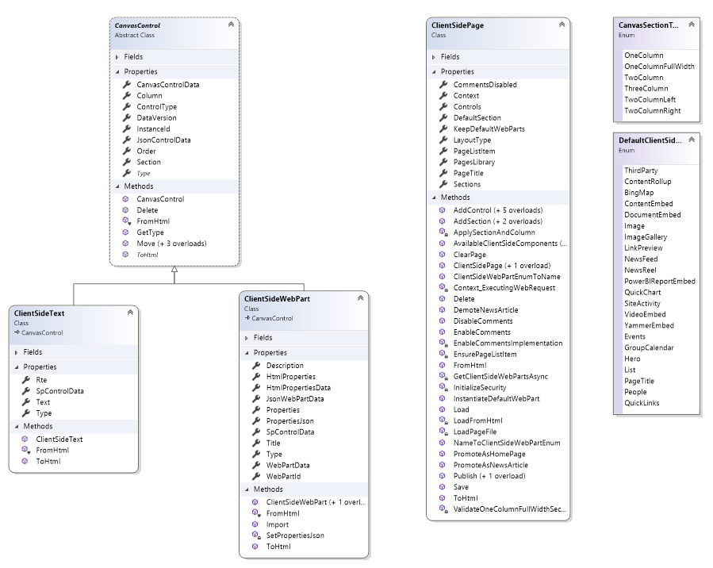

# Customizing "modern" site pages

In 2016, the "modern" page experience was released by the SharePoint team. Modern team site pages are fast, easy to author, and support rich multimedia content. Additionally, pages look great on any device, in a browser, or from within the SharePoint mobile app. 

SharePoint pages are built with web parts, which you can customize according to your needs. You can add documents, videos, images, site activities, Yammer feeds, and more. Just select the + sign and pick a web part from the toolbox to add content to your page. The new “highlighted content” web part lets you set criteria so that specific content automatically and dynamically populates in that area of the page. By using the SharePoint Framework, developers can build custom web parts that show up right in the toolbox.


This article focuses on the extensibility options within the "modern" page experience. However, if you want to learn more about the functionalities offered by the "modern" experiences, see [New capabilities in SharePoint Online team sites including integration with Office 365 Groups](https://blogs.office.com/2016/08/31/new-capabilities-in-sharepoint-online-team-sites-including-integration-with-office-365-groups).

In the remainder of this article, we'll use "modern" for the new user experience and "classic" for the legacy user experience. 

> [!IMPORTANT]
> We're not deprecating the "classic" experience; both "classic" and "modern" will coexist.

## Supported customizations for "modern" pages

The number of customizations available for "modern" pages keeps on growing, and in this article, we'll provide details and examples of the supported options. The SharePoint team is working to support more options in the future. The following list gives a quick overview of the supported capabilities for "modern" pages:

 - Custom branding
 - Adding "modern" pages programmatically
 - Adding, deleting, and updating client-side web parts on "modern" pages
 - Alternative layouts (see note on *SharePoint Virtual Summit*)

These customizations are currently not supported for "modern" pages:

 - Adding "classic" web parts on "modern" pages
 - Custom CSS via AlternateCSSUrl web property
 - Custom JavaScript embedded via user custom actions (see note on *SharePoint Framework Extensions*)
 - Custom master pages (more extensive branding will be supported later using alternative options)
 - Minimal Download Strategy (MDS)

> [!NOTE]
> - We don't recommend combining "modern" page functionality with "classic" SharePoint publishing portals. By default, the "modern" page functionality is not enabled on "classic" SharePoint publishing portals.
> - In June 2017, [SharePoint Framework Extensions went into developer preview](https://dev.office.com/blogs/announcing-availability-of-sharepoint-framework-extensions-developer-preview). Using these SharePoint Framework Extensions, you can control the rendering of a field via custom code, and you can create user custom actions that execute your custom code. To learn more, see [Overview of SharePoint Framework Extensions](http://aka.ms/spfx-extensions). 
> - In May 2017, during the SharePoint Virtual Summit, we announced [communication sites with configurable page layouts](https://blogs.office.com/2017/05/16/new-sharepoint-and-onedrive-capabilities-accelerate-your-digital-transformation/).  

<a name="themingimpact"> </a>
## Custom branding

If your site happens to use a custom theme, this theme is respected in the "modern" page experience as shown in the following sample.

*Figure 1. Modern page with custom branding coming from theme settings*



<a name="sitesversusmodernpages"> </a>
## Why a site may not have "modern" pages functionality

The "modern" pages are delivered by using the Site Pages web scoped feature (B6917CB1-93A0-4B97-A84D-7CF49975D4EC), so when this feature is activated, your site has the option to use "modern" pages. When Microsoft rolled out this feature, we enabled this for all "modern" team sites (GROUP#0 sites) and for most "classic" team sites (STS#0). 

If a "classic" team site had a high count of web parts or wiki pages, the feature was not automatically enabled, and the same applies to "classic" team sites with the publishing feature enabled. If you want "modern" page functionality on these sites, you can still activate the Site Pages feature. This also implies that sites based on other templates do not have the "modern" pages functionality enabled. 

The previous paragraph talked about how the "modern" page feature was enabled on existing sites. When you create a new "modern" or "classic" team site (GROUP#0 or STS#0), the "modern" Site Pages feature is enabled at provisioning time. The "modern" Site Pages feature is not enabled on sites that are based on other templates.

<a name="configuremodernpages"> </a>
## Configuring the end user experience

You have multiple options to control whether the "modern" or "classic" page experience is used. 

### Tenant level configuration

If you want to completely disable the "modern" experience, it's best to use the tenant setting for this. Go to your tenant admin center (for example, contoso-admin.sharepoint.com), go to Settings, and select the "classic" experience.

*Figure 2. Site Pages section in the SharePoint tenant scoped settings in Admin UI*



> [!NOTE]
> - The tenant level setting can be a little confusing; **Prevent users from creating Site Pages** actually brings back the "classic" experience.
> - The current configuration is cached, and signing off the session immediately shows the effect of this change.

### Web level configuration

You can prevent a web from using the "modern" page experience by disabling the web scoped feature with ID **B6917CB1-93A0-4B97-A84D-7CF49975D4EC** (name = "Site Pages"). To re-enable the "modern" page experience at the web level, you need to activate the feature again.

Use the following [PnP PowerShell](http://aka.ms/sppnp-powershell) to enable/disable the needed features:

```PowerShell
# Connect to a site
$cred = Get-Credential
Connect-PnPOnline -Url https://[tenant].sharepoint.com/sites/siteurl -Credentials $cred

# Prevent site pages at web level
Disable-PnPFeature -Identity B6917CB1-93A0-4B97-A84D-7CF49975D4EC -Scope Web 
# And again enable site pages at web
#Enable-PnPFeature -Identity B6917CB1-93A0-4B97-A84D-7CF49975D4EC -Scope Web 
```

> [!NOTE]
> When you disable the feature, you can no longer create new "modern" pages, but the already created pages stay working using the "modern" user experience. 

### Commenting configuration

By default, users can add comments (July 2017) on "modern" pages. If your organization does not want this feature, it can be disabled from the tenant Admin center on the Settings page.

*Figure 3. Enable or disable comments*


> [!NOTE]
> You can also programmatically manage the commenting behavior by using site and tenant level APIs (requires SharePoint Client-Side Object Model (CSOM) version 16.1.6621.1200 or later):
> - Microsoft.Online.SharePoint.TenantAdministration.SiteProperties.CommentsOnSitePagesDisabled 
> - Microsoft.SharePoint.Client.Site.CommentsOnSitePagesDisabled


## Programming "modern" pages

### Adding "modern" pages
Creating a "modern" page comes down to creating a list item in the site pages library and assigning it the correct content type combined with setting some additional properties as shown in the following code snippet:

```C#
// pagesLibrary is List object for the "site pages" library of the site
ListItem item = pagesLibrary.RootFolder.Files.AddTemplateFile(serverRelativePageName, TemplateFileType.ClientSidePage).ListItemAllFields;

// Make this page a "modern" page
item["ContentTypeId"] = "0x0101009D1CB255DA76424F860D91F20E6C4118";
item["Title"] = System.IO.Path.GetFileNameWithoutExtension("mypage.aspx");
item["ClientSideApplicationId"] = "b6917cb1-93a0-4b97-a84d-7cf49975d4ec";
item["PageLayoutType"] = "Article";
item["PromotedState"] = "0";
item["CanvasContent1"] = "<div></div>";
item["BannerImageUrl"] = "/_layouts/15/images/sitepagethumbnail.png";
item.Update();
clientContext.Load(item);
clientContext.ExecuteQuery();

```

<br/>

When using PnP (as of the March 2017 release), you can leverage our extension methods, which gives you a model for adding a page easily:

```C#
cc.Web.AddClientSidePage("mypage.aspx", true);
```

> [!IMPORTANT]
> As of September 2017, pages created using the `AddTemplateFile` method do not have a preview when you hover over them from the search results page. Microsoft is working on a fix/alternative solution for this.

### Using the PnP support for "modern" pages and client-side web parts

As of the March 2017 release, the [PnP Sites core library](http://aka.ms/sppnp) offers support for creating, updating, and deleting client-side pages. This section gives you information about how to work with client-side pages using the [PnP Sites core library on GitHub](https://github.com/SharePoint/PnP-Sites-Core).

#### Create a new page and add a text web part

In this sample, we create a new client-side page in memory, add a rich text editor control, and finally save the page to the site pages library as mypage.aspx. The first step is creating a ClientSidePage instance, and then we instantiate a control that we add on the page by using the `AddControl` method. After that's done, the page is saved.

```C#
// cc is the ClientContext instance for the site you're working with
ClientSidePage myPage = new ClientSidePage(cc);

ClientSideText txt1 = new ClientSideText() { Text = "PnP Rocks" };
myPage.AddControl(txt1, 0);
myPage.Save("mypage.aspx");
```

#### Load an existing page 

When you want to modify or copy an existing page, you can load that page into the PnP client-side object model; the loading "transforms" the HTML content into an object model that you can manipulate. Loading an existing page is done by using the `Load` method.

```C#
// load the page with name "page3.aspx"
ClientSidePage p = ClientSidePage.Load(cc, "page3.aspx");

// perform your page updates
...

// save the page back to SharePoint
p.Save()
```

#### Add a section

Pages can have a flexible layout; you can add one or more sections on a page, and these sections can have up to three columns. You can add sections to your pages by using the SharePoint user interface, or you can do this programmatically.

```C#
var page2 = cc.Web.AddClientSidePage("PageWithSections.aspx", true);
page2.AddSection(CanvasSectionTemplate.ThreeColumn, 5);
page2.AddSection(CanvasSectionTemplate.TwoColumn, 10);
```

#### Add an out-of-the-box web part 
The following sample shows how you can add an out-of-the-box **image** client-side web part on a page. Note that we instantiate the web part object by using the `InstantiateDefaultWebPart` method call. After the web part is initiated, its properties are set to the default properties defined in the web part manifest. For most web parts, you need to update the properties as shown in this sample.

```C#
ClientSidePage page5 = new ClientSidePage(cc);
var imageWebPart = page5.InstantiateDefaultWebPart(DefaultClientSideWebParts.Image);
imageWebPart.Properties["imageSourceType"] = 2;
imageWebPart.Properties["siteId"] = "c827cb03-d059-4956-83d0-cd60e02e3b41";
imageWebPart.Properties["webId"] = "9fafd7c0-e8c3-4a3c-9e87-4232c481ca26";
imageWebPart.Properties["listId"] = "78d1b1ac-7590-49e7-b812-55f37c018c4b";
imageWebPart.Properties["uniqueId"] = "3C27A419-66D0-4C36-BF24-BD6147719052";
imageWebPart.Properties["imgWidth"] = 1002;
imageWebPart.Properties["imgHeight"] = 469;
page5.AddControl(imageWebPart);
page5.Save("page5.aspx");

```

#### Add a custom client-side web part

Previous samples showed how to work with out-of-the-box web parts, but you can also add your custom built client-side web parts to a page. You would start by getting your web part information by using the `AvailableClientSideComponents` method, and then search for your web part and use the information you find to instantiate a `ClientSideWebPart` instance, which is added to the page in the last step.

```C#
ClientSidePage p = new ClientSidePage(cc);

// get a list of possible client side web parts that can be added
var components = p.AvailableClientSideComponents();

// Find our custom "HelloWord" web part
var myWebPart = components.Where(s => s.ComponentType == 1 && s.Name == "HelloWorld").FirstOrDefault();
if (myWebPart != null)
{
    // Instantiate a client side web part from our found web part information
    ClientSideWebPart helloWp = new ClientSideWebPart(myWebPart) { Order = 10 };
    // Add the custom client side web part to the page
    p.AddControl(helloWp);
}

// Persist the page to SharePoint
p.Save("PnPRocks.aspx");
```

#### Adjust control order
You have different methods to control the order in which the controls appear on the page. The key aspect is the `Order` attribute on the actual control: the list of controls is sorted by the value of that `Order` attribute when the page HTML is generated, and the order in the HTML is also the order at page rendering time.

```C#
// Set the order when initiating the control
ClientSideText txt1 = new ClientSideText() { Text = "PnP Rocks", Order = 5 };

// Set the order when you add the control to the page, in this case we want the control to be the first
myPage.AddControl(txt1, -1);

// Manipulate the control order on the page...e.g. move a control to the back
myPage.Controls[1].Order = 10;

```

#### Delete a control

If you want to delete a control from a page, you can simply call the `Delete` method on the control and save the page back.

```C#
ClientSidePage deleteDemoPage = ClientSidePage.Load(cc, "page3.aspx");
deleteDemoPage.Controls[0].Delete();
deleteDemoPage.Save();
```

#### Delete a page 

Finally, you can delete a client-side page.

```C#
ClientSidePage p = ClientSidePage.Load(cc, "deleteme.aspx");
p.Delete();
```

#### Class model

The following figure shows the most important classes you'll be working with when using the PnP client-side page object model.

*Figure 4. PnP client-side object model*



## Additional considerations

We'll gradually introduce more customization options for the "modern" pages experience. These options will be aligned with the release of additional SharePoint Framework capabilities. Currently, there is no exact schedule available, but we'll update the "modern" experience articles whenever new capabilities are released.

## Additional resources

- [Customizing the "modern" experiences in SharePoint Online](modern-experience-customizations.md)
- [Allow or prevent creation of modern site pages by end users](https://support.office.com/en-us/article/Allow-or-prevent-creation-of-modern-site-pages-by-end-users-c41d9cc8-c5c0-46b4-8b87-ea66abc6e63b?ui=en-US&rs=en-US&ad=US)
