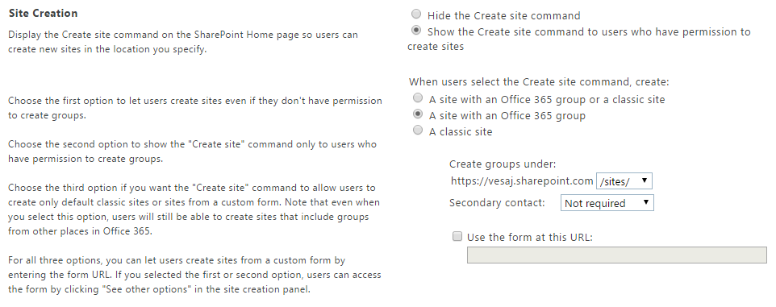
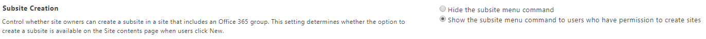

# Provisioning "modern" team sites programmatically

"Modern" sites were introduced in SharePoint Online during the autumn of 2016, and the option to use them can be controlled at the tenant level. This article discusses the different options and considerations for provisioning "modern" sites in SharePoint Online. In particular, the article covers how to create both "modern" team sites and "modern" communication sites.

> [!IMPORTANT]
> We're not deprecating the "classic" experience; both "classic" and "modern" will coexist.

## Comparing "modern" team sites and "modern" communication sites

Before digging into the details about how to provision "modern" sites, let's discuss a little bit about the two main flavors available: team sites and communication sites.

A "modern" team site is a place where a group of people can work together, collaborate, and share documents and messages. Every "modern" team site has a backing Office 365 group to improve the overall collaboration experience. In fact, thanks to the Office 365 group, members of the team can benefit from services such as Planner, a shared Calendar, a shared OneDrive for Business storage, and custom Office 365 connectors. In a "modern" team site, typically the members can contribute to the content (read/write). Moreover, the Office 365 group backing a "modern" team site can be private or public, and by default it is public.

A "modern" communication site is a place where you can share news, showcase a story, or broadcast a message. The idea of a communication site is to have few editors that create and maintain the content, and a wide audience that consumes that content. However, a communication site does not have a backing Office 365 group. Users can access the target communication site with the well-known set of permissions of any other SharePoint site, and by default every communication site is private.

Thus, if you have to create a site for team collaboration, most likely the "modern" team site is the right choice. On the contrary, if you want to communicate something to a broad set of people, probably the communication site is your best choice.

## Provisioning "modern" team sites

In this section you learn how to provision a "modern" team site, and what the available options are to do that.

### Provision a "modern" team site from the user interface

There are numerous routes for a "modern" team site to get provisioned. You can start the provisioning directly from the SharePoint Online site, or alternatively provision an Office 365 group from other locations (for example, from Outlook), which then also triggers the provisioning of a "modern" team site. 

- If your administrator enabled "modern" team sites in your tenant, you can create "modern" team sites from the SharePoint home page.

- You can also create an Office 365 group from Office 365 Outlook, and when you access the site tab of that group, you land on a "modern" team site. 

#### Control default provisioning flow

You can control the SharePoint site creation process from the SharePoint Online admin settings. You can choose if the "modern" experience is available for your end users or if you'd like to continue using the "classic" experience.



For more information, see the following Office Support article:
- [Manage site creation in SharePoint Online](https://support.office.com/en-US/article/Manage-site-creation-in-SharePoint-Online-e72844a3-0171-47c9-befb-e98b23e2dcf9)

### Provision a "modern" team site programmatically via SharePoint Online REST API

"Modern" team sites can be created programmatically by using a REST API provided by SharePoint Online, and also used by the Create Site UI of SharePoint Online. To provision a "modern" team site via REST, make a POST reqeust to the Microsoft Graph "groups" endpoint: ```https://graph.microsoft.com/v1.0/groups```

The URI of the "modern" team site is determined by the **mailNickname** parameter and the managed path you select for team sites in your tenant administration (this defaults to 'sites').

The following would create an Office 365 group and an associated "modern" team site with a URL of ```https://[tenant].sharepoint.com/sites/mymodernteamsite```

```
POST https://graph.microsoft.com/v1.0/groups
Content-type: application/json
Content-length: 200

{
  "description": "description",
  "displayName": "My modern team site",
  "groupTypes": [
    "Unified"
  ],
  "mailEnabled": true,
  "mailNickname": "mymodernteamsite",
  "securityEnabled": false
}
```

### Provision a "modern" team site by using the PnP CSOM Core component

In the SharePoint PnP Core component&mdash;since the October 2017 release (v. 2.19.1710.1)&mdash;there is a new extension method for the CSOM **ClientContext** type. The extension method name is **CreateSiteAsync** and allows you to create a "modern" team site in a matter of seconds. 

In the following code snippet you can see how to use this technique.

```csharp
// Let's use the CreateSiteAsync extension method of PnP CSOM Core
// to create the "modern" team site

var targetTenantUrl = "https://[tenant].sharepoint.com/";

using (var context = new ClientContext(targetTenantUrl))
{
    context.Credentials = OfficeDevPnP.Core.Utilities.CredentialManager.GetSharePointOnlineCredential("[Name-of-Your-Credentials]");

    // Create new "modern" team site at the url
    // https://[tenant].sharepoint.com/sites/mymodernteamsite
    var teamContext = await context.CreateSiteAsync(
        new TeamSiteCollectionCreationInformation
        {
            Alias = "mymodernteamsite", // Mandatory
            DisplayName = "displayName", // Mandatory
            Description = "description", // Optional
            Classification = "classification", // Optional
            IsPublic = true, // Optional, default true
        });
    teamContext.Load(teamContext.Web, w => w.Url);
    teamContext.ExecuteQueryRetry();
    Console.WriteLine(teamContext.Web.Url);
}
```

> [!NOTE]
> You can find further details about the **Classification** argument in [SharePoint "modern" sites classification](modern-experience-site-classification.md).

As you can see, the extension method creates a new "modern" team site and returns a new **ClientContext** object directly connected to the newly created site.

### Provision a "modern" team site by using PnP PowerShell

You can also create "modern" sites by using [PnP PowerShell](https://github.com/SharePoint/PnP-PowerShell/releases). The following script creates a "modern" team site and then returns the actual SharePoint site URL for further manipulation. After you have access to the URL of the created site, you can use CSOM (with the SharePoint PnP Core component) or SharePoint PnP-PowerShell to automate other operations on the created site.

```powershell
# Connect to SharePoint Online
# This command will prompt the sign-in UI to authenticate
Connect-PnPOnline "https://[tenant].sharepoint.com/"

# Create the new "modern" team site
$teamSiteUrl = New-PnPSite -Type TeamSite -Title "displayName" -Alias "mymodernteamsite" -Description "description" -IsPublic -Classification "classification" 

# Connect to the modern site using PnP PowerShell SP cmdlets
# Since we are connecting now to SP side, credentials will be asked
Connect-PnPOnline $teamSiteUrl

# Now we have access on the SharePoint site for any operations
$context = Get-PnPContext
$web = Get-PnPWeb
$context.Load($web, $web.WebTemplate)
Execute-PnPQuery
$web.WebTemplate + "#" + $web.Configuration
```

### Provision a "modern" team site using the Office 365 CLI

Alternatively, the [Office 365 CLI](https://sharepoint.github.io/office365-cli/?utm_source=msft_docs&utm_medium=page&utm_campaign=Provisioning+modern+team+sites+programmatically) can be used to create "modern" sites. The Office 365 CLI is a cross-platform command line interface that can be used on any platform, including Windows, MacOS and Linux. 

The following bash script will create a "modern" team site and then return the actual SharePoint site URL for further manipulation. Once you have access to the URL of the created site, you can use it to automate other operations on the created site.

```bash
#!/usr/bin/env bash
# Connect to SharePoint Online
# This command will prompt a sign-in confirmation message to authenticate
o365 spo connect https://[tenant].sharepoint.com/

# Create the new "modern" team site
siteUrl=$(o365 spo site add --type TeamSite --title 'displayName' --alias 'mymodernteamsite' --description 'description' --isPublic --classification 'classification')

# Display the modern site url
echo $siteUrl

# Since the Office 365 CLI is connected to SharePoint Online we can do any operations. 
# As example, we can list all the properties from the site property bag:
o365 spo propertybag list -u $siteUrl
```

### Provision an Office 365 group programmatically

"Modern" team sites can be created programmatically by creating an [Office 365 group](https://developer.microsoft.com/en-us/graph/docs/api-reference/v1.0/resources/group) using the Microsoft Graph. In fact, when you create an Office 365 group, a "modern" team site is automatically provisioned for the group. The "modern" team site URI is based on the **mailNickname** parameter of the Office 365 group and has the following default structure. 

```
https://[tenant].sharepoint.com/sites/[mailNickname]
``` 

> [!NOTE]
> A detailed description of group creation using Microsoft Graph is available from the [official documentation](https://developer.microsoft.com/en-us/graph/docs/api-reference/v1.0/api/group_post_groups).

#### Provision an Office 365 group using the PnP CSOM core component

The PnP CSOM Core component, available as a [NuGet package](https://www.nuget.org/packages/SharePointPnPCoreOnline), has simplified methods for the "modern" group handling. 

```csharp
/// <summary>
/// Let's use the UnifiedGroupsUtility class from PnP CSOM Core to simplify managed code operations for Office 365 groups
/// </summary>
/// <param name="accessToken">Azure AD Access token with Group.ReadWrite.All permission</param>
public static void ManipulateModernTeamSite(string accessToken)
{
    // Create new modern team site at the url https://[tenant].sharepoint.com/sites/mymodernteamsite
    Stream groupLogoStream = new FileStream("C:\\groupassets\\logo-original.png", 
                                            FileMode.Open, FileAccess.Read);
    var group = UnifiedGroupsUtility.CreateUnifiedGroup("displayName", "description", 
                            "mymodernteamsite", accessToken, groupLogo: groupLogoStream);
            
    // We received a group entity containing information about the group
    string url = group.SiteUrl;
    string groupId = group.GroupId;

    // Get group based on groupID
    var group2 = UnifiedGroupsUtility.GetUnifiedGroup(groupId, accessToken);
    // Get SharePoint site URL from group id
    var siteUrl = UnifiedGroupsUtility.GetUnifiedGroupSiteUrl(groupId, accessToken);

    // Get all groups in the tenant
    List<UnifiedGroupEntity> groups = UnifiedGroupsUtility.ListUnifiedGroups(accessToken);

    // Update description and group logo programatically
    groupLogoStream = new FileStream("C:\\groupassets\\logo-new.png", FileMode.Open, FileAccess.Read);
    UnifiedGroupsUtility.UpdateUnifiedGroup(groupId, accessToken, description: "Updated description", 
                                            groupLogo: groupLogoStream);

    // Delete group programatically
    UnifiedGroupsUtility.DeleteUnifiedGroup(groupId, accessToken);
}
```

#### Provision an Office 365 group using PnP PowerShell

You can also create an Office 365 group using [PnP PowerShell](https://github.com/SharePoint/PnP-PowerShell/releases), which will let you easily authenticate with the Microsoft Graph using Azure Active Directory. The following script creates an Office 365 group, together with a "modern" team site, and then returns the actual SharePoint site URL for further manipulation. After you have access to the URL of the created site, you can use CSOM (with the SharePoint PnP Core component) or SharePoint PnP-PowerShell to automate other operations on the created site.

```powershell
# Connect to your SharePoint admin center, credentials will be asked
Connect-PnPOnline -Url https://contoso-admin.sharepoint.com

# Create a new modern team site
New-PnPSite -Type Team -Title "Awesome Group" -Description "Awesome Group" -Alias "awesome-group"
```

#### Provision a modern teamsite using SharePoint Online Management Shell or PnP PowerShell

It is also possible to create a modern site which is not connected to a Group using PowerShell. Either by using the PnP PowerShell cmdlets or the SharePoint Online Management Shell. 

```powershell
$title = "Awesome ModernTeamsite"
$url = "https://contoso.sharepoint.com/sites/awesomemodernteamsite"
$owner = "denisd@contoso.com"

// SharePoint Online Management Shell
New-SPOSite -Title $_title -Url $_url -Owner $owner -StorageQuota 512 -Template "STS#3"

// PnP
New-PnPTenantSite -Url $_url -Description $_title -Title $_title -Template STS#3 -Owner $owner
```

#### Provision an Office 365 Group using the Office 365 CLI

Alternatively, the [Office 365 CLI](https://sharepoint.github.io/office365-cli/cmd/graph/o365group/o365group-add/?utm_source=msft_docs&utm_medium=page&utm_campaign=Provisioning+modern+team+sites+programmatically) can be used to create an Office 365 Group, which will let you easily authenticate with the Microsoft Graph and then create the new group.
The example below shows how it can be done using the [Office 365 CLI immersive mode](https://sharepoint.github.io/office365-cli/user-guide/using-cli/#start-the-cli-in-the-immersive-mode?utm_source=msft_docs&utm_medium=page&utm_campaign=Provisioning+modern+team+sites+programmatically).

```bash
# Use the Office 365 CLI immersive mode by typing o365 in the terminal
# Connect to Microsoft Graph using the Office 365 CLI
# This command will prompt a sign-in confirmation message to authenticate
graph connect

# Create an Office 365 Group
# The newly created SharePoint site for that group will has URL
# https://[tenant].sharepoint.com/sites/awesome-group
graph o365group add --displayName 'Awesome Group' --description 'Awesome Group' --mailNickname awesome-group
```


## Provisioning "modern" communication sites

In this section, you learn how to provision a "modern" communication site, and what are the available options to do that.

### Provision a "modern" communication site from the user interface

To provision a "modern" communication site using the user interface&mdash;if your administrator enabled "modern" team sites in your tenant&mdash;you can start directly from the SharePoint Online home page. Choose the **Create Site** button, select to create a **Communication Site**, choose a design for your site, provide a name and a description, and the site is created in a matter of seconds.

At the time of this writing the available designs for a communication site are:
* **Topic**: use this design if you have a lot of information to share such as news, events, and other content.
* **Showcase**: use this design to showcase a product, team, or event using photos or images.
* **Blank**: start with a blank site and make your design come to life quickly and easily.

### Provision a "modern" communication site programmatically

If you prefer, you can create a "modern" communication site programmatically by using either CSOM and PnP, or PowerShell.

#### Provision a "modern" communication site using the PnP CSOM Core component

The PnP CSOM Core component, available as a [NuGet package](https://www.nuget.org/packages/SharePointPnPCoreOnline), has simplified methods for the "modern" sites handling. 

```csharp
// Let's use the CreateSiteAsync extension method of PnP CSOM Core
// to create the "modern" team site

var targetTenantUrl = "https://[tenant].sharepoint.com/";

using (var context = new ClientContext(targetTenantUrl))
{
    context.Credentials = OfficeDevPnP.Core.Utilities.CredentialManager.GetSharePointOnlineCredential("[Name-of-Your-Credentials]");

    // Create new "modern" communication site at the url https://[tenant].sharepoint.com/sites/mymoderncommunicationsite
    var communicationContext = await context.CreateSiteAsync(new CommunicationSiteCollectionCreationInformation {
        Title = "title", // Mandatory
        Description = "description", // Mandatory
        Lcid = 1033, // Mandatory
        AllowFileSharingForGuestUsers = false, // Optional
        Classification = "classification", // Optional
        SiteDesign = CommunicationSiteDesign.Topic, // Mandatory
        Url = "https://[tenant].sharepoint.com/sites/mymoderncommunicationsite", // Mandatory
    });
    communicationContext.Load(communicationContext.Web, w => w.Url);
    communicationContext.ExecuteQueryRetry();
    Console.WriteLine(communicationContext.Web.Url);
}
```

As you can see, the extension method creates a new "modern" communication site and returns a new **ClientContext** object directly connected to the newly created site.

#### Provision a "modern" communication site by using PnP PowerShell

The following script creates a "modern" communication site and then returns the actual SharePoint site URL for further manipulation, similar to the previous example with "modern" team sites.

```powershell
# Connect to SharePoint Online
# This command will prompt the sign-in UI to authenticate
Connect-PnPOnline "https://[tenant].sharepoint.com/"

# Create the new "modern" communication site
$communicationSiteUrl = New-PnPSite -Type CommunicationSite -Title "displayName" -Url "https://[tenant].sharepoint.com/sites/mymoderncommunicationsite" -Description "description" -Classification "classification" -SiteDesign Topic

# Connect to the modern site using PnP PowerShell SP cmdlets
# Since we are connecting now to SP side, credentials will be asked
Connect-PnPOnline $communicationSiteUrl

# Now we have access on the SharePoint site for any operations
$context = Get-PnPContext
$web = Get-PnPWeb
$context.Load($web, $web.Title)
Execute-PnPQuery
$web.Title
```

#### Provision a "modern" communication site using the Office 365 CLI

Alternatively, the [Office 365 CLI](https://sharepoint.github.io/office365-cli/cmd/spo/site/site-add/?utm_source=msft_docs&utm_medium=page&utm_campaign=Provisioning+modern+team+sites+programmatically) can be used to create "modern" Communication site. The following bash script will create the site and then return the actual SharePoint site URL for further manipulation. Once you have access to the URL you can use it to automate other operations on the created site.

```bash
#!/usr/bin/env bash
# Connect to SharePoint Online
# This command will prompt a sign-in confirmation message to authenticate
o365 spo connect https://[tenant].sharepoint.com/

# Create the new "modern" communication site
siteUrl=$(o365 spo site add --type CommunicationSite --url https://[tenant].sharepoint.com/sites/mymoderncommunicationsite --title displayName --description description --classification classification)

# Display the modern site url
echo $siteUrl

# Since the Office 365 CLI is connected to SharePoint Online we can do any operations. 
# As example, we can list all the properties from the site property bag:
o365 spo propertybag list -u $siteUrl
```

## Additional considerations

### Subsites use "classic" templates

If you provision a subsite under the root site of a "modern" site collection, subsites will use "classic" templates. There are currently no "modern" subsite templates available. You can transform a "classic" subsite to a "modern" team site by creating a "modern" page on the site and updating the welcome page to the newly created page.  

If you don't want to allow users to create a "classic" subsite under a "modern" site collection, as an admin you can go to the SharePoint Admin Center, select the Settings page and configure the option for **Subsite Creation** to hide the **subsite** creation menu. You can see the **Subsite Creation** option in the following image.



### Sites are not listed in the classic SharePoint Admin UI / Tenant API

"Modern" team sites are not visible in the SharePoint admin UI. You can access the list of "modern" team sites from the Office 365 Groups admin user interface under Office 365 admin portal. SharePoint Online admin user interface only list "classic" SharePoint sites. This same limitation does not apply to the tenant API: you can use this API to enumerate "modern" team sites together with "classic" team sites. To obtain a list of only "modern" team sites, you can also use the Groups endpoint from Microsoft Graph API.

There is also an upcoming new SharePoint Admin UI, which supports managing the new "modern" site collections, together with the "classic" ones.

## See also

- [What is a SharePoint team site?](https://support.office.com/en-US/article/What-is-a-SharePoint-team-site-75545757-36c3-46a7-beed-0aaa74f0401e?ui=en-US&rs=en-US&ad=US)
- [Create a team site in SharePoint Online](https://support.office.com/en-US/article/Create-a-team-site-in-SharePoint-Online-ef10c1e7-15f3-42a3-98aa-b5972711777d)
- [Manage site creation in SharePoint Online](https://support.office.com/en-us/article/Manage-site-creation-in-SharePoint-Online-e72844a3-0171-47c9-befb-e98b23e2dcf9?ui=en-US&rs=en-US&ad=US)
- [Manage your SharePoint team site settings](https://support.office.com/en-us/article/Manage-your-SharePoint-team-site-settings-8376034d-d0c7-446e-9178-6ab51c58df42?ui=en-US&rs=en-US&ad=US)
- [Customizing the "modern" experiences in SharePoint Online](modern-experience-customizations.md)
