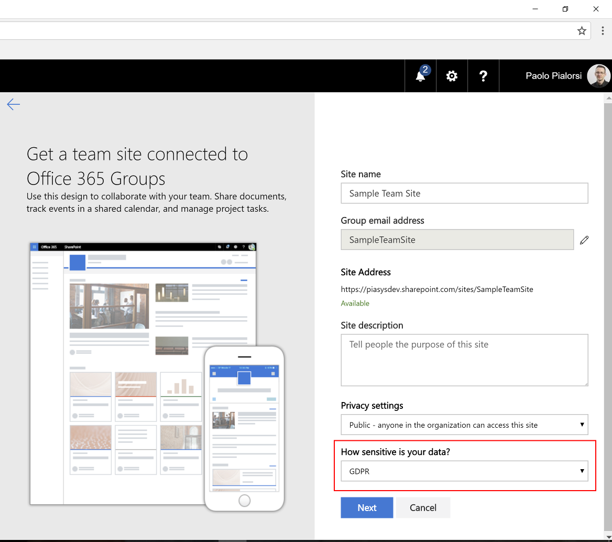
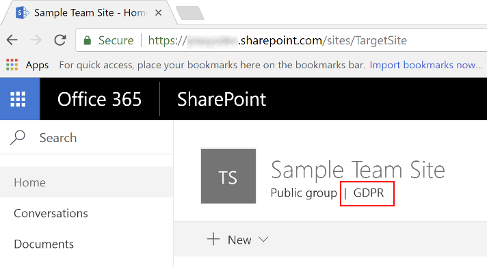
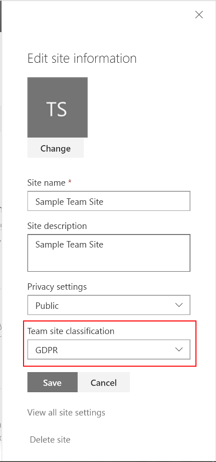

# SharePoint "modern" sites classification
When you create "modern" sites in SharePoint Online, you can optionally select a 'Site Classification' to define the sensitivity of your site data. The goal of site classification is to allow managing clusters of sites based on their classification from a governance and compliance perspective, as well as to automate governance processes based on site classification.

> [!IMPORTANT]
> The 'Site Classification' option is not enabled by default, and you need to configure it at the Azure AD level.

## Enabling 'Site Classification' in your tenant

In order to benefit of 'Site Classification' you need to enable this capability at the Azure AD level, in your target tenant. Once you have enabled this capability, you will see an additional field 'How sensititive is your data?' while creating new "modern" sites. In the following figure you can see how the 'Site Classification' field looks like.



While in the following figure, you can see the classification highlighted in the header of a "modern" site.



### Enabling 'Site Classification' with PowerShell
To enable the 'Site Classification' capability you can execute a bunch of PowerShell code, like the one illustrated below.

```ps
# Install the AzureAD Preview Module for PowerShell
Install-Module AzureADPreview

# Connect to Azure AD
Connect-AzureAD

# Create new directory setting and set initial values
$template = Get-AzureADDirectorySettingTemplate | where { $_.DisplayName -eq "Group.Unified" }

$setting = $template.CreateDirectorySetting()
$setting["UsageGuidelinesUrl"] = "https://aka.ms/sppnp"
$setting["ClassificationList"] = "HBI, MBI, LBI, GDPR"
$setting["DefaultClassification"] = "MBI"
New-AzureADDirectorySetting -DirectorySetting $setting

```

> [!NOTE]
> Please, consider that it takes a while (about 1 hour or more) to have the settings available in the UI of Office 365.

About the code snippet above, it worth it to say that at the time of this writing you have to use the preview version of the AzureAD cmdlets, but pretty soon you will be able to use the RTM version.
Once you have installed the AzureAD cmdlets, you simply need to connect to the target Azure AD tenant, which is backing your target SharePoint Online tenant.
Using the _Get-AzureADDirectorySettingTemplate_ cmdlet you get a reference to the 'Setting Template' for the 'Unified Groups', which is the one with _DisplayName_ of 'Group.Unified'.
Once you have the template, you can configure the settings of that template by creating a new _DirectorySetting_ and providing the setting values through a dictionary.

The main settings, from a 'Site Classification' perspective are:
* **UsageGuidelinesUrl**: the URL of a page where you can explain what are the different classification options. A link to that page will show up in the site creation form and in the header of every classified site.
* **ClassificationList**: a comma separated list of values for the 'Site Classification' options list.
* **DefaultClassification**: the default value for the 'Site Classification'.

### Enabling 'Site Classification' with PnP Core Library

Another option that you have to enable the 'Site Classification' capability is to leverage the PnP Core Library, which provides few extension methods to manage classification in C# code.
For example, to enable the 'Site Classification' you can write C# code like the one illustrated below.

```csharp
// Connect to the admin central of your tenant
using (var adminContext = new ClientContext("https://[tenant]-admin.sharepoint.com/"))
{
    // Provide a valid set of credentials
    adminContext.Credentials = OfficeDevPnP.Core.Utilities.CredentialManager.GetSharePointOnlineCredential("[name-of-your-credentials]");

    // Create a new instance of the Tenant class of CSOM
    var tenant = new Tenant(adminContext);

    // Get an Azure AD Access Token using ADAL, MSAL, or whatever else you like
    var accessToken = getAzureADAccessToken();

    // Define the list of classifications
    var newClassificationList = new List<String>();
    newClassificationList.Add("HBI");
    newClassificationList.Add("MBI");
    newClassificationList.Add("LBI");
    newClassificationList.Add("GDPR");

    // Use the PnP extension method to enable 'Site Classification'
    // Including a default classification value and a the URL to an informative page
    tenant.EnableSiteClassifications(accessToken, newClassificationList, "MBI", "http://aka.ms/OfficeDevPnP");
}

```

## Updating or Removing 'Site Classification' in your tenant

As like as for enabling the 'Site Classification', updating or removing the setting can be done either using PowerShell or PnP Core Library.

### Updating or Removing 'Site Classification' with PowerShell

If you need to update the 'Site Classification' settings afterwards, you can use the following PowerShell snippet.

```PowerShell
# Connect to Azure AD
Connect-AzureAD

# Read current settings
(Get-AzureADDirectorySetting | where { $_.DisplayName -eq "Group.Unified" }).Values

# Update settings
$currentSettings = Get-AzureADDirectorySetting | where { $_.DisplayName -eq "Group.Unified" }
$currentSettings["UsageGuidelinesUrl"] = "https://aka.ms/sppnp"
$currentSettings["ClassificationList"] = "HBI, MBI, LBI, GDPR"
$currentSettings["DefaultClassification"] = "MBI"
Set-AzureADDirectorySetting -Id $currentSettings.Id -DirectorySetting $currentSettings
```

> [!NOTE]
> Please, consider that it takes a while (about 1 hour or more) to have the settings updated in the UI of Office 365. However, it shouldn't be a big issue, because you shouldn't update the 'Site Classification' settings very often.

As you can see, you simply need to search for the Directory Setting with a _DisplayName_ value of 'Group.Unified' and then you can update its setting values and apply the changes by using the _Set-AzureADDirectorySetting_ cmdlet.

To remove a 'Site Classification' you can use the _Remove-AzureADDirectorySetting_ cmdlet, like in the following code snippet.

```ps
# Delete settings
$currentSettings = Get-AzureADDirectorySetting | where { $_.DisplayName -eq "Group.Unified" }
Remove-AzureADDirectorySetting -Id $currentSettings.Id
```

### Updating or Removing 'Site Classification' with PnP Core Library

Another option that you have is to use the PnP Core Library.
For example, to update the 'Site Classification' you can write C# code like the one illustrated below.

```csharp
// Connect to the admin central of your tenant
using (var adminContext = new ClientContext("https://[tenant]-admin.sharepoint.com/"))
{
    // Provide a valid set of credentials
    adminContext.Credentials = OfficeDevPnP.Core.Utilities.CredentialManager.GetSharePointOnlineCredential("[name-of-your-credentials]");

    // Create a new instance of the Tenant class of CSOM
    var tenant = new Tenant(adminContext);

    // Get an Azure AD Access Token using ADAL, MSAL, or whatever else you like
    var accessToken = getAzureADAccessToken();

    // Retrieve the current set of values for 'Site Classification'
    var classificationList = tenant.GetSiteClassificationList(accessToken);
    
    // And update it by adding a new value
    var updatedClassificationList = new List<String>(classificationList);
    updatedClassificationList.Add("TopSecret");

    // Update the 'Site Classification' settings accordingly
    tenant.UpdateSiteClassificationSettings(accessToken, updatedClassificationList, "MBI", "http://aka.ms/SharePointPnP");
}
```

Moreover, in order to disable and remove the 'Site Classification' settings, you can use a code snippet like the following one.

```csharp
// Connect to the admin central of your tenant
using (var adminContext = new ClientContext("https://[tenant]-admin.sharepoint.com/"))
{
    // Provide a valid set of credentials
    adminContext.Credentials = OfficeDevPnP.Core.Utilities.CredentialManager.GetSharePointOnlineCredential("[name-of-your-credentials]");

    // Create a new instance of the Tenant class of CSOM
    var tenant = new Tenant(adminContext);

    // Get an Azure AD Access Token using ADAL, MSAL, or whatever else you like
    var accessToken = getAzureADAccessToken();

    // Disable the 'Site Classification' settings
    tenant.DisableSiteClassifications(accessToken);
}
```

## Managing the classification of a site

The value of classification for a site can be read, or updated, later on using the UI of SharePoint Online, as you can see in the following figure, by editing the 'Site Information' settings.



### Programmatically reading the classification of a site

From a developer's perspective, you can use CSOM and the REST API of SharePoint Online to read and write the value of classification for a specific site. In fact, every SharePoint Online site collection has the _Classification_ property that you can use to read the site classification. 

Here you can see a PowerShell snippet to do that.

```ps
# Delete settings
Connect-PnPOnline "https://[tenant].sharepoint.com/sites/[modernsite]" -Credentials [credentials]

$site = Get-PnPSite
$classificationValue = Get-PnPProperty -ClientObject $site -Property Classification
Write-Host $classificationValue
```

If you like to read the 'Site Classification' value using REST, for example within a SharePoint Framework client-side web part, you can use the following REST endpoint:

```TEXT
https://[tenant].sharepoint.com/sites/[modernsite]/_api/site/Classification
```

Based on the classification value of a site, you can define automation and custom policy rules.

In the PnP Core Library there is an extension method for the Site object of CSOM, which allows you to easily read the classification value of a site. In the following code snippet you can see how to leverage this extension method.

```csharp
// Connect to the target site collectiion
using (var clientContext = new ClientContext("https://[tenant].sharepoint.com/sites/[modernsite]"))
{
    // Provide a valid set of credentials
    clientContext.Credentials = OfficeDevPnP.Core.Utilities.CredentialManager.GetSharePointOnlineCredential("[name-of-your-credentials]");

    // Read the current classification value
    var currentClassification = clientContext.Site.GetSiteClassification();
}
```

### Programmatically updating the classification of a site

If your target is a  "modern" communication site, you can use the _Classification_ property of CSOM to update the value, too.

If your target is a "modern" team site and you want to update the classification value, you should use the Microsoft Graph because the _Classification_ property of CSOM simply replicates the value of the _classification_ property of the Office 365 group.

> [!NOTE]
> You can find further details about how to update an Office 365 group using the Microsoft Graph in the document [Update group](https://developer.microsoft.com/en-us/graph/docs/api-reference/v1.0/api/group_update).

In order to make it easier for you to update the classification of a site, in the PnP Core Library there is an extension method that applies for you the right behavior, depending on the "modern" site type. In the following code excerpt you can see how to use it.

```csharp
// Connect to the target site collectiion
using (var clientContext = new ClientContext("https://[tenant].sharepoint.com/sites/[modernsite]"))
{
    // Provide a valid set of credentials
    clientContext.Credentials = OfficeDevPnP.Core.Utilities.CredentialManager.GetSharePointOnlineCredential("[name-of-your-credentials]");

    // Get an Azure AD Access Token using ADAL, MSAL, or whatever else you like
    // This is needed only if your target is a "modern" team site
    var accessToken = getAzureADAccessToken();

    // Update the classification value, where the accessToken is an optional argument
    clientContext.Site.SetSiteClassification("MBI", accessToken);

    // Read back the new classification value (it can take a while to get back the new value)
    var currentClassification = clientContext.Site.GetSiteClassification();
}
```
