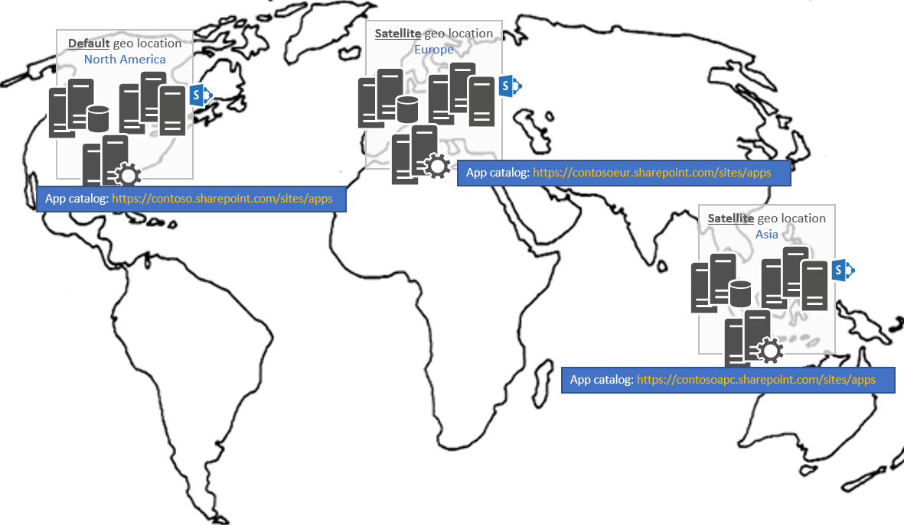

# Managing apps in a SharePoint Multi-Geo tenant

> **Important:** OneDrive and SharePoint Online Multi-Geo is currently in preview and is subject to change.

In a Multi-Geo tenant, you'll have an app catalog per geo location which is something to take in account if you want to deploy your apps across all geo locations.

## Where do I need to deploy my apps in a Multi-Geo tenant?
Before talking about deploying apps let's first define what's meant with apps in this article: all apps that you deploy by first adding them to your tenant app catalog are in scope of this guidance, so that includes SharePoint Add-In's (so .app files) but also SharePoint Framework Apps and Extensions (the .sppkg files). In a Multi-Geo tenant you'll have one app catalog site per geo location as show below:

A consequence of this architecture is that you'll need to deploy your app in **all** app catalogs if you want your app to be available for all sites, regardless of the geo location the site is hosted in. To realize this you have 2 options:
- Deploy your app manually in each of the app catalog sites
- Use the ALM API's to automate the deployment of your apps: using these API's you can write code that consistently deploys/upgrades your apps in all the geo locations of your Multi-Geo tenant.

## See also

- [SharePoint Apps ALM API's]()
- [Deploying and installing SharePoint Add-ins: methods and options](/docs/sp-add-ins/deploying-and-installing-sharepoint-add-ins-methods-and-options.md)
- [Hosting client-side web part from Office 365 CDN](/docs/spfx/web-parts/get-started/hosting-webpart-from-office-365-cdn.md)
- [Host extension from Office 365 CDN](/docs/spfx/extensions/get-started/hosting-extension-from-office365-cdn.md) 

