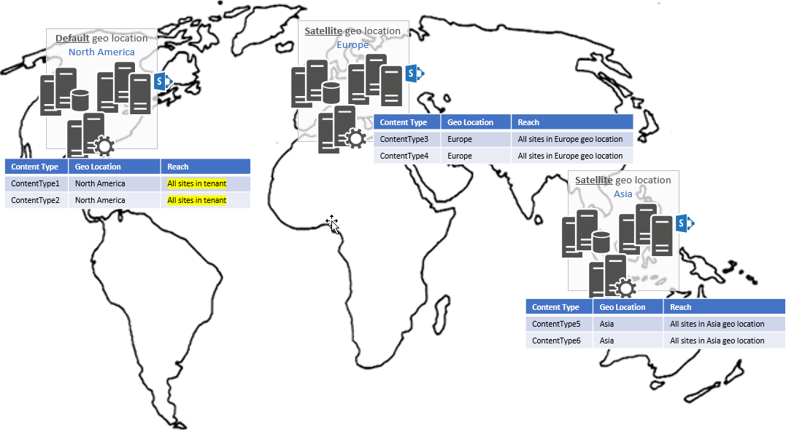

# Content type hub in a SharePoint Multi-Geo tenant

> **Important:** OneDrive and SharePoint Online Multi-Geo is currently in preview and is subject to change.

Customers use the content type hub to define content types in a central location, and then publish the content types to all sites in a SharePoint tenant. This article explains how the content type hub works in a SharePoint Multi-Geo tenant.

A Multi-Geo tenant has one content type hub per geo location. To define content types for each geo location, you create and publish them from the following site.

```
https://<tenant>.sharepoint.com/sites/contenttypehub
```

There is, however, an important distinction between the content type hub in the default geo location and in satellite geo locations. When you create and publish a content type in the content type hub of the default geo location,  that content type will be available in all sites in your tenant. In the example shown in the following image, content types created in the default North America geo location (contenttype1 and contenttype2) are pushed to all sites across the satellite geo locations for the tenant. Content types created in the content type hub for the Europe satellite location (contenttype3 and contenttype4) are only  pushed to the sites in the European geo location.



Most organizations want to have consistent content types across a SharePoint tenant. As a best practice, use the content type hub in the default geo location to create and publish content types. If you don't want all content types in the default geo location content type hub to be published to all geo locations, you can use the `Set-SPOTenantContentTypeReplicationParameters` PowerShell cmdlet to configure the content types that you do want to publish. This cmdlet is part of the [SharePoint Online Management Shell](https://www.microsoft.com/en-us/download/confirmation.aspx?id=35588).

As an alternative to using a content type hub, organizations can integrate content type provisioning into their site provisioning solutions. This offers more flexibility and can be fully automated.

## See also

- [Content type publishing](https://support.office.com/en-US/article/Introduction-to-content-types-and-content-type-publishing-E1277A2E-A1E8-4473-9126-91A0647766E5#__toc256601764)

