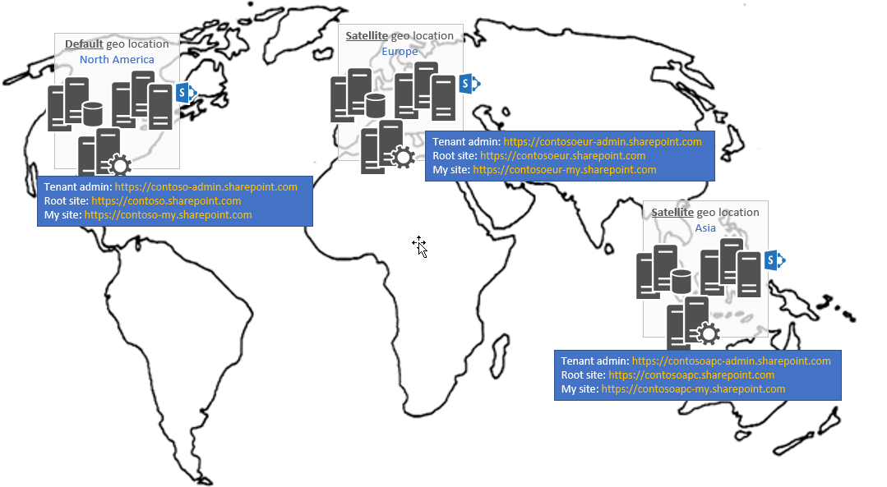

# Discover a Multi-Geo tenant configuration

When you're working with a SharePoint tenant, you'll need to be able to detect whether it's a Multi-Geo tenant and identify the default and satellite geo locations. 

The following image shows a Multi-Geo tenant with:

- A default geo location in North America.
- A satellite geo location in Europe.
- A satellite geo location in Asia.



## Get Multi-Geo tenant configuration information

Depending on your scenario, you can use one or a combination of the following APIs to access a Multi-Geo tenant site:

- **SharePoint CSOM API**: Not Multi-Geo-aware. Depending on the scenario, you need to target the correct geo location (for example, to access a user profile or perform tenant API operations). 

- **The Microsoft Graph API**: Multi-Geo-aware. We recommend that you use Microsoft Graph to access Multi-Geo tenant sites. 

- **SharePoint REST API**: Typically this API is used in the context of a site URL, and therefore, whether the tenant is Multi-Geo is not a factor. Some REST API scenarios (such as search or user profiles) might require you to make calls per geo location. 


### Using the CSOM API

Obtaining the geo location of your tenant can be done via CSOM by using the `Tenant` class and the `GetTenantInstances` method as shown in the following snippet:

```csharp
Tenant tenant = new Tenant(clientContext);
var tenantInstances = tenant.GetTenantInstances();
clientContext.Load(tenantInstances);
clientContext.ExecuteQuery();
```

### Using the Microsoft Graph API

You can get the geo location information for a tenant by using Microsoft Graph. The following example returns a collection with one object per geo location.

```
GET https://graph.microsoft.com/v1.0/sites?filter=siteCollection/root%20ne%20null&select=webUrl,siteCollection
```

#### Example response for a Multi-Geo tenant

```json
{
    "@odata.context": "https://graph.microsoft.com/v1.0/$metadata#sites",
    "value": [
        {
            "webUrl": "https://contoso.sharepoint.com/",
            "siteCollection": {
                "dataLocationCode":"NAM",
                "hostname": "contoso.sharepoint.com"
            }
        },
        {
            "webUrl": "https://contosoeur.sharepoint.com/",
            "siteCollection": {
                "dataLocationCode":"EUR",
                "hostname": "contosoeur.sharepoint.com"
            }
        },
        {
            "webUrl": "https://contosoapc.sharepoint.com/",
            "siteCollection": {
                "dataLocationCode":"APC",
                "hostname": "contosoapc.sharepoint.com"
            }
        }
    ]
}
```

For more information, see the [MultiGeo.TenantInformationCollection](https://github.com/SharePoint/PnP/tree/dev/Samples/MultiGeo.TenantInformationCollection) sample.

> [!NOTE] 
> For more information about permissions and how to configure your application, see [Set up a Multi-Geo sample application](multigeo-sampleapplicationsetup.md).

## Discover whether your tenant is Multi-Geo 

You can use Microsoft Graph to discover whether a tenant is Multi-Geo because requests via Microsoft Graph to Multi-Geo tenants return more than one item in the collection. 

The following example shows the results of a Microsoft Graph call to a single-geo tenant.

<!-- Not sure where the output for a Multi-Geo tenant is. Provide a link? -->

```
GET https://graph.microsoft.com/v1.0/sites?filter=siteCollection/root%20ne%20null&select=webUrl,siteCollection
```

#### Example response for a single-geo tenant

```json
{
    "@odata.context": "https://graph.microsoft.com/v1.0/$metadata#sites",
    "value": [
        {
            "webUrl": "https://singlegeotest.sharepoint.com/",
            "siteCollection": {
                "dataLocationCode":"",
                "hostname": "singlegeotest.sharepoint.com"
            }
        }
    ]
}
```

## See also

- [Microsoft Graph Developer Center](https://developer.microsoft.com/en-us/graph)
- [Microsoft Graph documentation](https://developer.microsoft.com/en-us/graph/docs/concepts/overview)
- [Graph Explorer](https://developer.microsoft.com/en-us/graph/graph-explorer)
- [OneDrive and SharePoint Online Multi-Geo](multigeo-introduction.md)
