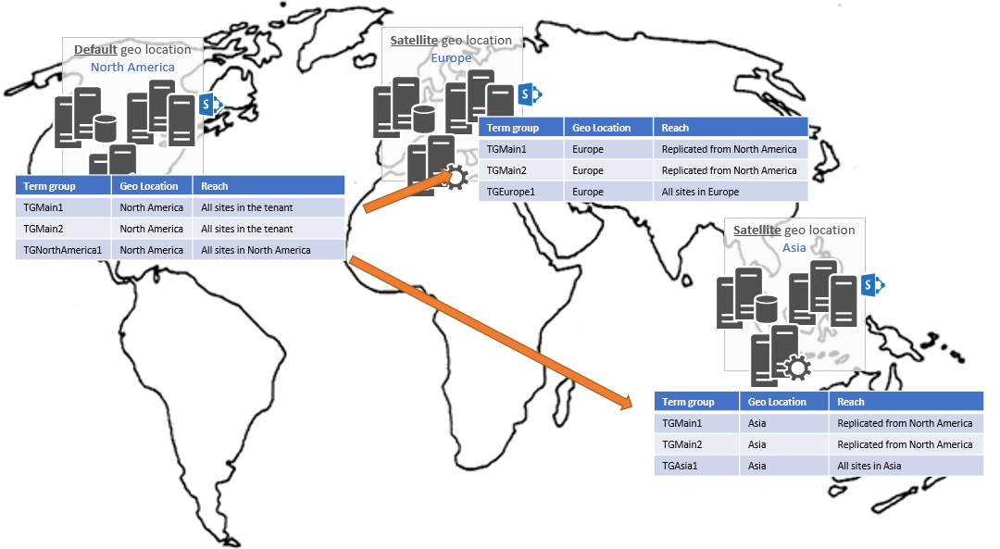

# Manage metadata in a Multi-Geo tenant

> [!IMPORTANT] 
> OneDrive for Business Multi-Geo is available, SharePoint Online Multi-Geo is currently in preview and is subject to change.

Managed metadata in SharePoint is Multi-Geo-aware. This article describes how to manage metadata in a SharePoint Multi-Geo tenant.

The managed metadata that you define for the default geo location of a Multi-Geo tenant automatically replicates to the tenant's satellite locations. Managed metadata that you define for a satellite geo location is only available to the sites that are hosted in that geo location.

In the example shown in the following image, the term groups TGMain1 and TGMain2 were created in the default geo location and are replicated to all satellite geo locations. As a result, those terms are available to all locations in the Multi-Geo tenant. 

Term set synchronization is one way from the default to the satellite geo locations. Term sets created in a satellite location do not sync to the default or other satellite geo locations. For example, term sets created in TGEurope1 are only available to sites hosted in Europe.

The following are important points to know about managed metadata in Multi-Geo tenants:

- Replication from the default geo location to any satellite geo location is **one way**. Users can't update  replicated term sets in satellite geo locations, but administrators can. However, we don't recommend this because it results in having additional term sets and terms available in that satellite geo location. 

- Create term groups, term sets, and terms in the default geo location. This ensures that they are consistently available across all the geo locations in your tenant. 

- When term groups, term sets, and terms are replicated across geo locations, they retain their ID. This allows you to reference term groups, term sets, and terms based on ID, regardless of the geo location your code is running in. 

- The incremental replication process runs hourly. The full replication job runs every three days. 

- When you programmatically create a term set in the default geo location, that term set is automatically replicated. You don't have to make any changes to the APIs. 

- In some cases, you might want a term group, term set, or terms to be available only in a satellite location, for example, a term that relates to a confidential project that applies to a specific geo location. In that case, you can choose to create the relevant terms in the applicable geo location. 

- If you want the term group to be available only in the default location, use the `Set-SPOTenantTaxonomyReplicationParameters` PowerShell cmdlet to explicitly specify which term groups from the default location are replicated. This cmdlet is part of the [SharePoint Online Management Shell](https://www.microsoft.com/en-us/download/details.aspx?id=35588).

## See also

- [Plan hybrid SharePoint taxonomy and hybrid content types](https://docs.microsoft.com/en-us/SharePoint/hybrid/plan-hybrid-sharepoint-taxonomy-and-hybrid-content-types) 
- [OneDrive and SharePoint Online Multi-Geo Preview](multigeo-introduction.md)