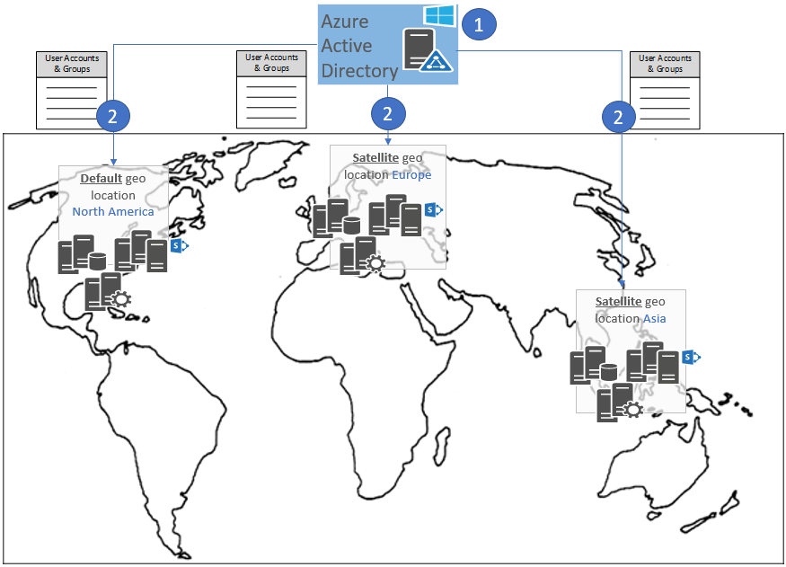

# Permission model in a Multi-Geo tenant

> [!IMPORTANT] 
> OneDrive for Business Multi-Geo is available, SharePoint Online Multi-Geo is currently in preview and is subject to change.

The permission model in a OneDrive and SharePoint Online Multi-Geo Preview tenant is the same as that for a single geo tenant.

A Multi-Geo tenant has a single Azure Active Directory (Azure AD) environment distributed across all geo locations. This Azure AD environment includes: 

- All users and groups. If you grant a user or group permissions, these permissions apply to all geo locations.
- All security principals. Whether you register your application in Azure AD by using one of the Azure portals, or via Azure Access Control Services (appregnew.aspx in SharePoint), the permissions granted apply to all geo locations.

The following image shows a Multi-Geo tenant with:

- A default geo location in North America.
- A satellite geo location in Europe.
- A satellite geo location in Asia.

This tenant has one distributed Azure AD environment that includes all the users, groups, and permissions. The central Azure AD instance is distributed to all the geo locations. 

 

To configure your applications for Multi-Geo tenants in Azure AD, see [Set up a Multi-Geo sample application](multigeo-sampleapplicationsetup.md).

## See also

- [OneDrive and SharePoint Online Multi-Geo Preview](multigeo-introduction.md)