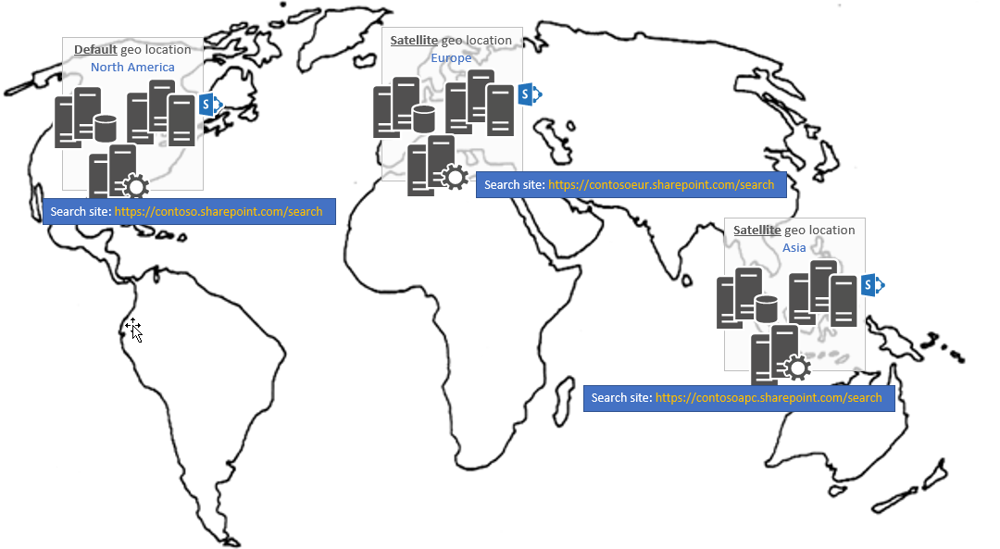

# Search in a Multi-Geo tenant

> [!IMPORTANT] 
> OneDrive and SharePoint Online Multi-Geo is currently in preview and is subject to change.

In a Multi-Geo tenant, each geo location has its own search index, as well as its own independent search center. When a user searches, the query is fanned out to all the indexes, and the returned results are merged.

For example, a user in one geo location can search for content stored in another geo location, or for content on a SharePoint site that’s restricted to a different geo location. If the user has access to this content, search shows the result. 

By default, when you configure a search center, the search center uses the following URL pattern:

```
https://<tenanturl>.sharepoint.com/sites/search
```

In the scenario shown in the following image, a Multi-Geo tenant has three geo locations, each with a geo location-specific search URL.

<br/>

|**Geo location**|**Search URL**|
|:---------------|:-------------|
|North America (default location)|https://contoso.sharepoint.com/search|
|Europe (satellite location)|https://contosoeur.sharepoint.com/search|
|Asia (satellite location)|https://contosoapc.sharepoint.com/search|

<br/>



To work with search programmatically in a Multi-Geo tenant, see [Get custom search applications to show results from all or some geo locations](https://docs.microsoft.com/en-us/office365/enterprise/configure-search-for-multi-geo#get-custom-search-applications-to-show-results-from-all-or-some-geo-locations).


## See also

- [How does search work in a Multi-Geo environment](https://docs.microsoft.com/en-us/office365/enterprise/configure-search-for-multi-geo#how-does-search-work-in-a-multi-geo-environment)
- [OneDrive and SharePoint Online Multi-Geo Preview](multigeo-introduction.md)
