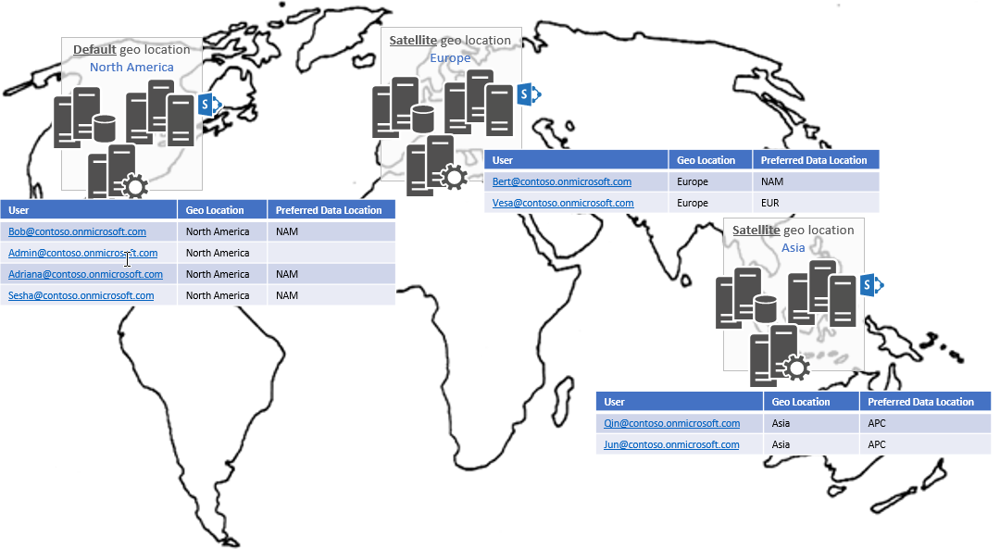

# Work with user profiles in a Multi-Geo tenant


In a Multi-Geo tenant, you can define a preferred data location for a user, detect a user's profile location and personal site URL, and read and update default and custom user profile properties.

## Define a preferred data location

In a Multi-Geo tenant, SharePoint users span different geo locations; for example, some users are in North America, some are in Europe, and so on. This model also applies to user accounts and personal (OneDrive for Business) sites. 

Ideally, the users and their user accounts and sites are in the same geo location. To ensure this, before you create personal sites, set the user's preferred data location to their geo location. 

In the example shown in the following image, user vesa@contoso.onmicrosoft.com lives in Europe and has a preferred data location set to **EUR**. As such:
 
- The default copy of the user's profile is in the Europe geo location.
- The user's personal site is created in the Europe geo location.

User bert@contoso.onmicrosoft.com has his preferred data location set to **NAM**. Because he had a personal site hosted in Europe before his preferred data location was set, his profile stays in Europe. 



Users' profiles and personal sites are in the same geo location. For users who do not have a personal site:

- If they set a preferred data location, their profile is located in that geo location.
- If they have not set a preferred data location, their profile is located in the default geo location.

## To detect a user's profile location and personal site URL

To programmatically discover a user's profile location, you can do one of the following:

- Use the SharePoint User Profile API. We recommend this approach because it works in all scenarios. 
- Use Microsoft Graph. This works for users who also have personal sites, but not for users who don't have personal sites.

### Use the SharePoint User Profile API to detect profile location

You can call the SharePoint User Profile API via REST or CSOM to retrieve the personal site host URL for a given account. This URL contains the personal site host for the user's personal site, regardless of whether the personal site has been created. The following example shows the REST call.

```
GET https://contoso.sharepoint.com/_api/SP.UserProfiles.PeopleManager/GetPropertiesFor(accountName=@v)/personalsitehosturl?%40v=%27i%3A0%23.f%7Cmembership%7Cbert%40contoso.onmicrosoft.com%27
```

If you're using C#, CSOM is easier to use, as shown in the following example.

```csharp
public string GetUserPersonalSiteHostUrlCSOM(string userPrincipalName)
{
    string result = null;

    PeopleManager peopleManager = new PeopleManager(this.clientContext);
    var userProperties = peopleManager.GetPropertiesFor($"i:0#.f|membership|{userPrincipalName}");
    this.clientContext.Load(userProperties);
    this.clientContext.ExecuteQuery();
    result = userProperties.PersonalSiteHostUrl;

    return result;
}
```

When you have the personal site host URL, you can use that along with the [Multi-Geo discovery](multigeo-discovery.md) information to get the tenant admin site URL for the geo location that hosts the user's profile.

To learn more, see the [MultiGeo.UserProfileUpdates](https://github.com/SharePoint/PnP/tree/dev/Samples/MultiGeo.UserProfileUpdates) sample.

### Use Microsoft Graph to detect user's personal site URL

To discover a user's personal site URL in a Multi-Geo tenant, you can use the following Microsoft Graph call:

```
GET https://graph.microsoft.com/v1.0/users/bert@contoso.onmicrosoft.com?$select=mySite
```

When you have the personal site host URL, you can use that along with the [Multi-Geo discovery](multigeo-discovery.md) information to get the tenant admin site URL for the geo location that hosts the user's profile.

> [!NOTE] 
> If the user doesn't have a personal site, this approach will not work. Instead, you should use the SharePoint User Profile API.

To learn more, see the [MultiGeo.UserProfileUpdates](https://github.com/SharePoint/PnP/tree/dev/Samples/MultiGeo.UserProfileUpdates) sample.


## Update user profile properties

Making bulk updates to user profile properties is a common scenario for enterprise customers. The process to use varies based on the type of user profile property that you want to update.

### Update default user profile properties

Some user profile properties are available by default, for example, **Department**, **AboutMe**, and **PreferredDataLocation**. We recommend that you use the Microsoft Graph API to update these properties because Microsoft Graph is geo-aware. 

The following example shows how to update the **AboutMe** property for the user bert@contoso.onmicrosoft.com.

```
GET https://graph.microsoft.com/v1.0/users/bert@contoso.onmicrosoft.com?$select=aboutme
```

For more information, see the [MultiGeo.UserProfileUpdates](https://github.com/SharePoint/PnP/tree/dev/Samples/MultiGeo.UserProfileUpdates) sample.

### Update the preferred data location property

The user's preferred data location (**preferredDataLocation** property) indicates the preferred geo location for the user. This affects the following:

- The geo location where the user's personal site is provisioned
- The geo location where the user's group sites are created 

Because the preferred data location is a default property, we recommend that you use the Microsoft Graph API to configure it, as shown in the following example. 

```
GET https://graph.microsoft.com/v1.0/users/bert@contoso.onmicrosoft.com?$select=preferredDataLocation

PATCH https://graph.microsoft.com/beta/users/bert@contoso.onmicrosoft.com

JSON payload:
{
    "preferredDataLocation" : "eur"
}

```

For more information, see the [MultiGeo.UserPreferredDataLocation](https://github.com/SharePoint/PnP/tree/dev/Samples/MultiGeo.UserPreferredDataLocation) sample.

### Add custom SharePoint user profile properties

You can add company-specific user profile properties to user profiles in SharePoint. For SharePoint Multi-Geo tenants, the following considerations apply:

- Custom user profile properties are created at the geo location level. If you create a property in the Europe geo location, that property is not available in the other geo locations. As a best practice, create custom user profile properties in all geo locations. This reduces the risk that data will be lost when a user moves across geo locations.
- You must read and update custom user profile properties at the geo location level. If you created a custom property in all geo locations, you need to iterate over the geo locations and update the property for all  users.

```csharp
// For SharePoint Online custom properties, use the following approach.
string userPrincipalName = "bert@contoso.onmicrosoft.com";
string userAccountName = $"i:0#.f|membership|{userPrincipalName}";
PeopleManager peopleManager = new PeopleManager(tenantAdminContext);
var propsToRetrieve = new string[] { "CostCenter", "CustomProperty" };
var props = peopleManager.GetUserProfilePropertiesFor(new UserProfilePropertiesForUser(tenantAdminContext, userAccountName, propsToRetrieve));
tenantAdminContext.ExecuteQuery();

int i = 0;
foreach (var prop in props)
{
    Console.WriteLine($"Prop: {propsToRetrieve[i]} Value: {prop}");
    i++;
}

// Update user profile properties
peopleManager.SetSingleValueProfileProperty(userAccountName, "CostCenter", "89786879");
tenantAdminContext.ExecuteQuery();
```

For more information, see the [MultiGeo.UserProfileUpdates](https://github.com/SharePoint/PnP/tree/dev/Samples/MultiGeo.UserProfileUpdates) sample.

### Use the bulk user profile update API

You can use the [bulk user profile update API](bulk-user-profile-update-api-for-sharepoint-online.md) to make bulk updates to custom user profile properties in a Multi-Geo tenant. Note the following:

- This API works at the geo location level and is not Multi-Geo-aware. For example, if you use the API in the Europe geo location, only accounts in Europe are updated.
- If you specify an import file with accounts in different geo locations, the API only updates the properties for the users in that geo location.


## See also

- [User Profile Batch Update API sample](https://github.com/SharePoint/PnP/tree/master/Samples/UserProfile.BatchUpdate.API)
- [OneDrive and SharePoint Online Multi-Geo](multigeo-introduction.md)
