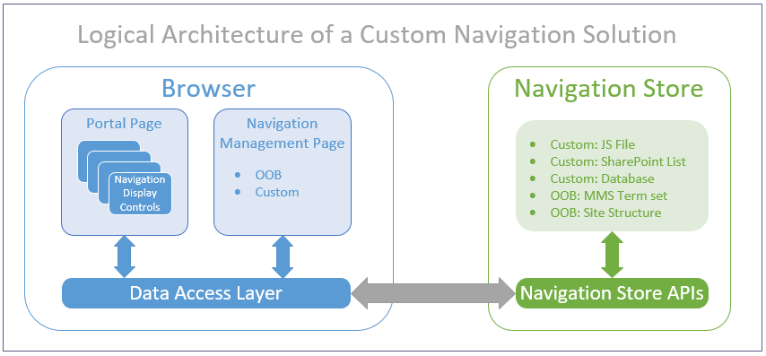

# Navigation solutions for SharePoint Online portals

Every portal project needs to implement a navigation solution. Based on project requirements, the navigation solution might choose to leverage only out-of-box navigation components, only custom navigation components, or a combination of both. 

This article describes how to build a well-performing navigation system in SharePoint Online.

> [!NOTE] 
> Although this guidance primarily targets SharePoint Online, most of it also applies to portals hosted in an on-premises SharePoint environment.

## What not to do

The following list contains the key things **not** to do if you want to have a good navigation solution.

Don't: 

- Use out-of-box **structural** site navigation when the site collections of your portal have complex structure (multiple level of sites and/or unique permissions). 
- Use a custom navigation solution that requests all navigation nodes for all custom navigation controls as soon as the page loads, even for controls that are initially collapsed/hidden.
- Use a custom navigation solution that does not cache the navigation nodes it receives.
- Use a custom navigation solution that targets the legacy Lists (SOAP) web service; for extra trouble, pass it some poorly-formed CAML queries.

## Rationale for a custom navigation solution

There are many reasons why a portal architect might decide to pursue a custom navigation solution. Most reasons are related to the fact that modern portal designs are responsive in nature and usually include a feature-rich navigation system; as such, attempts to map the proposed design onto SharePoint ultimately fail because the out-of-box server-side navigation controls cannot be configured to meet one or more requirements of the proposed design. Specific examples follow. 

The out-of-box control:

- And its management UX do not support a responsive UI design.
- Does not exhibit the required behaviors (such as flyout/hover, mega menu, rich media, Lazy Load).
- Does not support the desired navigation hierarchy attributes (such as headers, grouping, depth, link limit).
- Does not support the desired navigation link attributes (such as thumbnail, image link, publishing start/end, emphasis).
- Is not, or is no longer, available (such as footer, breadcrumb).
- Does not integrate with custom/legacy navigation data stores.
- Management UX is inconsistent across navigation controls and is not user-friendly.

When enough of the reasons add up, consider a custom navigation solution.

## Using an out-of-box navigation solution

You've evaluated the rationale for a custom navigation solution and have decided that none of those reasons apply. The good news is that you can leverage proven patterns for an out-of-box navigation solution.

At its core, a navigation solution consists of a set of navigation controls that receive their data from a navigation store. When choosing an out-of-box navigation solution, managed navigation (described later in this article) is generally the preferred choice for a navigation store because it offers the better page load performance. 

The other choice, out-of-box structured navigation (described later in this article), can easily become very resource-intensive (especially for complex site collection structures) and can result in significantly slower page-load performance.

## Using a custom navigation solution

You've evaluated the rationale for a custom navigation solution and have decided that enough of those reasons apply. The good news is that you can leverage proven patterns for developing a custom navigation solution.

The following diagram shows the logical architecture of a custom navigation solution.

The following sections describe the major components of the logical architecture.

 

### Navigation display control

This is a custom client-side JavaScript display control that resides on the page. 

In general, the control queries the navigation store when the page loads, processes the navigation data response, and renders the navigation component (presentation, information, and behavior). In practice, the control should observe a lazy-load pattern: execute the navigation data request only when necessary, and defer it for as long as possible.

The display control can be added to the static definition of the page at design time (via a master page, a page layout, or a web part) or it can be added to the dynamic state of the page at run-time (via the JavaScript embedding technique).

The display control leverages the Client-Side Data Access Layer (described later in this article) to optimize page performance.

The display control may optionally provide a Settings link for its navigation management page, which provides a user interface to manage the configuration of the navigation control.

Following is some general guidance for the various types of navigation controls typically used in a custom navigation solution.

 

#### Typical navigation display controls

- **Global navigation**: Implement a custom control that targets a central, portal-specific navigation configuration entity. Use a public cache for the navigation nodes. Consider the out-of-box management page.
- **Footer navigation**: Implement a custom control that targets a central, portal-specific navigation configuration entity. Use a public cache for the navigation nodes. Consider the out-of-box management page.
- **Site map**: Implement a custom control that targets a central, portal-specific navigation configuration entity.
- **Current navigation** (that is, Left-Hand): Implement a custom control that targets a local, web-specific navigation configuration entity. Use a public cache for the navigation nodes. Consider the out-of-box management page.
- **Breadcrumb**: *Avoid implementing this custom control*; construction of the parent chain of web objects, based on the URL of the current web, is a costly operation.
- **Useful links**: Implement a custom control that targets a local, web-specific navigation configuration entity. Use a public cache for the navigation nodes. Consider the out-of-box management page.
- **My Links**: Implement a custom control that targets a **private**, user-specific navigation configuration entity. Use a **private** cache for the navigation nodes. Provide a custom management page.

 

### Navigation store

The navigation store persists the configuration of the custom navigation control. You can choose to have the custom navigation control use either a custom navigation store or an out-of-box navigation store.

 

#### Custom navigation store

The most-commonly used custom navigation store, a custom SharePoint list, strikes a balance between extensibility, manageability, and performance (when queried via search). The list schema can be easily extended with custom content types that represent navigation headers/groups and navigation links, and site columns that define the desired custom attributes (for example, display order). Crawled properties for these site columns can be mapped to managed properties within SharePoint Search. The navigation data is easily managed via the familiar out-of-box list management pages. The navigation data can be accessed remotely via the SharePoint Search REST API.

> [!NOTE] 
> Search-based navigation has a dependency on the search index. SharePoint continuously crawls portal content; however, there is still a slight delay before changes to the SharePoint list appear in the search index.

The simplest and best-performing custom navigation store is a JavaScript resource file (for example, nav.js) that declares a component-specific configuration variable (for example, footerNav) that is initialized with a JSON string. The browser automatically downloads the file and caches it for subsequent use. The configuration data is ready for use after it loads into the JavaScript run-time environment. The primary trade-off with this approach concerns the management user interface: at a minimum, an admin must manually edit a JSON string in a JavaScript file. A custom user interface would be required to abstract the store from the admin and make things a bit more friendly.

At the other end of the spectrum of custom navigation stores is the custom database. This option provides the ultimate in flexibility, but also requires the most custom development. Additionally, a hosting environment is needed for the database, the custom Web API, and the navigation management page. 

> [!NOTE] 
> For an excellent sample showing how to implement a custom navigation store that uses the Client-Side Data Access Layer, see [Client-Side Data Access Layer (DAL) Sample](https://github.com/SharePoint/PnP/tree/master/Samples/Portal.DataAccessLayer) in the SharePoint PnP repository. 

 

#### Out-of-box navigation store 

- **Out-of-box managed navigation (MMS)**:  Managed navigation allows you to use a Managed Metadata Service (MMS) Term set to configure the navigation nodes for a given site collection. Out-of-box navigation display controls automatically consume this data. The out-of-box navigation management page provides an easy-to-use user interface to manage the navigation nodes within an *unconstrained* hierarchy (unlimited depth). Custom navigation display controls can also consume this data, but must do so via JSOM because there is currently no REST API available to work with managed navigation.

	> [!NOTE] 
	> It is quite cumbersome to configure and maintain a global navigation definition via managed navigation. As each new site collection is created, you must duplicate the configuration for the site collection and its associated term set. Also keep in mind that managed navigation is not security-trimmed, so your users might see links that they cannot access.

- **Out-of-box structural navigation (Site)**:  Structural navigation allows you to use the native structure of the site collection (its webs and pages), as well as authored headings and links, to configure the navigation nodes for a given site collection. The out-of-box navigation management page provides a user interface to manage the navigation nodes within a *constrained* hierarchy (limited depth). Custom navigation display controls can also consume this data, but must do so via JSOM because there is currently no REST API available to work with structural navigation.

	> [!NOTE] 
	> The out-of-box navigation display controls use database queries (that is, content by query) to obtain the navigation data. They do this for each page load, which is very resource-intensive for complex site collection structures. The use of structural navigation is recommended only for small portals with simple site collection structures. Structural navigation always returns security-trimmed results.

- **Out-of-box search index (Search)**:  Search driven navigation allows you to query the SharePoint search index for sites and pages by constructing the proper search query. There's no specific out-of-box navigation management page and you must implement custom navigation display controls to consume the data retrieved from the search queries.

	> [!NOTE] 
	> When using search-driven navigation, it is important that you cache the obtained search results because you don't want to access the server for each page load. Later in this article, the Client-Side Data Access Layer is explained, which is the model to use in combination with search-driven navigation. Just like structural navigation, the search-driven navigation is security-trimmed, so your users will not see unreachable links. The downside of search-driven navigation is that it's hard to control the order of the returned navigation items.

 

### Navigation management page

The navigation management page provides a user interface to manage the configuration of the navigation control in a user-friendly way. The page can be accessed directly, as well as from an optional link present on the navigation control (for example, a Settings link). The page uses the appropriate navigation store APIs for the chosen navigation store to manage the configuration of the navigation control.

You can choose to have the custom navigation control use either a custom navigation management page or an out-of-box navigation management page. 

In many cases, the default out-of-box navigation management page (for example, SharePoint List View or Term Set management page) associated with the chosen navigation store should suffice. When a default page is not available, you must obviously develop a custom page. When deciding if the existing default page is acceptable or not, be sure to consider the total cost of developing a custom management page (design, development/maintenance, hosting, and user training).

As a rule of thumb, pursue custom management pages only when a default option does not exist, when the page must support a responsive UI, or when the page is meant to be consumed via the front-end user view of the portal (as opposed to the back-end admin view).  

 

### Navigation store API

The navigation store API provides a programmatic interface to manage the configuration of the navigation control consistently and securely. You can choose to have the custom navigation control use either a custom navigation store API or an out-of-box navigation store API. 

If you wish to develop and deploy a custom navigation store API, observe the following guidelines:

- Implement using the technology stack of your choice (ASP.NET Web API 2.0, Node.js,...).
- Host the API in an Internet-accessible environment. 
- Use Public DNS for name resolution.
- Require SSL and obtain the SSL certificate from a Public Certificate Authority.
- Enable anonymous access and secure the API with Azure AD.
- Implement support for Cross-Origin Resource Support (CORS).

For .NET client environments:

- Target SharePoint APIs via the SharePoint Client-Side Object Model (CSOM or REST). 
- Target your custom Web APIs via REST.
- Target third-party APIs via REST (use SOAP only if necessary).

For browser client environments:

- Target SharePoint APIs via the SharePoint REST APIs (use JSOM only if necessary).
	- Use the cross-domain library if you target a different site collection.
- Target your custom Web APIs via REST.
	- Use Azure AD Authentication Library for JavaScript (ADAL.js) and Implicit OAuth flow.
- Target third-party APIs via REST (or SOAP if necessary).

 

### Client-Side Data Access Layer

The Client-Side Data Access Layer is a custom client-side JavaScript framework made available to all custom client-side display controls, including the custom navigation display controls. It supports intelligent data loading patterns, abstracts the details of the client-to-server requests, provides data caching functionality to minimize client-to-server request traffic, and improves perceived page performance.

For more information about the Client-Side Data Access Layer, see [Performance guidance for SharePoint Online portals](portal-performance.md#client-side-data-access-layer-dal-framework).

## See also

- [Navigation options for SharePoint Online](https://support.office.com/en-us/article/Navigation-options-for-SharePoint-Online-adb92b80-b342-4ecb-99a1-da2a2b4782eb?ui=en-US&rs=en-US&ad=US)
- [Overview of managed navigation in SharePoint Server](https://docs.microsoft.com/en-us/SharePoint/administration/overview-of-managed-navigation)
- [PnP O365 Starter Intranet - Navigation implementation](http://thecollaborationcorner.com/2016/08/31/part-4-the-navigation-implementation/#.WNoU5oVOKiM)
- [ASP.NET Web API 2](https://msdn.microsoft.com/en-us/library/dn448365(v=vs.118))
- [Azure AD Authentication Library for JavaScript (GitHub)](https://github.com/AzureAD/azure-activedirectory-library-for-js)
- [Building SharePoint Online portals](portal-overview.md)