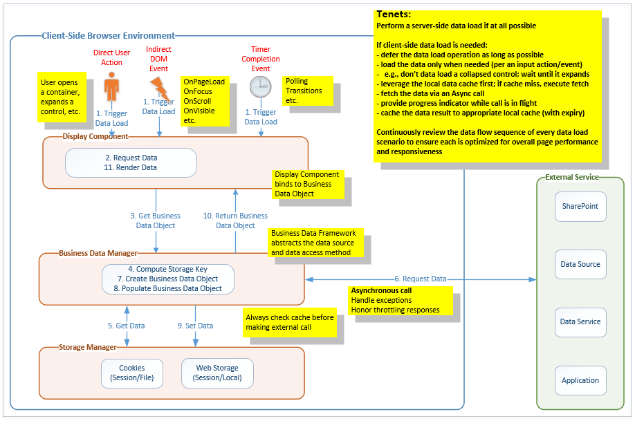

# Performance guidance for SharePoint Online portals

Every portal design includes at least one aspect that requires customizing SharePoint. The customization model for SharePoint Online portals is the SharePoint Add-in model or the SharePoint Framework. These both use a distributed application architecture that encompasses several execution environments: SharePoint Online, web hosters, service providers, and the client browser. This architecture is predicated on the concept of client-to-server data requests.

Implementing customizations to SharePoint Online places an even greater emphasis on effective design and development for web applications in general, and client-side web applications in particular, especially when it comes to the concept of application performance.

> [!NOTE]
> Although this guidance primarily targets SharePoint Online, most of it also applies to portals hosted in an on-premises SharePoint environment.

## Optimizing Classic Portal Pages
If you have not implemented Modern pages yet and are looking to optimize your existing or new Classic portal pages then this section applies to you.
To assist with some initial page reviews and start the process of understanding performance on classic portal pages for SharePoint Online, the [Page Diagnostics tool for SharePoint](https://aka.ms/perftool) can be utilized.
It is a Chrome extension developed by Microsoft to highlight guidance for optimizing Classic SharePoint portal pages.

Whilst some of the items highlighted relate to existing out of the box functionality, we are working towards removing these components as there are better alternatives that provide a faster user experience.The biggest culprit is the use of structural navigation.
The tool also highlights enhanced functionality e.g. Content Delivery Networks (CDNs), that have been made available by Microsoft to further optimize the end user experience. Please also see [Tune SharePoint Online Performance](https://aka.ms/spoperformance)

What you will see is that between the Page Diagnostics tool and tuning guidance, they provide a high level overview of what impacts performance whilst the details on this page take you deeper into how customizations should be built to avoid impacting a pages performance. 

<a name="bk_antiPatterns"> </a>

## What not to do

The following list contains the key things **not** to do when planning for performance.

Don't:

- Build custom client-side controls that issue client-side data requests to SharePoint and add a dozen or more of them to the page.
- Implement your client-side controls without centralized data access to the SharePoint data, so that numerous controls are requesting exactly the same data numerous times on a page.
- Embed redundant custom JavaScript and CSS throughout the page body.
- Embed several 10-MB thumbnail images throughout the page body.
- Execute all client-side data requests at page-load time, even if the data is not initially needed or displayed, even if it might never be used.
- Inject unnecessary order dependencies into the data request sequence and use **synchronous** data requests to ensure the order of execution.
- Use the legacy SharePoint Lists (SOAP) web service as the data request API of choice and pass it poorly-formed CAML queries.
- Avoid caching data responses (especially for static data) on the client to ensure that each data request gets re-executed on every page load.
- Perform hundreds of updates to the Document Object Model (DOM) of the page as each data response completes, even if they are redundant or conflicting.

## Evolution of the SharePoint Online customization model

The SharePoint Online customization model has evolved from the classic server-based model, where custom code executes on the server and performs server-side data requests, to a modern client-based model, where custom code runs remotely and performs client-side data requests. The natural solution architecture for this model is the distributed client-side web application.

A consequence of the distributed client-side web application model, aside from an increase in the inherent complexity of the new custom solution, is a significant increase in client-to-server network traffic associated with the new custom solution and a greater dependency on the client-side execution environment.

Consider the following comparison of the page-load sequence associated with each web application model.

### Classic server-side web application sequence

- First visit to page
	- Issue page request
	- Issue resource file requests (zero or more)
	- Execute some JavaScript
- Return visit to page
	- Issue page request
	- Execute some JavaScript

### Modern client-side web application sequence

- First visit to page
	- Issue page request
	- Issue resource file requests (zero or more)
	- Execute some JavaScript
	- Issue data requests (zero or more)
	- Execute more and more JavaScript
- Return visit to page
	- Issue page request
	- Execute some JavaScript
	- Issue data requests (zero or more)
	- Execute more and more JavaScript

A network monitor will show that a modern webpage can easily cause an order-of-magnitude increase in network traffic compared to that of a classic webpage. A browser-based execution profiler will also show that a modern webpage has a greater dependency upon the execution of client-side JavaScript. Granted, these increases are a function of the design and implementation of the new solution, but the probability of a significant increase is high.

<a name="bk_performanceGuidelines"> </a>

## General performance guidelines for client-side web applications

After you commit to building a custom client-side web application:

- Acknowledge that you are now responsible for the client-side performance of that application.
- Acknowledge that the benefits of server-side rendering and caching are no longer available for your custom controls.
- Understand that your application must now provide well-performing, client-side equivalents.

From a performance perspective, the goal with modern web applications in general, and client-side web applications in particular, is to implement the client-side logic necessary to mimic the minimal network traffic patterns observed for *return* visits to classic webpages.

The following sections provide performance guidance for achieving this goal.

<a name="bk_features"> </a>

### Disable the Device Channels and Search Engine Optimization features

If you create a new classic publishing portal then both the Device Channels as the Search Engine Optimization features are turned on with their default settings. If you keep these default settings there's no impact on your page rendering, but in SharePoint Online the presence of these two features does impact performance and therefore it's recommended to disable these features if you're no using them. See below [PnP PowerShell](https://aka.ms/sppnp-powershell) script to make this happen:

```PowerShell
Connect-PnPOnline -Url https://yourtenant.sharepoint.com/sites/yourportal

# Device channels
Disable-PnPFeature -Scope Site -Identity 57cc6207-aebf-426e-9ece-45946ea82e4a -Force
# SEO
Disable-PnPFeature -Scope Site -Identity 17415b1d-5339-42f9-a10b-3fef756b84d1 -Force
```

<a name="bk_Telemetry"> </a>

### Use telemetry

Performance is often viewed in subjective terms by end-users. However, it is rather challenging to definitively resolve issues such as *The portal is slow*.  To quantify perceived performance issues, it is critical to obtain objective metrics for the client-side web application.

The design and development of your client-side web application should include telemetry to establish a performance baseline and continuously monitor the run-time performance of the application.

Capture critical information application metrics such as:

- Application initialization timing
- Page-load timing (in general, and for specific pages)
- Client-side timing (in general, and for specific actions)
- External request/response timing (for example: SharePoint REST calls, third-party services)
- Search execution timing
- Page events occurring
- Control-level (that is, user) actions occurring
- Exceptions occurring (for example: data request failed, data request throttled)

Establish an objective performance baseline for your client-side web application, and use that baseline to validate/tune your initial design decisions.  After the application has been deployed, monitor ongoing performance and use the metrics to identify and resolve any issues that might arise.

Consider using [Azure Application Insights](https://azure.microsoft.com/en-us/blog/understand-your-sharepoint-usage-with-application-insights-2/), which provides a JavaScript module that makes it easy to add telemetry to any client-side web application. You can also build your own telemetry back-end service, but do know that we don't recommend storing the telemetry data in SharePoint because it negatively impacts your portal performance.

<a name="bk_clientBrowser"> </a>

### Use a modern client browser

The client browser can have a significant impact on the performance of the client-side web application in terms of actual performance and available functionality.

In general, you should target the most up-to-date version of modern browsers that are compatible with your desktop operating system. 

It is common for a large enterprise to have at least one web-based Line-of-Business (LOB) application that still requires the use of a legacy browser. However, that constraint should not hinder the forward progress of new web applications. Design new client-side web applications to take advantage of the improved performance and functionality of modern browsers.  

When dealing with a legacy browser constraint:

- Treat legacy browser requirements as exceptions; analyze the total cost of resolving the exception.
- Degrade/disable modern functionality in the new application when a legacy browser is detected at run-time.
- Consider using the legacy browser only for the constrained LOB application; use a modern browser for everything else, including the new client-side web applications.

For the latest Office 365 browser requirements, see [Which browsers work with Office Online](https://support.office.com/en-us/article/which-browsers-work-with-office-online-ad1303e0-a318-47aa-b409-d3a5eb44e452?ui=en-US&rs=en-US&ad=US).

<a name="bk_clientEnvironment"> </a>

### Consider the client environment and network topology

The client environment and the network topology that connects the client to the server can have a significant impact on the performance of client-side web applications.

In the ideal scenario, the client environment is comprised of up-to-date client machines running modern browsers, and is connected to the server via a network that has ample bandwidth and low latency. In reality, you will be faced with a less-than-ideal scenario, and your web application may lack the political currency necessary to drive immediate change. 

As such, tailor the initial design of your client-side web application to adhere to the present constraints, with a plan to take advantage of client environment improvements as they are deployed. In such a scenario, you will eventually encounter a mix of client machines, so ensure that your client-side web application can detect client capabilities at run-time and adjust its behavior accordingly.

For guidance about network performance planning, see [Network planning and performance tuning for Office 365](https://support.office.com/en-us/article/Network-planning-and-performance-tuning-for-Office-365-e5f1228c-da3c-4654-bf16-d163daee8848).

<a name="bk_dataRequestPatterns"> </a>

### Manage data request patterns

The proper management of client-side data request traffic is critical to the performance of a custom client-side web application. In this context, your primary goal should be to minimize and optimize the client-to-server data requests that your application requires.

#### Use an intelligent data loading pattern to govern your requests for data (from the server or any other back-end data source)

- Defer the data request for as long as possible (that is, Lazy Load).
- Request the data only if, and when, it is actually needed; for example, as in response to a browser event or user action (that is, do not request data for a collapsed/hidden control; wait until the control is expanded/rendered).

#### Use a client-side cache to fulfill all data requests
 
- Consult the local data cache before issuing the data request to the server.
- Return cached data if it is present and not yet expired (for example, upon a cache hit).

#### Call the server (or other back-end data source) only when a cache miss occurs

- Fetch the fresh data via an asynchronous AJAX call (never use a synchronous AJAX call).
- Return stale (or default) data if a request for fresh data fails.
- Consider presenting a progress indicator while a high-latency call is in flight.

#### Parse the data response

- Strip all request-specific packaging layers from the response.
- Extract the **core** data results and convert into a minimal, request-independent JSON representation:
	- A minimal representation requires less storage within the (finite) client-side cache.
	- A request-independent representation decouples the data from its data source and request semantics; this allows the data source to be easily changed (static, mock, live) as the solution is developed. 
	- JSON enables the use of JavaScript objects to which custom client-side display controls can easily bind; this also serves to define the working data contract between the UX and Data teams.

#### Store the data response in the client-side cache 

- Store the JSON representation of the data response in the local data cache (for example, Web Storage).
	- Use a public (local storage) cache for shared data (for example, Global Menu).
	- Use a private (session storage) cache for personal data (for example, My Stocks).
- Use component-specific expiration values that align with the volatility of the associated data; for example, Global Menu data (30 mins), Stock Ticker data (5 mins).
- Be sure to store **No results** as well because it is a valid data response.
- Ensure cached data is available across all pages and components of the client-side web application.

#### Leverage the Client-Side Data Access Layer Framework 

The Client-Side Data Access Layer Framework is described later in this article, and implements the patterns described earlier. 

Treat the Data Access Layer as a core component of your overall client-side framework, and ensure that it is used by all client-side web applications for consistency and performance.

<a name="bk_dataRequestApis"> </a>

### Manage data request APIs

#### Some client-side data requests can negatively impact the SharePoint server severely

- Avoid the use of client-side CAML queries, especially those that would target the legacy Lists (SOAP) web service. 
- Client-side CAML queries generally bypass all server-side caching mechanisms, which results in negative server performance under heavy loads.

If you must use CAML queries, observe the following guidelines:

- Avoid their use on high-volume pages (for example, the portal home page).
- Define the simplest, most-efficient CAML query possible, and verify its performance.
- Leverage the Client-Side Data Access Layer Framework (described later in this article) to cache the data response.

In general, use SharePoint REST APIs for client-side data requests. When performing data/content aggregation, use the SharePoint Search REST APIs. 

#### Optimize your search queries to minimize execution time and response sizes

- Limit use of wildcards.
- Return only those fields that are necessary (that is, avoid Select *).
- Limit the number of results (that is, use row limits).
- Target the narrowest scope possible.
- Keep the number of search queries as low as possible.
- Conduct regular query audits to consolidate redundant/similar queries that target the same data.

#### Client-side REST requests

- Client-side REST requests to SharePoint Online are now subject to request throttling and even request blocking. 
- Pay attention to the HTTP response codes/warnings of your data requests and alter your data request behavior accordingly to avoid data service disruptions in your client-side web applications. 

For details about how to avoid being throttled or blocked, see [Avoid getting throttled or blocked in SharePoint Online](../general-development/how-to-avoid-getting-throttled-or-blocked-in-sharepoint-online.md). 

#### REST request traffic

- REST request traffic can be now be optimized via OData Batching.  
- For more information, see [OData Batch Request Tutorial](http://www.odata.org/getting-started/advanced-tutorial/#batch) and the [OData Batch Request Protocol Spec](http://docs.oasis-open.org/odata/odata/v4.0/errata03/os/complete/part1-protocol/odata-v4.0-errata03-os-part1-protocol-complete.html#_Toc453752313). 
- Alternatively, consider using the Office Development Patterns and Practices [JavaScript Core (PnP-JS-Core)](https://github.com/SharePoint/PnP-JS-Core) component, which also provides a [wrapper](https://github.com/SharePoint/PnP-JS-Core/wiki/Batching) to encapsulate Batch Request functionality.

<a name="bk_freeShipping"> </a>

### Take advantage of "free shipping"

Make use of built-in functionality that can automatically deliver data to the client-side web application without the need for an explicit data request:

- Use the global JavaScript variable named **spPageContextInfo**, if available.
	- It is included in the global JavaScript namespace of every **classic** SharePoint page.
	- It contains common context information needed by the client-side environment upon page loads. 
	- There is no need to make a call to SharePoint to get this data when the page loads.

- Use preloaded information from SharePoint Framework, if you are using modern pages and implementing your customization by using SharePoint Framework.

- Use JavaScript files to store configuration settings used by the client-side web application.
	- Place these files in your resource file location (for example, SharePoint Style Library).
	- Reference these files as a JavaScript resource file in your client-side web application.
	- Browsers automatically deliver these files to the client environment when the page loads; furthermore, each is stored/served from the local internet files cache. 
	- There is no need to make a call to SharePoint to get this data when the page loads.

<a name="bk_resourceFiles"> </a>

### Use resource files

Use resource files effectively to improve the performance of your client-side web application:

- Use JavaScript/CSS files to deliver common script/CSS content shared across pages and components. You get the same benefits described earlier for JavaScript-based configuration files, plus:
	- Adheres to the precept of "One Rule, One Place."
	- Avoids redundant, embedded script/CSS content.
	- Minimizes page content.

- Package (that is, "minify") your resource files to reduce their size and improve download times.

- Leverage dynamic file requests to defer/load optional JavaScript files only when necessary (that is, Lazy Load).

- Ensure that JavaScript files are requested in the proper order; implement logic to ensure required functionality is present. 

- Leverage Image Sprites to reduce the number of image files that need to be downloaded.

- Leverage Image Renditions in SharePoint to define optimal image constraints for common image use case scenarios (for example, thumbnail, hero, rollup).

<a name="bk_cdn"> </a>

### Use a Content Delivery Network

A Content Delivery Network (CDN) is a geo-dispersed network that allows an end-user to obtain a given resource file from the closest CDN location. Use of a CDN results in better download times and contributes to an improved perception of overall page performance.

- Leverage existing CDNs to deliver third-party client-side frameworks (for example, jQuery, Bootstrap, Knockout, AJAX).

- Consider using a CDN to deliver your custom resource files:
	- [Azure CDN](https://azure.microsoft.com/en-us/services/cdn/)
	- [Office 365 Public/Private CDN](https://dev.office.com/blogs/general-availability-of-office-365-cdn)
	- SharePoint Portal Style Library (default option when a CDN is not used)

> [!NOTE] 
> The [Office 365 private CDN capability](https://dev.office.com/blogs/general-availability-of-office-365-cdn) has a publishing feature auto URL rewriting to CDN URLs. So after private CDN is enabled, SharePoint returns your publishing pages with links pointing to your private CDN location without you as a developer having to build this. This applies to publishing pages, but also to data returned by the content by a search web part, the picture library slideshow, image fields in SPList REST queries, and SharePoint Image renditions. Your publishing portal can also combine both private and public CDN on the same portal.

<a name="bk_ajax"> </a>

### Use AJAX

Asynchronous JavaScript and Xml (AJAX) allows a client-side web application to execute background data requests in a way that does not require a full page load.
 
For emphasis, the **A** in AJAX stands for **asynchronous**; it is best to keep it that way. While it is possible to execute synchronous calls in AJAX, it is rarely a good idea to do so. 

Never perform synchronous AJAX calls; the browser blocks until the call completes, which results in a poor user experience.

The need for a synchronous call usually arises due to an order dependency in the flow of data requests. Analyze the data request flow at design time, and eliminate (or at least reduce) the order dependency. Mitigate the impact of any dependencies that remain by chaining the success event handlers of asynchronous data requests. 

<a name="bk_javaScript"> </a>

### Execute JavaScript wisely

The JavaScript execution phase is the last portion of the overall page load sequence.  During this phase, the browser executes all of the JavaScript necessary to tie everything together and present the final, rendered page to the user.

Poorly-implemented JavaScript can still result in a poor user experience, even if your client-side web application follows all the guidance to request the webpage, its resource files, and execute all its data requests.

Extensive performance guidelines for JavaScript are outside the scope of this article; however, we summarize several of the most important concepts here:

- Limit updates to the DOM.
- Use looping structures efficiently.
- Limit use of try/catch in critical code segments.
- Use proper scope for variables.

For in-depth guidelines about JavaScript performance: 

- [JavaScript Patterns and Performance](javascript-patterns-and-performance.md)
- [Office Dev PnP webcast – JavaScript performance considerations with SharePoint](https://dev.office.com/blogs/javascript-performance-considerations-with-sharepoint)

<a name="bk_highVolumePages"> </a>

### Monitor high-volume pages

Pay special attention to the design and implementation of high-volume pages within your client-side web application.

A typical high-volume page is the portal home page. Consider the scenario where the Corporate IT department of a large enterprise (50,000 users) decides to implement a Group Policy Object (GPO) that forces all desktop browsers to open the portal home page by default. The performance of the portal home page has now become a critical consideration. If your initial design did not take this volume of traffic into account, the portal could encounter a significant performance degradation.

Best practices:

- Avoid the use of Content-by-Query web parts on the page; favor Content-by-Search web parts instead.

- Limit, and optimize, the number of client-side data requests issued by the page.

- Ensure that proper client-side caching is in play for client-side data requests.

- "Chunk" the page:
	- Limit initial page processing to only the top half (that is, first chunk) of the page.
	- Use scroll events to trigger the processing of additional chunks of the page as the user moves downward.

- Limit the amount of data rendered in custom display controls such as Highlight (for example, Latest Case Study) and Roll-Ups (for example, Top 3 News Links).
	- Provide **Read more...** links to redirect users to low-volume detail pages where expanded content can be viewed with less overall impact to the portal.

<a name="bk_dal"> </a>

## Client-Side Data Access Layer (DAL) Framework


The Client-Side Data Access Layer (DAL) Framework is a custom client-side JavaScript framework that you implement and make available to all custom client-side display controls of your client-side web applications. It supports intelligent data loading patterns, abstracts the details of the client-to-server requests, provides data caching functionality to minimize client-to-server request traffic, and greatly improves perceived page performance.

There are a number of client-side JavaScript Frameworks and Libraries that you can leverage to implement the DAL. Choose the one with which you are most familiar and adhere to the following tenets. Use the logical architecture proposed as a template for your implementation.

The [Client-Side Data Access Layer (DAL) Sample](https://github.com/SharePoint/PnP/tree/master/Samples/Portal.DataAccessLayer) provides a working reference implementation of the Client-Side Data Access Layer (DAL) Framework. 

<a name="bk_dalTenets"> </a>

### Architectural tenets

- Performance is Feature #1.
- Core component of the overall client-side framework; to be leveraged by all custom client-side web applications and components for consistency and performance.
- Fulfill data requests via the client-side data cache; if a cache miss occurs, execute the client-to-server data fetch.
- Fetch the server data via an asynchronous client-to-server AJAX call (never use a synchronous call).
- Reduce cascading call failures by re-using stale data when/if a data request fails.
- Honor request throttling responses and adjust behavior accordingly.
- Store the server data response in the client-side cache using a minimal, request-independent JSON representation.
- Support transient and durable storage options.
- Use transient storage for personal data and durable storage for shared data.
- Support absolute and sliding expiration policies.
- Allow each storage entry to configure its own storage options for storage (transient/durable), expiration policy (absolute/sliding), and expiration timeout (in minutes).
- Continuously monitor run-time performance via logging and telemetry.
- Continuously review data flow scenarios/sequences to ensure each remains optimized for overall page performance and responsiveness.

The following diagram shows the logical architecture of the Client-Side Data Access Layer (DAL) Framework.



<a name="bk_dalComponents"> </a>

### Major components

The logical architecture of the Data Access Layer (DAL) Framework includes the following components:

- JavaScript-based display components
	- These controls leverage intelligent data access patterns (for example, Lazy Load) and DOM events to ensure that data requests are deferred for as long as possible and initiated only when necessary (for example, wait until a collapsed menu is expanded).
	- Display controls may present status indicators while data requests are in flight.

- Event-based data requests
	- These event handlers are bound to control or page events and invoke data access methods when fired.

- Business data manager
	- Provides business data objects (BDOs) for use by the display components.
	- Provides logical data access methods that abstract the underlying data sources.
	- BDO data can come from a mock, a client-side cache, or the actual data source.

- External services
	- Provide APIs to access server-side (that is, back-end) data.
	- Includes SharePoint Online, third-party data services, custom data sources, and custom applications.

- Storage manager
	- Provides client-side data cache semantics, with durability (transient or persistent), duration (expiration timeout), and policy (absolute or sliding).
	- Web storage allows the client environment to store transient data (session storage) and long-term data (local storage).
		- Session storage supports caching of private data.
		- Local storage supports caching of shared data.
	- Cookie support can be added to provide another client-side storage option if needed.
	- Serving data from a client-side cache reduces requests to the actual data source and improves page performance.

<a name="bk_dalCallSequence"> </a>

### Typical call sequence

1. An event (implicit or explicit) occurs within the client browser.

2. The display component determines that it needs to request data to render.

3. The display component requests its associated business data object (BDO) from the Business Data Manager. 
	- Optionally, the display component displays a progress indicator while the request is in progress.

4. The Business Data Manager computes the storage key and determines the storage options for the BDO.

5. The Business Data Manager requests the BDO from the Storage Manager per the storage options.
	- If the BDO is present and fresh, a cache hit occurs and the Storage Manager returns the BDO (go to step 10).
	- If the BDO is absent or stale, a cache miss occurs and the Storage Manager returns no BDO (go to step 6).

6. The Business Data Manager issues an (asynchronous) request to the External Service for fresh data.
	- If the request fails, the Business Data Manager **re-uses** the stale BDO *if present* (go to step 9).
	- If the request succeeds, the Business Data Manager processes the fresh data response (go to step 7).

7. The Business Data Manager creates the business data object (BDO).

8. The Business Data Manager populates the BDO with the fresh data.

9. The Business Data Manager asks the Storage Manager to store the BDO per the storage options. 

10. The Business Data Manager returns the BDO to the display component. 

11. The display component binds to the BDO and renders the data.

## See also

- [Introduction to performance tuning for SharePoint Online](https://support.office.com/en-US/article/Introduction-to-performance-tuning-for-SharePoint-Online-81c4be5f-327e-435d-a568-526d68cffef0)
- [Tune SharePoint Online performance](https://support.office.com/en-us/article/Tune-SharePoint-Online-performance-f0522d4a-fbf4-41f9-854e-c9b59555091d)
- [Learn how to build a fast, responsive SharePoint portal in SharePoint Online](https://channel9.msdn.com/Events/Ignite/2016/BRK3026) (Channel 9 video)
- [Building SharePoint Online portals](portal-overview.md)
