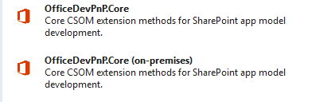

# Provisioning console application sample

Learn the fundamentals of using the PnP provisioning engine to create and persist, and then apply provisioning templates to new SharePoint site collections.

To support the new add-in model, the Office 365 Developer Patterns and Practices program (PnP) has introduced a provisioning framework that allows users to create custom site templates by simply pointing at a site model, persist the model as a provisioning template, and then apply the custom template to new or existing site collections as needed.

In this sample, we create a basic console application that implements classes in the provisioning PnP Core library to enable the PnP provisioning engine to complete these essential provisioning tasks: 

- Design and model your site customization. This can be a new site design, or you can point to an existing site and save it as a provisioning template.
    
- Save and persist the site model as a provisioning template so that you can reuse it.
    
- Apply the provisioning template to a new or existing site collection.
    
> [!NOTE] 
> This sample walkthrough is a companion to a sample currently available on GitHub: [Getting Started with the PnP Provisioning Engine](https://github.com/SharePoint/PnP/tree/master/Samples/Provisioning.Framework.Console). The code (Program.cs) and solution files for the sample are available for download. There also is a 20-minute video presentation of this process (with slightly different code) available on the Microsoft Channel 9 site: [Getting Started with the PnP Provisioning Engine](https://channel9.msdn.com/blogs/OfficeDevPnP/Getting-Started-with-PnP-Provisioning-Engine).

## Remote provisioning walkthrough

To begin, create a Visual Studio project. In this sample, for simplicity, we create a basic console application that implements the PnP provisioning engine by using the PnP Core library of the provisioning framework. To support the sample solution, however, we must download and install the provisioning framework PnP Core library. Instructions for doing so follow.

### Create and prepare a Visual Studio project

1. Launch Visual Studio, and then choose  **File** > **New** > **Project**.
    
2. In the  **New Project** wizard, choose **Visual C#**, then choose  **Console Application**.
    
3. Name the project "Program," and then click  **OK**. (You can name the project anything you like, but be mindful that this walkthrough will reference the project name as "program.")
    
4. Download and install the PnP Core library that is available as a NuGet package here: [OfficeDevPnP.Core packages](https://www.nuget.org/profiles/officedevpnp).
    
	> [!NOTE] 
	> There are two versions of the core library. One version is the **OfficeDevPnP.Core** library, which targets SharePoint Online and Office 365. The second version is **OfficeDevPnP.Core (on-premises)**, which targets SharePoint 2013 on-premises. Here is a screenshot of the available options.

	

In this sample walkthrough, we're using the first option to target SharePoint Online.

1. First, install the NuGet client by going to the [NuGet client installer](http://docs.nuget.org/consume/installing-nuget).

2. After the NuGet client is installed, run the  **NuGet Package manager**. Right-click the  **References** node in the Visual Studio **Solution Explorer**, and then select  **Manage NuGet Packages**.

3. In the Package Manager, choose **Online**, then  **EntityFramework**, and then enter the search term "OfficeDev" to expose the OfficeDevPnP.Core library.

4. Follow directions to download and install the  **OfficeDevPnP.Core** library, following the given directions.

   After the PnP Core library is referenced in your Visual Studio project, all library members are available to you as [extension methods](https://msdn.microsoft.com/en-us/library/bb383977.aspx) on existing object instances, for example, **web** and **list** instances.

5. Ensure that your Program.cs file contains all of the following  `using` statements.

	```c#
	using Microsoft.SharePoint.Client;
	using OfficeDevPnP.Core.Framework.Provisioning.Connectors;
	using OfficeDevPnP.Core.Framework.Provisioning.Model;
	using OfficeDevPnP.Core.Framework.Provisioning.ObjectHandlers;
	using OfficeDevPnP.Core.Framework.Provisioning.Providers.Xml;
	using System;
	using System.Net;
	using System.Security;
	using System.Threading;
	```

**Once we have set up your project**

Once your project is set up, you can create your site customizations. You can do this by hand or by pointing to a site whose design you wish to use. Simply save the chosen site design as a provisioning template. Or, you can use a mix of both approaches. For the purpose of this sample, we will simply point to an existing site and save its composed look and site artifacts (but not its content) as a provisioning template.

To begin, we need to connect to the site that we wish to model as our provisioning template. Let's start by gathering connection information, including user name, password, and the source URL.

### Create and extract and persist the provisioning template

1. Collect connection information from the user. Note that in the program's  `Main` routine, we do three simple things: collect connection information, GET the provisioning template, and APPLY the provisioning template. The heavy lifting is done by the **GetProvisioningTemplate** and **ApplyProvisioningTemplate** methods that we define below.
    
	```C#
	static void Main(string[] args)
	    {
	        ConsoleColor defaultForeground = Console.ForegroundColor;
	
	        // Collect information 
	        string templateWebUrl = GetInput("Enter the URL of the template site: ", false, defaultForeground);
	        string targetWebUrl = GetInput("Enter the URL of the target site: ", false, defaultForeground);
	        string userName = GetInput("Enter your user name:", false, defaultForeground);
	        string pwdS = GetInput("Enter your password:", true, defaultForeground);
	        SecureString pwd = new SecureString();
	        foreach (char c in pwdS.ToCharArray()) pwd.AppendChar(c);
	
	        // GET the template from existing site and serialize
	        // Serializing the template for later reuse is optional
	        ProvisioningTemplate template = GetProvisioningTemplate(defaultForeground, templateWebUrl, userName, pwd);
	
	        // APPLY the template to new site from 
	        ApplyProvisioningTemplate(defaultForeground, targetWebUrl, userName, pwd, template);
	
	        // Pause and modify the UI to indicate that the operation is complete
	        Console.ForegroundColor = ConsoleColor.White;
	        Console.WriteLine("We're done. Press Enter to continue.");
	        Console.ReadLine();
	    }
	```

2. Create and use a private  **GetInput** method to obtain the required user credentials.
    
	```c#
	private static string GetInput(string label, bool isPassword, ConsoleColor defaultForeground)
	    {
	        Console.ForegroundColor = ConsoleColor.Green;
	        Console.WriteLine("{0} : ", label);
	        Console.ForegroundColor = defaultForeground;
	
	        string value = "";
	
	        for (ConsoleKeyInfo keyInfo = Console.ReadKey(true); keyInfo.Key != ConsoleKey.Enter; keyInfo = Console.ReadKey(true))
	        {
	            if (keyInfo.Key == ConsoleKey.Backspace)
	            {
	                if (value.Length > 0)
	                {
	                    value = value.Remove(value.Length - 1);
	                    Console.SetCursorPosition(Console.CursorLeft - 1, Console.CursorTop);
	                    Console.Write(" ");
	                    Console.SetCursorPosition(Console.CursorLeft - 1, Console.CursorTop);
	                }
	            }
	            else if (keyInfo.Key != ConsoleKey.Enter)
	            {
	                if (isPassword)
	                {
	                    Console.Write("*");
	                }
	                else
	                {
	                    Console.Write(keyInfo.KeyChar);
	                }
	                value += keyInfo.KeyChar;
	
	            }
	
	        }
	        Console.WriteLine("");
	
	        return value;
	    }
	```

3. Point to the site that's the model for our provisioning template. While doing the GET on the source site with a single line of code, look at  `GetProvisioningTemplate()`, the GET method we defined. 
    
	```c#
	private static ProvisioningTemplate GetProvisioningTemplate(ConsoleColor defaultForeground, string webUrl, string userName, SecureString pwd)
	    {
	        using (var ctx = new ClientContext(webUrl))
	        {
	            // ctx.Credentials = new NetworkCredentials(userName, pwd);
	            ctx.Credentials = new SharePointOnlineCredentials(userName, pwd);
	            ctx.RequestTimeout = Timeout.Infinite;
	
	            // Just to output the site details
	            Web web = ctx.Web;
	            ctx.Load(web, w => w.Title);
	            ctx.ExecuteQueryRetry();
	
	            Console.ForegroundColor = ConsoleColor.White;
	            Console.WriteLine("Your site title is:" + ctx.Web.Title);
	            Console.ForegroundColor = defaultForeground;
	
	            ProvisioningTemplateCreationInformation ptci
	                    = new ProvisioningTemplateCreationInformation(ctx.Web);
	
	            // Create FileSystemConnector to store a temporary copy of the template 
	            ptci.FileConnector = new FileSystemConnector(@"c:\temp\pnpprovisioningdemo", "");
	            ptci.PersistComposedLookFiles = true;
	            ptci.ProgressDelegate = delegate(String message, Int32 progress, Int32 total)
	            {
	                // Only to output progress for console UI
	                Console.WriteLine("{0:00}/{1:00} - {2}", progress, total, message);
	            };
	
	            // Execute actual extraction of the template
	            ProvisioningTemplate template = ctx.Web.GetProvisioningTemplate(ptci);
	
	            // We can serialize this template to save and reuse it
	            // Optional step 
	            XMLTemplateProvider provider =
	                    new XMLFileSystemTemplateProvider(@"c:\temp\pnpprovisioningdemo", "");
	            provider.SaveAs(template, "PnPProvisioningDemo.xml");
	
	            return template;
	        }
	    }
	```

	In the above code snippet, we also defined a  **ProvisioningTemplateCreationInformation** variable, **pcti**. The variable gives us the option to store information about artifacts that we can save along with the template.
    
4. Create a file system connector object so that we can store a temporary copy of the provisioning template that we're going to apply to another site.
    
	> [!NOTE] 
	> This step is optional. It's not required that you serialize the provisioning template to XML. At this stage, the template is simply C# code. Not only is serialization optional, but you also can use whatever serialization format you wish.

5. Execute the extraction of the provisioning template by using just this single line of code.  	`ProvisioningTemplate template = ctx.Web.GetProvisioningTemplate(ptci);`
    
6. (Optional) Save and store a serialized version of the provisioning template so that you can reuse it. You can serialize the provisioning template in whichever format you prefer. In this sample, we've serialized to an XML file named  **PnPProvisioningDemo.xml**. The file itself is an **XMLFileSystemTemplateProvider** object for which we've provided a file system location.
    
**Once we extract, save and persist the provisioning template**

Once we extract, save, and persist the provisioning template, the next and final step is to apply the provisioning template to a new SharePoint site collection by using the  **ApplyProvisioningTemplate** method.

### Apply the provisioning template to a new or existing site

1. Obtain credentials to the target site.
    
	```c#
	// ctx.Credentials = new NetworkCredentials(userName, pwd);
	            ctx.Credentials = new SharePointOnlineCredentials(userName, pwd);
	            ctx.RequestTimeout = Timeout.Infinite;
	```

2. Capture site artifacts that were stored using the  **ProvisioningTemplateCreationInformation** method by using the companion method, **ProvisioningTemplateApplyingInformation**.
    
	```c#
	ProvisioningTemplateApplyingInformation ptai
	                    = new ProvisioningTemplateApplyingInformation();
	            ptai.ProgressDelegate = delegate(String message, Int32 progress, Int32 total)
	            {
	                Console.WriteLine("{0:00}/{1:00} - {2}", progress, total, message);
	            };
	```

3. Get an association to the file connector for the assets.
    
	```c#
	// Associate file connector for assets
	            FileSystemConnector connector = new FileSystemConnector(@"c:\temp\pnpprovisioningdemo", "");
	            template.Connector = connector;
	
	```

4. (Optional) Because the provisioning template is an object instance, we can write code to customize site artifacts on the fly. In this instance, we're adding a new "contact" list.
    
	```c#
	// Since template is actual object, we can modify this using code as needed
	            template.Lists.Add(new ListInstance()
	            {
	                Title = "PnP Sample Contacts",
	                Url = "lists/PnPContacts",
	                TemplateType = (Int32)ListTemplateType.Contacts,
	                EnableAttachments = true
	            });
	```

5.  Apply the provisioning template to the new site, again using one line of code.
    
	```c#
		web.ApplyProvisioningTemplate(template, ptai);
	```

## See also
<a name="bk_addresources"> </a>

- [PnP provisioning framework](pnp-provisioning-framework.md)
    
- [PnP provisioning engine and the core library](pnp-provisioning-engine-and-the-core-library.md)
