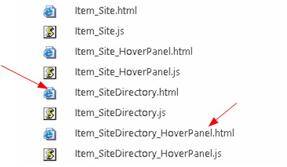
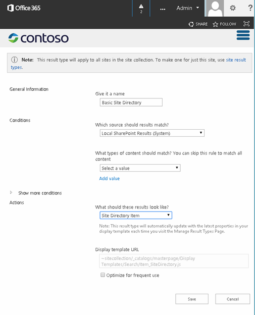
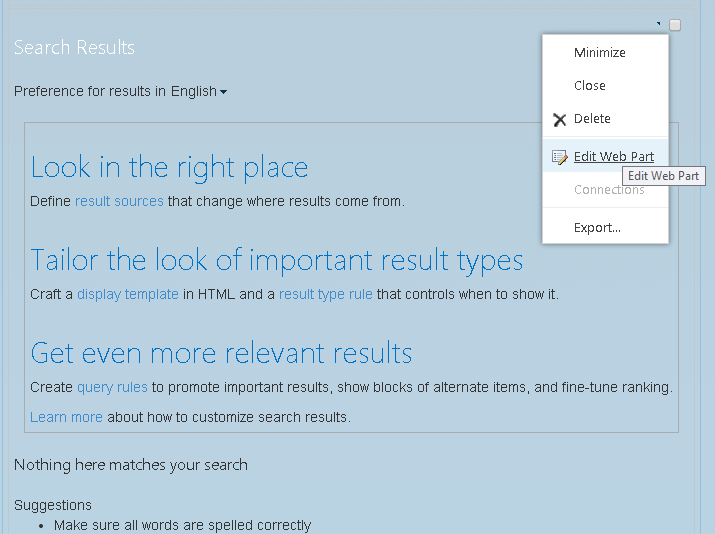
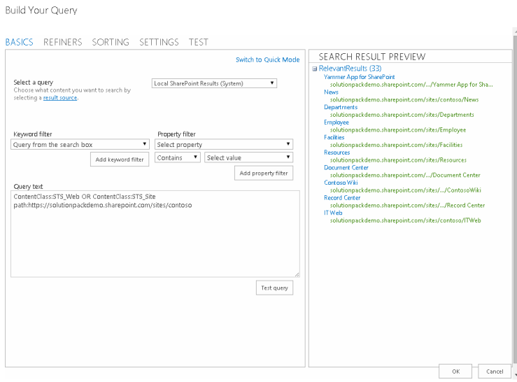
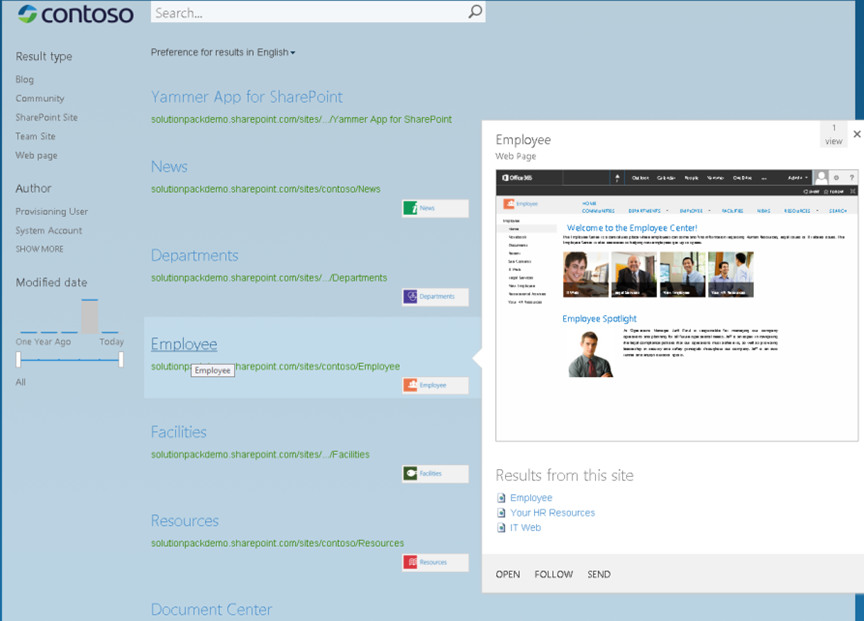
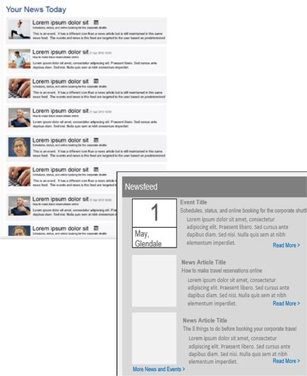
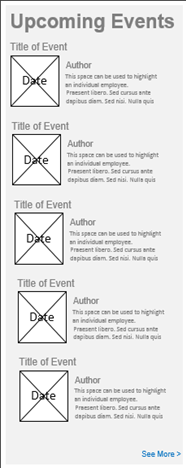
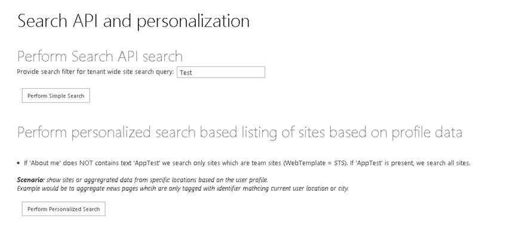
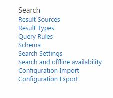

# Search customizations for SharePoint

Create customized SharePoint 2013 and SharePoint Online search scenarios by using a search-based site directory, personalized search, or search configuration portability. 

_**Applies to:** Office 365 | SharePoint 2013 | SharePoint Add-ins | SharePoint Online_

## Search-based site directory

SharePoint search enables you to create a search-based site directory without writing any custom code. 

To create a site directory:

1. Create the site directory display templates.
    
2. Define the site directory result type.
    
3. Create the results page.
    
4. Edit the Results web part properties.
    
To create the site directory display templates:

> [!NOTE] 
> This procedure uses the site-related display templates without modification. If you want to change how site directory results are displayed, modify the display templates that you create.

1. Open the mapped network drive to the  **Master Page Gallery**. For more information, see [How to: Map a network drive to the SharePoint 2013 Master Page Gallery](http://msdn.microsoft.com/en-us/library/office/jj733519%28v=office.15%29.aspx).
    
2. Make copies of the display template HTML files that best map what you're trying to do. For the site directory scenario, this will be Item_Site.html and Item_Site_HoverPanel.html. Both files are located in the  `\Display Templates\Search` folder in the mapped network drive.
    
3. Rename the copies that you made of the Item_SiteDirectory.html and Item_SiteDirectory_HoverPanel.html files as shown.
    
    **Figure 1. Site directory display templates**

    

4. Open the Item_SiteDirectory.html file and make the following changes:
    
	- Change the  `<title>` tag value from "Site Item" to "Site Directory".
    
	- Change the first  `<div>` tag after the opening `<body>` tag from `<div id="Item_Site">` to `<div id="Item_SiteDirectory">`.
    
	- Change the hover panel display template JavaScript file name from: `var hoverUrl = "~sitecollection/_catalogs/masterpage/Display Templates/Search/Item_Site_HoverPanel.js";`to: `var hoverUrl = "~sitecollection/_catalogs/masterpage/Display Templates/Search/Item_SiteDirectory_HoverPanel.js";`
    
5. Open the Item_SiteDirectory_HoverPanel.html file and make the following changes:
    
	- Change the  `<div>` tag following the opening `<body>` tag from: `<title>Site Hover Panel Test</title>`to: `<title>Site Directory Hover Panel</title>`
    
	- Change the  `<title>` tag from: `<div id="Item_Site_HoverPanel">`to: `<div id="Item_SiteDirectory_HoverPanel">`
    
To define the site directory result type:

1. Go to  **Site Settings** > **Search** > **Result Types**, and then choose  **New Result Type**.
    
2. Name your new result type "Basic Site Directory".
    
3. In the  **What should these results look like?** box, select **Site Directory**.
    
    **Figure 2. Site result configuration**

    

4. Choose  **Save**.
    
To create the results page:

1. On the  **Site Settings** menu, select **Site contents**.
    
2. Select  **Pages**.
    
3. In the  **Pages** library, select **Files** > **New Document** > **Page**.
    
4. On the  **Create Page** page, specify "Site Directory" for **Title** and "sitedirectory" for **URL Name**.
    
5. Choose  **Create**.
    
To edit the Results web part properties:

1. On the  **Site Directory** page, choose **Settings** > **Edit Page**.
    
2. In the  **Search Results Web Part**, choose the  **Web Part** menu, and then choose **Edit Web Part**.
    
    **Figure 3. Web Part menu**

    

3. In the Web Part tool pane, choose  **Change query** to open the Query Builder.
    
4. In the  **Query text** field, enter the following: `ContentClass:STS_Web OR ContentClass:STS_Site path:http://<YourServer>`
    
5. Choose  **Test query** to confirm that the syntax is correct. The **Search Results Preview** pane should display subsites within the site you specified for _path_ in the **Query text**.
    
    **Figure 4. Search results Web Part query builder**

    

6. Choose  **OK** to close the Query Builder.
    
7. In  **Display Templates**, select  **Use result types to display items**.
    
8. Select  **Basic Site Directory** in the **Result type for item** drop-down list.
    
9. In the  **Appearance** section, change the **Title** to "Sites I have access to".
    
10. Choose  **OK** to save the changes to the Web Part and to close the Web Part tool pane. The following figure shows an example of a search-based site directory page.
    
    **Figure 5. Contoso search-based site directory example**

    

## Personalized search results

Personalized search is when you show search results targeted to the user submitting the search request. This section describes some scenarios for personalized search and how you might implement them.

### Your news scenario

In this scenario, you create a search add-in that shows relevant content, such as news and events, targeted to the user.

**Figure 6. Your News personalized search scenario**



To implement the news scenario, use the SharePoint search results Web Part and default display templates to display the news information, including title, description, and rollup image. Show the first 10 news items. When the user chooses the rollup image, title, or Read More link, the news article page is loaded.

Alternatively, you can create a search add-in using the query API (CSOM or REST). You can make the number of news items to be displayed configurable by using the search add-in properties.

Another option is to use the query API to add the query API code that retrieves the search results directly to the page layout.

To display the news and event information specific to the user:

1. Modify the query to filter news and event results based on user profile properties like business unit, region, and language.
    
2. Retrieve the Title, Description, rollup image, and URL properties for the news or event items.
    
3. Implement sorting logic for the combined news and events based on the  **LastModifiedDate** property.

### Upcoming events scenario

In this scenario, the search add-in shows relevant events targeted to the user.

**Figure 7. Upcoming Events personalized search scenario**



To implement this scenario, you can configure the SharePoint search results Web Part to change the query to only retrieve upcoming event information. To do this, specify  `ContentClass:STS_ListItem_Events` for the Web Part's query text. To change how event results are displayed, create custom display templates to render the event information.

You can modify the item display template so that when the user chooses the image, title, or Read More link, the event information page is loaded. You can also modify the control display template so that when the user chooses  **See More**, the next 10 event results are displayed in the Web Part.

You can also create a search add-in that uses the query API to retrieve even results. You can configure the search add-in to show, by default, only 10 of the latest upcoming events, but make this setting configurable through the search add-in properties. 

### Featured news scenario

In this scenario, the search add-in shows search results as featured content targeted to your users in places such as corporate intranet and divisional landing pages. You can implement this with an add-in part that contains a jQuery plugin with HTML, that uses the search REST service or the query CSOM to get search results from SharePoint and display the results.

### Code sample for personalized search

The [SharePoint 2013: Personalizing search results in a SharePoint Add-in](http://code.msdn.microsoft.com/SharePoint-2013-Personalizi-fb6ddcf9) sample shows a basic search example and a personalized search results example that uses the search query CSOM. The basic search example lets the user provide a search filter to use for a tenant-wide search. Sites are searched based on that user-supplied filter.

The example first gets SharePoint context by using the  **SharePointContextProvider** class.

```
var spContext = SharePointContextProvider.Current.GetSharePointContext(Context);
```

Next, it builds the query based on what the user entered. It restricts the query to site collections, and then calls the  **ProcessQuery** method, passing the context and the query in the method call. It then returns the **ProcessQuery** results as a result table, which is then parsed by the **FormatResults** method.

```
using (var clientContext = spContext.CreateUserClientContextForSPHost())
{
	string query = searchtext.Text + " contentclass:\"STS_Site\"";
	ClientResult<ResultTableCollection> results = ProcessQuery(clientContext, query);
	lblStatus1.Text = FormatResults(results);
}
```

The  **ProcessQuery** method builds a **KeywordQuery** object that represents the search query.

```
KeywordQuery keywordQuery = new KeywordQuery(ctx);
keywordQuery.QueryText = keywordQueryValue;
keywordQuery.RowLimit = 500;
keywordQuery.StartRow = 0;
keywordQuery.SelectProperties.Add("Title");
keywordQuery.SelectProperties.Add("SPSiteUrl");
keywordQuery.SelectProperties.Add("Description");
keywordQuery.SelectProperties.Add("WebTemplate");
keywordQuery.SortList.Add("SPSiteUrl", Microsoft.SharePoint.Client.Search.Query.SortDirection.Ascending);
```

The search query is then submitted to SharePoint by calling the  **ExecuteQuery_Client(Query)** method. Results are returned to the **ClientResult<T&gt;** object.

```
SearchExecutor searchExec = new SearchExecutor(ctx);
ClientResult<ResultTableCollection> results = searchExec.ExecuteQuery(keywordQuery);
ctx.ExecuteQuery();
```

The  **FormatResults** method iterates through the results and constructs an HTML table to display the result values.

```
string responseHtml = "<h3>Results</h3>";
responseHtml += "<table>";
responseHtml += "<tr><th>Title</th><th>Site URL</th><th>Description</th><th>Template</th></tr>";
if (results.Value[0].RowCount > 0)
{
 foreach (var row in results.Value[0].ResultRows)
 {
   responseHtml += "<tr>";
   responseHtml += string.Format("<td>{0}</td>", row["Title"] != null ? row["Title"].ToString() : "");
   responseHtml += string.Format("<td>{0}</td>", row["SPSiteUrl"] != null ? row["SPSiteUrl"].ToString() : "");
   responseHtml += string.Format("<td>{0}</td>", row["Description"] != null ? row["Description"].ToString() : "");
   responseHtml += string.Format("<td>{0}</td>", row["WebTemplate"] != null ? row["WebTemplate"].ToString() : "");
   responseHtml += "</tr>";
 }
}
responseHtml += "</table>";
```

The  **ResolveAdditionalFilter** method checks for "Apptest". If it is found, a list of site templates of any type is returned in the search results. If it is not found, only STS web templates are returned in the search results.

```
private string ResolveAdditionalFilter(string aboutMeValue)
{
	if (!aboutMeValue.Contains("AppTest"))
	{
		return "WebTemplate=STS";
	}
	return "";
}
```

The example then constructs the query and calls the  **ProcessQuery** and **FormatResults** methods to retrieve, format, and display the search results.

```
string query = "contentclass:\"STS_Site\" " + templateFilter;
ClientResult<ResultTableCollection> results = ProcessQuery(clientContext, query);
lblStatus2.Text = FormatResults(results);
```

You can see the UI for this example in the following figure.

**Figure 8. Personalized search results sample UI**



## Search configuration portability

In SharePoint 2013 and SharePoint Online, you can export and import customized search configuration settings between site collections and sites. You can only export customized search configuration settings at the Search service application (SSA) level, and you have to use the search APIs to do this programmatically. The export option is not available in the SharePoint UI.

The [SharePoint 2013: Import and Export search settings for SharePoint Online](http://code.msdn.microsoft.com/SharePoint-2013-Import-and-6287b5ac) sample show how to import and export search settings for a SharePoint Online site using the search CSOM in a console application.

### Configuration settings that are portable

When you export customized search configuration settings, SharePoint 2013 creates a search configuration file in XML format. This search configuration file includes all exportable customized search configuration settings at the SSA, site collection, or site level from where you start the export. A search configuration file for a site collection does not contain search configuration settings from the individual sites within the site collection.

When you import a search configuration file, SharePoint 2013 creates and enables each customized search configuration setting in the site collection or site from where you start the import.

Table 1 lists the settings that you can export and import and any dependencies on other customized search configuration settings. If the customized search configuration settings depend on a customized search configuration setting at a different level, you must export and import settings at all relevant levels.

**Table 1. Search settings that you can export and import**

|**Configuration setting**|**Dependencies**|
|:-----|:-----|
|Query rules, including result blocs, promoted results, and user segments|Result sources, result types, search schema, ranking model|
|Result sources|Search schema|
|Result types|Search schema, result sources, display templates|
|Search schema|None|
|Ranking model|Search schema|

You can export customized search configuration settings from an SSA and import the settings to site collections and sites. But you can't import customized search configuration settings to an SSA. You also can't export the default search configuration settings.

At the site or site collection level, you can export or import search configuration settings by using the SharePoint UI. These settings are located in the  **Search** section of the **Site Settings** page.

**Site Settings - Search**



These settings are also available in the  **Site Collection Administration** section. Alternatively, you can programmatically import and export these settings by using the SharePoint 2013 search CSOM.

### Search configuration files

The following table lists schema files that support a search configuration. For information about the schema format, see [Share Point search settings portability schemas](http://msdn.microsoft.com/en-us/library/office/dn627953%28v=office.15%29.aspx).

> [!NOTE] 
> You can download the schema files from [http://download.microsoft.com/download/1/2/2/12204CDE-56A6-4B2F-9719-4EA25FDA7743/SP15_search_settings_portability_schema.zip](http://download.microsoft.com/download/1/2/2/12204CDE-56A6-4B2F-9719-4EA25FDA7743/SP15_search_settings_portability_schema.zip). 

**Table 2. Search settings portability schemas**

|**Schema**|**Description**|
|:-----|:-----|
|[SPS15XSDSearchSet1](http://msdn.microsoft.com/en-us/library/office/dn639116%28v=office.15%29.aspx)|Specifies XML that represents result sources.|
|[SPS15XSDSearchSet2](http://msdn.microsoft.com/en-us/library/office/dn639118%28v=office.15%29.aspx)|Specifies XML that represents administrative types and members for managing an SSA search instance. This includes result item types and property rule settings.|
|[SPS15XSDSearchSet3](http://msdn.microsoft.com/en-us/library/office/dn639120%28v=office.15%29.aspx)|Specifies XML that represents settings that include query rules, result sources, managed properties, crawled properties, and ranking models.|
|[SPS15XSDSearchSet4](http://msdn.microsoft.com/en-us/library/office/dn639117%28v=office.15%29.aspx)|Specifies XML that represents enumerations used in other schemas.|
|[SPS15XSDSearchSet5](http://msdn.microsoft.com/en-us/library/office/dn639119%28v=office.15%29.aspx)|Specifies XML that represents enumerations like  **ResultType** that are used in other schemas.|
|[SPS15XSDSearchSet6](http://msdn.microsoft.com/en-us/library/office/dn639115%28v=office.15%29.aspx)|Specifies XML that represents enumerations used in the  **Microsoft.Office.Server.Search.Administration** schema.|

### Using CSOM to port configuration settings

The CSOM APIs that you need in order to import and export your search configuration settings are in the  **SearchConfigurationPortability** class in the **Microsoft.SharePoint.Client.Search.Portability** namespace.

The following code example shows how to export a site's search configuration settings.

```
private static void ExportSearchSettings(ClientContext context, string settingsFile)
{
   SearchConfigurationPortability sconfig = new SearchConfigurationPortability(context);
   SearchObjectOwner owner = new SearchObjectOwner(context, SearchObjectLevel.SPWeb);
   ClientResult<string> configresults = sconfig.ExportSearchConfiguration(owner);
   context.ExecuteQuery();
   string results = configresults.Value;
   System.IO.File.WriteAllText(settingsFile, results);
}
```

The following code shows how to import a site's search configuration settings.

```
private static void ImportSearchSettings(ClientContext context, string settingsFile)
{
   SearchConfigurationPortability sconfig = new SearchConfigurationPortability(context);
   SearchObjectOwner owner = new SearchObjectOwner(context, SearchObjectLevel.SPWeb);
   sconfig.ImportSearchConfiguration(owner, System.IO.File.ReadAllText(settingsFile));
   context.ExecuteQuery();            
}
```

## See also
<a name="bk_addresources"> </a>

- [Search solutions in SharePoint 2013 and SharePoint Online](search-solutions-in-sharepoint-2013-and-sharepoint-online.md)
    
- [SharePoint 2013: Import and Export search settings for SharePoint Online](http://code.msdn.microsoft.com/SharePoint-2013-Import-and-6287b5ac)
    
- [SharePoint 2013: Personalizing search results in a SharePoint Add-in](http://code.msdn.microsoft.com/SharePoint-2013-Personalizi-fb6ddcf9)
