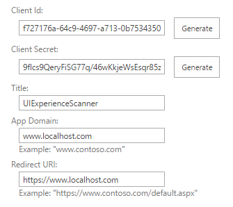
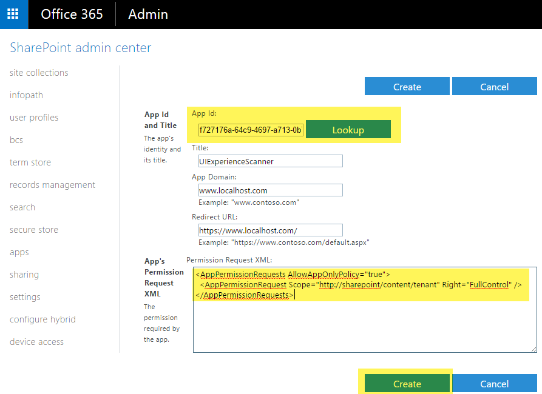
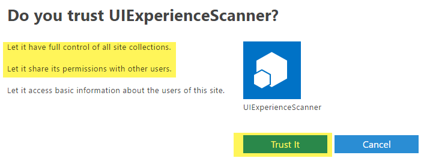

# Granting access using SharePoint App-Only
SharePoint App-Only is the older, but still very relevant, model of setting up app-principals. This model works for both SharePoint Online and SharePoint 2013/2016 on-premises and is ideal to prepare your applications for migration from SharePoint on-premises to SharePoint online. Below steps show how to setup an app principal with tenant full control permissions, but obviously you could also grant just read permissions using this approach.

> [!IMPORTANT]
> Azure Access Control (ACS), a service of Azure Active Directory (Azure AD), will be retired on November 7, 2018. This retirement does not impact SharePoint add-in model which is using `https://accounts.accesscontrol.windows.net` hostname, which is not impacted by this retirement. See more details on this from [Impact of Azure Access Control retirement for SharePoint add-ins](https://dev.office.com/blogs/impact-of-azure-access-control-deprecation-for-sharepoint-add-ins).

## Setting up an app-only principal with tenant permissions
Navigate to a site in your tenant (e.g. https://contoso.sharepoint.com) and then call the appregnew.aspx page (e.g. https://contoso.sharepoint.com/_layouts/15/appregnew.aspx). In this page click on the Generate button to generate a client id and client secret and fill the remaining information like shown in the screen-shot below.



> [!IMPORTANT]
> Store the retrieved information (client id and client secret) since you'll need this in the next step!

Next step is granting permissions to the newly created principal. Since we're granting tenant scoped permissions this granting can only be done via the appinv.aspx page on the tenant administration site. You can reach this site via https://contoso-admin.sharepoint.com/_layouts/15/appinv.aspx. Once the page is loaded add your client id and look up the created principal:



To grant permissions, you'll need to provide the permission XML that describes the needed permissions. Since this application needs to be able to access all sites + also uses search with app-only it needs below permissions:

```
<AppPermissionRequests AllowAppOnlyPolicy="true">
  <AppPermissionRequest Scope="http://sharepoint/content/tenant" Right="FullControl" />
</AppPermissionRequests>
```

When you click on Create you'll be presented with a permission consent dialog. Press Trust It to grant the permissions:



> [!IMPORTANT]
> Please safeguard the created client id/secret combination as would it be your administrator account. Using this client id/secret one can read/update all data in your SharePoint Online environment!

With the preparation work done let's continue to the next chapter showing how you can use the created app principal via its client id and secret combination.

## Using this principal in your application using the SharePoint PnP Sites Core library
In a first step, you add the SharePoint PnP Sites Core library nuget package: https://www.nuget.org/packages/SharePointPnPCoreOnline. Once that’s done you can use below code construct:

```csharp
string siteUrl = "https://contoso.sharepoint.com/sites/demo";
using (var cc = new AuthenticationManager().GetAppOnlyAuthenticatedContext(siteUrl, "[Your Client ID]", "[Your Client Secret]"))
{
    cc.Load(cc.Web, p => p.Title);
    cc.ExecuteQuery();
    Console.WriteLine(cc.Web.Title);
};
```

## Using this principal in your application without using the PnP Sites Core library
Once the principal is created and consented you can use the principal's id and secret to request an access. The TokenHelper.cs class will grab the id and secret from the application's configuration file.
using Microsoft.SharePoint.Client;
using System;

```csharp
namespace AzureACSAuth
{
    class Program
    {
        static void Main(string[] args)
        {
            string siteUrl = "https://contoso.sharepoint.com/sites/demo";

            //Get the realm for the URL
            string realm = TokenHelper.GetRealmFromTargetUrl(new Uri(siteUrl));

            //Get the access token for the URL.  
            string accessToken = TokenHelper.GetAppOnlyAccessToken(TokenHelper.SharePointPrincipal, new Uri(siteUrl).Authority, realm).AccessToken;

            //Create a client context object based on the retrieved access token
            using (ClientContext cc = TokenHelper.GetClientContextWithAccessToken(siteUrl, accessToken))
            {
                cc.Load(cc.Web, p => p.Title);
                cc.ExecuteQuery();
                Console.WriteLine(cc.Web.Title);
            }
        }
    }
}
```

A sample app.config looks like this:

```XML
<?xml version="1.0" encoding="utf-8" ?>
<configuration>
  <appSettings>
    <!-- Use AppRegNew.aspx and AppInv.aspx to register client id with secret -->
    <add key="ClientId" value="[Your Client ID]" />
    <add key="ClientSecret" value="[Your Client Secret]" />
  </appSettings>
</configuration>
```

> [!NOTE]
> You can easily insert the TokenHelper.cs class in your project by adding the AppForSharePointOnlineWebToolkit nuget package to your solution.

