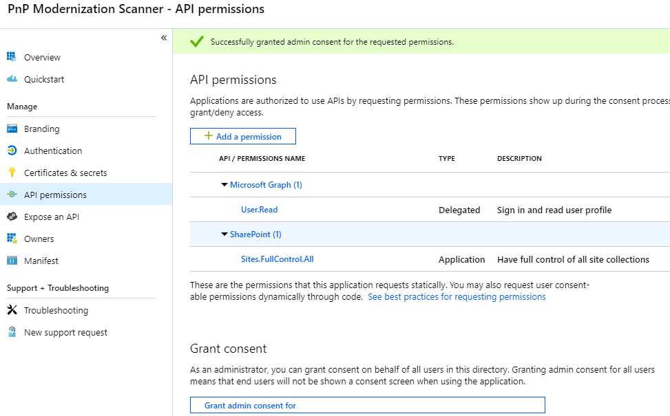

# Granting access via Azure AD App-Only
When using SharePoint Online you can define applications in Azure AD and these applications can be granted permissions to SharePoint, but also to all the other services in Office 365. This model is the preferred model in case you’re using SharePoint Online, if you’re using SharePoint on-premises you have to use the SharePoint Only model via based Azure ACS as described in [here](security-apponly-azureacs.md "link to Azure ACS app only article").

## Setting up an Azure AD app for app-only access
In Azure AD when doing app-only you typically use a certificate to request access: anyone having the certificate and its private key can use the app and the permissions granted to the app. Below steps walk you through the setup of this model.

You are now ready to configure the Azure AD Application for invoking SharePoint Online with an App Only access token. To do that, you have to create and configure a self-signed X.509 certificate, which will be used to authenticate your Application against Azure AD, while requesting the App Only access token. First you must create the self-signed X.509 Certificate, which can be created using the makecert.exe tool that is available in the Windows SDK or through a provided PowerShell script which does not have a dependency to makecert. Using the PowerShell script is the preferred method and is explained in this chapter.

> [!IMPORTANT]
> It's important that you run the below scripts with Administrator privileges.

To create a self signed certificate with this script:

```powershell
.\Create-SelfSignedCertificate.ps1 -CommonName "MyCompanyName" -StartDate 2017-10-01 -EndDate 2019-10-01
```

> [!NOTE]
> The dates are provided in US date format: YYYY-MM-dd

The actual script can be copied from here:

```powershell
#Requires -RunAsAdministrator
<#
.SYNOPSIS
Creates a Self Signed Certificate for use in server to server authentication
.DESCRIPTION
.EXAMPLE
PS C:\> .\Create-SelfSignedCertificate.ps1 -CommonName "MyCert" -StartDate 2015-11-21 -EndDate 2017-11-21
This will create a new self signed certificate with the common name "CN=MyCert". During creation you will be asked to provide a password to protect the private key.
.EXAMPLE
PS C:\> .\Create-SelfSignedCertificate.ps1 -CommonName "MyCert" -StartDate 2015-11-21 -EndDate 2017-11-21 -Password (ConvertTo-SecureString -String "MyPassword" -AsPlainText -Force)
This will create a new self signed certificate with the common name "CN=MyCert". The password as specified in the Password parameter will be used to protect the private key
.EXAMPLE
PS C:\> .\Create-SelfSignedCertificate.ps1 -CommonName "MyCert" -StartDate 2015-11-21 -EndDate 2017-11-21 -Force
This will create a new self signed certificate with the common name "CN=MyCert". During creation you will be asked to provide a password to protect the private key. If there is already a certificate with the common name you specified, it will be removed first.
#>
Param(

   [Parameter(Mandatory=$true)]
   [string]$CommonName,

   [Parameter(Mandatory=$true)]
   [DateTime]$StartDate,
   
   [Parameter(Mandatory=$true)]
   [DateTime]$EndDate,

   [Parameter(Mandatory=$false, HelpMessage="Will overwrite existing certificates")]
   [Switch]$Force,

   [Parameter(Mandatory=$false)]
   [SecureString]$Password
)

# DO NOT MODIFY BELOW

function CreateSelfSignedCertificate(){
    
    #Remove and existing certificates with the same common name from personal and root stores
    #Need to be very wary of this as could break something
    if($CommonName.ToLower().StartsWith("cn="))
    {
        # Remove CN from common name
        $CommonName = $CommonName.Substring(3)
    }
    $certs = Get-ChildItem -Path Cert:\LocalMachine\my | Where-Object{$_.Subject -eq "CN=$CommonName"}
    if($certs -ne $null -and $certs.Length -gt 0)
    {
        if($Force)
        {
        
            foreach($c in $certs)
            {
                remove-item $c.PSPath
            }
        } else {
            Write-Host -ForegroundColor Red "One or more certificates with the same common name (CN=$CommonName) are already located in the local certificate store. Use -Force to remove them";
            return $false
        }
    }

    $name = new-object -com "X509Enrollment.CX500DistinguishedName.1"
    $name.Encode("CN=$CommonName", 0)

    $key = new-object -com "X509Enrollment.CX509PrivateKey.1"
    $key.ProviderName = "Microsoft RSA SChannel Cryptographic Provider"
    $key.KeySpec = 1
    $key.Length = 2048 
    $key.SecurityDescriptor = "D:PAI(A;;0xd01f01ff;;;SY)(A;;0xd01f01ff;;;BA)(A;;0x80120089;;;NS)"
    $key.MachineContext = 1
    $key.ExportPolicy = 1 # This is required to allow the private key to be exported
    $key.Create()

    $serverauthoid = new-object -com "X509Enrollment.CObjectId.1"
    $serverauthoid.InitializeFromValue("1.3.6.1.5.5.7.3.1") # Server Authentication
    $ekuoids = new-object -com "X509Enrollment.CObjectIds.1"
    $ekuoids.add($serverauthoid)
    $ekuext = new-object -com "X509Enrollment.CX509ExtensionEnhancedKeyUsage.1"
    $ekuext.InitializeEncode($ekuoids)

    $cert = new-object -com "X509Enrollment.CX509CertificateRequestCertificate.1"
    $cert.InitializeFromPrivateKey(2, $key, "")
    $cert.Subject = $name
    $cert.Issuer = $cert.Subject
    $cert.NotBefore = $StartDate
    $cert.NotAfter = $EndDate
    $cert.X509Extensions.Add($ekuext)
    $cert.Encode()

    $enrollment = new-object -com "X509Enrollment.CX509Enrollment.1"
    $enrollment.InitializeFromRequest($cert)
    $certdata = $enrollment.CreateRequest(0)
    $enrollment.InstallResponse(2, $certdata, 0, "")
    return $true
}

function ExportPFXFile()
{
    if($CommonName.ToLower().StartsWith("cn="))
    {
        # Remove CN from common name
        $CommonName = $CommonName.Substring(3)
    }
    if($Password -eq $null)
    {
        $Password = Read-Host -Prompt "Enter Password to protect private key" -AsSecureString
    }
    $cert = Get-ChildItem -Path Cert:\LocalMachine\my | where-object{$_.Subject -eq "CN=$CommonName"}
    
    Export-PfxCertificate -Cert $cert -Password $Password -FilePath "$($CommonName).pfx"
    Export-Certificate -Cert $cert -Type CERT -FilePath "$CommonName.cer"
}

function RemoveCertsFromStore()
{
    # Once the certificates have been been exported we can safely remove them from the store
    if($CommonName.ToLower().StartsWith("cn="))
    {
        # Remove CN from common name
        $CommonName = $CommonName.Substring(3)
    }
    $certs = Get-ChildItem -Path Cert:\LocalMachine\my | Where-Object{$_.Subject -eq "CN=$CommonName"}
    foreach($c in $certs)
    {
        remove-item $c.PSPath
    }
}

if(CreateSelfSignedCertificate)
{
    ExportPFXFile
    RemoveCertsFromStore
}
```

You will be asked to give a password to encrypt your private key, and both the .PFX file and .CER file will be exported to the current folder. 

Next step is registering an Azure AD application in the Azure Active Directory tenant that is linked to your Office 365 tenant. To do that, open the Office 365 Admin Center (https://portal.office.com) using the account of a user member of the Tenant Global Admins group. Click on the "Azure AD" link that is available under the "Admin centers" group in the left-side treeview of the Office 365 Admin Center. In the new browser's tab that will be opened you will find the Microsoft Azure Management Portal. If it is the first time that you access the Azure Management Portal with your account, you will have to register a new Azure subscription, providing some information and a credit card for any payment need. But don't worry, in order to play with Azure AD and to register an Office 365 Application you will not pay anything. In fact, those are free capabilities. Once having access to the Azure Management Portal, select the "Active Directory" section and choose the option "App Registrations". See the next figure for further details.


In the "App Registrations" tab you will find the list of Azure AD applications registered in your tenant. Click the "New application registration" button in the upper left part of the blade. Next, provide a name for your application, select the option "Web app / API", and fill in the "Sign-on URL" with a URL (does not have to exist, e.g. https://www.pnp.com). Click on “Create” to create the Azure AD application.


Once created you need to look up your Azure AD application again and open it:


> [!IMPORTANT]
> Once the application has been opened copy the application ID as you’ll need it later.

Now click on "Required Permissions", and click on the "Add" button, a new blade will appear. You need to configure the following permissions:
 - Office 365 SharePoint Online (Application Permission)
	 - Read and write managed metadata
	 - Have full control of all site collection

The "Application Permissions" are those granted to the application when running as App Only.


Final step is “connecting” the certificate we created earlier to the application. You need to execute the Get-SelfSignedCertificateInformation.ps1 script. 

```powershell
.\Get-SelfSignedCertificateInformation.ps1 | clip
```

The actual script can be copied from here:

```powershell
$certPath = Read-Host "Enter certificate path (.cer)"
$cert = New-Object System.Security.Cryptography.X509Certificates.X509Certificate2
$cert.Import($certPath)
$rawCert = $cert.GetRawCertData()
$base64Cert = [System.Convert]::ToBase64String($rawCert)
$rawCertHash = $cert.GetCertHash()
$base64CertHash = [System.Convert]::ToBase64String($rawCertHash)
$KeyId = [System.Guid]::NewGuid().ToString()

$keyCredentials = 
'"keyCredentials": [
    {
      "customKeyIdentifier": "'+ $base64CertHash + '",
      "keyId": "' + $KeyId + '",
      "type": "AsymmetricX509Cert",
      "usage": "Verify",
      "value":  "' + $base64Cert + '"
     }
  ],'
$keyCredentials

Write-Host "Certificate Thumbprint:" $cert.Thumbprint
```

You will have to provide the full qualified path of the .CER file that you created when you created the certificate for the AppOnly context configuration. The command will copy into the clipboard a JSON snippet that you will use in the upcoming steps. Paste the content of the clipboard in a safe place (like a fresh new notepad file).

Go back to the Azure AD Application that you created in the previous step and click the "Manifest" button at the top of the blade, then click Edit'. Search for the **keyCredentials** property and replace it with the snippet you generated before, this will be like:

```JSON
  "keyCredentials": [
    {
      "customKeyIdentifier": "<$base64CertHash>",
      "keyId": "<$KeyId>",
      "type": "AsymmetricX509Cert",
      "usage": "Verify",
      "value":  "<$base64Cert>"
     }
  ],
```

Click Save when you complete this step.

In this sample the Sites.FullControl.All application permission require admin consent in a tenant before it can be used. Create a consent URL like the following:

```
https://login.microsoftonline.com/<tenant>/adminconsent?client_id=<application id>&state=<something>
```

Using the application id from my Azure AD app and consenting to the app from my tenant contoso.onmicrosoft.com, the URL looks like this:

```
https://login.microsoftonline.com/contoso.onmicrosoft.com/adminconsent?client_id=6e4433ca-7011-4a11-85b6-1195b0114fea&state=12345
```

Browsing to the created URL and log in as a tenant admin, and consent to the application. You can see the consent screen show the name of your application as well as the permission scopes you configured.



> [!NOTE]
> After clicking “Accept” you’re redirected to the sign-in URL you specified earlier (https://www.pnp.com in our case) …if that URL is not valid the redirect will fail but the grant was done successful, so nothing to worry about.


## Using this principal in your application using the SharePoint PnP Sites Core library
In a first step, you add the SharePointPnPCoreOnline library nuget package: https://www.nuget.org/packages/SharePointPnPCoreOnline. Once that’s done you can use below code construct:

```C#
using OfficeDevPnP.Core;
using System;

namespace AzureADCertAuth
{
    class Program
    {
        static void Main(string[] args)
        {
            string siteUrl = "https://contoso.sharepoint.com/sites/demo";
            using (var cc = new AuthenticationManager().GetAzureADAppOnlyAuthenticatedContext(siteUrl, "<application id>", "contoso.onmicrosoft.com", @"C:\BertOnlineAzureADAppOnly.pfx", "<password>"))
            {
                cc.Load(cc.Web, p => p.Title);
                cc.ExecuteQuery();
                Console.WriteLine(cc.Web.Title);
            };
        }
    }
}
```

## FAQ
### Can I use other means besides certificates for realizing app-only access for my Azure AD app?
No, all other options are blocked by SharePoint Online and will result in an Access Denied message.

