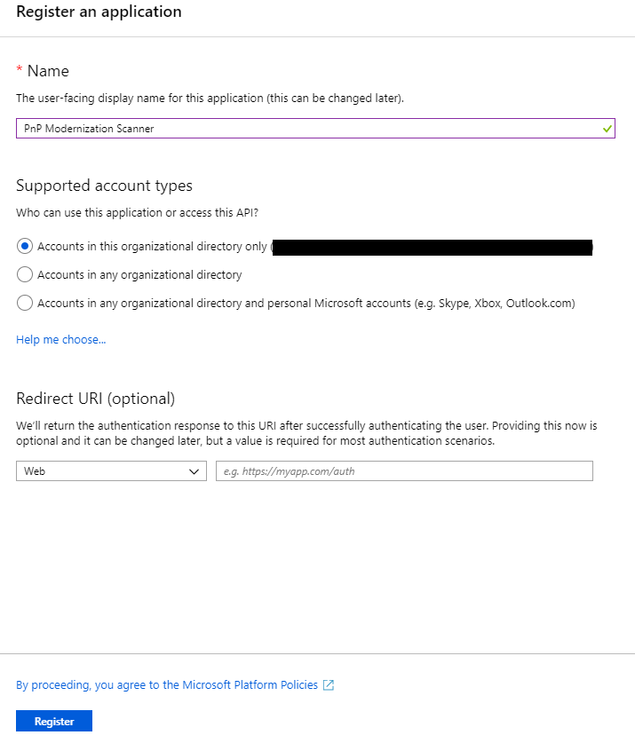

# Granting access via Azure AD App-Only

When using SharePoint Online you can define applications in Azure AD and these applications can be granted permissions to SharePoint, but also to all the other services in Office 365. This model is the preferred model in case you’re using SharePoint Online, if you’re using SharePoint on-premises you have to use the SharePoint Only model via based Azure ACS as described in [here](security-apponly-azureacs.md).

> [!IMPORTANT]
> Azure Access Control (ACS), a service of Azure Active Directory (Azure AD), has been retired on November 7, 2018. This retirement does not impact the SharePoint Add-in model, which uses the `https://accounts.accesscontrol.windows.net` hostname (which is not impacted by this retirement). For more information, see [Impact of Azure Access Control retirement for SharePoint Add-ins](https://developer.microsoft.com/office/blogs/impact-of-azure-access-control-deprecation-for-sharepoint-add-ins).

## Setting up an Azure AD app for app-only access

In Azure AD when doing app-only you typically use a certificate to request access: anyone having the certificate and its private key can use the app and the permissions granted to the app. Below steps walk you through the setup of this model.

You are now ready to configure the Azure AD Application for invoking SharePoint Online with an App Only access token. To do that, you have to create and configure a self-signed X.509 certificate, which will be used to authenticate your Application against Azure AD, while requesting the App Only access token. First you must create the self-signed X.509 Certificate, which can be created using the makecert.exe tool that is available in the Windows SDK or through a provided PowerShell script which does not have a dependency to makecert. Using the PowerShell script is the preferred method and is explained in this chapter.

> [!IMPORTANT]
> It's important that you run the below scripts with Administrator privileges.

To create a self signed certificate with this script:

```powershell
.\Create-SelfSignedCertificate.ps1 -CommonName "MyCompanyName" -StartDate 2017-10-01 -EndDate 2019-10-01
```

> [!NOTE]
> The dates are provided in ISO date format: YYYY-MM-dd

The actual script can be copied from here:

```powershell
#Requires -RunAsAdministrator
<#
.SYNOPSIS
Creates a Self Signed Certificate for use in server to server authentication
.DESCRIPTION
.EXAMPLE
PS C:\> .\Create-SelfSignedCertificate.ps1 -CommonName "MyCert" -StartDate 2015-11-21 -EndDate 2017-11-21
This will create a new self signed certificate with the common name "CN=MyCert". During creation you will be asked to provide a password to protect the private key.
.EXAMPLE
PS C:\> .\Create-SelfSignedCertificate.ps1 -CommonName "MyCert" -StartDate 2015-11-21 -EndDate 2017-11-21 -Password (ConvertTo-SecureString -String "MyPassword" -AsPlainText -Force)
This will create a new self signed certificate with the common name "CN=MyCert". The password as specified in the Password parameter will be used to protect the private key
.EXAMPLE
PS C:\> .\Create-SelfSignedCertificate.ps1 -CommonName "MyCert" -StartDate 2015-11-21 -EndDate 2017-11-21 -Force
This will create a new self signed certificate with the common name "CN=MyCert". During creation you will be asked to provide a password to protect the private key. If there is already a certificate with the common name you specified, it will be removed first.
#>
Param(

   [Parameter(Mandatory=$true)]
   [string]$CommonName,

   [Parameter(Mandatory=$true)]
   [DateTime]$StartDate,

   [Parameter(Mandatory=$true)]
   [DateTime]$EndDate,

   [Parameter(Mandatory=$false, HelpMessage="Will overwrite existing certificates")]
   [Switch]$Force,

   [Parameter(Mandatory=$false)]
   [SecureString]$Password
)

# DO NOT MODIFY BELOW

function CreateSelfSignedCertificate(){

    #Remove and existing certificates with the same common name from personal and root stores
    #Need to be very wary of this as could break something
    if($CommonName.ToLower().StartsWith("cn="))
    {
        # Remove CN from common name
        $CommonName = $CommonName.Substring(3)
    }
    $certs = Get-ChildItem -Path Cert:\LocalMachine\my | Where-Object{$_.Subject -eq "CN=$CommonName"}
    if($certs -ne $null -and $certs.Length -gt 0)
    {
        if($Force)
        {

            foreach($c in $certs)
            {
                remove-item $c.PSPath
            }
        } else {
            Write-Host -ForegroundColor Red "One or more certificates with the same common name (CN=$CommonName) are already located in the local certificate store. Use -Force to remove them";
            return $false
        }
    }

    $name = new-object -com "X509Enrollment.CX500DistinguishedName.1"
    $name.Encode("CN=$CommonName", 0)

    $key = new-object -com "X509Enrollment.CX509PrivateKey.1"
    $key.ProviderName = "Microsoft RSA SChannel Cryptographic Provider"
    $key.KeySpec = 1
    $key.Length = 2048
    $key.SecurityDescriptor = "D:PAI(A;;0xd01f01ff;;;SY)(A;;0xd01f01ff;;;BA)(A;;0x80120089;;;NS)"
    $key.MachineContext = 1
    $key.ExportPolicy = 1 # This is required to allow the private key to be exported
    $key.Create()

    $serverauthoid = new-object -com "X509Enrollment.CObjectId.1"
    $serverauthoid.InitializeFromValue("1.3.6.1.5.5.7.3.1") # Server Authentication
    $ekuoids = new-object -com "X509Enrollment.CObjectIds.1"
    $ekuoids.add($serverauthoid)
    $ekuext = new-object -com "X509Enrollment.CX509ExtensionEnhancedKeyUsage.1"
    $ekuext.InitializeEncode($ekuoids)

    $cert = new-object -com "X509Enrollment.CX509CertificateRequestCertificate.1"
    $cert.InitializeFromPrivateKey(2, $key, "")
    $cert.Subject = $name
    $cert.Issuer = $cert.Subject
    $cert.NotBefore = $StartDate
    $cert.NotAfter = $EndDate
    $cert.X509Extensions.Add($ekuext)
    $cert.Encode()

    $enrollment = new-object -com "X509Enrollment.CX509Enrollment.1"
    $enrollment.InitializeFromRequest($cert)
    $certdata = $enrollment.CreateRequest(0)
    $enrollment.InstallResponse(2, $certdata, 0, "")
    return $true
}

function ExportPFXFile()
{
    if($CommonName.ToLower().StartsWith("cn="))
    {
        # Remove CN from common name
        $CommonName = $CommonName.Substring(3)
    }
    if($Password -eq $null)
    {
        $Password = Read-Host -Prompt "Enter Password to protect private key" -AsSecureString
    }
    $cert = Get-ChildItem -Path Cert:\LocalMachine\my | where-object{$_.Subject -eq "CN=$CommonName"}

    Export-PfxCertificate -Cert $cert -Password $Password -FilePath "$($CommonName).pfx"
    Export-Certificate -Cert $cert -Type CERT -FilePath "$CommonName.cer"
}

function RemoveCertsFromStore()
{
    # Once the certificates have been been exported we can safely remove them from the store
    if($CommonName.ToLower().StartsWith("cn="))
    {
        # Remove CN from common name
        $CommonName = $CommonName.Substring(3)
    }
    $certs = Get-ChildItem -Path Cert:\LocalMachine\my | Where-Object{$_.Subject -eq "CN=$CommonName"}
    foreach($c in $certs)
    {
        remove-item $c.PSPath
    }
}

if(CreateSelfSignedCertificate)
{
    ExportPFXFile
    RemoveCertsFromStore
}
```

You will be asked to give a password to encrypt your private key, and both the .PFX file and .CER file will be exported to the current folder.

Next step is registering an Azure AD application in the Azure Active Directory tenant that is linked to your Office 365 tenant. To do that, open the Office 365 Admin Center (https://admin.microsoft.com) using the account of a user member of the Tenant Global Admins group. Click on the "Azure Active Directory" link that is available under the "Admin centers" group in the left-side treeview of the Office 365 Admin Center. In the new browser's tab that will be opened you will find the [Microsoft Azure portal](https://portal.azure.com). If it is the first time that you access the Azure portal with your account, you will have to register a new Azure subscription, providing some information and a credit card for any payment need. But don't worry, in order to play with Azure AD and to register an Office 365 Application you will not pay anything. In fact, those are free capabilities. Once having access to the Azure portal, select the "Azure Active Directory" section and choose the option "App registrations". See the next figure for further details.


In the "App registrations" tab you will find the list of Azure AD applications registered in your tenant. Click the "New registration" button in the upper left part of the blade. Next, provide a name for your application and click on "Register" at the bottom of the blade.



> [!IMPORTANT]
> Once the application has been created copy the "Application (client) ID" as you’ll need it later.

Now click on "API permissions" in the left menu bar, and click on the "Add a permission" button. A new blade will appear. Here you choose the permissions that you will grant to this application. Choose i.e.:

- SharePoint
	- Application permissions
		- Sites
			- Sites.FullControl.All

Click on the blue "Add permissions" button at the bottom to add the permissions to your application. The "Application permissions" are those granted to the application when running as App Only.


Final step is “connecting” the certificate we created earlier to the application. Click on "Certificates & secrets" in the left menu bar. Click on the "Upload certificate" button, select the .CER file you generated earlier and click on "Add" to upload it.

To confirm that the certificate was successfully registered, click on "Manifest" in the left menu bar. Search for the **keyCredentials** property. It should look like:

```JSON
  "keyCredentials": [
    {
      "customKeyIdentifier": "<$base64CertHash>",
      "endDate": "2021-05-01T00:00:00Z",
      "keyId": "<$guid>",
      "startDate": "2019-05-01T00:00:00Z",
      "type": "AsymmetricX509Cert",
      "usage": "Verify",
      "value": "<$base64Cert>",
      "displayName": "CN=<$name of your cert>"
     }
  ],
```

If you see a section looking somewhat similar to this, the certificate has been added successfully.

In this sample the Sites.FullControl.All application permission require admin consent in a tenant before it can be used. In order to do this, click on "API permissions" in the left menu again. At the bottom you will see a section "Grant consent". Click on the "Grant admin consent for {{organization name}}" button and confirm the action by clicking on the "Yes" button that appears at the top.


## Using this principal with PnP PowerShell

If you want to use this AAD App Only principal with [PnP PowerShell](https://github.com/SharePoint/PnP-PowerShell), after you have installed the PnP PowerShell module, you can connect to your SharePoint Online environment using:

```powershell
Connect-PnPOnline -ClientId <$application client id as copied over from the AAD app registration above> -CertificatePath '<$path to the PFX file generated by the PowerShell script above>' -CertificatePassword (ConvertTo-SecureString -AsPlainText "<$password assigned to the generated certificate pair above>" -Force) -Url https://<$yourtenant>.sharepoint.com -Tenant "<$tenantname>.onmicrosoft.com"
```

You can now perform operations through PnP PowerShell against your SharePoint Online environment using this certificate App Only trust.

[!INCLUDE [pnp-powershell](../../includes/snippets/open-source/pnp-powershell.md)]

## Using this principal in your application using the SharePoint PnP Sites Core library

In a first step, you add the PnP Framework library NuGet package: https://www.nuget.org/packages/PnP.Framework.

Once that’s done you can use below code construct:

```csharp
using PnP.Framework;
using System;

namespace AzureADCertAuth
{
    class Program
    {
        static void Main(string[] args)
        {
            var authManager = new AuthenticationManager("<application id>", "c:\\temp\\mycert.pfx", "<password>", "contoso.onmicrosoft.com");
            using (var cc = authManager.GetAzureADAppOnlyAuthenticatedContext("https://contoso.sharepoint.com/sites/demo"))
            {
                cc.Load(cc.Web, p => p.Title);
                cc.ExecuteQuery();
                Console.WriteLine(cc.Web.Title);
            };
        }
    }
}
```

[!INCLUDE [pnp-sites-core](../../includes/snippets/open-source/pnp-sites-core.md)]

## Using this principal in your Powershell script using the PnP Sites core library

When making use of Azure Automation Runbooks, first add the certificate (.pfx) using the Certificates option (under Shared Resources), then use the Get-AutomationCertificate cmdlet to retrieve the certificate to be used in the script.

> [!NOTE]
> You need to add the SharePointPnPPowerShellOnline module to your Automation Account first. This module contains the OfficeDevPnP.Core.dll assembly needed to make the authentication call.

```powershell
# path to installed modules
$path = "C:\Modules\User\SharePointPnPPowerShellOnline"

# reference to needed assemblies
Add-Type -Path "$path\Microsoft.SharePoint.Client.dll"
Add-Type -Path "$path\Microsoft.SharePoint.Client.Runtime.dll"
Add-Type -Path "$path\OfficeDevPnP.Core.dll"

# reference to the certificate
$cert = Get-AutomationCertificate -Name 'NameOfCertificate'

# set the variables
$siteUrl = "https://<tenant>.sharepoint.com"
$appId = "<guid of the App>"
$domain = "<tenant>.onmicrosoft.com"
$azureEnv = [OfficeDevPnP.Core.AzureEnvironment]::Production

# instantiate the objects
$clientContext = new-object Microsoft.SharePoint.Client.ClientContext($siteUrl)
$authManager = new-object OfficeDevPnP.Core.AuthenticationManager

# configure the object
$clientContext = $authManager.GetAzureADAppOnlyAuthenticatedContext($siteUrl, $appId, $domain, $cert, $azureEnv)

# do some stuff
$clientContext.Load($clientContext.Web)
$clientContext.ExecuteQuery()
$clientContext.Web.Title
```

## Using this principal in your application and make use of the Azure KeyVault to store the certificate and retrieve it using an Azure Function

Add a [Managed Identity](/azure/app-service/overview-managed-identity
) to the Azure Function and give this identity access (GET permission on Secrets) to the [KeyVault](/azure/app-service/app-service-key-vault-references).

Below there is a slightly different call to the same GetAzureADAppOnlyAuthenticatedContext method where we pass an actual certificate instead of a path to the certificate. An extra function is added to retrieve to certificate from the KeyVault using the managed identity of the Azure Function, this retrieval is seamless and transparent since the 'magic' happens in the AzureServiceTokenProvider.

```csharp
static void Main(string[] args)
{
	using (var cc = new AuthenticationManager().GetAzureADAppOnlyAuthenticatedContext(
		siteUrl,
		ApplicationId,
		tenant + ".onmicrosoft.com",
		GetKeyVaultCertificate("kv-spo", "AzureAutomationSPOAccess")))
	    {
		cc.Load(cc.Web, p => p.Title);
		cc.ExecuteQuery();
		log.Info("Via PnP, we have site: " + cc.Web.Title);
	    };
}


internal static X509Certificate2 GetKeyVaultCertificate(string keyvaultName, string name)
{
    // Some steps need to be taken to make this work
    // 1. Create a KeyVault and upload the certificate
    // 2. Give the Function App the permission to GET certificates via Access Policies in the KeyVault
    // 3. Call an explicit access token request to the management resource to https://vault.azure.net and use the URL of our Keyvault in the GetSecretMethod
    if (keyVaultClient == null)
    {
        // this token provider gets the appid/secret from the azure function identity
        // and thus makes the call on behalf of that appid/secret
        var serviceTokenProvider = new AzureServiceTokenProvider();
        keyVaultClient = new KeyVaultClient(new KeyVaultClient.AuthenticationCallback(serviceTokenProvider.KeyVaultTokenCallback));
    }

    // Getting the certificate
    var secret = keyVaultClient.GetSecretAsync("https://" + keyvaultName + ".vault.azure.net/", name);

    // Returning the certificate
    return new X509Certificate2(Convert.FromBase64String(secret.Result.Value));

    // If you receive the following error when running the Function;
    // Microsoft.Azure.WebJobs.Host.FunctionInvocationException:
    // Exception while executing function: NotificationFunctions.QueueOperation--->
    // System.Security.Cryptography.CryptographicException:
    // The system cannot find the file specified.at System.Security.Cryptography.NCryptNative.ImportKey(SafeNCryptProviderHandle provider, Byte[] keyBlob, String format) at System.Security.Cryptography.CngKey.Import(Byte[] keyBlob, CngKeyBlobFormat format, CngProvider provider)
    //
    // Please see https://stackoverflow.com/questions/31685278/create-a-self-signed-certificate-in-net-using-an-azure-web-application-asp-ne
    // Add the following Application setting to the AF "WEBSITE_LOAD_USER_PROFILE = 1"
}


```

## Using this principal with the Pnp Modernization Scanner

Now you have created the Azure Active Directory Application Registration, proceed with [following the steps here](../transform/modernize-scanner.md) to use this principal with the tool.

## FAQ

### Can I use other means besides certificates for realizing app-only access for my Azure AD app?

No, all other options are blocked by SharePoint Online and will result in an Access Denied message.

