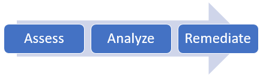

# Introduction
Most of the SharePoint Online tenants handles the file open experience using the **strict** model. As a result, all files which can potentially cause harm (e.g. a html file having embedded script) are not executed in the browser but downloaded or shown as raw content (html preview in the modern user experience). If your tenant is configured using the **permissive** model then the file open experience will execute the file, for example a html file in a document library does get executed and page is shown in the browser. In strict this file would be downloaded.

Today the default setting is strict, and you already cannot switch your tenant to the permissive model. For tenants that switched to permissive in the past things will change: the tenant permissive model will be deprecated, at that point all tenants will be switched to strict.


# Is my tenant impacted?
The recommended approach to check this is by checking the PermissiveBrowserFileHandlingOverride setting using [Office 365 PowerShell for SharePoint Online](https://technet.microsoft.com/en-us/library/fp161362.aspx):

```PowerShell
Connect-SPOService -url https://contoso-admin.sharepoint.com
$tenant = get-spotenant
$tenant.PermissiveBrowserFileHandlingOverride
```

If this results in **False** then your tenant is not impacted, if this is set to **True** then you need prepare for the upcoming deprecation. 

# How can I prepare for changing permissive into strict?



## Step 1: Assess the impact
Understanding which files are impacted is a first step and you can do that via the permissive file scanner. See the [SharePoint Permissive Scanner](https://github.com/SharePoint/PnP-Tools/tree/master/Solutions/SharePoint.PermissiveFile.Scanner) to learn more about the scanner and how to use it. In the default configuration this scanner searches for html/html files, but using the command line options you can request the scanner to search for additional filetypes.

The result of the scanner is CSV file listing all the impacted (html/htm + optional other file types) files, including information about the html/htm files (number of links and scripts that are used).

## Step 2: Analyze the scan results
Once you’ve the list of impacted files you need to assess which if these files and the sites holding these files are still business relevant. The file and/or site might be stale and if so remediation of those files/sites might be skipped. To help you with understanding the business need the report contains the site collection admins and site owners, providing you the needed information to contact them.

## Step 3: Remediate the files
If the files are still important and you’ll want to continue to be able to execute the files once the tenant has moved to the strict setting you’ll need to remediate the files, as explained in the next chapters. 

# Remediation process for html/htm files
The main reason for customers sticking with permissive mode is because they want to be able to use html files from inside a document library. As mentioned before once moved to strict these files will simply download and not automatically open anymore.
For these html/html files the remediation is simple: if a user/app with site owner or site collection admin permissions renames the html/htm files to ASPX files then these files do open again. Below [SharePoint PnP PowerShell](https://aka.ms/sppnp-powershell) shows a how this can be done. Assume you’ve a html file with following url: https://contoso.sharepoint.com/sites/permissive/html/newfile.html. 

```PowerShell
Connect-PnPOnline -Url https://contoso.sharepoint.com/sites/permissive -Verbose
Rename-PnPFile -ServerRelativeUrl /sites/permissive/html/newfile.html -TargetFileName newfile.aspx -OverwriteIfAlreadyExists
```

## Who can perform this rename?
The rename must be performed by users having the AddAndCustomizePages (ACP) permission, which by default is granted to site collection administrators or site owners. If the rename is done by a user with Edit the permission level (so site members) then the rename is done, but the resulting .aspx file is not marked for execution and as such will be downloaded and not executed. 

When you want to do a bulk rename you most likely will use an app principal instead of a user account and there the same applies: the app principal needs the ACP permission (e.g. Full Control permission level) to make this work.

## What about embedded links to other html/htm files?
My html/htm files link to other html/htm files in the same folder or in a subfolder…will these links break if the files are renamed to aspx? If the underlying rename is done using the MoveTo API call then most of the relative links inside the html file are automatically fixed to be links to aspx files…essentially renaming a structure of nested html/htm files which link to each other can be done by only renaming the actual files, all the links inside the documents will be handled by the rename.

> [!NOTE]
> The automatic renaming will not work when the html document has links pointing to files in another site collection or when the links are dynamically generated using JavaScript. In those cases, manual actions are required to fixup the links.

## What about sites having the “noscript” feature enabled
All “modern” sites (modern team site, communication site) have the “noscript” feature turned on by default. The result of this is that no one will have the AddAndCustomizePages (ACP) permission, so no one can perform a successful rename from html/htm to aspx. Typically, the html/htm files live in (migrated) classic team sites so this problem is not there. In the case you are working in a “noscript” site you’ll need to first turn off the “noscript” feature, perform the renames and then turn on “noscript” again. As a result the html/htm files can be executed again, but do note that each change on these files will mark them as non-executable again. Turning off “noscript” again and updating the file will handle this.

## In the modern document library experience the aspx file initially do not seem to open?
The modern document library experience “assumes” a certain file type when the file was added and when accessing the file for the first time you’ll see that aspx files are opened wrongly. Second attempt however does execute the file. The avoid this problem it’s recommended to programmatically pull down each renamed file once, which gives SharePoint the opportunity to correctly set the file type. Below [SharePoint PnP PowerShell](https://aka.ms/sppnp-powershell) shows a how this can be done:

```PowerShell
Connect-PnPOnline -Url https://contoso.sharepoint.com/sites/permissive -Verbose
Get-PnPFile -Url /sites/permissive/html/newfile.aspx -Path c:\temp -Filename newfile.aspx -AsFile
```

# Remediation of other file types
Html/htm files are the major reason for customers to use the permissive mode but what about other file types? For the many common file formats SharePoint Online does offer a preview capability as explained in this [blog](https://techcommunity.microsoft.com/t5/OneDrive-for-Business/Announcing-New-File-Viewers-Available-for-OneDrive-For-Business/td-p/60040). SharePoint Online can preview the following formats:

## Documents
csv, doc, docm, docx, dotx, eml, msg, odp, ods, odt, pdf, pot, potm, potx, pps, ppsx, ppt, pptm, pptx, rtf, vsd, vsdx, xls, xlsb, xlsm, xlsx

## Images
ai, arw, bmp, cr2, eps, erf, gif, ico, icon, jpeg, jpg, mrw, nef, orf, pict, png, psd, tif, tiff

## Video
3gp, m4v, mov, mp4, wmv

## 3D
3mf, fbx, obj, ply, stl

## Medical
dcm, dcm30, dic, dicm, dicom

## Text and code
abap, ada, adp, ahk, as, as3, asc, ascx, asm, asp, awk, bash, bash_login, bash_logout, bash_profile, bashrc, bat, bib, bsh, build, builder, c, c++, capfile, cc, cfc, cfm, cfml, cl, clj, cls, cmake, cmd, coffee, cpp, cpt, cpy, cs, cshtml, cson, csproj, css, ctp, cxx, d, ddl, di, dif, diff, disco, dml, dtd, dtml, el, emakefile, erb, erl, f, f90, f95, fs, fsi, fsscript, fsx, gemfile, gemspec, gitconfig, go, groovy, gvy, h, h++, haml, handlebars, hbs, hcp, hh, hpp, hrl, hs, htc, hxx, idl, iim, inc, inf, ini, inl, ipp, irbrc, jade, jav, java, js, jsp, jsx, l, less, lhs, lisp, log, lst, ltx, lua, m, make, markdn, markdown, md, mdown, mkdn, ml, mli, mll, mly, mm, mud, nfo, opml, osascript, out, p, pas, patch, php, php2, php3, php4, php5, phtml, pl, plist, pm, pod, pp, profile, properties, ps1, pt, py, pyw, r, rake, rb, rbx, rc, re, readme, reg, rest, resw, resx, rhtml, rjs, rprofile, rpy, rss, rst, rxml, s, sass, scala, scm, sconscript, sconstruct, script, scss, sgml, sh, shtml, sml, sql, sty, tcl, tex, text, textile, tld, tli, tmpl, tpl, txt, vb, vi, vim, wsdl, xhtml, xml, xoml, xsd, xsl, xslt, yaml, yaws, yml, zip, zsh


