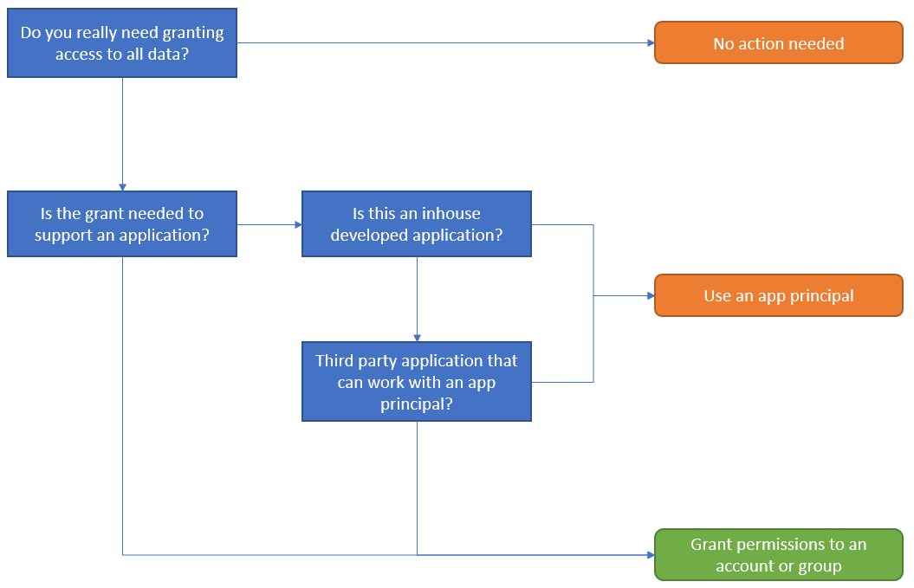
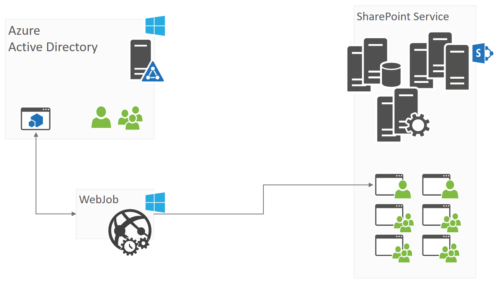

# Alternative model for web app policies in SharePoint Online

Web app policies are a concept that allows SharePoint administrators to either grant or deny permissions to users and groups for all sites under a web application. These permission grants and denies take preference over the permissions set at the sites in the web application and therefore are a mechanism typically used in scenarios like these:
 - Grant a service account permissions to all the sites because that service account is used to run a background process that needs to manipulate the data in all sites
 - Grant support team read-only access to all sites so the support engineer can walk through the site with the end user
 - Deny users (e.g. after leaving the company) access to all content

Web application policies do not exist anymore in SharePoint Online and there’s no identical alternative implementation possible, however by using the existing SharePoint security model you can achieve similar results. In this article, you’ll learn more about this.

## Granting access

### What’s the business reason for this permission grant?
Before starting to implement permissions grants it’s important to understand why a grant was needed. Questions to ask yourselves are:
 - Is granting access to **all** data in your SharePoint Online tenant necessary? Push back and verify that the access to **all** data is an absolute must to support a business scenario
 - Is the “one” using the granted permission an application or a user? If it’s an application then it might be possible to work with an app principal having SharePoint Online tenant wide permissions, especially if this is an inhouse developed application

Below flowchart is capturing these questions:



> [!IMPORTANT]
>Only in the case the granted access will be consumed by a user or an application that is not compatible with app principals should you grant access via users or groups. If possible, prefer app principals above users and groups because:
> - App principals are granted with scope all sites, meaning if a site gets added the app principal automatically has access to it as well. In case of user/group access the respective user/group first needs to be added to the new site
> - App principals “override” permission inheritance setting. Suppose a sub site has broken permission inheritance and as such granting a user/group owner, contribute or view access to the root site does grant access to the sub site while the app principal will always have access.

### Granting access using app principals
For all non-human access, it’s advisable to use app principals as discussed previously. There are two approaches for doing so: 
 - Using an Azure AD application: this is the preferred method when using SharePoint Online because you can also grant permissions to other Office 365 services (if needed) + you’ve a user interface (Azure management portal) to maintain your app principals.
 - Using a SharePoint App-Only principal: this method is older and only works for SharePoint access, but is still relevant. This method is also the recommended model when you’re still working in SharePoint on-premises since this model works in both SharePoint on-premises as SharePoint Online.

Both models are explained in detail in the [Accessing SharePoint using an application context, also known as app-only](https://docs.microsoft.com/en-us/sharepoint/dev/solution-guidance/security-apponly) article.

### Granting access via users and groups
When you want to grant access to all your sites you’ll need to grant either a user or a group access to all sites individually. This model is different than what you used to have with web app policies, but it’s the only model that you can use to grant a user account or group access to all sites. 

#### Permissions that can be granted
Using web app policies, you’ve the option to either grant “Full Control” or “Full Read”, which translated into SharePoint permissions comes down to this:

|**Web App policy grant**|**Equivalent SharePoint permission**|
|:-----|:-----|
| Full Control | Add to site collection administrators
| Full Read | Add using “Read” permission level (= site visitors)
| | Add using “Full Control” permission level (= site owners)
| | Add using “Edit” permission level (= site members)

We deliberately opted to use the site collection administrator role for the “Full control” grant because this way we avoid the permission inheritance problem. In SharePoint users can break permission inheritance and as such grant unique permissions on objects (e.g. sub sites, lists, list items). If that was done and you for example add a user to the site collection site owners group, then that user would not have permissions on the object with unique permissions.

> [!IMPORTANT]
>If the business scenario you’re implementing can live with the permission inheritance limitations, then you can use any of the described SharePoint permissions. If you need to guarantee 100% sure access on all content, then the only good SharePoint permission is the site collection administrator role.

#### Granting by adding a user or a group?
You can achieve the same result by either granting the permissions to a user or a group, but both models have pro’s and con’s.

| |**Group**|**User**|
|:-----|:-----|:-----|
| Clarity | A group can contain on or more accounts, typically not visible to the other site collection administrators | User account is always visible, there’s no doubt about it
| Maintenance | You can easily grant access by adding new members to the group | New members must be added to all sites
| Tamper proof | A group can shield the actual accounts having access (e.g. legal account) and other admins are less likely to remove the permissions for the group | There’s full transparency, other admins might be more likely to remove the “weird” users from their site

> [!IMPORTANT]
> Granting permissions using a group is a more flexible model.

#### What about modern team sites (a.k.a. group sites)?
Modern team sites are SharePoint team sites which are connected to an Office 365 group. This Office 365 group acts as a central model for granting access to all the services on top of that group (e.g. SharePoint Site, Exchange mailbox, Planner, …). For these sites, you do have 2 options for granting access:
 - Add user accounts (no groups) to either the members or owners of the Office 365 group connected to the modern team site. The advantage of this approach is that the granted permission applies to all services that use this group, but when evaluating web app policies this typically is not relevant
 - Treat the modern team site like a “normal” site and grant permission like described in earlier chapters

> [!IMPORTANT]
> We recommend granting permissions at SharePoint level, so threat the modern team sites like regular classic SharePoint team sites. This approach aligns with what the web application policies were providing.

#### Granting permissions using PnP PowerShell
Below scripts show an easy way to grant access via using PnP PowerShell and they can be a good starting basis for your implementation. Below scripts do not take in account the following:
 - Get-PnPTenantSite is currently not enumerating modern team sites
 - Get-PnPTenantSite is not Multi-Geo aware
 - Performance is not optimal since the scripts are sequentially running, there’s no parallel execution

Since users continuously create new site collections it’s important to run these scripts on regular basis, ideally as a scheduled task.

> [!IMPORTANT]
> If your tenant has a lot of site collections, then the approach using a custom developed application is a better solution for you.

##### Full Control
To give users full control to specific (or all) SharePoint sites, you can use SharePoint PowerShell to make the target users Site Collection admins of the target sites (including all). This can be done by a Global administrator or SharePoint Service administrator.
It is recommended that access be added on an as-needed basis, and then removed. For example, the script below assigns a list of administrators to all site collections in a tenant. The example uses the [SharePoint Patterns and Practices (PnP) of PowerShell commands](http://aka.ms/sppnp-powershell) to make two users admins of all site collections in the tenant.

```PowerShell
# comma separated list of users and groups to be added
$adminAccounts = "admin1@contoso.onmicrosoft.com","admin21@contoso.onmicrosoft.com"

# Specify the tenant here
$tenant = "contoso"

# Note: This example assumes that you are managing your credentials in Windows as documented here:
# https://github.com/SharePoint/PnP-PowerShell/wiki/How-to-use-the-Windows-Credential-Manager-to-ease-authentication-with-PnP-PowerShell
write-host "Connecting to https://$($tenant)-admin.sharepoint.com"
Connect-PnPOnline -Url "https://$($tenant)-admin.sharepoint.com"


#Note: we are only fetching the root site collection and any site collection in the /sites path
#Update filters here accordingly to match your requirements
write-host "Getting list of site collections"
$sitecollections = Get-PnPTenantSite | where {($_.Url -like "*$($tenant).sharepoint.com/") -or ($_.Url -like "*$($tenant).sharepoint.com/sites/*")}
foreach($sitecollection in $sitecollections) {
    write-host "Adding administrators to $($sitecollection.Url)"
    Set-PnPTenantSite -Url $sitecollection.Url -Owners $adminAccounts
}
```

##### Full Read
To give users full read to specific (or all) SharePoint sites, you can use SharePoint PowerShell to add the target users to a site collection Read Role. This can be done by a Global administrator or SharePoint Service administrator.
The general steps include defining a SharePoint Read Role for the site collection, or reuse an existing one, and then assigning users or groups to the Role. To use Azure AD groups, including those with dynamic membership, to control access to resources refer to: [Manage access to resources with Azure Active Directory groups](https://docs.microsoft.com/en-us/azure/active-directory/active-directory-manage-groups#https%3A%2F%2Fchannel9.msdn.com%2FSeries%2FAzure-Active-Directory-Videos-Demos%2FAzure-AD--Introduction-to-Dynamic-Memberships-for-Groups%2Fplayer). 
The example uses the [SharePoint Patterns and Practices (PnP) of PowerShell commands](http://aka.ms/sppnp-powershell) to create a new Read Role for all site collections in the tenant.

```PowerShell
# Specify the tenant here
$tenant = "contoso"

# Note: This example assumes that you are managing your credentials in Windows as documented here:
# https://github.com/SharePoint/PnP-PowerShell/wiki/How-to-use-the-Windows-Credential-Manager-to-ease-authentication-with-PnP-PowerShell
write-host "Connecting to https://$($tenant)-admin.sharepoint.com"
Connect-PnPOnline -Url "https://$($tenant)-admin.sharepoint.com"

# Note: we are only fetching the root site collection and any site collection in the /sites/ path
# Update filters here accordingly to match your requirements
write-host "Getting list of site collections"
$sitecollections = Get-PnPTenantSite | where {($_.Url -like "*$($tenant).sharepoint.com/") -or ($_.Url -like "*$($tenant).sharepoint.com/sites/*")}
foreach($sitecollection in $sitecollections) {
    write-host "Set FullRead for MyGroup to $($sitecollection.Url)" 
    Connect-PnPOnline -Url $($sitecollection.Url)
    New-PnPGroup -Title 'FullReader' 
    Set-PnPGroupPermissions -Identity 'FullReader' -RemoveRole 'Full Control' -AddRole 'Read'
}
```

#### Granting permissions using a custom developed application
An alternative model for the PowerShell approach is creating a background application that enumerates all site collections (including modern team sites, OneDrive for Business sites, across locations when using Multi-Geo), checks if the needed user/group has access and if not adds that one. The architecture of such an application could be as simple as the one defined below:
1. You start with defining an application in Azure AD for which you setup app-only usage (see “[Setting up an Azure AD app for app-only access](https://docs.microsoft.com/en-us/sharepoint/dev/solution-guidance/security-apponly-azuread)”) and grant full control on all site collections
2. You create a C# application that authorizes itself using the Azure AD application you’ve defined in step 1 and iterates over all the site collections (this can include OD4B site collections) to add the needed accounts/groups if they’re not present
3. This C# application then needs to be hosted and scheduled to run on regular intervals. Using an Azure web job is a good model for doing so, but the same could be done by running the application as a scheduled task on a server



As part of this guidance we’ve created an application to get you started with this. The sample is called [Governance.EnsurePolicy](https://github.com/SharePoint/PnP/tree/master/Solutions/Governance.EnsurePolicy) and can be in the SharePoint PnP repository.

> [!NOTE]
> This scenario could be further expanded into an application that conditionally grants and removes permissions. For example, helpdesk employees could request access for a given site via creating a SharePoint list item, the application sees this and grants access for x hours…and removes the permissions later. This application also keeps a log showing who was granted access to which site and when.

## Denying access
### Replace Deny All Policy Using Office 365 and SharePoint Access Controls
There is no "Deny All" policy in Office 365, rather our recommended approach is to manage the permissions using O365 SharePoint access control policies. The landscape needs to include Users, Apps, and Devices. Some of these access control policies are described below.

To block specific users from accessing Office 365 resources, including SharePoint, follow the instructions outlined here: [Remove a former employee from Office 365](https://support.office.com/en-us/article/Remove-a-former-employee-from-Office-365-44d96212-4d90-4027-9aa9-a95eddb367d1). For example, to cut off access to an employee who has left the organization. This can be done by a Global administrator or user management administrator using the Office 365 Admin center or scripted using PowerShell.

To limit external sharing so that vendors, clients, or customers have access only to specific resources, follow the guidance here: [Manage external sharing for your SharePoint Online environment](https://support.office.com/en-us/article/Manage-external-sharing-for-your-SharePoint-Online-environment-c8a462eb-0723-4b0b-8d0a-70feafe4be85). For example, you can configure a SharePoint Online extranet site focused on external collaboration. 

To block or allow sharing with external users from specific domains at the tenant or site collection level, follow the instructions here: [Restricted domains sharing in SharePoint Online and OneDrive for Business](https://support.office.com/en-us/article/Restricted-domains-sharing-in-SharePoint-Online-and-OneDrive-for-Business-5d7589cd-0997-4a00-a2ba-2320ec49c4e9?ui=en-US&rs=en-US&ad=US). For example, to limit sharing with only specific business partners at well-known domains. This can be configured by a Global administrator or SharePoint Service administrator. 

With Office 365 Security and Compliance Center you can use the Auditing features to track file activity. Learn more with the following articles: 
 - Auditing of all your SharePoint site collections using the Office 365 Security and Compliance center: [Search the audit log in the Office 365 Security & Compliance Center](https://support.office.com/en-us/article/Search-the-audit-log-in-the-Office-365-Security-Compliance-Center-0d4d0f35-390b-4518-800e-0c7ec95e946c?ui=en-US&rs=en-US&ad=US). This approach gives you auditing of all your sites, a flexible reporting model and you can use [API’s to do custom processing of the audit data](https://msdn.microsoft.com/en-us/office-365/office-365-management-activity-api-reference).
 - Use [Office 365 Cloud App Security](https://support.office.com/en-us/article/Overview-of-Office-365-Cloud-App-Security-81f0ee9a-9645-45ab-ba56-de9cbccab475): Office 365 Cloud App Security gives you insight into suspicious activity in Office 365 so you can investigate situations that are potentially problematic and, if needed, take action to address security issues. With Office 365 Cloud App Security, you can do all of the following:
	- See how your organization's data in Office 365 is accessed and used
	- Define policies that trigger alerts for atypical or suspicious activities
	- Suspend user accounts exhibiting suspicious activity
	- Require users to log back in to Office 365 apps after an alert has been triggered

With Office 365 Security and Compliance Center, you can also block external sharing of sensitive documents by defining what sensitive types are in your organization (pick from one of the many templates or create your own custom sensitive types). Learn about built-in sensitive types here: Sensitive Information Types. Learn about creating your own here: [Create Custom Sensitive Information Types](https://support.office.com/en-us/article/Create-a-custom-sensitive-information-type-82c382a5-b6db-44fd-995d-b333b3c7fc30). 

To use Azure AD groups, including those with dynamic membership, to control access to resources refer to: [Manage access to resources with Azure Active Directory groups](https://docs.microsoft.com/en-us/azure/active-directory/active-directory-manage-groups#https%3A%2F%2Fchannel9.msdn.com%2FSeries%2FAzure-Active-Directory-Videos-Demos%2FAzure-AD--Introduction-to-Dynamic-Memberships-for-Groups%2Fplayer). For example, groups can be configured to remove members whose account is not enabled. In addition, [Azure Active Directory Identity Protection](https://docs.microsoft.com/en-us/azure/active-directory/active-directory-identityprotection) (part of Azure AD Premium) allows admins to identify risky sign-ins and either block or require multi-factor authentication.

To block or limit access on non-compliant or unmanaged devices, functionality is coming soon which takes advantage of [Azure Active Directory conditional access policies](https://docs.microsoft.com/en-us/azure/active-directory/active-directory-conditional-access-azure-portal). Using this policy, you can block access to rich apps on unmanaged devices and allow browser only access without the ability to download, print or sync. This prevents leakage of data on unmanaged devices. This will be configurable by a Global administrator or SharePoint Service administrator.

To block access on untrusted network locations, you can use location-based policy to configure a list of trusted IP addresses from which access is allowed. Follow the instructions here: [Control Access to SharePoint and OneDrive Based on Network Locations](https://support.office.com/en-us/article/Control-access-to-SharePoint-Online-and-OneDrive-data-based-on-defined-network-locations-b5a5f1f1-1174-4c6b-91d0-9273a6b6971f).


