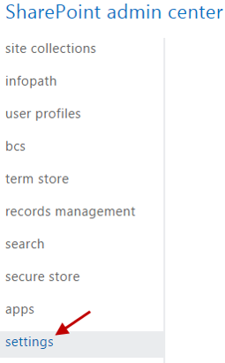

Site provisioning in the SharePoint Add-in model
================================================

Summary
-------

The approach you take to provision site collections and sub sites is different in the new SharePoint Add-in model, compared to how it was in Full Trust Code. In a typical Full Trust Code (FTC) / Farm Solution scenario, you would create site collections and sub sites with the site definitions and web templates and then use declarative code to configure the sites and apply customizations. In this model, you would typically use declarative code to create site columns, content types, and lists defined in XML and then use SharePoint's feature framework elements to package and deploy them.

In an SharePoint Add-in model scenario, you can use the SharePoint Client Side Object Model (CSOM) to create and configure site collections and sub sites. This pattern is commonly referred to as the *remote provisioning pattern*.

At a high level, the remote provisioning pattern looks like this:

![1) A remote timer job, goes to 2) Initial provisioning based on the out-of-the-box site. Usually either team site or publishing site. Assets are uploaded from the provisioning engine using CSOM/REST. 3) Apply the needed changes (configurations etc.) on top of the out-of-the-box site based on the user selection to create the Project site, Organizational site, or Workgroup site. This is the specialization part, but since we start from OOB site, we always get the latest improvements to it as a base line.](media/Recipes/SiteProvisioning/overview.png)

High Level Guidelines
---------------------

As a rule of a thumb, we recommend the following high-level guidelines for creating site collections and sub sites.

- Provision sites collections and sub sites based on the out-of-the-box site templates that ship with SharePoint.
	+ Use the SharePoint CSOM to create the site collections and sub sites.
- Apply customization and settings to the out-of-the-box site collections and sub sites to meet your requirements.
	+ Use the SharePoint CSOM to apply customization and settings.
- We recommend that you do not use Feature framework elements in the creation of create collections and sub sites.
	+ The only exception to this guideline is when you are using declarative XML-based provisioning to an Add-in web in a SharePoint-hosted SharePoint Add-in. This is because the CSOM is not available in a SharePoint-hosted SharePoint Add-in.

Challenges when creating site collections and sub sites
--------------------------------------------------

**Creating in a web browser vs. Creating with code** 

It is important to understand that creating site collections and sub sites via the web browser and via code are different. This list describes the different options.

- **Creating via a web browser**
	+ In this option, users access a SharePoint site via a web browser and use the Administrative Pages to create site collections and sub sites.
	+ Usually the only time you need to use the web browser is to manually create site collections and sub sites is when you are prototyping or modifying a single SharePoint site that is not planned to grow to include other site collections or sub sites.	
- **Creating with code**
	+ In this option, you would execute SharePoint CSOM code to create site collections and sub sites. 
	+ Later in this article you can read about a few approaches that you could use to execute the SharePoint CSOM code.

When **Creating via a web browser** consider the following points.

- Creating site collections and sub sites via the web browser is typically a complicated and time consuming process.
	+ These factors make creating site collections and sub sites via the web browser **prone to errors**.	
- There is no way to re-create site collections and sub sites (and the components they contain) created via the web browser in a repeatable fashion. 
	+ This makes it **difficult** to quickly and consistently deploy the site collections and sub sites to different environments as you move from development to testing to production.

When **Creating with code**, consider the following points.

- Creating site collections and sub sites with code typically involves using custom utility libraries to execute SharePoint CSOM code.
	+ You'll find these libraries available in many projects in the OfficeDev PnP GitHub Repository. They are referenced throughout the article and at the end.
	+ These factors make creating site collections and sub sites with code **prone to success**.
- You can **easily and consistently replicate** site collections and sub sites (and the components they contain) created via code in a granular fashion.
	+ You can **easily** deploy the site collections and sub sites to different environments and reference them as you move from development to testing to production.

**Must happen quickly!**

End users won't accept having to wait several hours for their new SharePoint sites to be provisioned.

**Must be consistently perfect!**

Site collections and sub sites and the various components they include such as site columns, content types, lists, master pages, JavaScript files, images, etc., are the foundation that define your information architecture, *they must be perfect*!

Incorrect site collection and sub site provisioning can affect an entire line-of-business application in the SharePoint site where they are provisioned as well as other parts of SharePoint and other line-of-business applications that access SharePoint services.

For example: If you have SharePoint sites used to manage projects in your company, you will most likely create a common list scheme for all of them. This will require creating site columns and content types. When you search for information in these sites via the SharePoint search page, you filter the results by content type or tag (site column). If your site columns and content types are not perfectly consistent across all the project sites, you will not receive accurate search results.

This example may also be applied to Content By Search web parts, SharePoint Add-ins, mobile apps, and any other systems that access the information in the SharePoint sites.

Options to create site collections and sub sites
------------------------------------------------

There are several options you can use to create site collections and sub sites with the new SharePoint Add-in model. These options all fall into the **Creating with code** option described above.

- Override the create site link
- Override the create sub site link
- Use a Provider-hosted SharePoint Add-in
- Use .NET/Java/Objective-C applications or PowerShell scripts

Override the create site link
-----------------------------

In this pattern, the link to create a site collection is overridden with a link that points to a Provider-hosted SharePoint Add-in. CSOM code running in a Provider-hosted SharePoint Add-in is executed via the remote provisioning pattern as part of the site creation process.

- The pattern is only used when targeting site collection creation; it is not used to create sub sites.
- The override URL is configured in the SharePoint admin center. This URL points to a Provider-hosted SharePoint Add-in.
- The Provider-hosted SharePoint Add-in uses CSOM APIs to create site collections.
	+ CSOM/REST APIs may also be used to configure other aspects of the site during the provisioning process.
- This approach may be used in Office 365 tenants and in on-premises SharePoint.
- Provides a tremendous amount of flexibility to create and configure SharePoint site collections.
- Easy and inexpensive to implement and maintain in the short and long term.

**Configuration**

To override the create site link open the settings page in the SharePoint admin center (shown below).

Then, check the Use the form at this URL checkbox and enter the URL to the Provider-hosted SharePoint Add-in that implements the site creation functionality (shown below).

Notice SharePoint warns you (in the dialog below) about the security implications associated with this approach and provides you with an option to disable this type of functionality.

**When is it a good fit?**

This option works well when you need to provide your end users with a self-service ability to create SharePoint site collections based on custom templates.

**Getting Started**

The following articles describe the override create site link pattern and provide code samples to get you started.

- [Self-Service Site Provisioning using add-ins for SharePoint 2013 (MSDN Blog)](http://blogs.msdn.com/b/richard_dizeregas_blog/archive/2013/04/04/self-service-site-provisioning-using-apps-for-sharepoint-2013.aspx)
	+ End-to-end article about this pattern with accompanying video.
- [Provisioning.Cloud.Sync (O365 PnP Sample)](https://github.com/SharePoint/PnP/tree/master/Solutions/Provisioning.Cloud.Sync)
	+ This solution shows the model for providing synchronous site collection or sub site creation experience to introduce model for site templates without using actual sandbox solutions or stp files. 

Override the create sub site link
---------------------------------

In this pattern, the link to create a sub site is overridden with a link that points to a Provider-hosted SharePoint Add-in. CSOM code running in a Provider-hosted SharePoint Add-in is executed via the remote provisioning pattern as part of the site creation process.
 
- The pattern is only used when targeting sub site creation; it is not used to create site collections.
- The override URL is configured with a custom action that uses JavaScript to modify the link. This URL points to a Provider-hosted SharePoint Add-in.
- The Provider-hosted SharePoint Add-in uses CSOM APIs to create sub sites.
	+ CSOM/REST APIs may also be used to configure other aspects of the site during the provisioning process.
- This approach may be used in Office 365 tenants and in on-premises SharePoint.
- Provides a tremendous amount of flexibility to create and configure SharePoint sites.
- Easy and inexpensive to implement and maintain in the short and long term.

**When is it a good fit?**

This option works well when you need to provide your end users with a self-service ability to create SharePoint sub sites based on custom templates.

**Getting Started**

The following articles describe the override create sub site link pattern and provide code samples to get you started.

- [Provisioning.Cloud.Sync (O365 PnP Sample)](https://github.com/SharePoint/PnP/tree/master/Solutions/Provisioning.Cloud.Sync)
	+ This solution shows the model for providing synchronous site collection or sub site creation experience to introduce a model for site templates without using actual sandbox solutions or stp files. 
- [Provisioning.SubSiteCreationApp (O365 PnP Sample)](https://github.com/SharePoint/PnP/tree/master/Samples/Provisioning.SubSiteCreationApp)
	+ This solution uses the so-called remote provisioning pattern to provide as flexible sub site template system as possible. It also includes an accompanying video.

Use a Provider-hosted SharePoint Add-in
---------------------------------------

In this pattern, CSOM code running in a Provider-hosted SharePoint Add-in is executed via the remote provisioning pattern as part of the site creation process.
 
- The pattern may be used to target site collection and sub site creation
- The SharePoint-hosted Add-in must be granted Full Control permissions to the SharePoint environment.
	+ You cannot use this pattern in the Microsoft Marketplace because it requires Full Control permissions.
- Provider-hosted SharePoint Add-in uses CSOM APIs to create site collections and sub sites.
	+ CSOM/REST APIs may also be used to configure other aspects of the site during the provisioning process.
- This approach may be used in Office 365 tenants and in on-premises SharePoint.
- Provides a tremendous amount of flexibility to create and configure SharePoint sites.
- Easy and inexpensive to implement and maintain in the short and long term.

**When is it a good fit?**

This option works well when you need to provide your end users with a self-service ability to create SharePoint site collections and sub sites based on custom templates. *Note that you will need to provide your users a link to the Provider-hosted application so they can access it.*

- [Async provisioning with hybrid scenarios (MSDN Blog Article)](http://blogs.msdn.com/b/vesku/archive/2015/03/05/hybrid-site-collection-provisioning-from-azure-to-on-premises-sharepoint.aspx)
- [Provisioning.Hybrid.Simple (O365 PnP Sample)](https://github.com/SharePoint/PnP/tree/master/Samples/Provisioning.Hybrid.Simple)
	+ This sample demonstrates the simplest possible hybrid setup with Azure storage queues, WebJobs and Service Bus relay. This is a demonstration of hosting a provider SharePoint Add-in in the Azure website, which can be used to provision new custom branded site collections to on-premises farm without any SharePoint Add-in infrastructure requirements on-premises.
- [Provisioning.Services.SiteManager (O365 PnP Sample)](https://github.com/SharePoint/PnP/tree/master/Samples/Provisioning.Services.SiteManager)
	+ This sample shows how to extend on-premises farm to support site collection creation from a Provider-hosted SharePoint Add-in.
- [Provisioning.SiteCollectionCreation (O365 PnP Sample)](https://github.com/SharePoint/PnP/tree/master/Samples/Provisioning.SiteCollectionCreation)
	+ Demonstrates how to create site collections using CSOM for Office 365 from a Provider-hosted SharePoint Add-in.

Use .NET/Java/Objective-C applications or PowerShell scripts
----------------------------------------------------

In this pattern, CSOM code is executed via .NET/Objective-C/iOS applications or PowerShell scripts.  This pattern also encompasses using remote timer jobs; for example, an Azure Web Job.
 
- The pattern may be used to target site collection and sub site creation.
- The SharePoint Add-ins must be granted Full Control permissions to the SharePoint environment.
- Authentication can be a challenge depending on the type of SharePoint Add-in you are creating and your SharePoint security settings.
- The Provider-hosted SharePoint Add-in uses CSOM APIs to create site collections and sub sites.
	+ CSOM/REST APIs may also be used to configure other aspects of the site during the provisioning process.
- This approach may be used in Office 365 tenants and in on-premises SharePoint.
- Provides a tremendous amount of flexibility to create and configure SharePoint sites.
- Easy and inexpensive to implement and maintain in the short and long term.

**When is it a good fit?**

This option works well in Dev-Ops scenarios. It allows you to create custom applications or scripts that are specifically built to work with your Dev-Ops processes. This option provides the ultimate level of automation because the SharePoint Add-ins and scripts can be built to run without any user interaction. 

-   [Async provisioning for Office 365 with WebJobs (MSDN Blog Article)](http://blogs.msdn.com/b/vesku/archive/2015/03/04/asynchronous-on-demand-site-collection-provisioning-to-office-365-with-azure-webjobs.aspx) 
- [Provisioning.Cloud.Async.WebJob (O365 PnP Sample)](https://github.com/SharePoint/PnP/tree/master/Samples/Provisioning.Cloud.Async.WebJob)
	+ Solution demonstrating how to build an asynchronous self-service site collection provisioning solution using Azure Storage Queues and Azure WebJobs.
-	[Provisioning.Framework.Console (O365 PnP Sample)](https://github.com/SharePoint/PnP/tree/master/Samples/Provisioning.Framework.Console) – Site Provisioning Framework sample to show the power of the new engine.
-	[Provisioning.Cloud.Async (O365 PnP Sample)](https://github.com/SharePoint/PnP/tree/master/Samples/Provisioning.Cloud.Async) - Demonstrates how to create site collections in Office 365/SharePoint asynchronously. Requests are saved in a list within the SharePoint host web. The console application included in this sample is deployed to Azure or an on-premises environment & scheduled. 
 

Related links
=============
- [Self-Service Site Provisioning using add-ins for SharePoint 2013 (MSDN Blog)](http://blogs.msdn.com/b/richard_dizeregas_blog/archive/2013/04/04/self-service-site-provisioning-using-apps-for-sharepoint-2013.aspx)
- Guidance articles at [http://aka.ms/OfficeDevPnPGuidance](http://aka.ms/OfficeDevPnPGuidance "Guidance Articles")
- References in MSDN at [http://aka.ms/OfficeDevPnPMSDN](http://aka.ms/OfficeDevPnPMSDN "References in MSDN")
- Videos at [http://aka.ms/OfficeDevPnPVideos](http://aka.ms/OfficeDevPnPVideos "Videos")

Related PnP samples
===================

- [Provisioning.Cloud.Sync (O365 PnP Sample)](https://github.com/SharePoint/PnP/tree/master/Solutions/Provisioning.Cloud.Sync)
- [Provisioning.SubSiteCreationApp (O365 PnP Sample)](https://github.com/SharePoint/PnP/tree/master/Samples/Provisioning.SubSiteCreationApp)
- [Provisioning.Services.SiteManager (O365 PnP Sample)](https://github.com/SharePoint/PnP/tree/master/Samples/Provisioning.Services.SiteManager)
- [Provisioning.SiteCollectionCreation (O365 PnP Sample)](https://github.com/SharePoint/PnP/tree/master/Samples/Provisioning.SiteCollectionCreation)
- Samples and content at https://github.com/SharePoint/PnP

Applies to
==========
- Office 365 Multi Tenant (MT)
- Office 365 Dedicated (D) *partly*
- SharePoint 2013 on-premises – *partly*

*Patterns for dedicated and on-premises are identical with SharePoint Add-in model techniques, but there are differences on the possible technologies that can be used.*
