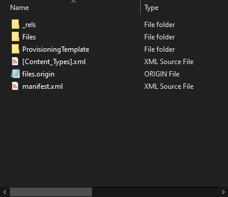
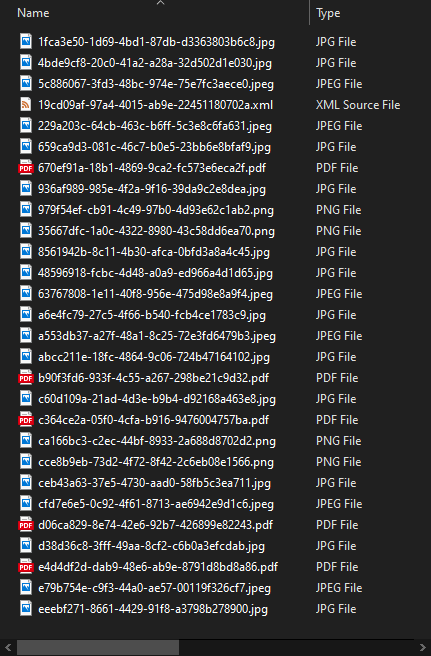

# The PnP Office Open XML File Format (.pnp)

If you have a template which contains file references (through the ```<pnp:Files />``` element) you will have to distribute both the xml file _and_ the files that are referred to. While this of course works, it is very easy to miss files when copying them to another location.

[!INCLUDE [pnp-provisioning-engine](../../includes/snippets/open-source/pnp-provisioning-engine.md)]

For this reason we introduced a specific Office Open XML format called a 'pnp file'. Effectively it is a zip file with a specific structure in it. If you rename the .pnp file to have a .zip extension you can simply open the file and have a look in it.



## Files

If you open the Files folder in the zipped folder you'll see a lot of strange filenames, all based upon a Guid (Globally Unique Identifier)



The template itself is located in this list, it has an .xml extension. The other files you see are actually files you refer to in your XML template.

Every file has been renamed to have a unique file name. The reason for this is that the Office Open XML file format does not allow for subfolders in this structure, but what if you have 2 different files referred to in your template, each having the same file name? Say you have a file called project.docx that goes to your Shared Documents library and you have another project.docx file that goes to a Project Documents library? For this reason we rename the files to have a unique filename. 

When we apply the template we make use of a lookup table to find the actual filename. That lookup table is located in the ```ProvisioningTemplate``` folder and is called ```files-map.xml```.

This is an example of the contents of that file:

```xml
<PnPFilesMap xmlns="clr-namespace:OfficeDevPnP.Core.Framework.Provisioning.Connectors.OpenXML.Model;assembly=OfficeDevPnP.Core" xmlns:x="http://schemas.microsoft.com/winfx/2006/xaml">
  <PnPFilesMap.Map>
    <x:String x:Key="19cd09af-97a4-4015-ab9e-22451180702a.xml">theperspective.xml</x:String>
    <x:String x:Key="cce8b9eb-73d2-4f72-8f42-2c6eb08e1566.png">assets/__sitelogo___sitelogo_theperspective.png</x:String>
    <x:String x:Key="e4d4df2d-dab9-48e6-ab9e-8791d8bd8a86.pdf">assets/documents/Contoso Falcon.pdf</x:String>
    <x:String x:Key="c364ce2a-05f0-4cfa-b916-9476004757ba.pdf">assets/documents/Contoso Flex.pdf</x:String>
    <x:String x:Key="d06ca829-8e74-42e6-92b7-426899e82243.pdf">assets/documents/Contoso Mark8 Controller.pdf</x:String>
    <x:String x:Key="670ef91a-18b1-4869-9ca2-fc573e6eca2f.pdf">assets/documents/Contoso Mark8.pdf</x:String>
    <x:String x:Key="b90f3fd6-933f-4c55-a267-298be21c9d32.pdf">assets/documents/Contoso Quad.pdf</x:String>
    <x:String x:Key="35667dfc-1a0c-4322-8980-43c58dd6ea70.png">assets/SitePages/2019-sales-leadership-award/sales-leadership-award.png</x:String>
    <x:String x:Key="5c886067-3fd3-48bc-974e-75e7fc3aece0.jpeg">assets/SitePages/Contoso-called-on-drone-pilots-to/AdobeStock_145027729.jpeg</x:String>
    <x:String x:Key="eeebf271-8661-4429-91f8-a3798b278900.jpg">assets/SitePages/Contoso-partners-with-non-profit-to-deliver-life-saving-supplies/7719-larm-rmah-216854-unsplash.jpg</x:String>
    <x:String x:Key="48596918-fcbc-4d48-a0a9-ed966a4d1d65.jpg">assets/SitePages/Miriam-Graham--Contoso-s-new-Chief-Marketing-Officer/CLO17_azure_004.jpg</x:String>
    <x:String x:Key="ceb43a63-37e5-4730-aad0-58fb5c3ea711.jpg">assets/SitePages/One-million-drones-sold-in-2018/kevin-chow-176761-unsplash.jpg</x:String>
    <x:String x:Key="936af989-985e-4f2a-9f16-39da9c2e8dea.jpg">assets/SitePages/One-million-drones-sold-in-2018/white-drone-hovering-in-a-bright-blue-sky-PFV2XG7.jpg</x:String>
    <x:String x:Key="e79b754e-c9f3-44a0-ae57-00119f326cf7.jpeg">assets/SitePages/Our-commitment-to-sustainability/AdobeStock_83900723.jpeg</x:String>
    <x:String x:Key="1fca3e50-1d69-4bd1-87db-d3363803b6c8.jpg">assets/SitePages/Patti-announces-flagship-store-opening/contoso-storefront.jpg</x:String>
    <x:String x:Key="63767808-1e11-40f8-956e-475d98e8a9f4.jpeg">assets/SitePages/Pushing-the-Boundaries-on-Aerial-Inspection/AdobeStock_137739028.jpeg</x:String>
    <x:String x:Key="d38d36c8-3fff-49aa-8cf2-c6b0a3efcdab.jpg">assets/SitePages/Singapore-building-update--August-2019/12891-artist_rendering.jpg</x:String>
    <x:String x:Key="229a203c-64cb-463c-b6ff-5c3e8c6fa631.jpeg">assets/SitePages/The-future-of-air-traffic--safely-sharing-the-skies-with-drones/AdobeStock_132294759.jpeg</x:String>
    <x:String x:Key="979f54ef-cb91-4c49-97b0-4d93e62c1ab2.png">assets/SitePages/The-importance-of-branding-at-Contoso/SBLB-BRANDING.png</x:String>
    <x:String x:Key="a6e4fc79-27c5-4f66-b540-fcb4ce1783c9.jpg">assets/SitePages/ThePerspective/23363-showcase.jpg</x:String>
    <x:String x:Key="4bde9cf8-20c0-41a2-a28a-32d502d1e030.jpg">assets/SitePages/ThePerspective/27137-consumer-showcase-thumb-1.jpg</x:String>
    <x:String x:Key="8561942b-8c11-4b30-afca-0bfd3a8a4c45.jpg">assets/SitePages/ThePerspective/33318-consumer-showcase-thumb-2.jpg</x:String>
    <x:String x:Key="c60d109a-21ad-4d3e-b9b4-d92168a463e8.jpg">assets/SitePages/ThePerspective/1548836252flysafe-thumb.jpg</x:String>
    <x:String x:Key="a553db37-a27f-48a1-8c25-72e3fd6479b3.jpeg">assets/SitePages/ThePerspective/AdobeStock_109868254.jpeg</x:String>
    <x:String x:Key="cfd7e6e5-0c92-4f61-8713-ae6942e9d1c6.jpeg">assets/SitePages/ThePerspective/AdobeStock_132294759.jpeg</x:String>
    <x:String x:Key="659ca9d3-081c-46c7-b0e5-23bb6e8bfaf9.jpg">assets/SitePages/ThePerspective/cta-banner.jpg</x:String>
    <x:String x:Key="abcc211e-18fc-4864-9c06-724b47164102.jpg">assets/SitePages/ThePerspective/nasa-_SFJhRPzJHs-unsplash.jpg</x:String>
    <x:String x:Key="ca166bc3-c2ec-44bf-8933-2a688d8702d2.png">assets/SitePages/Why-simplicity-matters/poster-patti-quote.png</x:String>
  </PnPFilesMap.Map>
</PnPFilesMap>
```

You'll see that for every file you find in the ```Files``` folder we have a matching entry in the ```files-map.xml``` file.

## Manually editing

In principle it is possible to manually edit the .pnp file by extracting the zip file to a folder, updating the files, adding files, modifying the ```files-map.xml``` file, but we recommend that you use PnP PowerShell to actually do the work for you.

## Creating a PnP file

The easiest way to create a PnP file is to extract a template from a site and specify the .pnp extension. The cmdlet will do the work for you:

```powershell
Connect-PnPOnline -Url https://yourtenant.sharepoint.com/sites/yoursite
Get-PnPSiteTemplate -Out myfile.pnp
```

[!INCLUDE [pnp-powershell](../../includes/snippets/open-source/pnp-powershell.md)]

This will however not give you the ability to modify the template easily. The better way is:

1. Create a [configuration](configuring-the-pnp-provisioning-engine.md) file and make sure to at least set the ```persistAssetFiles``` property to ```true```, optionally specifying to extract libraries like SiteAssets, Shared Documents, WebSettings (for the logo etc.).
1. Create a new folder on your file system and navigate to that folder with PowerShell.
1. Extract a template as an XML file and provide the configuration file:
    ```powershell
    Connect-PnPOnline -Url https://yourtenant.sharepoint.com/sites/yoursite
    Get-PnPSiteTemplate -Out myfile.xml -Configuration ./yourconfiguration.json
    ```
1. You will notice that one or more additional folders will have been created in your folder. These contain the actual files. When you open the XML file you'll notice ```<pnp:File />``` elements pointing to those files.
1. Read the template into an in-memory object and save it as an PnP file:
    ```powershell
    $template = Read-PnPSiteTemplate -Path myfile.xml
    Save-PnPSiteTemplate -Out myfile.pnp -Template $template
    ```

> [!NOTE] 
> You can also save a tenant template using PnP PowerShell substitute ```Read-PnPSiteTemplate``` with ```Read-PnPTenantTemplate``` and ```Save-PnPSiteTemplate``` with ```Save-PnPTenantTemplate```. Refer to [PnP Provisioning Tenant Template](pnp-provisioning-tenant-templates.md) for more information about Tenant templates.


## See also

- [SharePoint Patterns and Practices](https://github.com/SharePoint/PnP/)
- [SharePoint Developer Group at Microsoft Tech Community](https://techcommunity.microsoft.com/t5/SharePoint-Developer/bd-p/SharePointDev) 
- [PnP remote provisioning](pnp-remote-provisioning.md)
