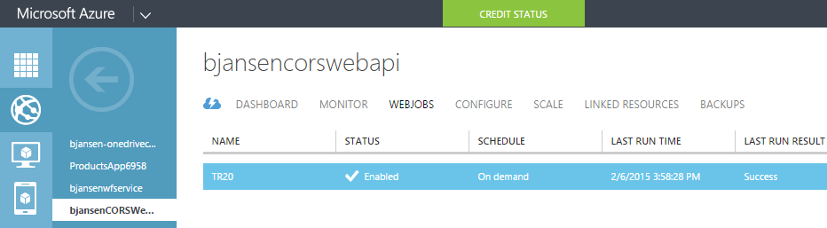
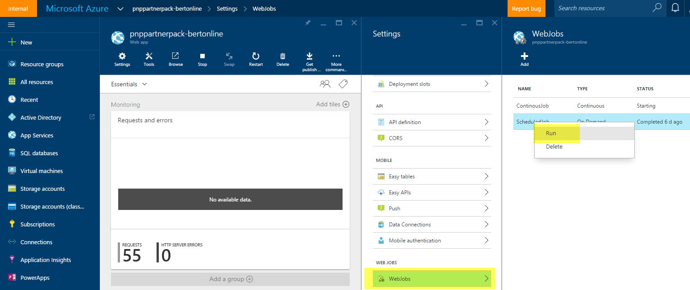
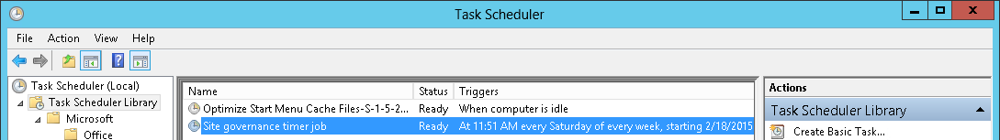
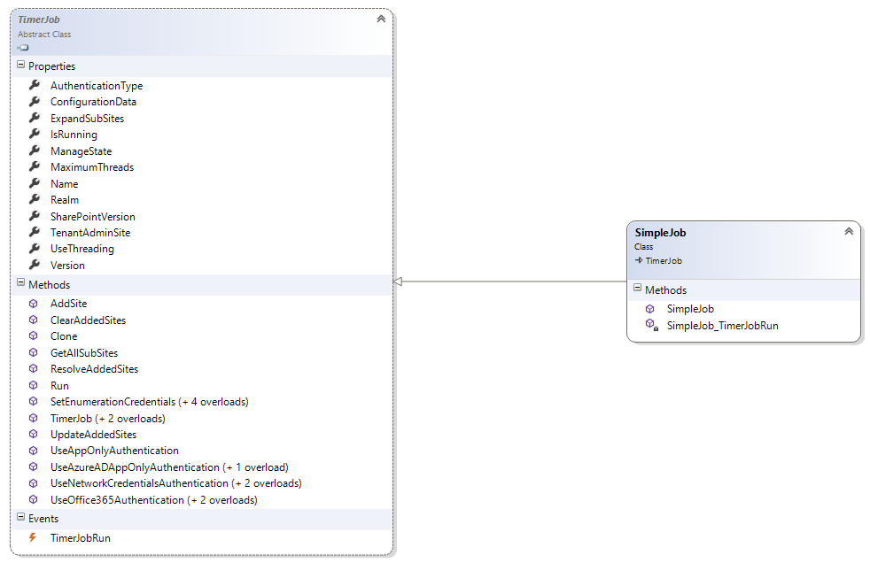
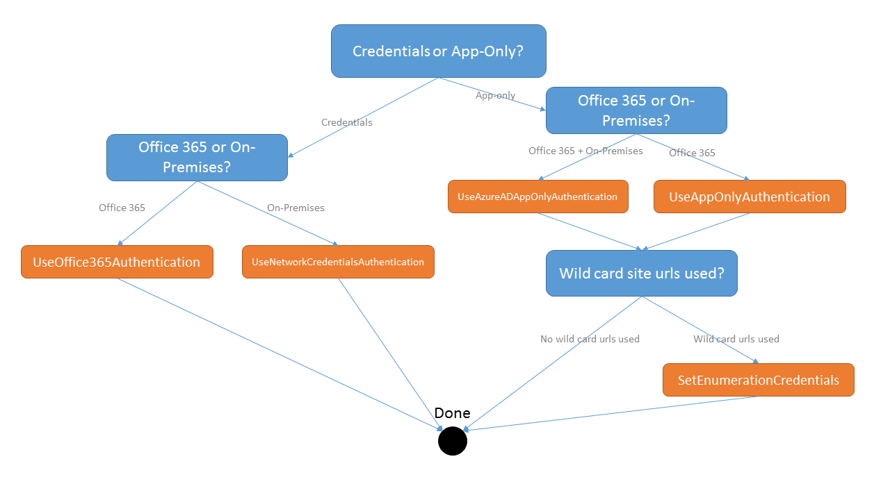
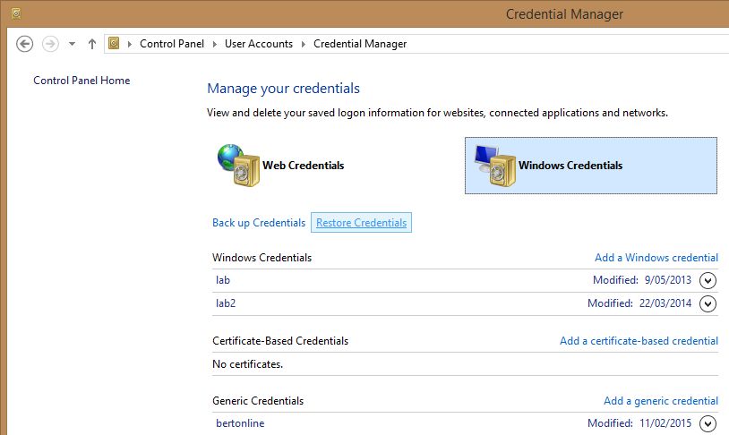
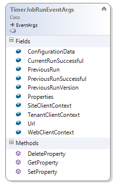

# The Timer Job Framework #

The PnP Timer Job Framework is a set of classes designed to ease the creation of background processes that operate against SharePoint sites. The Timer Job Framework is similar to on-premises full trust code Timer Jobs (`SPJobDefinition`). The primary difference with between the Timer Job Framework and the full trust code Timer Job is that the Timer Job Framework only uses client side APIs and therefore can (and should) be run outside of SharePoint. The Timer Job Framework makes it possible to build Timer Jobs that operate against SharePoint Online.

Once a Timer Job has been created it needs to be scheduled and executed. The two most common options are:

- When **Microsoft Azure** is the hosting platform, Timer Jobs can be deployed and run as **Azure WebJobs**.
- When **Windows Server** is the hosting platform (e.g. for on-premises SharePoint) Timer Jobs can be deployed and run in **Windows scheduler**.

For a video introduction to Timer Jobs, [this PnP video](http://channel9.msdn.com/blogs/OfficeDevPnP/Introduction-to-the-PnP-timer-job-framework) introduces the Timer Job Framework and demonstrates the Simple Timer Job example.

## Simple Timer Job example ##
In this chapter you'll see how to create a very simple Timer Job: the goal of this sample is to provide the reader a quick view, later on we'll provide a more detailed explanation of the Timer Job Framework. 

> [!NOTE] 
> For a more extensive PnP solution with ten individual Timer Job examples, from "Hello world" samples to actual content expiration jobs, see https://github.com/SharePoint/PnP/tree/dev/Solutions/Core.TimerJobs.Samples

The following describes how to create a simple Timer Job:

### Step 1: Create a Console project and reference PnP Core ###
In this first step, create a new project of the type "console" and reference the PnP core library by doing one of the following:

- Add the Office 365 Developer Patterns and Practices Core Nuget package to your project. There's a [nuget package for v15 (on-premises) and for v16 (Office 365)](https://www.nuget.org/packages?q=pnp). This is the preferred option.
- Add the existing PnP Core source project to your project. This will allow you to step into the PnP core code when debugging. 

    > [!NOTE] 
    > You will be responsible for keeping this code updated with the latest changes added to PnP.

### Step 2: Create a Timer Job class and add your Timer Job logic ###
1. Add a class for the Timer Job named `SimpleJob`.
2. Have the class inherit the `TimerJob` abstract base class.
3. In the constructor give the Timer Job a name (`base("SimpleJob")`) and connect the `TimerJobRun` event handler.
4. Add your Timer Job logic to the `TimerJobRun` event handler.

The result will be similar to the following:
```csharp
using System;
using System.Collections.Generic;
using System.Linq;
using System.Text;
using System.Threading.Tasks;
using Microsoft.SharePoint.Client;
using OfficeDevPnP.Core.Framework.TimerJobs;

namespace Core.TimerJobs.Samples.SimpleJob
{
    public class SimpleJob: TimerJob
    {
        public SimpleJob() : base("SimpleJob")
        {
            TimerJobRun += SimpleJob_TimerJobRun;
        }

        void SimpleJob_TimerJobRun(object sender, TimerJobRunEventArgs e)
        {
            e.WebClientContext.Load(e.WebClientContext.Web, p => p.Title);
            e.WebClientContext.ExecuteQueryRetry();
            Console.WriteLine("Site {0} has title {1}", e.Url, e.WebClientContext.Web.Title);
        }
    }
}
```

### Step 3: Update Program.cs to use the Timer Job ###
The Timer Job created in the previous step still needs to be executed. To do so, update `Program.cs` by using the following steps:

1. Instantiate your Timer Job class.
2. Provide the authentication details for the Timer Job. This example uses the user name and password to authenticate against SharePoint Online.
3. Add one or more sites for the Timer Job program to access. This example uses a wild card character in the URL. The Timer Job will run on all sites that match this wild card URL.
4. Start the Timer Job by calling the `Run` method.

```csharp
static void Main(string[] args)
{
    // Instantiate the Timer Job class
    SimpleJob simpleJob = new SimpleJob();
    
    // The provided credentials need access to the site collections you want to use
    simpleJob.UseOffice365Authentication("user@tenant.onmicrosoft.com", "pwd");

    // Add one or more sites to operate on
    simpleJob.AddSite("https://<tenant>.sharepoint.com/sites/d*");
    
    // Run the job
    simpleJob.Run();
}
```

## Timer Job deployment options ##
The previous step demonstrates a simple Timer Job. The next step is to deploy the Timer Job.

A Timer Job is an .exe file that must be scheduled on a hosting platform. Depending on the chosen hosting platform the deployment differs. The following sections describe the two most common hosting platform options:
- Using Microsoft Azure as the hosting platform
- Using Windows Server as the hosting platform

### Deploying Timer Jobs to Microsoft Azure using Azure WebJobs ###
Before deploying a Timer Job, ensure that the job can run without user interaction. The sample in this article prompts the user to provide a password or clientsecret (see more in **Authentication**) which works while testing but will not work when deployed. The existing samples all allow the user to provide a password or clientsecret by using the `app.config` file:

```XML
  <appSettings>
    <add key="user" value="user@tenant.onmicrosoft.com"/>
    <add key="password" value="your password goes here!"/>
    <add key="domain" value="Contoso"/>
    <add key="clientid" value="a4cdf20c-3385-4664-8302-5eab57ee6f14"/>
    <add key="clientsecret" value="your clientsecret goes here!"/>
  </appSettings>
```

After these changes are added to the `app.config` file, run the Timer Job from Visual Studio to confirm that it runs without user interaction. 

The actual deployment to Azure is based on Azure Web Jobs. To deploy this Timer Job example, follow these steps:

1. Right click the project in Visual Studio and choose **Publish as Azure WebJob...**
2. Provide a schedule for the Timer Job and click **OK**
3. Select **Microsoft Azure Websites** as a publish target. You'll be asked to login to Azure and select the Azure Web Site that will host the Timer Job (you can also create a new one if that would be needed)
4. Press **Publish** to push the WebJob to Azure
5. Once the Timer Job has been published you can trigger the job and check the job execution from Visual Studio or the [Azure management portal](https://manage.windowsazure.com).



Also, the timer job can be run from the new [Azure portal](https://portal.azure.com) by selecting the job and choosing **Run**. More details about how to work with WebJobs from the new portal can be found in the article, [Run Background tasks with WebJobs](https://azure.microsoft.com/en-us/documentation/articles/web-sites-create-web-jobs/).



> [!NOTE] 
> For in-depth guidance on deploying an Azure WebJob, see [Getting Started with azure WebJobs ("Timer Jobs") for your Office 365 Sites](https://github.com/SharePoint/PnP-Guidance/blob/master/articles/Getting-Started-with-building-Azure-WebJobs-for-your-Office365-sites.md). 

### Deploying Timer Jobs to Windows Server using the Windows Scheduler ###
When deployed to Windows Server, the Timer Job must run without user interaction. Modify the `app.config` file as described in **Deploying Timer Jobs to Microsoft Azure using Azure WebJobs**. 

Copy the release version of your job to the server you want it to run on. **Important:** Copy all the relevant assemblies, the .exe file and the .config file to ensure the job can run on the server without installing any additional files or programs on the server. 

Schedule the execution of the Timer Job. It is recommended to use the built in [Windows Task Scheduler](https://technet.microsoft.com/en-us/library/cc721871.aspx). To use the Windows Task Scheduler, take the following steps:

1. Open the task scheduler (Control Panel -> Task Scheduler).
2. Click on **Create Task** and specify a name and an account that will execute the task.
3. Click on **Triggers** and add a new trigger. Specify the schedule you want for the Timer Job.
4. Click on **Actions** and choose action "Start a program", select the Timer Job .exe file and set the start in folder.
5. Click on **OK** to save the task.



## Timer Job Framework in-depth ##
This section details how the Timer Job Framework features and how it works.

### Structure ###
The `TimerJob` class is an abstract base class which contains the following public properties, methods and events:



Most properties and methods will be explained in more detail in the coming sections. The rest of the properties and methods are described here:

- **IsRunning** property: Gets a value indicating whether the Timer Job is executing. Value of **true** if executing; **false** if not executing.
- **Name** property: Gets the name of the Timer Job. The name is initially set in the Timer Job constructor.
- **SharePointVersion** property: Gets or sets the SharePoint version. this property is automatically set based on the version of the loaded Microsoft.SharePoint.Client.dll and in general should not change. You can, however, change this property in case you for example want to use the v16 CSOM libraries in a v15 (on-premises) deployment.
- **Version** property: Gets the version of this Timer Job. The version is initially set in the Timer Job constructor or defaults to 1.0 when not set via the constructor.

To prepare for a Timer Job run you must first **configure** it:

1. Provide **authentication** settings.
2. Provide a **scope**, which is a list of sites.
3. Optionally set **Timer Job properties**.

From an execution perspective the following overall steps are taken when a Timer Job run is started:

1. **Resolve sites**: Wild card site urls (for example, https://tenant.sharepoint.com/sites/d*) are resolved into an actual list of existing sites. If sub site expanding was requested then the resolved sites list is expanded with all sub sites.
2. **Create batches of work** based on the current treading settings and create one thread per batch.
3. The **threads execute work batches** and call the `TimerJobRun` event for each site in the list.

Further details on each step can be found below.

### Authentication ###
Before a Timer Job can be used the Timer Job needs to know how to authenticate back to SharePoint. The framework currently supports the approaches in the **AuthenticationType** enum; **Office365**, **NetworkCredentials** and **AppOnly**. Using the methods illustrated below also automatically sets the **AuthenticationType** property to the appropriate value of **Office365**, **NetworkCredentials** and **AppOnly**. The flowchart below shows the steps to take. Detailed explanations on each approach are found below.



#### User credentials ####
To specify user credentials for running against **Office 365** you can use these 2 methods:
```csharp
public void UseOffice365Authentication(string userUPN, string password)
public void UseOffice365Authentication(string credentialName)
```

The first method simply accepts a user name and password. The second one allows you to specify a generic credential stored in the Windows Credential Manager. The screen shot below shows the `bertonline` generic credential. To use that to authenticate the Timer Job, provide "bertonline" as the parameter of the second method.



There are similar methods for running against **SharePoint on-premises**:
```csharp
public void UseNetworkCredentialsAuthentication(string samAccountName, string password, string domain)
public void UseNetworkCredentialsAuthentication(string credentialName)
```

#### App Only ####
App only is the **preferred method** as you can grant tenant scoped permissions. For user credentials the user account must have the needed permissions. 

> [!NOTE] 
> Certain site resolving logic wont work with App-only authentication. Details can be found in the next section. 

To configure the job for app-only authentication, use one of the following methods:
```csharp
public void UseAppOnlyAuthentication(string clientId, string clientSecret)
public void UseAzureADAppOnlyAuthentication(string clientId, string clientSecret)
```

The same method can be used for either Office 365 or SharePoint on-premises which makes Timer Jobs using app-only authentication easily transportable between environments.

> [!NOTE] 
> When you use app-only your Timer Job logic will fail when APIs are used that do not work with **AuthenticationType.AppOnly**. Typical samples are the Search API, writing to the taxonomy store, and using the user profile API.

### Sites to operate on ###
When a Timer Job runs it needs one or more sites to run against. To add sites to a Timer Job, use the below set of methods.

```csharp
public void AddSite(string site)
public void ClearAddedSites()
```

To add a site, specify either a fully qualified URL (for example, https://tenant.sharepoint.com/sites/dev) or a wild card URL. A wild card URL is a URL that ends with a * (only one single * is allowed and it must be the last character of the url). A sample wild card URL is https://tenant.sharepoint.com/sites/* which will return **all** the site collections underneath the managed path of that site. For another example, https://tenant.sharepoint.com/sites/dev* will return all site collections where the URL contains "dev".

Typically the sites are added by the program that instantiates the Timer Job object, but if needed the Timer Job can take control over the passed list of sites. Do this by adding a method override for the `UpdateAddedSites`virtual method as shown in sample below:

```csharp
public override List<string> UpdateAddedSites(List<string> addedSites)
{
    // Let's assume we're not happy with the provided list of sites, so first clear it
    addedSites.Clear();

    // Manually adding a new wildcard Url, without an added URL the Timer Job will do...nothing
    addedSites.Add("https://bertonline.sharepoint.com/sites/d*");

    // Return the updated list of sites
    return addedSites;
}
```

After adding a wild card URL and setting authentication to app-only, specify the enumeration credentials. Enumeration credentials are used to fetch a list of site collections which are used in the site matching algorithm to return a real list of sites. To acquire a list of site collections the timer framework will behave differently between Office 365 (v16) and on-premises (v15):
- Office 365: The `Tenant.GetSiteProperties` method is used to read the 'regular' site collections, the search API is used to read the OneDrive for Business site collections.
- On-Premises: The search API is used to read all site collections.

Given that the search API doesn't work with a user context, the Timer Job falls back to the specified enumeration credentials. 

To specify user credentials for running against **Office 365** you can use these 2 methods:
```csharp
public void SetEnumerationCredentials(string userUPN, string password)
public void SetEnumerationCredentials(string credentialName)
```

There are similar methods for running against **SharePoint on-premises**:
```csharp
public void SetEnumerationCredentials(string samAccountName, string password, string domain)
public void SetEnumerationCredentials(string credentialName)
```

The first method simply accepts a user name, password and optionally domain (when in on-premises). The second specifies a generic credential stored in the Windows Credential Manager. See the **Authentication** chapter to learn more about the Credential Manager.

#### Sub site expanding ####
Often you want the Timer Job code to be executed against the root site of the site collection and against all the sub sites of that site collection. To do this, set the **ExpandSubSites** property to **true**. This will cause the Timer Job to expand the sub sites as part of the site resolving step.

#### Override resolved and/or expanded sites ####
Once the timer framework resolves the wild card sites, and optionally expands the sub sites, the next step is to process the list of sites. Prior to processing the list of sites, you might want to modify the list of sites. For example, you may want to remove specific sites or add more sites to the list. This can be accomplished by overriding the `ResolveAddedSites` virtual method. The sample below shows how to override the `ResolveAddedSites` method to remove one site from the list. 

```csharp
public override List<string> ResolveAddedSites(List<string> addedSites)
{
    // Use default TimerJob base class site resolving
    addedSites = base.ResolveAddedSites(addedSites);

    //Delete the first one from the list...simple change. A real life case could be reading the site scope 
    //from a SQL (Azure) DB to prevent the whole site resolving. 
    addedSites.RemoveAt(0);

    // return the updated list of resolved sites...this list will be processed by the Timer Job
    return addedSites;
}
```

### TimerJobRun event ###
The Timer Job Framework splits the list of sites into work batches. Each batch of sites will be run on its own thread. By default, the framework will create five batches and five threads to run those five batches. See the **Threading** section to learn more about Timer Job threading options. When a thread processes a batch the `TimerJobRun` event is triggered by the timer framework and will provide all the necessary information to run the Timer Job. Timer Jobs are run as events, so the code must connect an event handler to the `TimerJobRun` event:

```csharp
public SimpleJob() : base("SimpleJob")
{
    TimerJobRun += SimpleJob_TimerJobRun;
}

void SimpleJob_TimerJobRun(object sender, TimerJobRunEventArgs e)
{
    // your Timer Job logic goes here
}
```

An alternative approach is using an inline delegate as shown here:

```csharp
public SimpleJob() : base("SimpleJob")
{
    // Inline delegate
    TimerJobRun += delegate(object sender, TimerJobRunEventArgs e)
    {
        // your Timer Job logic goes here
    };
}
```

When the `TimerJobRun` event fires you receive a `TimerJobRunEventArgs` object which provides the necessary information to write the Timer Job logic. The following attributes and methods are available in this class:



Several of the properties and all of the methods are used in the optional state management feature which will be discussed in the next section. However the following properties will always be available in every event, regardless of the used configuration:
- **Url** property: Gets or sets the URL of the site for the Timer Job to operate against. This can be the root site of the site collection, but it can also be a sub site in case site expanding was done.
- **ConfigurationData** property: Gets or sets additional timer job configuration data (optional). This configuration data is passed along as part of the `TimerJobRunEventArgs` object.
- **WebClientContext** property: Gets or sets the `ClientContext` object for the current URL. This property is a `ClientContext` object for the site defined in the *Url* property. This is typically the `ClientContext` object that you would use in your Timer Job code.
- **SiteClientContext** property: Gets or sets the `ClientContext` object for the root site of the site collection. This property provides access to the root site should the Timer Job require access to it. For example, the Timer Job can add a page layout to the master page gallery using the *SiteClientContext* property.
- **TenantClientContext** property: Gets or sets the `ClientContext` object to work with the Tenant API. This property provides a `ClientContext`object constructed by using the tenant admin site URL. To use the `Tenant` API in the Timer Job `TimerJobRun` event handler, create a new `Tenant` object by using this TenantClientContext property.

All `ClientContext`objects use the authentication information described in the **Authentication** section. If you've opted for user credentials please ensure that the used account has the needed permissions to operate against the specified sites. When using app-only, it is best to set tenant-scoped permissions to the app-only principal.

### State management ###
When you write Timer Job logic you often need to persist state. For example, to record when a site was last processed, or to store data to support your Timer Job business logic. For this reason, the Timer Job Framework has state management capabilities. State management stores and retrieves a set of standard and custom properties as a JSON serialized string in the web property bag of the processed site (name = Timer Job name + "_Properties"). The following are the default properties of the `TimerJobRunEventArgs`object:
- **PreviousRun** property: Gets or sets the date and time of the previous run.
- **PreviousRunSuccessful** property: Gets or sets a value indicating whether the previous run was successful. Note that the Timer Job author is responsible for flagging a job run as successful by setting the **CurrentRunSuccessful** property as part of your Timer Job implementation
- **PreviousRunVersion** property: Gets or sets the Timer Job version of the previous run.

Next to these standard properties you also have the option to specify your own properties by adding keyword - value pairs to the `Properties` collection of the `TimerJobRunEventArgs`object. To make this easier there are three methods to help you:
- **SetProperty** adds or updates a property.
- **GetProperty** returns the value of a property.
- **DeleteProperty** removes a property from the property collection.

The following code shows how state management can be used:

```csharp
void SiteGovernanceJob_TimerJobRun(object o, TimerJobRunEventArgs e)
{
    try
    {
        string library = "";

        // Get the number of admins
        var admins = e.WebClientContext.Web.GetAdministrators();

        Log.Info("SiteGovernanceJob", "ThreadID = {2} | Site {0} has {1} administrators.", e.Url, admins.Count, Thread.CurrentThread.ManagedThreadId);

        // grab reference to list
        library = "SiteAssets";
        List list = e.WebClientContext.Web.GetListByUrl(library);

        if (!e.GetProperty("ScriptFileVersion").Equals("1.0", StringComparison.InvariantCultureIgnoreCase))
        {
            if (list == null)
            {
                // grab reference to list
                library = "Style%20Library";
                list = e.WebClientContext.Web.GetListByUrl(library);
            }

            if (list != null)
            {
                // upload js file to list
                list.RootFolder.UploadFile("sitegovernance.js", "sitegovernance.js", true);

                e.SetProperty("ScriptFileVersion", "1.0");
            }
        }

        if (admins.Count < 2)
        {
            // Oops, we need at least 2 site collection administrators
            e.WebClientContext.Site.AddJsLink(SiteGovernanceJobKey, BuildJavaScriptUrl(e.Url, library));
            Console.WriteLine("Site {0} marked as incompliant!", e.Url);
            e.SetProperty("SiteCompliant", "false");
        }
        else
        {
            // We're all good...let's remove the notification
            e.WebClientContext.Site.DeleteJsLink(SiteGovernanceJobKey);
            Console.WriteLine("Site {0} is compliant", e.Url);
            e.SetProperty("SiteCompliant", "true");
        }

        e.CurrentRunSuccessful = true;
        e.DeleteProperty("LastError");
    }
    catch(Exception ex)
    {
        e.CurrentRunSuccessful = false;
        e.SetProperty("LastError", ex.Message);
    }
}
```

The state is stored as a single JSON serialized property which means it can be used by other customizations as well. For example, if the Timer Job wrote the state entry "SiteCompliant=false", a JavaScript routine could prompt the user to act because the Timer Job determined that the site was incompliant.

### Threading ###
The Timer Job Framework by default uses threads to parallelize work. Threading is used for both the sub site expansion (when requested) and for the running the actual Timer Job logic (`TimerJobRun` event) for each site. The following properties can be used to control the threading implementation:
- **UseThreading** property: Gets or sets a value indicating whether threading will be used. Defaults to **true**.  Set to **false** to perform all actions by using the main application thread.
- **MaximumThreads** property: Gets or sets the number of threads to use for this Timer Job. Valid values are 2 to 100. The default is 5. Having lots of threads is not necessarily faster then having just few threads. The optimal number should be acquired via testing using a variety of thread counts. The default of 5 threads has been found to significantly boost performance in most scenarios. 

#### Throttling ####
Because Timer Job uses threading and Timer Job operations are typically resource intensive operations, a Timer Job run could be throttled. In order to correctly deal with throttling the Timer Job Framework and the whole of PnP Core uses the `ExecuteQueryRetry` method instead of the default `ExecuteQuery`method.

> [!NOTE] 
> It is important to use `ExecuteQueryRetry` in your Timer Job implementation code.

#### Concurrency issues - process all sub sites of a site collection in the same thread ####

Timer Jobs may have concurrency issues when using multiple threads to process sub sites. Take this example: Thread A processes the first set of sub sites from site collection 1, and thread B processes the rest of the sub sites from site collection 1. If the Timer Job processes the sub site and the root site (by using the `SiteClientContext` object), there could be a concurrency issue since both thread A and thread B process the root site. To avoid the concurrency issue (without running the Timer Jobs in a single thread) use the `GetAllSubSites` method within the Timer Job.

The following code shows how to use the `GetAllSubSites` method within a Timer Job:

```csharp
public class SiteCollectionScopedJob: TimerJob
{
    public SiteCollectionScopedJob() : base("SiteCollectionScopedJob")
    {
        // ExpandSites *must* be false as we'll deal with that at TimerJobEvent level
        ExpandSubSites = false;
        TimerJobRun += SiteCollectionScopedJob_TimerJobRun;
    }

    void SiteCollectionScopedJob_TimerJobRun(object sender, TimerJobRunEventArgs e)
    {
        // Get all the sub sites in the site we're processing
        IEnumerable<string> expandedSites = GetAllSubSites(e.SiteClientContext.Site);

        // Manually iterate over the content
        foreach (string site in expandedSites)
        {
            // Clone the existing ClientContext for the sub web
            using (ClientContext ccWeb = e.SiteClientContext.Clone(site))
            {
                // Here's the Timer Job logic, but now a single site collection is handled in a single thread which 
                // allows for further optimization or prevents race conditions
                ccWeb.Load(ccWeb.Web, s => s.Title);
                ccWeb.ExecuteQueryRetry();
                Console.WriteLine("Here: {0} - {1}", site, ccWeb.Web.Title);
            }
        }
    }
}
```

### Logging ###
The Timer Job Framework uses the PnP Core logging components as it's part of the PnP Core library. To activate the built-in PnP Core logging, configure it using the appropriate config file (app.config or web.config). The following example shows the required syntax:

```XML
  <system.diagnostics>
    <trace autoflush="true" indentsize="4">
      <listeners>
        <add name="DebugListenter" type="System.Diagnostics.TextWriterTraceListener" initializeData="trace.log" />
        <!--<add name="consoleListener" type="System.Diagnostics.ConsoleTraceListener" />-->
      </listeners>
    </trace>
  </system.diagnostics>
```

Using the above configuration file the Timer Job Framework will use the `System.Diagnostics.TextWriterTraceListener` to write logs to a file called trace.log in the same folder as the Timer Job .exe. Other trace listeners are available such as:
- **ConsoleTraceListener** writes logs to the console.
- The method described in [Cloud Diagnostics - Take Control of Logging and Tracing in Windows Azure](https://msdn.microsoft.com/en-us/magazine/ff714589.aspx). This method uses Microsoft.WindowsAzure.Diagnostics.**DiagnosticMonitorTraceListener**. Additional Azure resources can be found here:
    - [Enable diagnostic logging for Azure Websites](http://azure.microsoft.com/en-us/documentation/articles/web-sites-enable-diagnostic-log/)
    - [Troubleshooting Azure Websites in Visual Studio](http://azure.microsoft.com/en-us/documentation/articles/web-sites-dotnet-troubleshoot-visual-studio/)

It is strongly advised to use the same logging approach for your custom Timer Job code as you do for the Timer Job Framework. In your Timer Job code you can use the PnP Core `Log` class:

```csharp
void SiteGovernanceJob_TimerJobRun(object o, TimerJobRunEventArgs e)
{
    try
    {
        string library = "";

        // Get the number of admins
        var admins = e.WebClientContext.Web.GetAdministrators();

        Log.Info("SiteGovernanceJob", "ThreadID = {2} | Site {0} has {1} administrators.", e.Url, admins.Count, Thread.CurrentThread.ManagedThreadId);

        // Additional Timer Job logic...

        e.CurrentRunSuccessful = true;
        e.DeleteProperty("LastError");
    }
    catch(Exception ex)
    {
        Log.Error("SiteGovernanceJob", "Error while processing site {0}. Error = {1}", e.Url, ex.Message);
        e.CurrentRunSuccessful = false;
        e.SetProperty("LastError", ex.Message);
    }
}
```
