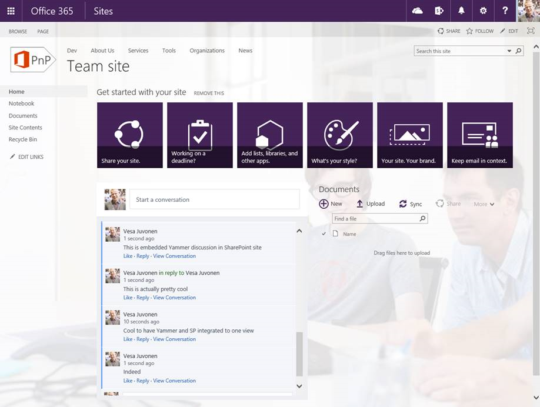

Yammer integration in the SharePoint Add-in model
=================================================

Summary
-------

The approach you take to integrate Yammer with SharePoint is the same in the new SharePoint Add-in model as it is with Full Trust Code.

High Level Guidelines
---------------------

As a rule of a thumb, we would like to provide the following high level guidelines to integrate Yammer with SharePoint.

- Yammer integration may be used in both on-premises and Office 365  SharePoint environments.
- You can use the remote provisioning pattern to create Yammer groups and/or Yammer OpenGraph objects to facilitate conversations when you create new SharePoint sites.
- You can use the out-of-the-box embed functionality to quickly and easily integrate Yammer with SharePoint.
	+ To use embed you need a HTML container 400 pixels or larger in your application.
- You can use the Yammer SDKs and REST APIs to create customized integration functionality.

Options to integrate Yammer with SharePoint
-------------------------------------------

You have a few options to integrate Yammer with SharePoint.

- Embed
	+ Group, Topic, My, and User Feeds
	+ OpenGraph Feeds
- Yammer OpenGraph API and/or Yammer REST API with Yammer SDKs
	
Embed
-----

In this option you embed a Yammer feed in a SharePoint webpage.
	
- This option is quickly and easily implemented.
- This option allows you to control limited aspects of the feed and how it appears.

Using embed looks like this in your SharePoint page:

The following table describes each type of Yammer feed you can access with embed out-of-the-box.

Feed | Description | FeedType | Use Case
---- | ----------- | -------- | --------
My Feed | My Feeds are where conversations are delivered for Yammer users. | MyFeed | My Site homepage or workspace site.
User Feed | All the conversations posted by a specific user in Yammer. | User | Profile pages for users in a system directory.
Topic Feed | A feed of conversations that have been tagged with a topic in Yammer. | Topic | An event page on an intranet.
Group Feed | A feed of conversations that have been posted in a specified group. | Group | A team page on an intranet.

If you need to go beyond the capabilities of the out-of-the-box Yammer feeds in the table above you can use the OpenGraph embed option.  This option gives you more control of the feed.  The following table illustrates such an example.

Feed | Description | FeedType | Use Case
---- | ----------- | -------- | --------
Comment  Feed | Uses Yammer’s Open Graph API to facilitate conversation around an application object. | Custom | An opportunity in a custom CRM application, or a media detail page in a digital asset management system.

**When is it a good fit?**

When you are trying to integrate Yammer feeds with SharePoint sites and the out-of-the-box capabilities of the embed feed meet your needs.

**Getting Started**

The following sample demonstrates how to provision sites with a Yammer feed associated with the site in place of the default news feed for the site.

- [Provisioning.Yammer (O365 PnP Sample)](https://github.com/SharePoint/PnP/tree/master/Samples/Provisioning.Yammer)

The **CreateYammerGroupDiscussionPartXml** method in the [YammerUtility.cs](https://github.com/SharePoint/PnP-Sites-Core/blob/master/Core/OfficeDevPnP.Core/Utilities/YammerUtility.cs) class comes from the [OfficeDevPnP.Core](https://github.com/SharePoint/PnP-Sites-Core/blob/master/Core/OfficeDevPnP.Core) sample.  This method creates the XML for an Add-in Part definition that is added to a SharePoint page when a site is provisioned.  Notice the **feedType: 'group'** portion of the code.  Here you can see the feedType is set to use the out-of-the-box group feedType.

	public static string CreateYammerGroupDiscussionPartXml(string yammerNetworkName, int yammerGroupId, bool showHeader, bool showFooter, bool useSSO = true)
    {
        StringBuilder wp = new StringBuilder(100);
        wp.Append("<?xml version=\"1.0\" encoding=\"utf-8\" ?>");
        wp.Append("<webParts>");
        wp.Append("	<webPart xmlns='http://schemas.microsoft.com/WebPart/v3'>");
        wp.Append("		<metaData>");
        wp.Append("			<type name='Microsoft.SharePoint.WebPartPages.ScriptEditorWebPart, Microsoft.SharePoint, Version=16.0.0.0, Culture=neutral, PublicKeyToken=71e9bce111e9429c' />");
        wp.Append("			<importErrorMessage>Cannot import this web part.</importErrorMessage>");
        wp.Append("		</metaData>");
        wp.Append("		<data>");
        wp.Append("			<properties>");
        wp.Append("				<property name='Title' type='string'>$Resources:core,ScriptEditorWebPartTitle;</property>");
        wp.Append("				<property name='Description' type='string'>$Resources:core,ScriptEditorWebPartDescription;</property>");
        wp.Append("				<property name='ChromeType' type='chrometype'>None</property>");
        wp.Append("				<property name='Content' type='string'>");
        wp.Append("				<![CDATA[");
        wp.Append("				    

");
        wp.Append("				    ");
        wp.Append("				    ");
        wp.Append("				]]>");
        wp.Append("				</property>");
        wp.Append("			</properties>");
        wp.Append("		</data>");
        wp.Append("	</webPart>");
        wp.Append("</webParts>");

        return wp.ToString();
    }

The **CreateYammerOpenGraphDiscussionPartXml** method in the [YammerUtility.cs](https://github.com/SharePoint/PnP-Sites-Core/blob/master/Core/OfficeDevPnP.Core/Utilities/YammerUtility.cs) class comes from the [OfficeDevPnP.Core](https://github.com/SharePoint/PnP-Sites-Core/blob/master/Core/OfficeDevPnP.Core) sample.  This method creates the XML for an Add-in Part definition that is added to a SharePoint page when a site is provisioned.  Notice the **feedType: 'open-graph'** portion of the code.  Here you can see the feedType is set to use the OpenGraph API.

	public static string CreateYammerOpenGraphDiscussionPartXml(string yammerNetworkName, string url, bool showHeader, 
                                                                    bool showFooter, string postTitle="", string postImageUrl="", 
                                                                    bool useSso = true, string groupId = "")
        {
            StringBuilder wp = new StringBuilder(100);
            wp.Append("<?xml version=\"1.0\" encoding=\"utf-8\" ?>");
            wp.Append("<webParts>");
            wp.Append("	<webPart xmlns='http://schemas.microsoft.com/WebPart/v3'>");
            wp.Append("		<metaData>");
            wp.Append("			<type name='Microsoft.SharePoint.WebPartPages.ScriptEditorWebPart, Microsoft.SharePoint, Version=16.0.0.0, Culture=neutral, PublicKeyToken=71e9bce111e9429c' />");
            wp.Append("			<importErrorMessage>Cannot import this web part.</importErrorMessage>");
            wp.Append("		</metaData>");
            wp.Append("		<data>");
            wp.Append("			<properties>");
            wp.Append("				<property name='Title' type='string'>$Resources:core,ScriptEditorWebPartTitle;</property>");
            wp.Append("				<property name='Description' type='string'>$Resources:core,ScriptEditorWebPartDescription;</property>");
            wp.Append("				<property name='ChromeType' type='chrometype'>None</property>");
            wp.Append("				<property name='Content' type='string'>");
            wp.Append("				<![CDATA[");
            wp.Append("				    

");
            wp.Append("				    ");
            wp.Append("				    ");
            wp.Append("				]]>");
            wp.Append("				</property>");
            wp.Append("			</properties>");
            wp.Append("		</data>");
            wp.Append("	</webPart>");
            wp.Append("</webParts>");

            return wp.ToString();
        }

Watch the [Integrate Yammer feeds to SharePoint sites (O365 PnP Video)](https://channel9.msdn.com/blogs/OfficeDevPnP/Integrate-Yammer-feeds-to-SharePoint-sites) to see a walk through of the - [Provisioning.Yammer (O365 PnP Sample)](https://github.com/SharePoint/PnP/tree/master/Samples/Provisioning.Yammer).

For more information about Yammer embed see the [Yammer Embed Feed (Yammer Developer Center)](https://developer.yammer.com/v1.0/docs/embed) article.

For more information about Yammer OpenGraph see the [Open Graph Introduction & Format (Yammer Developer Center)](https://developer.yammer.com/v1.0/docs/open-graph) article.

Yammer OpenGraph API & Yammer REST API with Yammer SDKs
-------------------------------------------------------

In this option you use the Yammer OpenGraph API and/or Yammer REST API with Yammer SDKs to integrate Yammer with SharePoint.  These APIs may also be used to integrate Yammer with processes outside of webpages.  Examples of such scenarios include services and long running operations. 
	
- This option takes longer to implement.
- This option allows you to control all aspects of the feed and how it appears and how you interact with it.

**When is it a good fit?**

- When you are trying to integrate Yammer feeds with SharePoint sites and the out-of-the-box capabilities of the embed feeds do not meet your needs.
- When you are trying to integrate Yammer feeds into services or long running operations.

**Getting Started**

For more information about Yammer OpenGraph see the [Open Graph Introduction & Format (Yammer Developer Center)](https://developer.yammer.com/v1.0/docs/open-graph) article.

Yammer SDKs provide you the ability to authenticate to Yammer.  For more information about the Yammer SDKs see the following articles:

- [JavaScript SDK](https://developer.yammer.com/v1.0/docs/js-sdk)
- [Ruby SDK](https://developer.yammer.com/v1.0/docs/ruby-sdk)
- [Python SDK](https://developer.yammer.com/v1.0/docs/python-sdk)
- [iOS SDK](https://developer.yammer.com/v1.0/docs/ios-sdk)
- [.NET SDK](https://developer.yammer.com/v1.0/docs/net-sdk)
- [Windows Phone 8 SDK](https://developer.yammer.com/v1.0/docs/windows-phone-8-sdk)

After you have authenticated to Yammer via the Yammer SDKs you can call the Yammer REST APIs.  

For more information about Yammer REST APIs see the [REST API & Rate Limits (Yammer Developer Center)](https://developer.yammer.com/v1.0/docs/rest-api-rate-limits) article.

**Authentication Note**

In a scenario where you sign into SharePoint with credentials that differ from the credentials you use to sign into SharePoint with you may wish to develop a single-sign-on capability for your users.  An example of such a scenario is when you sign into SharePoint with a LiveID and you need to sign into Yammer with a Microsoft personal or work account.

To implement a single-sign-on scenario you can direct your users to sign into Yammer the first time they come to a SharePoint page with your custom Yammer component on it. After the user signs into Yammer via the Yammer SDK you can store the refresh token for the user in their user profile.  Then, on subsequent visits to the page you can retrieve the refresh token from the user profile and use it to authenticate.  With this approach your end users only need to sign into Yammer when their refresh token expires.

Related links
=============
- [Integrate Yammer feeds to SharePoint sites (O365 PnP Video)](https://channel9.msdn.com/blogs/OfficeDevPnP/Integrate-Yammer-feeds-to-SharePoint-sites)
- [Yammer Embed Feed (Yammer Developer Center)](https://developer.yammer.com/v1.0/docs/embed)
- [Open Graph Introduction & Format (Yammer Developer Center)](https://developer.yammer.com/v1.0/docs/open-graph)
- Guidance articles at [http://aka.ms/OfficeDevPnPGuidance](http://aka.ms/OfficeDevPnPGuidance "Guidance Articles")
- References in MSDN at [http://aka.ms/OfficeDevPnPMSDN](http://aka.ms/OfficeDevPnPMSDN "References in MSDN")
- Videos at [http://aka.ms/OfficeDevPnPVideos](http://aka.ms/OfficeDevPnPVideos "Videos")

Related PnP samples
===================
- [Provisioning.Yammer (O365 PnP Sample)](https://github.com/SharePoint/PnP/tree/master/Samples/Provisioning.Yammer)
- [OfficeDevPnP.Core](https://github.com/SharePoint/PnP-Sites-Core/blob/master/Core)
- Samples and content at [http://aka.ms/OfficeDevPnP](http://aka.ms/OfficeDevPnP)

Applies to
==========
- Office 365 Multi Tenant (MT)
- Office 365 Dedicated (D)
- SharePoint 2013 on-premises
