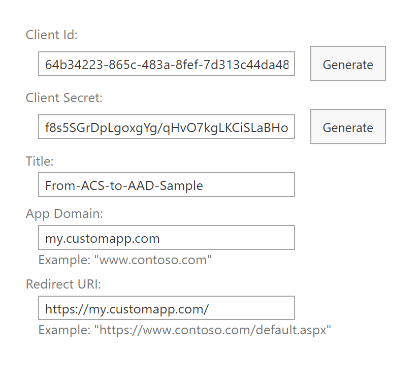
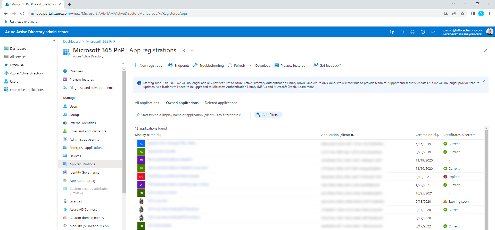
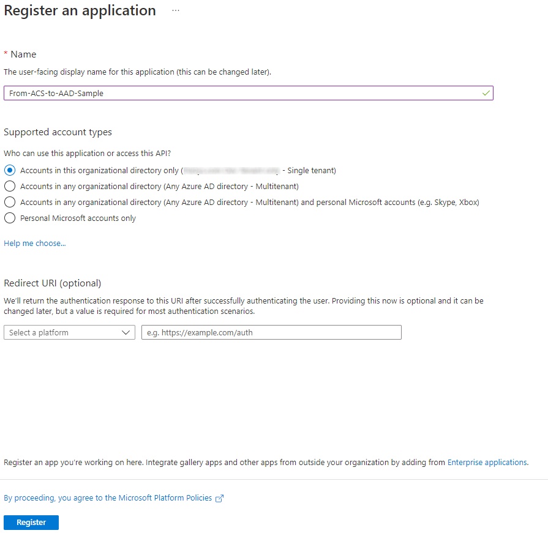
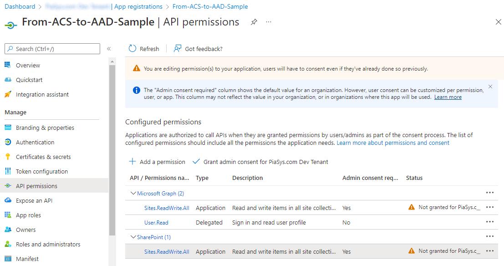

# Upgrading SharePoint applications from Azure Access Control Service to Azure Active Directory

The SharePoint Add-in model allows you to register applications in Azure Access Control Service (ACS) in order to gain app-only access to your SharePoint Online resources. Depending on how you configure the app-only access, you can grant different levels of permission from read-only to full-control. In the articles ["Accessing SharePoint using an application context, also known as app-only"](../solution-guidance/security-apponly.md) and ["Granting access using SharePoint App-Only"](../solution-guidance/security-apponly-azureacs.md) you can find step-by-step guidance about how to configure such kind of applications.

> [!IMPORTANT]
> Azure Access Control (ACS), a service of Azure Active Directory (Azure AD), has been retired on November 7, 2018. This retirement does not impact the SharePoint Add-in model, which uses the `https://accounts.accesscontrol.windows.net` hostname (which is not impacted by this retirement). For more information, see [Impact of Azure Access Control retirement for SharePoint Add-ins](https://developer.microsoft.com/office/blogs/impact-of-azure-access-control-deprecation-for-sharepoint-add-ins/). For new tenants, apps using an ACS app-only access token is disabled by default. We recommend using the Azure AD app-only model which is modern and more secure. 

> [!IMPORTANT]
> This article refers to so called PnP components, samples and/or tooling which are open-source assets backed by an active community providing support for them. There is no SLA for open-source tool support from official Microsoft support channels. These components or samples are however using Microsoft supported out of the box APIs and features which are supported by Microsoft.
 
However, the SharePoint Add-in model is an old model and there are newer, more modern, and more versatile development models available like, for example, the SharePoint Framework. Moreover, from a technical point of view, the permissions granted to an app-only application registered with the SharePoint Add-in model gets access to the whole tenant, and you can't selectively choose the target site collections that you want to grant permissions for.

As a suitable and more secure alternative, you can rely on registering an application in Azure Active Directory (Azure AD) eventually using the Resource Specific Consent (RSC) model, which is covered in the article ["Understanding Resource Specific Consent for Microsoft Graph and SharePoint Online"](./understanding-rsc-for-msgraph-and-sharepoint-online.md), in order to target specific site collections only, instead of the whole tenant.

In this article, you can find detailed information about how the Azure AD application registration model works, and about how to upgrade to the Azure AD model an already existing application registered in ACS with the SharePoint Add-in model.

If you prefer, you can watch the following video, instead of reading the whole article, which you can still consider as a much more detailed reference.

[](https://youtu.be/jNKX6qos8ZI)

## Upgrading from ACS to Azure AD

In this section we make the assumption that you already have an app-only application registered in SharePoint Online, using the SharePoint Add-in model and ACS. 

### The application to migrate from

In the screenshot below you can see a sample configuration for the application registered in ACS using the https://[your-tenant].sharepoint.com/_layouts/15/appregnew.aspx URL of your target tenant.



The application was granted *FullControl* right on the target SharePoint Online tenant through the following policy, which was registered via the https://[your-tenant]-admin.sharepoint.com/_layouts/15/appinv.aspx URL of the SharePoint Online Admin Central.

```XML
<AppPermissionRequests AllowAppOnlyPolicy="true">
  <AppPermissionRequest Scope="http://sharepoint/content/tenant" Right="FullControl" />
</AppPermissionRequests>
```

In the following screenshot, you can see the UI settings used for granting Full Control permission to the application.


We also make the assumption that you're accessing a target SharePoint Online Site Collection in order to read and write the items of a SharePoint library.

In the following code excerpt - grabbed from a .NET 6 Console application - you can see how you can get access to the target SharePoint Online tenant by using the [PnP Framework Library](https://www.nuget.org/packages/PnP.Framework), which is available as an open source NuGet package.

```csharp
// Use the PnP Framework AuthenticationManager class to get access to SharePoint Online
var am = new AuthenticationManager();

using (var context = am.GetACSAppOnlyContext(settings.SiteUrl, settings.ClientId, settings.ClientSecret))
{
    // Read the target library title
    var targetLibrary = context.Web.Lists.GetByTitle(settings.ListTitle);
    context.Load(targetLibrary, l => l.Title);
    await context.ExecuteQueryAsync();

    Console.WriteLine($"The title of the library is: \"{targetLibrary.Title}\"");

    // Add a new document to the target library
    using (var fileContent = new MemoryStream())
    {
        // Create some random text content
        var randomContent = Encoding.UTF8.GetBytes($"Some random content {DateTime.Now}");
        fileContent.Write(randomContent, 0, randomContent.Length);
        fileContent.Position = 0;

        // Upload the content as a random name file
        await targetLibrary.RootFolder.UploadFileAsync($"{Guid.NewGuid().ToString("n")}.txt", fileContent, true);
    }
}
```

The code excerpt reads the title of a target library and then uploads a new text file into the target library, just for the sake of showing a hypothetical custom logic that consumes SharePoint Online via app-only.

> [!NOTE]
> The code sample relies on PnP Framework Library to make it easier to get access to SharePoint Online. However, you can eventually use the SharePoint Online Client Side Object Model (CSOM) only. The purpose of the PnP Framework Library is just to speed up your development process and improve developers' quality of life.

## Registering the new application in Azure AD

Since you have an ACS registered application, let's see how to transform it into a modern Azure AD application.

First of all, you need to register the application in Azure AD. Then you need to configure authentication for the application. Lastly you need to configure the permissions that you want to grant to the application in order to access SharePoint Online.

For security reasons, in order to access SharePoint Online in app-only mode via an Azure AD registered application you also need to create and configure and X.509 certificate for application authentication.

In the following sections, you see how to proceed with the Azure AD application registration, either using an automatic approach or a manual one.

### Automatically registering a new application in Azure AD with PnP PowerShell

The fastest and easiest way to register an Azure AD application to access SharePoint Online in app-only mode is to rely on [PnP PowerShell](https://pnp.github.io/powershell/).

>[!NOTE]
>PnP PowerShell is an open-source solution with active community providing support for it. There is no SLA for the open-source tool support from Microsoft.

In fact, there's the [Register-PnPAzureADApp](https://pnp.github.io/powershell/cmdlets/Register-PnPAzureADApp.html) cmdlet, which allows to execute all the registration steps with just one line of code. In the following code excerpt, you can see a PowerShell script to do so.

```PowerShell
$app = Register-PnPAzureADApp -ApplicationName "Here the name of your application" -Store CurrentUser -Tenant yourtenant.onmicrosoft.com -Username "your-username" -Password (Read-Host -AsSecureString -Prompt "Enter Password") -CertificatePassword (Read-Host -AsSecureString -Prompt "Enter Certificate Password") -OutPath .\

$app.'AzureAppId/ClientId'
$app.'Certificate Thumbprint'
```

The cmdlet executes the following steps:

- registers the application in Azure AD
- creates an X.509 certificate for application authentication
- imports the certificate, with its private key, in the Current User certificate store
- exports the .PFX and .CER files of the certificate in the folder specified by the *OutPath* argument
- uploads the public key of the certificate to Azure AD to configure the certificate for application authentication
- configures a predefined set of permissions for the application in Azure AD

The above script outputs the Client ID of the application and the thumbprint of the autogenerated certificate. 

During the whole process you see a prompt dialog to grant to the application the permissions. In the following scree-shot you can see the permissions automatically granted to the application by the cmdlet.


There are plenty of options to configure the behavior of the [Register-PnPAzureADApp](https://pnp.github.io/powershell/cmdlets/Register-PnPAzureADApp.html) cmdlet. For example, you could like to customize the permissions to grant to the application using the *GraphApplicationPermissions* and the *SharePointApplicationPermissions* arguments.

If you aren't interested in the manual process, you can jump to the section ["Consuming SharePoint Online in app-only mode via an Azure AD registered application"](#consuming-sharepoint-online-in-app-only-mode-via-an-azure-ad-registered-application) to see how to consume SharePoint Online with your newly registered Azure AD application.

### Manually registering a new application in Azure AD

The PnP PowerShell cmdlet to automatically register the Azure AD application is powerful. However, there are scenarios where you want more control on the process. In such scenarios you can manually register a new application in Azure AD. To achieve the same result illustrated before, you need to open a browser a go to https://aad.portal.azure.com/. Select *Azure Active Directory* on the left tab to activate the Azure AD blade,  then choose **App registrations** in the list of sections available in the left menu of the Azure AD blade. In the screenshot below you can see the user interface of the Azure AD blade in such scenario.



Select on the *New registration* button in order to start the manual application registration process. In the following screenshot you can see the form to register a new application.



You need to provide a name for your new application. Then you need to choose the accounts that you want to support. Available options are:
- Accounts in this organizational directory only: the application targets a single tenant (i.e. single-tenant).
- Accounts in any organizational directory: the application targets any tenant (i.e. multi-tenant).
- Accounts in any organizational directory and personal Microsoft accounts: the application is multi-tenant and will support any personal Microsoft account (like Skype, Xbox, etc.). 
- Personal Microsoft accounts only: the application supports any personal Microsoft account (like Skype, Xbox, etc.).

For the current scenario, you can choose either the single-tenant or multi-tenant option. Let's go for single-tenant one.

Select the *Register* button and register the actual application. You'll now be prompted with a page with a set of useful information about the registered application. You can see the page in the following screenshot.


### Configuring an X.509 Certificate for the application

You can manually create an X.509 certificate for your application, using any tool of your choice. However, the easiest and fastest way to create an X.509 certificate for Azure AD authentication is one more time to rely on [PnP PowerShell](https://pnp.github.io/powershell/) and specifically on the **New-PnPAzureCertificate** cmdlet. Here follows an example of the PowerShell syntax to create a new X.509 certificate.

```PowerShell
$cert = New-PnPAzureCertificate -CommonName "my-certificate-common-name" -OutPfx .\my-certificate.pfx -OutCert .\my-certificate.cer -ValidYears 2 -CertificatePassword (Read-Host -AsSecureString -Prompt "Enter Certificate Password")

$cert.Thumbprint
```

The above script creates a new X.509 certificate and it stores its .PFX and .CER files in the specified file paths. Then, it outputs the thumbprint of the generated certificate.

>[!NOTE]
>In case you want to use the generated certificate from your local development machine, you will have to import the generated .PFX file (which includes the private key) into your local certificate store. The procedure can vary depending on the Operating System of your development machine. In case you used the automatic process, the certificate will be automatically imported in your Current User certificate store.

Now, you're ready to upload the certificate into Azure AD. Go back to the Azure AD web page showing the application information and select on the *Certificates & secrets* menu on the left side of the application page. Select the *Certificates* tab in the page and select on *Upload certificate* and upload the .CER file from there. In the following screenshot you can see how the Azure AD portal UI looks like when uploading an X.509 certificate.


### Granting permissions to the application

You're now ready to grant permissions to the application. You simply need to select on the *API Permissions* menu on the left side of the screen and select on the *Add a permission* command. In the below screenshot you can see how the user interface looks like.


You'll be prompted by a multi-step wizard through which you can choose the permissions to add. In order to access SharePoint Online, you can either choose *Microsoft Graph* or *SharePoint* as the target API. Since in this article we're talking about configuring an application for app-only access to SharePoint, you should select to add permissions of type *Application permissions*. Lastly, you have to select the permissions that you want to add.

At the time of this writing, the available application permissions for the current scenario are illustrated in the following list:

- Microsoft Graph
  - Application permissions:
    - Sites.FullControl.All: Have full control of all site collections
    - Sites.Manage.All: Create, edit, and delete items and lists in all site collections
    - Sites.Read.All: Read items in all site collections
    - Sites.ReadWrite.All: Read and write items in all site collections
    - Sites.Select: Access selected site collections (it's covered in article ["Understanding Resource Specific Consent for Microsoft Graph and SharePoint Online"](./Understanding-RSC-for-MSGraph-and-SharePoint-Online.md))
- SharePoint
  - Application permissions:
    - Sites.FullControl.All: Have full control of all site collections
    - Sites.Manage.All: Read and write items and lists in all site collections
    - Sites.Read.All: Read items in all site collections
    - Sites.ReadWrite.All: Read and write items in all site collections
    - Sites.Selected: Access selected site collections (it's covered in article ["Understanding Resource Specific Consent for Microsoft Graph and SharePoint Online"](./Understanding-RSC-for-MSGraph-and-SharePoint-Online.md))
    - TermStore.Read.All: Read managed metadata
    - TermStore.ReadWrite.All: Read and write managed metadata
    - User.Read.All: Read user profiles
    - User.ReadWrite.All: Read and write user profiles

As you can see, there are plenty of options that you can choose, and depending on your goal you can either consume Microsoft Graph, which should always be the primary choice, or the SharePoint Online REST APIs as an alternative. You can even use both within the same application, depending on what you actually need to do.

Just for the sake of making an example, let's add the following permissions:

- Microsoft Graph
  - Application permissions:
    - Sites.ReadWrite.All
- SharePoint
  - Application permissions:
    - Sites.ReadWrite.All

Once you have added permissions to an application in Azure AD, you might need to explicitly grant those permissions. In the list of permissions you can see a column with name *Status* and if the value is "Not granted for [name of your tenant]" with an orange exclamation mark you'll need to select on the button *Grant admin consent for [name of your tenant]* in order to grant consent for those permissions, like it's illustrated in the following screenshot.



By granting consent, the value of the *Status* column of the permissions become "Granted for [name of your tenant]" and there will be a green check mark.

## Consuming SharePoint Online in app-only mode via an Azure AD registered application

You're now ready to consume SharePoint Online via your newly registered Azure AD application.

>[!NOTE]
>If you want to consume it locally, from your development machine, you will have to install the generated certificate in your certificate store. If you used the automatic registration via PnP PowerShell, the certificate will be already registered. If you used the manual process, you will have to manually import the certificate in your Current User certificate store.

In the following code excerpt - grabbed from a .NET 6 Console application - you can see how you can get access to the target SharePoint Online tenant by using the [PnP Framework Library](https://www.nuget.org/packages/PnP.Framework).

```csharp
// Use the PnP Framework AuthenticationManager class to get access to SharePoint Online
var certificate = X509CertificateUtility.LoadCertificate(StoreName.My, StoreLocation.CurrentUser, settings.CertificateThumbprint);
var am = AuthenticationManager.CreateWithCertificate(settings.ClientId, certificate, settings.TenantId);

using (var context = am.GetContext(settings.SiteUrl))
{
    // Read the target library title
    var targetLibrary = context.Web.Lists.GetByTitle(settings.ListTitle);
    context.Load(targetLibrary, l => l.Title);
    await context.ExecuteQueryAsync();

    Console.WriteLine($"The title of the library is: \"{targetLibrary.Title}\"");

    // Add a new document to the target library
    using (var fileContent = new MemoryStream())
    {
        // Create some random text content
        var randomContent = Encoding.UTF8.GetBytes($"Some random content {DateTime.Now}");
        fileContent.Write(randomContent, 0, randomContent.Length);
        fileContent.Position = 0;

        // Upload the content as a random name file
        await targetLibrary.RootFolder.UploadFileAsync($"{Guid.NewGuid().ToString("n")}.txt", fileContent, true);
    }
}
```

As like as it was in the previous sample, the code excerpt reads the title of a target library, and then uploads a new text file into the target library. As you can see, the code looks almost like the former sample. However, in the latter sample you're using an Azure AD registered application and you're referring to an X.509 certificate for authentication. Aside from that, you're still using the PnP Framework Library and the CSOM syntax to access SharePoint Online. Thanks to this new approach, you now have a higher level of customization for your application permissions and you aren't anymore using ACS.

## Recommended content

You can find additional information about this topic reading the following documents:

* [Impact of Azure Access Control retirement for SharePoint Add-ins](https://developer.microsoft.com/office/blogs/impact-of-azure-access-control-deprecation-for-sharepoint-add-ins/)
* ["Understanding Resource Specific Consent for Microsoft Graph and SharePoint Online"](./Understanding-RSC-for-MSGraph-and-SharePoint-Online.md)