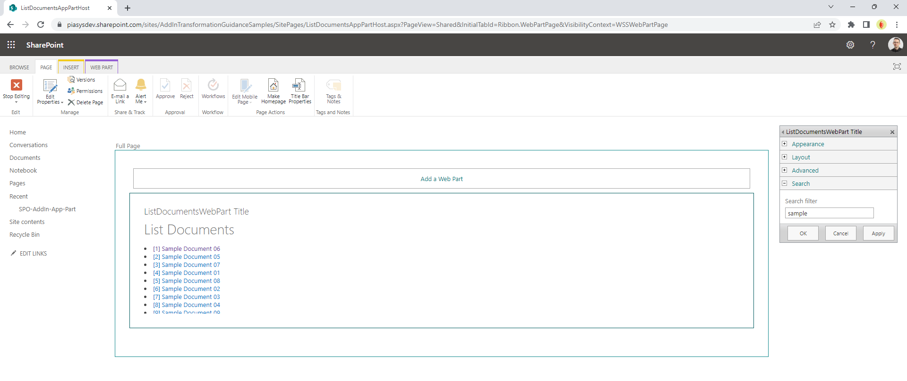
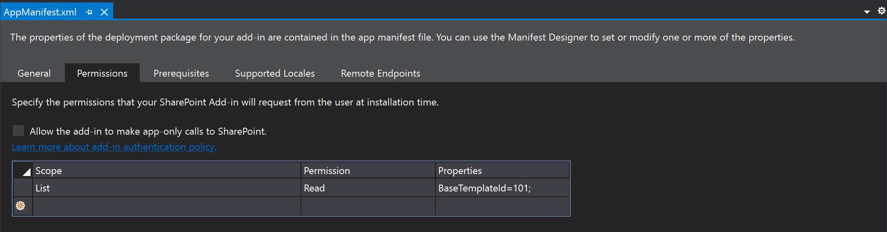
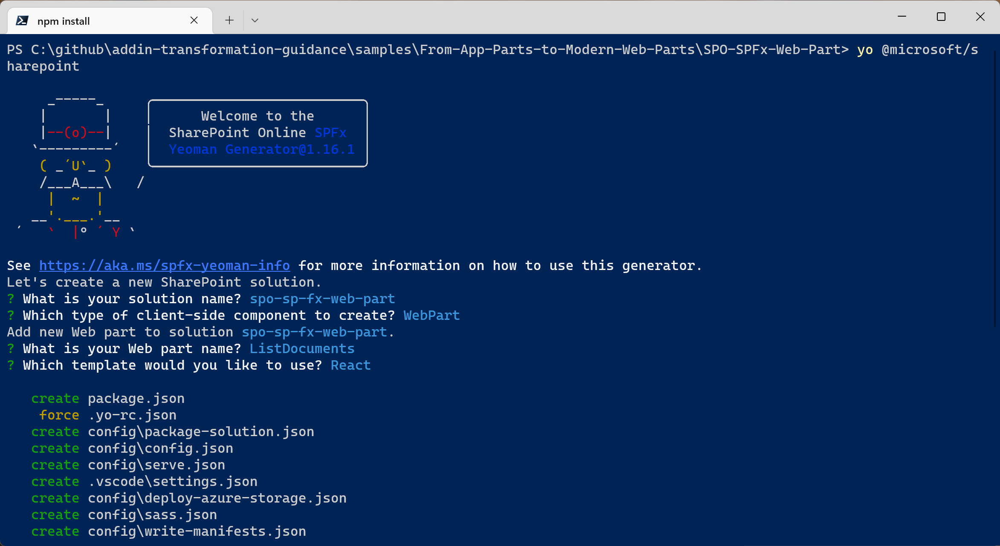
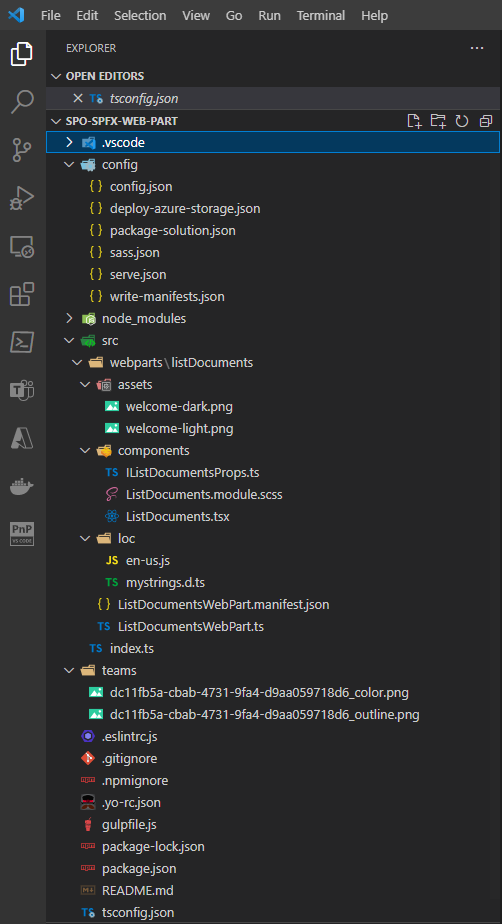
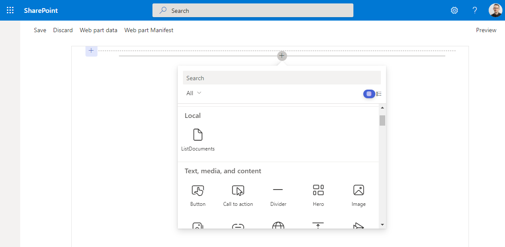
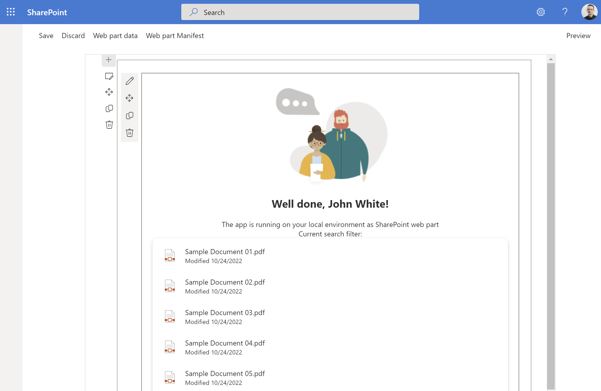

# Transform SharePoint add-in App Parts and classic web parts to SharePoint Framework web parts

In the SharePoint Add-in model, you're used to creating custom web parts for SharePoint classic pages by creating App Parts. In the new SharePoint Framework, you can achieve the same result both for classic and modern pages by creating client-side web parts.

In this article, you can find detailed information about how to transform an already existing App Part into a modern client-side web part.

If you prefer, you can watch the following video, instead of reading the whole article, which you can still consider as a much more detailed reference.

[](https://youtu.be/YFUt3pp6C1I)

> [!NOTE]
> You can find further details about creating SharePoint Framework web parts by reading the document [Build your first SharePoint client-side web part](../spfx/web-parts/get-started/build-a-hello-world-web-part.md).

## Transforming an App Part into a client-side web part

Imagine that you have an App Part to render the list of documents in the "Shared Documents" library of a site. The App Part is configurable, and allows to define a search filter on items. In the following screenshot, you can see the UI of the App Part.



Now you want to transform the App Part into a modern client-side web part built with SharePoint Framework.

### The SharePoint Add-in model solution to migrate from

In the following code excerpt, you can see the actual implementation of the App Part JavaScript code.

```JavaScript
var hostweburl;
var appweburl;
var clientContext;
var hostweb;
var documentsLibrary;
var docs;

// This code runs when the DOM is ready and creates a context object which is
// needed to use the SharePoint object model
$(document).ready(function () {
    hostweburl = decodeURIComponent(getQueryStringParameter("SPHostUrl"));
    appweburl = decodeURIComponent(getQueryStringParameter("SPAppWebUrl"));
    searchfilter = decodeURIComponent(getQueryStringParameter("SearchFilter"));

    clientContext = new SP.ClientContext.get_current();
    hostWebContext = new SP.AppContextSite(clientContext, hostweburl);
    hostweb = hostWebContext.get_web();
    listDocuments(searchfilter);
});

// This function retrieves the documents in the "Shared Documents" library of the parent site
function listDocuments(searchfilter) {
    documentsLibrary = hostweb.get_lists().getByTitle("Documents");
    if (searchfilter === undefined || searchfilter === '') {
        var camlQuery = SP.CamlQuery.createAllItemsQuery();
        docs = documentsLibrary.getItems(camlQuery);
    } else {
        var camlQuery = new SP.CamlQuery();
        var q = '<View><Query><Where><Contains><FieldRef ' +
            'Name="Title" /><Value Type="Text">' + searchfilter +
            '</Value></Contains></Where></Query></View>';
        camlQuery.set_viewXml(q);

        docs = documentsLibrary.getItems(camlQuery);
    }

    clientContext.load(docs);
    clientContext.executeQueryAsync(onListDocumentsSucceded, onListDocumentsFailed);
}

// In case of successful retrieval of the docs
function onListDocumentsSucceded(sender, args) {
    $("#listDocuments").empty();

    if (docs.get_count() > 0) {
        var docsEnumerator = docs.getEnumerator();

        $("#listDocuments").append('<ul>');
        while (docsEnumerator.moveNext()) {
            var doc = docsEnumerator.get_current();

            var docId = doc.get_item("ID");
            var docServerRedirectedEmbedUri = doc.get_serverRedirectedEmbedUri();
            var docTitle = doc.get_item("Title");

            $("#listDocuments").append('<li><a href="' + docServerRedirectedEmbedUri + '">[' + docId + '] ' + docTitle + '</a></li>');
        }
        $("#listDocuments").append('</ul>');
    }
}

// In case of failed retrieval of the docs
function onListDocumentsFailed(sender, args) {
    alert('Request failed ' + args.get_message() + '\n' + args.get_stackTrace());
}

function getQueryStringParameter(paramToRetrieve) {
    var params =
        document.URL.split("?")[1].split("&");
    var strParams = "";
    for (var i = 0; i < params.length; i = i + 1) {
        var singleParam = params[i].split("=");
        if (singleParam[0] == paramToRetrieve)
            return singleParam[1];
    }
}
```

As you can see the code is fully based on client-side code (JavaScript) and relies on the SharePoint JavaScript Object Model to retrieve a reference to the current site, to the library of "Shared Documents", and to query its documents based on the user's selected filter.

The App Part is then defined in an XML manifest file, where it's also defined the "Search Filter" parameter.

```xml
<?xml version="1.0" encoding="utf-8"?>
<Elements xmlns="http://schemas.microsoft.com/sharepoint/">
  <ClientWebPart Name="ListDocumentsWebPart" Title="ListDocumentsWebPart Title" Description="ListDocumentsWebPart Description" DefaultWidth="300" DefaultHeight="200">

    <!-- Content element identifies the location of the page that will render inside the client web part
         Properties are referenced on the query string using the pattern _propertyName_
         Example: Src="~appWebUrl/Pages/ClientWebPart1.aspx?Property1=_property1_" -->
    <Content Type="html" Src="~appWebUrl/Pages/ListDocumentsWebPart.aspx?{StandardTokens}&amp;SearchFilter=_SearchFilter_" />

    <!-- Define properties in the Properties element.
         Remember to put Property Name on the Src attribute of the Content element above. -->
    <Properties>
      <Property xmlns="http://schemas.microsoft.com/sharepoint/"
        Name="SearchFilter"
        DefaultValue=""
        Multilingual="true"
        PersonalizationScope="user"
        PersonalizableIsSensitive="true"
        Type="string"
        RequiresDesignerPermission="false"
        WebBrowsable= "true"
        WebCategory="Search"
        WebDescription="Define a custom search filter"
        WebDisplayName="Search filter">
      </Property>
    </Properties>

  </ClientWebPart>
</Elements>
```

In order to work, the SharePoint Add-in model solution requires the Read permission for libraries (BaseTemplate=101) defined in its *AppManifest.xml* file. In the following screenshot, you can see the configuration of the AppManifest.xml file.



### Creating a SharePoint Framework solution

Now let's create a new SharePoint Framework solution that you use to transform the previous SharePoint Add-in model solution.

First of all, you need to scaffold the SharePoint Framework solution, so start a command prompt or a terminal window, create a folder, and from within the newly created folder run the following command.

> [!IMPORTANT]
> In order to being able to follow the illustrated procedure, you need to have SharePoint Framework installed on your development environment. You can find detailed instructions about how to set up your environment reading the document [Set up your SharePoint Framework development environment](../spfx/set-up-your-development-environment.md).

```powershell
yo @microsoft/sharepoint
```



Follow the prompts to scaffold a solution for a modern web part. Specifically, make the following choices, when prompted by the tool:

* What is your solution name? **spo-sp-fx-web-part**
* Which type of client-side component to create? **WebPart**
* What is your Web part name? **ListDocuments**
* Which template would you like to use? **React**

With the above answers, you decided to create a solution with name *spo-sp-fx-web-part*, in which there's a web part with name *ListDocuments* and that is based on React to render its User Experience.

The scaffolding tool generates for you a new SharePoint Framework solution. When it's done, you can open the current folder using your favorite code editor. However, before opening the solution you need to add a package to have an easy and better looking rendering of the list of files in the target library. In fact, you're going to reference the Microsoft Graph Toolkit (MGT) library of components by running the following command:

```PowerShell
npm install @microsoft/mgt-spfx @microsoft/mgt-react --save
```

> [!NOTE]
> The Microsoft Graph Toolkit is a set of components to speed up the rendering of the UI of your client-side solutions, including SharePoint Framework solutions. It is not mandatory to use it in this sample solution, but it is an easy way to speed up your learning and development process. You can find detailed information about MGT reading the document [Microsoft Graph Toolkit overview](/graph/toolkit/overview) and you can learn how to integrate MGT with SharePoint Framework reading the document [SharePoint Framework library for Microsoft Graph Toolkit](/graph/toolkit/get-started/mgt-spfx).

> [!WARNING]
> Microsoft Graph Toolkit is deprecated and will be fully retired on August 28th, 2026. See more details from [Microsoft Graph Toolkit retirement](https://devblogs.microsoft.com/microsoft365dev/microsoft-graph-toolkit-retirement/).

Now you can open the solution in your favorite code editor. If your favorite code editor is Microsoft Visual Studio Code, run the following command:

```PowerShell
code .
```

In the following image, you can see the outline of the generated SharePoint Framework solution.



The main file, to start from is the *ListDocumentsWebPart.ts*, under the *src\webparts\listDocuments* folder. The file is based on TypeScript syntax, which is the one used by SharePoint Framework.

```TypeScript

// Here we intentionally removed some of the auto-generated code, for the sake of simplicity ...

export interface IListDocumentsWebPartProps {
  description: string;
}

export default class ListDocumentsWebPart extends BaseClientSideWebPart<IListDocumentsWebPartProps> {

  private _isDarkTheme: boolean = false;
  private _environmentMessage: string = '';

  public render(): void {
    const element: React.ReactElement<IListDocumentsProps> = React.createElement(
      ListDocuments,
      {
        description: this.properties.description,
        isDarkTheme: this._isDarkTheme,
        environmentMessage: this._environmentMessage,
        hasTeamsContext: !!this.context.sdks.microsoftTeams,
        userDisplayName: this.context.pageContext.user.displayName
      }
    );

    ReactDom.render(element, this.domElement);
  }

  protected onInit(): Promise<void> {
    return this._getEnvironmentMessage().then(message => {
      this._environmentMessage = message;
    });
  }

  // Here we intentionally removed some of the auto-generated code, for the sake of simplicity ...

  protected onDispose(): void {
    ReactDom.unmountComponentAtNode(this.domElement);
  }

  protected get dataVersion(): Version {
    return Version.parse('1.0');
  }

  protected getPropertyPaneConfiguration(): IPropertyPaneConfiguration {
    return {
      pages: [
        {
          header: {
            description: strings.PropertyPaneDescription
          },
          groups: [
            {
              groupName: strings.BasicGroupName,
              groupFields: [
                PropertyPaneTextField('description', {
                  label: strings.DescriptionFieldLabel
                })
              ]
            }
          ]
        }
      ]
    };
  }
}
```

The code excerpt illustrated above shows the main code excerpts of the *ListDocumentsWebPart.ts* file.

First of all, you can notice that the Web Part is declared as a TypeScript class with name *ListDocumentsWebPart*, which inherits from the base type `BaseClientSideWebPart<IListDocumentsWebPartProps>`.

The *BaseClientSideWebPart* type is provided by the base libraries of SharePoint Framework, while the interface *IListDocumentsWebPartProps* is defined just before the web part class declaration and it defines the configuration properties for your custom web part.

What used to be the list of `<Property />` elements in the XML manifest file of a SharePoint Add-in model solution, is now a list of properties defined in a TypeScript interface.

The property pane for configuring the properties of the web part is rendered thanks to the *getPropertyPaneConfiguration* method, which renders a field for each property. The rendering of the fields relies also on resource strings defined in external files declared within the SharePoint Framework solution, under the *src\webparts\listDocuments\loc* folder. The default language generated by the scaffolding tool is the US English one (en-us).

As such, if you want to provide the same documents filtering experience of the App Part, you can replace the interface definition with the following one:

```TypeScript
export interface IListDocumentsWebPartProps {
  searchFilter: string;
}
```

Then, you'll also need to update the *getPropertyPaneConfiguration* method implementation, like in the following code excerpt:

```TypeScript
  protected getPropertyPaneConfiguration(): IPropertyPaneConfiguration {
    return {
      pages: [
        {
          header: {
            description: strings.PropertyPaneDescription
          },
          groups: [
            {
              groupName: strings.BasicGroupName,
              groupFields: [
                PropertyPaneTextField('searchFilter', {
                  label: strings.SearchFilterFieldLabel
                })
              ]
            }
          ]
        }
      ]
    };
  }
```

Notice that the `PropertyPaneTextField` object in the *groupFields* was updated to handle the new *searchFilter* property. There's also a new resource string for the label of the field, which was created in the file *src\webparts\listDocuments\loc\mystrings.d.ts* and whose value is configured in the resource file *src\webparts\listDocuments\loc\en-us.js*.

Another interesting part of the web part code is the *render* method, where the scaffolded solution simply creates an instance of a React component that is defined in the *src\webparts\listDocuments\components* folder. As you can see, the React component receives a set of properties as input arguments to configure its behavior.

Since you replaced the *description* property in the *IListDocumentsWebPartProps* interface, you also need to update the render method accordingly, as you can see in the following code excerpt. Moreover, for the sake of being able to query the list of files using Microsoft Graph, the *render* method provides to the React component also the current Site ID, Web ID, and tenant name.

```TypeScript
public render(): void {
const element: React.ReactElement<IListDocumentsProps> = React.createElement(
    ListDocuments,
    {
    searchFilter: this.properties.searchFilter,
    tenantName: this.context.pageContext.site.absoluteUrl.substring(8,
        this.context.pageContext.site.absoluteUrl.indexOf('/', 8)),
    siteId: this.context.pageContext.site.id.toString(),
    webId: this.context.pageContext.web.id.toString(),
    isDarkTheme: this._isDarkTheme,
    environmentMessage: this._environmentMessage,
    hasTeamsContext: !!this.context.sdks.microsoftTeams,
    userDisplayName: this.context.pageContext.user.displayName
    }
);

ReactDom.render(element, this.domElement);
}
```

One more thing you need to do in your web part code is to initialize the MGT library. First of all, you'll need to reference the MGT library in the code file, by adding the following line in the top section of the file, right after all the *import* statements.

```TypeScript
import { Providers, SharePointProvider } from '@microsoft/mgt-spfx';
```

Then, replace the *onInit* method of the web part with the following code excerpt.

```TypeScript
protected onInit(): Promise<void> {

if (!Providers.globalProvider) {
    Providers.globalProvider = new SharePointProvider(this.context);
}

return this._getEnvironmentMessage().then(message => {
    this._environmentMessage = message;
});
}
```

As you can see, the new *onInit* method relies on `Providers.globalProvider` to set an instance of the `SharePointProvider` of MGT that you referenced before. The result of the above syntax is that MGT will be initialized and ready to use the SharePoint Framework security context in order to consume Microsoft Graph.

Now, in order to make your code to work, you have to update the React component to support the new *searchFilter* property, and the *tenantName*, *siteId*, and *webId* properties. Open the *src\webparts\listDocuments\components\IListDocumentsProps.ts* file and replace the description property with the *searchFilter* one. Then add three new properties named *tenantName*, *siteId*, and *webId* like it's illustrated in the following code excerpt.

```TypeScript
export interface IListDocumentsProps {
  searchFilter: string;
  tenantName: string;
  siteId: string;
  webId: string;
  isDarkTheme: boolean;
  environmentMessage: string;
  hasTeamsContext: boolean;
  userDisplayName: string;
}
```

Now open the *src\webparts\listDocuments\components\ListDocuments.tsx* file, which represents the React component that renders the User Experience of the modern web part. Import the *FileList* component from the MGT library and update the *render* method in order to replace the *description* property with the new *searchFilter* one.

> [!NOTE]
> You can find further information about the *FileList* component by reading the document [File list component in Microsoft Graph Toolkit](/graph/toolkit/components/file-list).

Lastly replace the whole return value of the render method, in order to show the value of the *searchFilter* property and the actual list of files using the *MgtFileList* component.

```TypeScript
import * as React from 'react';
import styles from './ListDocuments.module.scss';
import { IListDocumentsProps } from './IListDocumentsProps';
import { escape } from '@microsoft/sp-lodash-subset';
import { FileList } from '@microsoft/mgt-react/dist/es6/spfx';

export default class ListDocuments extends React.Component<IListDocumentsProps, {}> {
  public render(): React.ReactElement<IListDocumentsProps> {
    const {
      searchFilter,
      tenantName,
      siteId,
      webId,
      isDarkTheme,
      environmentMessage,
      hasTeamsContext,
      userDisplayName
    } = this.props;

    // If we have a value for searchFilter, let's use it, otherwise get the whole list of files
    const fileListQuery: string = searchFilter ?
      `/sites/${tenantName},${siteId},${webId}/drive/root/search(q='${escape(searchFilter)}')` :
      `/sites/${tenantName},${siteId},${webId}/drive/root/children`;

    return (
      <section className={`${styles.listDocuments} ${hasTeamsContext ? styles.teams : ''}`}>
        <div className={styles.welcome}>
          
          <h2>Well done, {escape(userDisplayName)}!</h2>
          <div>{environmentMessage}</div>
          <div>Current search filter: <strong>{escape(searchFilter)}</strong></div>
        </div>
        <div>
          <FileList fileListQuery={fileListQuery} />
        </div>
      </section>
    );
  }
}
```

As you can see, the code dynamically builds the URL of a Microsoft Graph query to retrieve the list of files in the "Shared Documents" folder of the current site. In case there's a value for the *searchFilter* property, it relies on a search query. If there's no value for the searchFilter property, it simply retrieves the whole list of files.

Then, inside the return statement of the *render* method there's an instance of the `FileList` React component of MGT, to render the actual list of files, providing the dynamic query as the value for the *fileListQuery* property.

As like as it was with the Add-in model App Part, also in SharePoint Framework you need to configure the permissions needed by your web part in order to consume the Microsoft Graph. You can do that by editing the */config/package-solution.json* file and creating a *WebApiPermissionRequests* section, like in the following code excerpt.

```JSON
{
  "$schema": "https://developer.microsoft.com/json-schemas/spfx-build/package-solution.schema.json",
  "solution": {
    "name": "spo-sp-fx-web-part-client-side-solution",
    "id": "06b2a772-deaa-4b4b-855b-e50bd8e935f0",
    "version": "1.0.0.0",
    "includeClientSideAssets": true,
    "skipFeatureDeployment": true,
    "isDomainIsolated": false,
    "developer": {
      "name": "",
      "websiteUrl": "",
      "privacyUrl": "",
      "termsOfUseUrl": "",
      "mpnId": "Undefined-1.16.1"
    },
    "webApiPermissionRequests": [
      {
        "resource": "Microsoft Graph",
        "scope": "Files.Read"
      }
    ],
```

Once you're done with your changes, you can build the SharePoint Framework solution and run it in debug. In order to do that, you need to update the content of the */config/serve.json* file to target your actual SharePoint online site where you want to test the web part.

```JSON
{
  "$schema": "https://developer.microsoft.com/json-schemas/spfx-build/spfx-serve.schema.json",
  "port": 4321,
  "https": true,
  "initialPage": "https://enter-your-SharePoint-site/_layouts/workbench.aspx"
}
```

Replace the value of the *initialPage* property with the URL of your target site collection.

Then, you can run the following command in the terminal window:

```PowerShell
gulp serve
```

A browser window starts and you see the SharePoint Framework Workbench, which is a page provided by SharePoint Online for debugging your SharePoint Framework components. Select the *Add* button and choose to add the custom *ListDocuments* web part to the page.



You see the following output.



If you select on the pencil, just beside the web part, you're able to show the property pane and to configure a search filter, which is applied to the list of files rendered by the *FileList* control.

## Recommended content

You can find additional information about this topic reading the following documents:

* [Set up your SharePoint Framework development environment](../spfx/set-up-your-development-environment.md)
* [Build your first SharePoint client-side web part](../spfx/web-parts/get-started/build-a-hello-world-web-part.md)
* [Microsoft Graph Toolkit overview](/graph/toolkit/overview)
* [File list component in Microsoft Graph Toolkit](/graph/toolkit/components/file-list)
