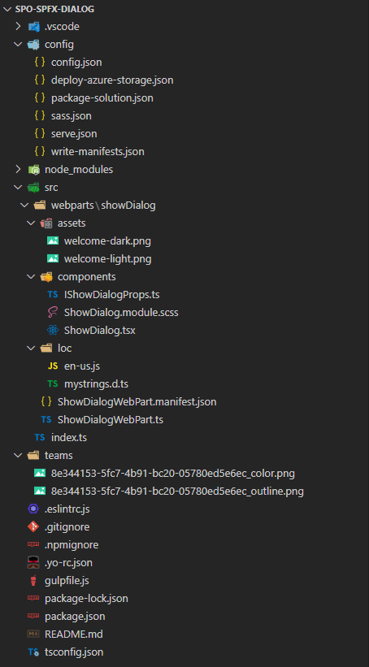

# Transform Add-in model Dialogs to modern Dialogs in SharePoint Framework

In the SharePoint Add-in model, you were used to rely on the JavaScript Object Model for SharePoint to show dialog windows, using syntax like as follows:

```JavaScript
// Sample syntax to show a dialog window
var options = SP.UI.$create_DialogOptions();
options.url = '{SiteUrl}/_layouts/MyAddin/' + 'MyAddinDialog.aspx';
options.autoSize = true;
options.dialogReturnValueCallback = Function.createDelegate(null, dialogCloseCallback);
this.dialog = SP.UI.ModalDialog.showModalDialog(options);

// Function to handle dialog close callback
function dialogCloseCallback(result, returnValue) {
  if (result == SP.UI.DialogResult.OK) {
    window.alert('You clicked OK! And selected a status of: ' + returnValue);
  } else if (result == SP.UI.DialogResult.cancel) {
    window.alert('You clicked Cancel!');
  } 

  SP.UI.ModalDialog.RefreshPage(result);
}
```

Just to make an example, the above code could be used in the action of a UI custom action, or inside the JavaScript of a web part, or in many other places.

Nowadays, with SharePoint Framework, you can rely on the SharePoint Framework Dialog Framework to achieve the same result and even more. In this article, you can find detailed information about how to transform classic modal dialogs of the SharePoint Add-in model into SharePoint Framework modern dialogs.

If you prefer, you can watch the following video, instead of reading the whole article, which you can still consider as a much more detailed reference.

[](https://youtu.be/HuQemEUWydM)

> [!NOTE]
> You can find further details about leveraging the SharePoint Framework Dialog Framework by reading the document [Use custom dialog boxes with SharePoint Framework Extensions](../spfx/extensions/guidance/using-custom-dialogs-with-spfx.md).

## Setting the context

Imagine that you have a custom web part with a "Create Task" button and, whenever a user selects on that button, you want to open a modal dialog to collect some information about a hypothetical task that is created. 

In the following screenshot, you can see how this solution should look like.


## Creating a SharePoint Framework solution

In order to achieve the above result, let's start by creating a new SharePoint Framework solution.

First of all, you need to scaffold the SharePoint Framework solution, so start a command prompt or a terminal window, create a folder, and from within the newly created folder run the following command.

> [!IMPORTANT]
> In order to being able to follow the illustrated procedure, you need to have SharePoint Framework installed on your development environment. You can find detailed instructions about how to set up your environment reading the document [Set up your SharePoint Framework development environment](https://learn.microsoft.com/en-us/sharepoint/dev/spfx/set-up-your-development-environment).


```PowerShell
yo @microsoft/sharepoint
```


Follow the prompts to scaffold a solution for a modern Application Customizer. Specifically, make the following choices, when prompted by the tool:

* What is your solution name? **spo-sp-fx-dialog**
* Which type of client-side component to create? **WebPart**
* What is your Web part name? **ShowDialog**
* Which template would you like to use? **React**

With the above answers, you decided to create a solution with name *spo-sp-fx-dialog*, in which there will be a custom web part with name *ShowDialog*. When the scaffolding is done, you can simply open the current folder using your favorite code editor. However, before opening the solution you need to add a package to have support for the SharePoint Framework Dialog Framework. You can do that by running the following commands:

```PowerShell
npm i @microsoft/sp-dialog --save
```

In fact, by default the scaffolded solution for a SharePoint Framework web part doesn't include the Dialog Framework package. Now you can open the solution in your favorite code editor. If your favorite code editor is Microsoft Visual Studio Code, simply run the following command:

```PowerShell
code .
```

In the following image, you can see the outline of the generated SharePoint Framework solution.



As you can see, under the *src/webparts* folder there's a subfolder with name *showDialog* that contains the basic scaffolding for the sample web part. Based on the choice made while generating the solution, the web part relies on React to render its user interface. As such, we can focus on the React component defined under the folder *components* of the web part subfolder.

### Defining the Dialog window

Add a new subfolder with name *sampleDialog* under the *components* subfolder and create three files in it:

* *ITaskDialogProps.tsx*: defines the configuration properties for the custom dialog window. 
* *ITaskDialogState.tsx*: defines the state for the custom dialog window.
* *TaskDialog.tsx*: represents the actual implementation of the dialog window.

In the following code excerpt, you can see the definition of the *ITaskDialogProps.tsx* interface.

```TypeScript
export interface ITaskDialogProps {
    onSave: (description: string, dueDate: Date) => Promise<void>;
    onClose: () => Promise<void>;
}
```

The interface simply defines a couple of methods that handle the events when the user saves the task and when the user selects on "Cancel" to close the dialog without saving the task.

Moreover, in the next code excerpt you can find the definition of the interface to hold the state of the dialog component.

```TypeScript
export interface ITaskDialogState {
    description?: string;
    dueDate?: Date;
}
```

It defines the state to keep track of the task description and due date. Lastly, in the next code excerpt, you can see the actual implementation of the dialog component.

```TypeScript
import * as React from 'react';
import * as ReactDOM from 'react-dom';
import { ITaskDialogProps } from './ITaskDialogProps';
import { ITaskDialogState } from './ITaskDialogState';

import { BaseDialog, IDialogConfiguration } from '@microsoft/sp-dialog';
import {
    TextField,
    DatePicker,
    DayOfWeek,
    DefaultButton,
    PrimaryButton,
    DialogFooter,
    DialogContent
} from '@fluentui/react/lib';

class TaskDialogContent extends
    React.Component<ITaskDialogProps, ITaskDialogState> {
    
    constructor(props: ITaskDialogProps) {
        super(props);

        this.state = {
            description: '',
            dueDate: new Date()
        };
    }
    
    public render(): JSX.Element {
        return (<div>
            <DialogContent
                title="Create Task"
                onDismiss={this.props.onClose}>

            <div>
                <div>
                    <TextField label="Task description"
                        onChange={this._onDescriptionChange}
                        value={this.state.description} />
                </div>
                <div>
                    <DatePicker label="Task due date"
                        firstDayOfWeek={DayOfWeek.Monday}
                        placeholder="Select a due date..."
                        ariaLabel="Select a due date"
                        onSelectDate={this._onDueDateSelected}
                        value={this.state.dueDate} />
                </div>
            </div>

            <DialogFooter>
                <DefaultButton text="Cancel"
                        title="Cancel" onClick={this.props.onClose} />
                <PrimaryButton text="Create Task"
                        title="Create Task" onClick={async () => { await this.props.onSave(this.state.description, this.state.dueDate); }} />
            </DialogFooter>
        </DialogContent>
    </div>);
    }

    private _onDescriptionChange = (event: React.FormEvent<HTMLInputElement | HTMLTextAreaElement>, newValue?: string): void => {
        this.setState({ description: newValue });
    }

    private _onDueDateSelected = (date: Date): void => {
        this.setState({ dueDate: date });
    }
}

export default class TaskDialog extends BaseDialog {

    /**
     * Constructor for the dialog window
     */
    constructor(
        public onSave: (description: string, dueDate: Date) => Promise<void>,
        public onClose: () => Promise<void>) {
        super({isBlocking: true});
    }
  
    public render(): void {
        ReactDOM.render(<TaskDialogContent
                onSave={this._save}
                onClose={this._close}
            />,
            this.domElement);
    }
  
    public getConfig(): IDialogConfiguration {
      return {
        isBlocking: true
      };
    }

    protected onAfterClose(): void {
        ReactDOM.unmountComponentAtNode(this.domElement);
    }

    private _save = async (description: string, dueDate: Date): Promise<void> => {
        await this.close();
        await this.onSave(description, dueDate);
    }
  
    private _close = async (): Promise<void> => {
        await this.close();
        await this.onClose();
    }
}
```

The file defines a React component with name *TaskDialogContent* that renders the actual user interface of the dialog. You can see that the *render* method creates an instance of the *DialogContent* component of Fluent UI as well as of the *DialogFooter* to provide the "Cancel" and "Create Task" buttons.

> [!NOTE]
> You can find further details about leveraging the Fluent UI Framework by reading the document [Fluent UI - Get Started](https://developer.microsoft.com/en-us/fluentui).

The dialog component itself is then defined by the *TaskDialog* class, which inherits from the `BaseDialog` type of `@microsoft/sp-dialog` and accepts two methods in its constructor. Those two methods match the *onSave* and *onClose* events signatures and allow to provide the handlers to implement the save and close logic. In the *render* method of the *TaskDialog* component, you simply create an instance of the *TaskDialogContent* component.

Last but not least, the *ShowDialog.tsx* React component scaffolded in the *components* subfolder of the web part needs to be updated accordingly to the following implementation.

```TypeScript
import * as React from 'react';
import styles from './ShowDialog.module.scss';
import { IShowDialogProps } from './IShowDialogProps';
import { escape } from '@microsoft/sp-lodash-subset';
import { PrimaryButton } from '@fluentui/react/lib';

import TaskDialog from './sampleDialog/TaskDialog';

export default class ShowDialog extends React.Component<IShowDialogProps, {}> {
  public render(): React.ReactElement<IShowDialogProps> {
    const {
      isDarkTheme,
      environmentMessage,
      hasTeamsContext,
      userDisplayName
    } = this.props;

    return (
      <section className={`${styles.showDialog} ${hasTeamsContext ? styles.teams : ''}`}>
        <div className={styles.welcome}>
          
          <h2>Well done, {escape(userDisplayName)}!</h2>
          <div>{environmentMessage}</div>
        </div>
        <div style={{textAlign: 'center', marginTop: '10px'}}>
          <PrimaryButton text='Create Task' onClick={this._createTask} />
        </div>
      </section>
    );
  }

  private _createTask = async (): Promise<void> => {
    const taskDialog = new TaskDialog(
      async (description, dueDate) => {
        alert(`You asked to create the task '${description}' with due date on: ${dueDate}`); },
      async () => alert('You closed the dialog!')
    );
    
    await taskDialog.show();
  }
}
```

The *render* method of the component simply renders a button in the middle of the screen and by clicking on that button you activate the *_createTask* handler. Internally, the handler creates a new instance of the custom *TaskDialog*, providing the save and cancel handlers to the constructor. Then the *_createTask* handler invokes the asynchronous method *show* of the dialog component.

## Recommended content

You can find additional information about this topic reading the following documents:

* [Use custom dialog boxes with SharePoint Framework Extensions](../spfx/extensions/guidance/using-custom-dialogs-with-spfx.md)