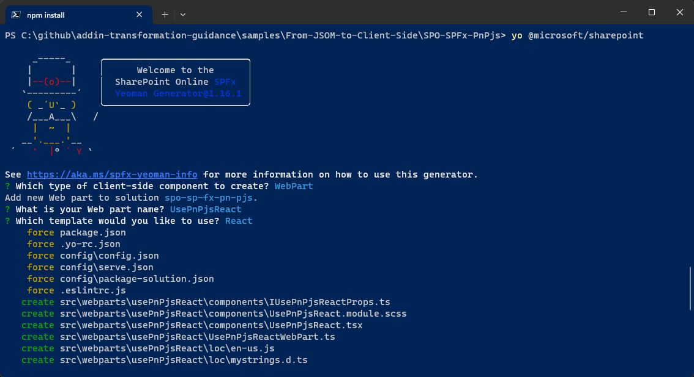

# Upgrading your code from SharePoint JavaScript Object Model (JSOM) to Client-side code and PnPjs

While developing solutions with the SharePoint Add-in model you used to rely on the SharePoint JavaScript Object Model (JSOM) to consume SharePoint Online from client-side code. For example, you used to get a reference to the client context with the following syntax.

> [!IMPORTANT]
> This article refers to so called PnP components, samples and/or tooling which are open-source assets backed by an active community providing support for them. There is no SLA for open-source tool support from official Microsoft support channels. These components or samples are however using Microsoft supported out of the box APIs and features which are supported by Microsoft.

```JavaScript
var context = SP.ClientContext.get_current();
var user = context.get_web().get_currentUser();
```

Or you used to get the items of a library in a target SharePoint Online host site using the following syntax.

```JavaScript
// Get a reference to the current host web
var clientContext = SP.ClientContext.get_current();
var hostWebContext = new SP.AppContextSite(clientContext, hostweburl);
var hostweb = hostWebContext.get_web();

// Get a reference to the 'Documents' library
var list = hostweb.get_lists().getByTitle("Documents");

// Define a query to get all the items
var camlQuery = SP.CamlQuery.createAllItemsQuery();
var docs = documentsLibrary.getItems(camlQuery);

// Load and execute the actual query
clientContext.load(docs);
clientContext.executeQueryAsync(
    // Success callback
    function() {
        // Iterate through the items and display their titles
        var docsEnumerator = docs.getEnumerator();
        while (docsEnumerator.moveNext()) {
            var doc = docsEnumerator.get_current();
            console.log(doc.get_item('Title'));
        }
    },
    // Failure callback
    function(sender, args) {
        console.log('Request failed. ' + args.get_message() + '\n' + args.get_stackTrace());
    }
);
```

The above syntax is based on JSOM (sp.js) and is really tight to the SharePoint Add-in model architecture, because for example it relies on having the SharePoint tokens in the URL of a SharePoint-hosted site.

If you prefer, you can watch the following video, instead of reading the whole article, which you can still consider as a much more detailed reference.

[](https://youtu.be/ipqQiJ_MbNM)

## Consuming SharePoint Online Data in SharePoint Framework

In the modern development model for SharePoint Online, the JSOM library is not anymore a suitable option and you should rely on SharePoint Online REST APIs or on Microsoft Graph APIs. For example, if you are developing a SharePoint Framework solution, you can rely on the *SPHttpClient* and on the *MSGraphClientV3* objects of the SPFx context to consume the SharePoint REST APIs or the Microsoft Graph APIs, respectively.

### Consuming SharePoint Online Data via *SPHttpClient*

For example, in the following code excerpt you can see how to consume the same list of documents of the above sample, while in SPFx via *SPHttpClient*.

```TypeScript
import { Version } from '@microsoft/sp-core-library';
import { BaseClientSideWebPart } from '@microsoft/sp-webpart-base';

import styles from './ConsumeSpoViaClientCodeWebPart.module.scss';

// Import spHttpClient
import { SPHttpClient, SPHttpClientResponse } from '@microsoft/sp-http';

// Define interface for each list item
export interface IListItem {
  Title?: string;
  Id: number;
}

// Define interface for list item collection
export interface ISPListItems {
  value: IListItem[];
}

export interface IConsumeSpoViaClientCodeWebPartProps {
}

export default class ConsumeSpoViaClientCodeWebPart extends BaseClientSideWebPart<IConsumeSpoViaClientCodeWebPartProps> {

  private _docs: ISPListItems;

  public render(): void {
    // For each document in the list, render a <li/> HTML element
    let docsOutput = '';
    this._docs.value.forEach(d => { docsOutput += `<li>${d.Title}</li>`; });
    this.domElement.innerHTML = `<div class="${ styles.consumeSpoViaClientCode }"><ul>${docsOutput}</ul></div>`;
  }

  protected async onInit(): Promise<void> {
    // Load all the documents onInit
    this._docs = await this._getDocuments();
    return super.onInit();
  }

  protected get dataVersion(): Version {
    return Version.parse('1.0');
  }

  // Get list items using spHttpClient
  private _getDocuments = async (): Promise<ISPListItems> => {
    // Get the REST response of the SharePoint REST API and return as collection of items
    return this.context.spHttpClient.get(this.context.pageContext.web.absoluteUrl + 
        `/_api/web/lists/GetByTitle('Documents')/items`, 
        SPHttpClient.configurations.v1)
      .then((response: SPHttpClientResponse) => {
        return response.json();
    });
  }
}
```

The code is taken from a SharePoint Framework Web Part that shows the list of files in the "Documents" library of the current site.

Notice that you don't have to rely on any querystring tokens or paramenters and you can simply query the *this.context.spHttpClient* to make an HTTP GET request to the SharePoint REST API for accessing the items of the "Documents" document library. You can also use the same *this.context.spHttpClient* object to make a POST HTTP request or any other HTTP request via the *fetch* method. However, despite the code is quite simple and trivial, you need to be aware of the SharePoint REST API URL to invoke and about the JSON structure of the response, which in some scenarios could be a challenge.

Nevertheless, using the above technique you can basically do whatever you need, simply consuming SharePoint Online via REST.

> [!NOTE]
> You can dig into consuming SharePoint Online REST API in SharePoint Framework by reading the article [Connect to SharePoint APIs](https://learn.microsoft.com/en-us/sharepoint/dev/spfx/connect-to-sharepoint).

### Consuming SharePoint Online Data via *MSGraphClient*

Another option that you have is to consume the SharePoint Online data using the Microsoft Graph API. Here you can find a sample code excerpt of a Web Part consuming the same list of documents but using Microsoft Graph and the *MSGraphClientV3* object. 

```TypeScript
import { Version } from '@microsoft/sp-core-library';
import { BaseClientSideWebPart } from '@microsoft/sp-webpart-base';

import styles from './ConsumeSpoViaGraphWebPart.module.scss';

import { MSGraphClientV3 } from '@microsoft/sp-http';

// Define interface for each list item
export interface IListItem {
  name?: string;
  id: number;
}

// Define interface for list item collection
export interface ISPListItems {
  value: IListItem[];
}

export interface IConsumeSpoViaGraphWebPartProps {
}

export default class ConsumeSpoViaGraphWebPart extends BaseClientSideWebPart<IConsumeSpoViaGraphWebPartProps> {

  private _docs: ISPListItems;

  public render(): void {
    // For each document in the list, render a <li/> HTML element
    let docsOutput = '';
    this._docs.value.forEach(d => { docsOutput += `<li>${d.name}</li>`; });
    this.domElement.innerHTML = `<div class="${ styles.consumeSpoViaGraph }"><ul>${docsOutput}</ul></div>`;
  }

  protected async onInit(): Promise<void> {
    await super.onInit();

    // Load all the documents onInit
    this._docs = await this._getDocuments();
  }

  protected get dataVersion(): Version {
    return Version.parse('1.0');
  }

  // Get list items using spHttpClient
  private _getDocuments = async (): Promise<ISPListItems> => {
    // Get the REST response of the SharePoint REST API and return as collection of items
    const graphClient: MSGraphClientV3 = await this.context.msGraphClientFactory.getClient("3");
    return graphClient.api(`/sites/${this.context.pageContext.site.id}/drive/root/children`)
      .version('v1.0')
      .get();
  }
}
```

As like as with *SPHttpClient* the syntax is not too complex, and by knowning what the Microsoft Graph API endpoints that you need are and the structure of the JSON responses, you can easily consume any data in SharePoint Online or any other service in the Microsoft 365 ecosystem, as long as you will have proper permissions granted to your SharePoint Framework solution.

> [!NOTE]
> You can dig into consuming Microsoft Graph API in SharePoint Framework by reading the article [Use the MSGraphClientV3 to connect to Microsoft Graph](https://learn.microsoft.com/en-us/sharepoint/dev/spfx/use-msgraph).

## Introducing the PnPjs Library

[PnPjs](https://pnp.github.io/pnpjs/) is an open source client-side library, implemented by the community for the community, that provides a collection of fluent libraries to consume SharePoint Online, Microsoft Graph, and Microsoft 365 REST APIs in a type-safe way.
You can use PnPjs in SharePoint Framework solutions, on in Node.js modules (like scripts, Azure Functions, etc.), on in any JavaScript or client-side based solution.

### Consuming SharePoint Online Data via PnPjs

In order to consume SharePoint Online data with PnPjs in a SharePoint Framework Web Part you need to import via *npm* one or more of the libraries offered by PnPjs. Let's create a SharePoint Framework Web Part project and do it step by step.

First of all, you need to scaffold the SharePoint Framework solution, so start a command prompt or a terminal window, create a folder, and from within the newly created folder run the following command.

> [!IMPORTANT]
> In order to being able to follow the illustrated procedure, you need to have SharePoint Framework installed on your development environment. You can find detailed instructions about how to set up your environment reading the document [Set up your SharePoint Framework development environment](https://learn.microsoft.com/en-us/sharepoint/dev/spfx/set-up-your-development-environment).


```PowerShell
yo @microsoft/sharepoint
```


Follow the prompts to scaffold a solution for a modern web part. Specifically, make the following choices, when prompted by the tool:

* What is your solution name? **spo-sp-fx-pn-pjs**
* Which type of client-side component to create? **WebPart**
* What is your Web part name? **UsePnPjsMinimal**
* Which template would you like to use? **Minimal**

With the above answers, you decided to create a solution with name *spo-sp-fx-pn-pjs*, in which there will be a web part with name *UsePnPjsMinimal* and that will be based on the *Minimal* template, meaning that it will be based on HTML, CSS, and JavaScript code only.

The scaffolding tool will generate for you a new SharePoint Framework solution. When it's done you can simply open the current folder using your favorite code editor. However, before opening the solution you will need to add the PnPjs packages by running the following command:

```PowerShell
npm install @pnp/sp @pnp/graph @pnp/logging --save
```

The above command installs the *@pnp/sp* and the *@pnp/graph* packages in the current solution, together with @pnp/logging for logging purposes. Overall, the available packages of PnPjs are:

|     ||  |
| ---| -------------|-------------|
| @pnp/| | |
|| [core](./packages#core)  | Provides shared functionality across all pnp libraries |
|| [graph](./packages#graph) | Provides a fluent api for working with Microsoft Graph |
|| [logging](./packages#logging) | Light-weight, subscribable logging framework |
|| [msaljsclient](./concepts/authentication.md#MSAL-in-Browser)  | Provides an msal wrapper suitable for use with PnPjs |
|| [nodejs](./packages#nodejs) | Provides functionality enabling the @pnp libraries within nodejs |
|| [queryable](./packages#queryable) | Provides shared query functionality and base classes |
|| [sp](./packages#sp) | Provides a fluent api for working with SharePoint REST |
|| [sp-admin](./packages#sp-admin) | Provides a fluent api for working with M365 Tenant admin methods |

Now you can open the solution in your favorite code editor. If your favorite code editor is Microsoft Visual Studio Code, simply run the following command:

```PowerShell
code .
```

First of all, you need to import the PnPjs types that you need to consume SharePoint Online data. So, open the web part source file and add the following *import* statements.

```TypeScript
import { spfi, SPFx } from "@pnp/sp";
import "@pnp/sp/webs";
import "@pnp/sp/lists";
import "@pnp/sp/items";
```

The very first import statement imports the initialization types for PnPjs, while the subsequent import statements simply import the types needed to work with web objects, list objects, and list item objects. Once you have done that, you can implement a method like the one in the following code excerpt, to load the documents in the "Documents" library.

```TypeScript
// Get list items using PnPjs
private _getDocuments = async (): Promise<IListItem[]> => {

  // Initialized PnPjs
  const sp = spfi().using(SPFx(this.context));
  const items: IListItem[] = await sp.web.lists.getByTitle('Documents').items();
  
  return items;
}
```

As you can see, the syntax is really simple and straightforward. In fact, the code initializes a new instance of an object of type *SPFI* (stands for SharePoint Factory Interface) providing the *context* object of SharePoint Framework, where *SPFI* is a type of PnPjs. Then, using the just initialized *sp* object it relies on a fluent syntax to collect the items of the list with title "Documents" in the current web.

In the following code excerpt you can see the whole code of the web part.

```TypeScript
import { Version } from '@microsoft/sp-core-library';
import { BaseClientSideWebPart } from '@microsoft/sp-webpart-base';

import { spfi, SPFx } from "@pnp/sp";
import "@pnp/sp/webs";
import "@pnp/sp/lists";
import "@pnp/sp/items";

import styles from './UsePnPjsMinimalWebPart.module.scss';

// Define interface for each list item
export interface IListItem {
  Title?: string;
  Id: number;
}

export interface IUsePnPjsMinimalWebPartProps {
}

export default class UsePnPjsMinimalWebPart extends BaseClientSideWebPart<IUsePnPjsMinimalWebPartProps> {

  private _docs: IListItem[];

  public render(): void {
    // For each document in the list, render a <li/> HTML element
    let docsOutput = '';
    this._docs.forEach(d => { docsOutput += `<li>${d.Title}</li>`; });
    this.domElement.innerHTML = `<div class="${ styles.usePnPjsMinimal }"><ul>${docsOutput}</ul></div>`;
  }

  protected async onInit(): Promise<void> {
    // Load all the documents onInit
    this._docs = await this._getDocuments();
    return await super.onInit();
  }

  protected get dataVersion(): Version {
    return Version.parse('1.0');
  }

  // Get list items using PnPjs
  private _getDocuments = async (): Promise<IListItem[]> => {

    // Initialized PnPjs
    const sp = spfi().using(SPFx(this.context));
    const items: IListItem[] = await sp.web.lists.getByTitle('Documents').items();
    
    return items;
  }
}
```

The fluent syntax of PnPjs reminds also the syntax that you used to used with CSOM or JSOM in the classic SharePoint Add-in model.

### Using PnPjs in a React Web Part

Now that you have seen how to read SharePoint data in basic JavaScript code, let's move to a more real and common use case, which is using PnPjs in a React Web Part with SharePoint Framework.

Open a command prompt and go to the same folder of the previous SPFx solution, then run again the SPFx scaffolding tool running the following command.

```PowerShell
yo @microsoft/sharepoint
```

When you execute the scaffolding tool multiple times against the same solution, it will allow you to add additional artifacts or components to the already existing solution.



Follow the prompts to scaffold a solution for a modern web part. Specifically, make the following choices, when prompted by the tool:

* Which type of client-side component to create? **WebPart**
* What is your Web part name? **UsePnPjsReact**
* Which template would you like to use? **React**

With the above answers, you decided to add another web part to the solution. The new web part name will be *UsePnPjsReact* and it will use the *React* template for the UI/UX.

Now, you could potentially initialize the PnPjs SPFI object like in the previous example and pass it to the React component rendering the web part as a custom property. For example, the interface defining the properties for the React component could be like in the following code.

```TypeScript
import { SPFI } from "@pnp/sp";

export interface IUsePnPjsReactProps {
  description: string;
  isDarkTheme: boolean;
  environmentMessage: string;
  hasTeamsContext: boolean;
  userDisplayName: string;
  sp: SPFI;
}
```

And the web part could initialize the React component like in the following code excerpt.

```TypeScript
export default class UsePnPjsReactWebPart extends BaseClientSideWebPart<IUsePnPjsReactWebPartProps> {

  private _isDarkTheme: boolean = false;
  private _environmentMessage: string = '';
  private _sp: SPFI;

  public render(): void {
    const element: React.ReactElement<IUsePnPjsReactProps> = React.createElement(
      UsePnPjsReact,
      {
        description: this.properties.description,
        isDarkTheme: this._isDarkTheme,
        environmentMessage: this._environmentMessage,
        hasTeamsContext: !!this.context.sdks.microsoftTeams,
        userDisplayName: this.context.pageContext.user.displayName,
        sp: this._sp
      }
    );

    ReactDom.render(element, this.domElement);
  }

  protected async onInit(): Promise<void> {
    // Initialized PnPjs
    this._sp = spfi().using(SPFx(this.context));

    return this._getEnvironmentMessage().then(message => {
      this._environmentMessage = message;
    });
  }

  // Omitted code, for the sake of simplicity ...
```

And lastly, in the React component, you could rely on the *sp* property available in the component properties to use the PnPjs fluent syntax and retrieve the items in the target library. Here follows an uber-simplified example of this logic.

```TypeScript
import * as React from 'react';
import styles from './UsePnPjsReact.module.scss';
import { IUsePnPjsReactProps } from './IUsePnPjsReactProps';
import { IUsePnPjsReactState } from './IUsePnPjsReactState';

import "@pnp/sp/webs";
import "@pnp/sp/lists";
import "@pnp/sp/items";

export default class UsePnPjsReact extends React.Component<IUsePnPjsReactProps, IUsePnPjsReactState> {

  constructor(props: IUsePnPjsReactProps) {
    super(props);
    
    this.state = {
      documents: []
    }
  }

  override async componentDidMount(): Promise<void> {

    const docs = await this.props.sp.web.lists.getByTitle("Documents").items<{Id: number; Title: string;}[]>();

    this.setState({
      documents: docs
    });
  }

  public render(): React.ReactElement<IUsePnPjsReactProps> {
    const {
      isDarkTheme,
      hasTeamsContext
    } = this.props;

    const {
      documents
    } = this.state;

    return (
      <section className={`${styles.usePnPjsReact} ${hasTeamsContext ? styles.teams : ''}`}>
        <div className={styles.welcome}>
          
        </div>
        <div>
          <h3>Here are the documents!</h3>
          <ul className={styles.links}>
            { documents.map(d => <li key={d.Id}>{d.Title}</li>)}
          </ul>
        </div>
      </section>
    );
  }
}
```

However, it might be that in your solutions you need to use PnPjs from multiple React components, and providing the SPFI object instance to all the components as a property is not necessarily the best option, or a best practice either.

To improve your code quality, you should create a file in your solution, for example call it *pnpjsConfig.ts*, with the following content.

```TypeScript
import { WebPartContext } from "@microsoft/sp-webpart-base";

// import pnp and pnp logging system
import { spfi, SPFI, SPFx } from "@pnp/sp";
import { LogLevel, PnPLogging } from "@pnp/logging";
import "@pnp/sp/webs";
import "@pnp/sp/lists";
import "@pnp/sp/items";
import "@pnp/sp/batching";

// eslint-disable-next-line no-var
var _sp: SPFI = null;

export const getSP = (context?: WebPartContext): SPFI => {
  if (!!context) { // eslint-disable-line eqeqeq
    //You must add the @pnp/logging package to include the PnPLogging behavior it is no longer a peer dependency
    // The LogLevel set's at what level a message will be written to the console
    _sp = spfi().using(SPFx(context)).using(PnPLogging(LogLevel.Warning));
  }
  return _sp;
};
```

The file exports a function that builds a new instance of SPFI, based on a provided optional SPFx context. If you invoke the function without providing the context, it will try to reuse a previously created SPFI instance, if any.

> [!NOTE]
> You can find additional information about this pattern by reading [Project Config/Services Setup](https://pnp.github.io/pnpjs/concepts/project-preset/), and you can find a fully functional example of this pattern on GitHub in the sample solution [Using @pnp/js and ReactJS](https://github.com/pnp/sp-dev-fx-webparts/tree/main/samples/react-pnp-js-sample).

Once you have defined the *pnpjsConfig.ts* file, you can import it in the web part class and invoke the *getSP* method from within the *onInit* method of the web part, like it is illustrated in the following code excerpt.

```TypeScript
import * as React from 'react';
import * as ReactDom from 'react-dom';
import { Version } from '@microsoft/sp-core-library';
import {
  IPropertyPaneConfiguration,
  PropertyPaneTextField
} from '@microsoft/sp-property-pane';
import { BaseClientSideWebPart } from '@microsoft/sp-webpart-base';
import { IReadonlyTheme } from '@microsoft/sp-component-base';

import * as strings from 'UsePnPjsReactBetterWebPartStrings';
import UsePnPjsReactBetter from './components/UsePnPjsReactBetter';
import { IUsePnPjsReactBetterProps } from './components/IUsePnPjsReactBetterProps';

// Import the getSP function from the pnpjsConfig file
import { getSP } from '../../pnpjsConfig';

export interface IUsePnPjsReactBetterWebPartProps {
  description: string;
}

export default class UsePnPjsReactBetterWebPart extends BaseClientSideWebPart<IUsePnPjsReactBetterWebPartProps> {

  private _isDarkTheme: boolean = false;
  private _environmentMessage: string = '';

  public render(): void {
    const element: React.ReactElement<IUsePnPjsReactBetterProps> = React.createElement(
      UsePnPjsReactBetter,
      {
        description: this.properties.description,
        isDarkTheme: this._isDarkTheme,
        environmentMessage: this._environmentMessage,
        hasTeamsContext: !!this.context.sdks.microsoftTeams,
        userDisplayName: this.context.pageContext.user.displayName
      }
    );

    ReactDom.render(element, this.domElement);
  }

  protected onInit(): Promise<void> {

    //Initialize our _sp object that we can then use in other packages without having to pass around the context.
    //  Check out pnpjsConfig.ts for an example of a project setup file.
    getSP(this.context);

    return this._getEnvironmentMessage().then(message => {
      this._environmentMessage = message;
    });
  }

  // Omitted code, for the sake of simplicity ...
```

Now, wherever you will need to access PnPjs, you can simply import the *getSP* function and invoke it without providing any argument to get back the already initialized *SPFI* object instance. For example, in any React component of your solution, you can write syntax like the following one.

```TypeScript
import * as React from 'react';
import styles from './UsePnPjsReactBetter.module.scss';
import { IUsePnPjsReactBetterProps } from './IUsePnPjsReactBetterProps';
import { IUsePnPjsReactBetterState } from './IUsePnPjsReactBetterState';

import { SPFI } from "@pnp/sp";
import "@pnp/sp/webs";
import "@pnp/sp/lists";
import "@pnp/sp/items";

import { getSP } from '../../../pnpjsConfig';

export default class UsePnPjsReactBetter extends React.Component<IUsePnPjsReactBetterProps, IUsePnPjsReactBetterState> {

  private _sp: SPFI;

  constructor(props: IUsePnPjsReactBetterProps) {
    super(props);

    this.state = {
      documents: []
    }
    
    this._sp = getSP();
  }

  override async componentDidMount(): Promise<void> {

    const docs = await this._sp.web.lists.getByTitle("Documents").items<{Id: number; Title: string;}[]>();

    this.setState({
      documents: docs
    });
  }

  public render(): React.ReactElement<IUsePnPjsReactBetterProps> {
    const {
      isDarkTheme,
      hasTeamsContext
    } = this.props;

    const {
      documents
    } = this.state;

    return (
      <section className={`${styles.usePnPjsReactBetter} ${hasTeamsContext ? styles.teams : ''}`}>
        <div className={styles.welcome}>
          
        </div>
        <div>
          <h3>Here are the documents!</h3>
          <ul className={styles.links}>
            { documents.map(d => <li key={d.Id}>{d.Title}</li>)}
          </ul>
        </div>
      </section>
    );
  }
}
```

Notice the syntax in the constructor, where the *getSP* function is invoked.

```TypeScript
this._sp = getSP();
```

Moreover, notice the usage of the retrieved *SPFI* instance, for example in the *componentDidMount* method. 

```TypeScript
const docs = await this._sp.web.lists.getByTitle("Documents").items<{Id: number; Title: string;}[]>();
```

The one you have just seen is a very common pattern when using PnPjs in React based web parts, and you should rely on it in your own solutions.

> [!IMPORTANT]
> There are scenarios where you need to use PnPjs in a service class that supports your business logic. In such scenarios, you do not necessarily have a React component and you cannot necessarily rely on the SPFx context object, unless you provide it to the service class as an input argument, for example in the constructor of the service class. However and generally speaking, passing the SPFx context as a constructor parameter or as a React component property is not a good design pattern. If you need to create a service class that relies on PnPjs in SPFx you can refer to the [Use a service class](https://pnp.github.io/pnpjs/concepts/project-preset/#use-a-service-class) design pattern.

## Recommended content 

You can find additional information about this topic reading the following documents:

* [PnPjs](https://pnp.github.io/pnpjs/)
* [PnPjs Getting Started](https://pnp.github.io/pnpjs/getting-started/)
* [Project Config/Services Setup](https://pnp.github.io/pnpjs/concepts/project-preset/)
