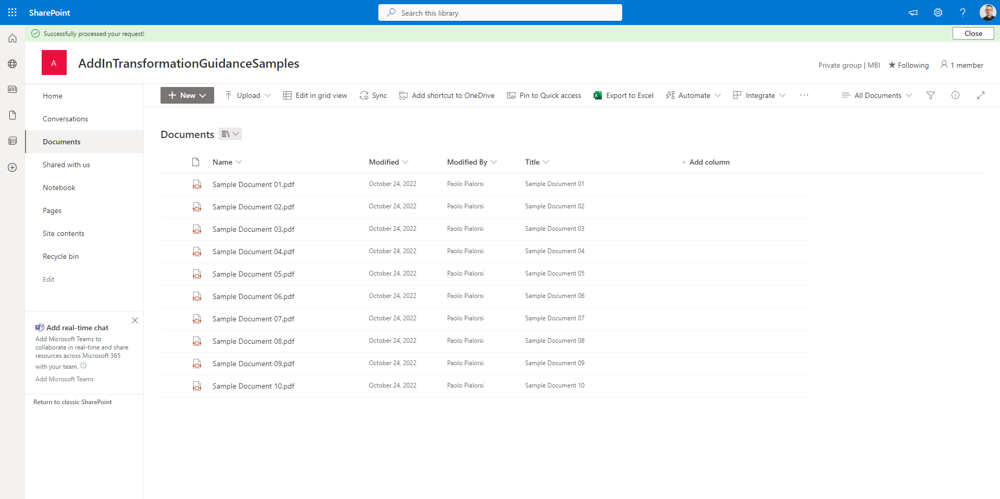
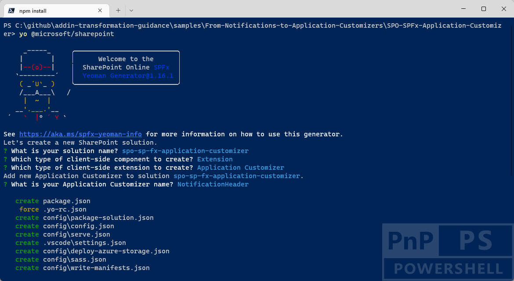
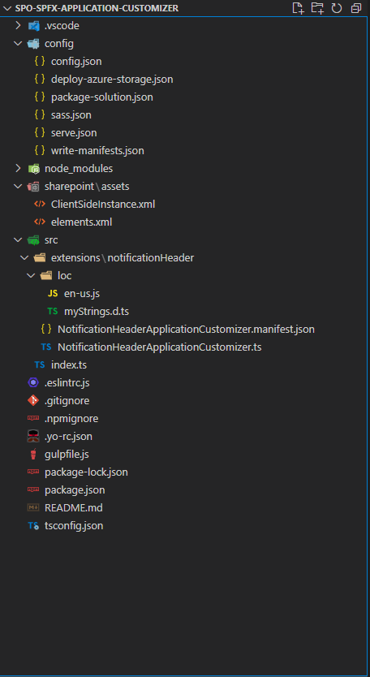

# Transforming classic SharePoint add-in notifications to SPFx Application Customizers

In the SharePoint Add-in model you were used to rely on the JavaScript Object Model for SharePoint to show notifications and status bars using syntax like the following:

```JavaScript
// Sample syntax to show and hide a notification area
var notifyId = SP.UI.Notify.addNotification('Notification message ...', true);
SP.UI.Notify.removeNotification(notifyId);

// Sample syntax to show and hide a status bar with red background color
var statusId = SP.UI.Status.addStatus('Status message ...');
SP.UI.Status.setStatusPriColor(this.statusId, 'red');
SP.UI.Status.removeStatus(statusId);
```

Nowadays, with SharePoint Framework, you can rely on the Application Customizer extensions to achieve the same result and even more. In this article you can find detailed information about how to transform notifications and status bars of the SharePoint Add-in model into SharePoint Framework modern solutions.

If you prefer, you can watch the following video, instead of reading the whole article, which you can still consider as a much more detailed reference.

[](https://youtu.be/-pivUEMMZVg)

> [!NOTE]
> You can find further details about creating a SharePoint Framework Application Customizer by reading the documents [Build your first SharePoint Framework Extension (Hello World part 1)](../spfx/extensions/get-started/build-a-hello-world-extension.md) and [Use page placeholders from Application Customizer (Hello World part 2)](../spfx/extensions/get-started/using-page-placeholder-with-extensions.md).

[!INCLUDE [spfx-gulp-heft-migration-wip](../../includes/snippets/spfx-gulp-heft-migration-wip.md)]

## Setting the context

Imagine that you need to provide to your users a notification about the result of a running process. In order to achieve this result, you can create an Application Customizer, which is a SharePoint Framework extension that allows you to add a custom header and/or footer to a modern page, as well as it eventually allows you to embed custom client-side code in the modern pages of SharePoint Online.

While in the following screenshot, you can see how an hypothetical footer looks like, when built leveraging a  SharePoint Framework Application Customizer, in order to implement a "Status Bar"-like experience.



## Creating a SharePoint Framework solution

In order to achieve the above result, let's start by creating a new SharePoint Framework solution.

First of all, you need to scaffold the SharePoint Framework solution, so start a command prompt or a terminal window, create a folder, and from within the newly created folder run the following command.

> [!IMPORTANT]
> In order to being able to follow the illustrated procedure, you need to have SharePoint Framework installed on your development environment. You can find detailed instructions about how to set up your environment reading the document [Set up your SharePoint Framework development environment](../spfx/set-up-your-development-environment.md).


```PowerShell
yo @microsoft/sharepoint
```



Follow the prompts to scaffold a solution for a modern Application Customizer. Specifically, make the following choices, when prompted by the tool:

* What is your solution name? **spo-sp-fx-application-customizer**
* Which type of client-side component to create? **Extension**
* Which type of client-side extension to create? **Application Customizer**
* What is your Application Customizer name? **NotificationHeader**

With the above answers, you decided to create a solution with name *spo-sp-fx-application-customizer*, in which there will be a custom extension of type Application Customizer with name *NotificationHeader*.

Now you have the SharePoint Framework solution ready to be customized. When it's done you can simply open the current folder using your favorite code editor. However, before opening the solution you will need to add a package to have an easy and better looking rendering of the UI of your extension. In fact, you are going to reference the React framework by running the following commands:

```PowerShell
npm install react@17.0.1 react-dom@17.0.1 --save
npm install @types/react@17.0.45 @types/react-dom@17.0.17 --save-dev
```

In fact, by default the scaffolded solution for a SharePoint Framework extension does not include the React packages, and it is up to you to choose to add them to the solution.

Now you can open the solution in your favorite code editor. If your favorite code editor is Microsoft Visual Studio Code, simply run the following command:

```PowerShell
code .
```

In the following image, you can see the outline of the generated SharePoint Framework solution.



As you can see, under the *src/* folder there are two subfolders, one for the Application Customizer with name *notificationHeader*.

### Defining the Application Customizer

Let's start defining the Application Customizer.
The main files scaffolded for this extension are the file *NotificationHeaderApplicationCustomizer.manifest.json* manifest and the *NotificationHeaderApplicationCustomizer.ts* with the actual TypeScript source code. In the manifest you define the general settings about the Application Customizer, while in the TypeScript file you define the logic of the extension.
In the following code excerpt you can see the content of the auto-generated manifest file:

```JSON
{
  "$schema": "https://developer.microsoft.com/json-schemas/spfx/client-side-extension-manifest.schema.json",

  "id": "a782a9b0-dffe-480d-918a-9c645c64583e",
  "alias": "NotificationHeaderApplicationCustomizer",
  "componentType": "Extension",
  "extensionType": "ApplicationCustomizer",

  // The "*" signifies that the version should be taken from the package.json
  "version": "*",
  "manifestVersion": 2,

  // If true, the component can only be installed on sites where Custom Script is allowed.
  // Components that allow authors to embed arbitrary script code should set this to true.
  // https://support.office.com/en-us/article/Turn-scripting-capabilities-on-or-off-1f2c515f-5d7e-448a-9fd7-835da935584f
  "requiresCustomScript": false
}
```

The only interesting and important part of the above manifest, in the context of the current article, is the *id* of the extension, which will become important during the provisioning and deployment of the solution.

So now, let's dig into the Application Customizer implementation. First of all, let's have a look at the scaffolded code for the extension.

```TypeScript
import { Log } from '@microsoft/sp-core-library';
import {
  BaseApplicationCustomizer
} from '@microsoft/sp-application-base';
import { Dialog } from '@microsoft/sp-dialog';

import * as strings from 'NotificationHeaderApplicationCustomizerStrings';

const LOG_SOURCE: string = 'NotificationHeaderApplicationCustomizer';

/**
 * If your command set uses the ClientSideComponentProperties JSON input,
 * it will be deserialized into the BaseExtension.properties object.
 * You can define an interface to describe it.
 */
export interface INotificationHeaderApplicationCustomizerProperties {
  // This is an example; replace with your own property
  testMessage: string;
}

/** A Custom Action which can be run during execution of a Client Side Application */
export default class NotificationHeaderApplicationCustomizer
  extends BaseApplicationCustomizer<INotificationHeaderApplicationCustomizerProperties> {

  public onInit(): Promise<void> {
    Log.info(LOG_SOURCE, `Initialized ${strings.Title}`);

    let message: string = this.properties.testMessage;
    if (!message) {
      message = '(No properties were provided.)';
    }

    Dialog.alert(`Hello from ${strings.Title}:\n\n${message}`).catch(() => {
      /* handle error */
    });

    return Promise.resolve();
  }
}
```

There is the definition of a class *NotificationHeaderApplicationCustomizer* that inherits from `BaseApplicationCustomizer<INotificationHeaderApplicationCustomizerProperties>`, where *INotificationHeaderApplicationCustomizerProperties* defines the configuration properties for the extension.
In the *onInit* method of the Application Customizer you can implement your own logic to render the extension.

The current extension will render a nice looking status message in the top area of the page, and in order to do that you can rely on the `MessageBar` component offered by Fluent UI and on a custom React component that will host the message bar.

> [!NOTE]
> You can find further details about leveraging the Fluent UI Framework by reading the document [Fluent UI - Get Started](https://developer.microsoft.com/en-us/fluentui).

As such, let's create a custom React component in the current solution. Create a folder named *components* under the *src/extensions/notificationHeader* folder and then create yet another folder named *notification* under the *src/extensions/notificationHeader/components* folder. In the new *notification* folder add the following files:

* *INotificationProperties.ts*: defines the state of the React component implementing the notification area
* *INotificationState.ts*: defines the configuration properties of the React component implementing the notification area
* *Notification.tsx*: defines the actual implementation of the notification area React component

Now, let's dig into each of the files. The *INotificationProperties.ts* is defined like in the following code excerpt.

```TypeScript
export class INotificationProperties {
    showMessage: boolean;
    message: string;
}
```

It is really simple, and it only defines two properties:
* *showMessage*: to show or hide the notification message
* *message*: the actual message to show in the notification area

Here you can see the *INotificationState.ts* file.

```TypeScript
export class INotificationState {
    showMessage: boolean;
}
```

The file simply declares a *showMessage* property which defines the current display status of the notification area.
Lastly, the implementation of the actual React component for notification is illustrated in the following code excerpt.

```TypeScript
import * as React from 'react';
import { INotificationProperties } from './INotificationProperties';
import { INotificationState } from './INotificationState';

import {
    MessageBar,
    MessageBarButton,
    MessageBarType
} from '@fluentui/react/lib';

export class Notification extends
    React.Component<INotificationProperties, INotificationState> {

    constructor(props: INotificationProperties) {
        super(props);

        this.state = {
            showMessage: props.showMessage
        };
    }

    public render(): JSX.Element {

        return (<div>
            {this.state.showMessage ?
                <MessageBar
                    actions={
                        <div>
                            <MessageBarButton onClick={() => { this._showMessageBar(false); }}>Close</MessageBarButton>
                        </div>
                    }
                    messageBarType={MessageBarType.success}
                    isMultiline={false}>
                    {this.props.message}
                </MessageBar>
                : null}
        </div>);
    }

    private _showMessageBar = (show: boolean): void => {
        this.setState({ showMessage: show });
    }
}
```

The React component relies on the `MessageBar` component in order to render its content and it provides a successful notification message, with a button to close the notification.

You can now use the *Notification* React component in your custom Application Customizer. In the following code excerpt you can see the updated logic for the Application Customizer.

```TypeScript
import * as React from 'react';
import * as ReactDom from 'react-dom';
import { Log } from '@microsoft/sp-core-library';
import {
  BaseApplicationCustomizer, PlaceholderContent, PlaceholderName
} from '@microsoft/sp-application-base';

import * as strings from 'NotificationHeaderApplicationCustomizerStrings';

import { Notification } from './components/notification/Notification';
import { INotificationProperties } from './components/notification/INotificationProperties';

const LOG_SOURCE: string = 'NotificationHeaderApplicationCustomizer';

/**
 * If your command set uses the ClientSideComponentProperties JSON input,
 * it will be deserialized into the BaseExtension.properties object.
 * You can define an interface to describe it.
 */
export interface INotificationHeaderApplicationCustomizerProperties {
  // This is an example; replace with your own property
  testMessage: string;
}

/** A Custom Action which can be run during execution of a Client Side Application */
export default class NotificationHeaderApplicationCustomizer
  extends BaseApplicationCustomizer<INotificationHeaderApplicationCustomizerProperties> {

  private _topPlaceholder?: PlaceholderContent;

  public async onInit(): Promise<void> {
    Log.info(LOG_SOURCE, `Initialized ${strings.Title}`);

    // call render method for generating the needed html elements
    return (await this._renderPlaceHolders());
  }

  private async _renderPlaceHolders(): Promise<void> {

    // check if the application customizer has already been rendered
    if (!this._topPlaceholder) {
      // create a DOM element in the bottom placeholder for the application customizer to render
      this._topPlaceholder = this.context.placeholderProvider
        .tryCreateContent(PlaceholderName.Top, { onDispose: this._handleDispose });
    }

    // if the top placeholder is not available, there is no place in the UI
    // for the app customizer to render, so quit.
    if (!this._topPlaceholder) {
      return;
    }

    const element: React.ReactElement<INotificationProperties> = React.createElement(
      Notification,
      {
        message: 'Successfully processed your request!',
        showMessage: true
      }
    );

    // render the UI using a React component
    ReactDom.render(element, this._topPlaceholder.domElement);
  }

  private _handleDispose(): void {
    ReactDom.unmountComponentAtNode(this._topPlaceholder.domElement);
    console.log('[NotificationHeaderApplicationCustomizer._onDispose] Disposed custom bottom placeholder.');
  }
}
```

The *onInit* method is now asynchronous and it handles the rendering of a placeholder using the *_renderPlaceHolders* custom method. The *_renderPlaceHolders* method relies on the object `this.context.placeholderProvider` provided by the SharePoint Framework libraries to try to get a reference to the top section of the target page, using the *tryCreateContent* method and providing a valid `PlaceholderName` as an input.
In case the *tryCreateContent* method provides a successful result, then the method creates an instance of the custom *Notification* React component and renders it inside the just retrieved placeholder.

At the time of this writing, the placeholders in a modern page are:

* *PlaceholderName.Top*: the top area of the page, just below the Microsft 365 Suite bar
* *PlaceholderName.Bottom*: the bottom area of the page, after all the native content

### Testing the solution

In order to test the solution, open the file with name *serve.json* under the *config* folder of the solution and replace the value of the *pageUrl* attribute targeting an hypothetical contoso.sharepoint.com tenant with the actual URL of the SharePoint Online site where you want to test the solution.
Once you have updated and saved the *serve.json* file, you will simply need to run the following command from the console winodow:

```PowerShell
gulp serve
```

A web browser session will start, you will have to accept to execute debug code and then you will the Notification header in action.

## Recommended content

You can find additional information about this topic reading the following documents:

- [Build your first SharePoint Framework Extension (Hello World part 1)](../spfx/extensions/get-started/build-a-hello-world-extension.md)
- [Use page placeholders from Application Customizer (Hello World part 2)](../spfx/extensions/get-started/using-page-placeholder-with-extensions.md)
