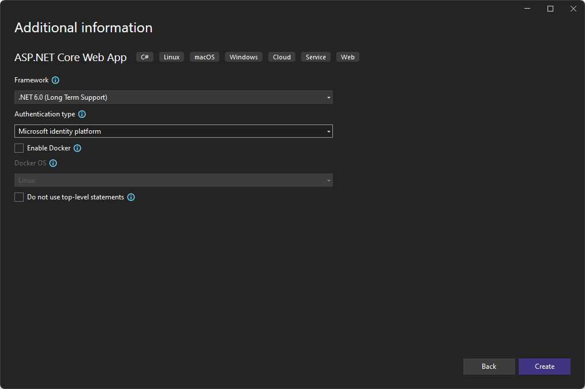
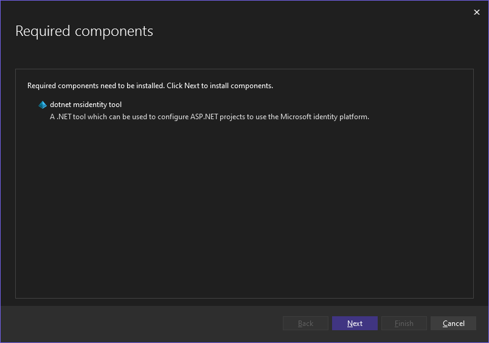
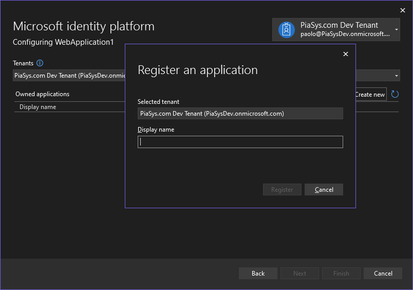
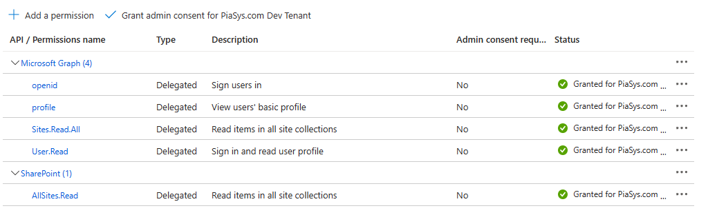

# Upgrading Provider-hosted applications to Azure Active Directory applications

In the SharePoint Add-in model you used to create so called Provider-hosted applications, which were applications built outside of SharePoint Online, hosted on a third party hosting platform like for example Microsoft Azure, and capable of communicating with SharePoint Online and consuming its data via CSOM or REST APIs.

In the modern development world of SharePoint Online, you can register Azure Active Directory (Azure AD) applications and still consume SharePoint Online via CSOM, REST, or Microsoft Graph. In this article you can find detailed information about how to transform an already existing Provider-hosted application into a modern Azure AD application.

> [!IMPORTANT]
> This article refers to so called PnP components, samples and/or tooling which are open-source assets backed by an active community providing support for them. There is no SLA for open-source tool support from official Microsoft support channels. These components or samples are however using Microsoft supported out of the box APIs and features which are supported by Microsoft.

If you prefer, you can watch the following video, instead of reading the whole article, which you can still consider as a much more detailed reference.

[](https://youtu.be/a1snL_hc94k)

However, you should keep into account that there is no conversion tool that you can use, so you will have to manually upgrade and slightly change your code. The easiest thing to do is to create a fresh new application, and partially migrate and adapt your existing code.

## Creating a new application

Start from scratch and using Microsoft Visual Studio 2022 (or newer), create a new ASP.NET core web application, using for example .NET 6.0 and Razor. When you create such an application, you can choose to use the *"Microsoft identity platform"* as the authentication layer, like you can see in the following screenshot. 



In order to proceed you will have to agree on installing the *"dotnet msidentity tool"* component, which will be used to configure the authentication with the *"Microsoft identity platform"*, like illustrated in the following screenshot.



You will have to provide information about the target Azure AD tenant to use for authentication and you will be able to register a new application in Azure AD.



You can also manually register an application, following the instructions that you can find in the article [Upgrading SharePoint applications from Azure Access Control Service to Azure Active Directory](./From-ACS-to-AAD-apps.md) and configuring delegated permissions.

> [!NOTE]
> You can find further details about Azure AD, OAuth 2.0, delegated and applications tokens, and consuming SharePoint Online reading the article [Understanding Azure Active Directory and OAuth 2.0 in the context of SharePoint Online modern development](./Understanding-AAD-and-OAuth-for-SPO-modern.md).

If you want to use CSOM or the SharePoint REST APIs in your Azure AD application, you will have to configure the *"API permissions"* section of the Azure AD application with SharePoint Online delegated permissions, like it is illustrated in the following screenshot.



If you want to consume SharePoint Online data via Microsoft Graph, you can configure Microsoft Graph delegated permissions.

## Supporting Incremental Consent

Now, you need to slightly update the code of your web application in order to support the so called "Incremental Consent", which allows your code to request to Azure AD on the fly an Access Token to consume a back-end API or service, accordingly to the API permissions configured for the application itself.

Open the *Program.cs* file generated by Microsoft Visual Studio and change the following lines to update how the dependency injection is configured:

```CSharp
// Add services to the container.
builder.Services.AddAuthentication(OpenIdConnectDefaults.AuthenticationScheme)
    .AddMicrosoftIdentityWebApp(builder.Configuration.GetSection("AzureAd"));
```

with the new ones that you can see right here:

```CSharp
// Add services to the container.
builder.Services.AddAuthentication(OpenIdConnectDefaults.AuthenticationScheme)
    .AddMicrosoftIdentityWebApp(builder.Configuration.GetSection("AzureAd"))
    .EnableTokenAcquisitionToCallDownstreamApi()
    .AddInMemoryTokenCaches();
```

Basically, you simply need to add a couple of extension methods to configure support for incremental consent and for caching tokens in memory.

Now, open the *Index.cshtml.cs* file of the web application (or any other page you want to customize) and add the `AuthorizeForScopes` attribute to the class inheriting from `PageModel`. This will enable the page model to support incremental consent.

## Consuming SharePoint Online Data

Right click on your project and select the "Manage NuGet Packages" menu item to go to the package manager. Now, add the *"PnP Framework"* package, which will give you a set of rich extensions and utilities to consume SharePoint Online.

You are now ready to implement, or migrate, your custom code to consume SharePoint Online via CSOM or REST APIs. In the following code excerpt you can see the whole implementation of a sample page model that enumerates the documents in the default "Shared Documents" document library of a target site.

```CSharp
using Microsoft.AspNetCore.Authorization;
using Microsoft.AspNetCore.Mvc;
using Microsoft.AspNetCore.Mvc.RazorPages;
using Microsoft.Identity.Web;
using Microsoft.SharePoint.Client;
using PnP.Framework;
using PnP.Framework.Utilities;

namespace AAD_Provider_Hosted_WebApp.Pages
{
    // Attribute required to have incremental consent
    [AuthorizeForScopes()]
    public class IndexModel : PageModel
    {
        private readonly ILogger<IndexModel> _logger;
        private readonly ITokenAcquisition _tokenAcquisition;
        private readonly IConfiguration _configuration;

        public List<Document> Documents { get; set; }

        public IndexModel(ILogger<IndexModel> logger,
            ITokenAcquisition tokenAcquisition,
            IConfiguration configuration)
        {
            _logger = logger;
            _tokenAcquisition = tokenAcquisition;
            _configuration = configuration;
        }

        public async Task OnGet()
        {
            await LoadSPODataAsync();
        }

        private async Task LoadSPODataAsync()
        {
            // Get the site URL from settings and determine the SPO tenant name
            var spoSiteUrl = _configuration["SPOSiteUrl"];
            var spoRootUrl = spoSiteUrl.Substring(0, spoSiteUrl.IndexOf("/", 9));

            // Get the access token for SPO
            var scopes = new[] { $"{spoRootUrl}/AllSites.Read" };
            var accessToken = await _tokenAcquisition.GetAccessTokenForUserAsync(scopes, user: HttpContext.User);
            var secureAccessToken = EncryptionUtility.ToSecureString(accessToken);

            // Build the secure ClientContext of CSOM via PnP Framework AuthenticationManager
            var am = AuthenticationManager.CreateWithAccessToken(secureAccessToken);
            using (var clientContext = am.GetContext(spoSiteUrl))
            {
                // User CSOM to retrieve files from the "Documents" document library
                var lib = clientContext.Web.Lists.GetByTitle("Documents");
                var docs = lib.GetItems(CamlQuery.CreateAllItemsQuery());

                clientContext.Load(docs);
                await clientContext.ExecuteQueryRetryAsync();

                // Map the documents to the Model
                this.Documents = new List<Document>();
                foreach (var d in docs)
                {
                    if (d["Title"] != null)
                    {
                        this.Documents.Add(new Document
                        {
                            Title = d["Title"]?.ToString(),
                            Link = $"{spoRootUrl}{d["FileRef"]?.ToString()}"
                        });
                    }
                }
            }
        }
    }
}

/// <summary>
/// Defines the model for a single Document item
/// </summary>
public record Document
{
    public string Title { get; set; }

    public string Link { get; set; }
}
```

The core part is defined in the *LoadSPODataAsync* method, which uses an instance of the service implementing `ITokenAcquisition` to acquire an access token for consuming SharePoint Online via CSOM or REST APIs. It is important to notice that, when you want to consume SharePoint Online via CSOM or REST using modern authentication and providing an OAuth access token, you have to request a token with permission scopes that will have the following structure:

```TEXT
https://[your-tenant-name].sharepoint.com/[permission-scope]
```

For example, if you want to read SharePoint Online data and you need to rely on the *AllSites.Read* permission scope, the actual permission scope to request will be (for contoso.sharepoint.com):

```TEXT
https://contoso.sharepoint.com/AllSites.Read
```

Once you have got a valida access token from Azure AD, you can rely on the `AuthenticationManager` class of PnP Framework to retrieve a `ClientContext` of CSOM and to consume the target SharePoint Online site. Here you could reuse the CSOM code that you used to use in your old SharePoint Add-in model Provider-hosted app.

## Recommended content

You can find additional information about this topic reading the following documents:

* [Quickstart: Register an application with the Microsoft identity platform](/azure/active-directory/develop/quickstart-register-app)
* [Tutorial: Register an app with Azure Active Directory](/power-apps/developer/data-platform/walkthrough-register-app-azure-active-directory)
* [Class AuthenticationManager](https://pnp.github.io/pnpframework/api/PnP.Framework.AuthenticationManager.html)