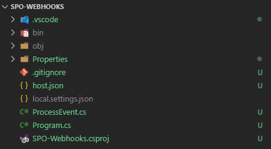

# Transform SharePoint Add-in model Remote Event Receivers to SharePoint Online Webhooks

In the SharePoint Add-in model you can create Remote Event Receivers, which can be used to handle events related to a list item, a list, a website, an app, a BCS entity, or a security configuration. The Remote Event Receivers rely on a SOAP communication channel that allows an external SOAP service to get notifications of events. The events can be synchronous or asynchronous. 

The synchronous events allow a developer to intercept an event while it is happening and with custom logic the Remote Event Receiver can even cancel the currently running operation. 

The asynchronous events allow a developer to be notified of an event after it already occurred, as such you can only keep track of the event or react to the event, but you cannot cancel the already occurred event, unless you implement your own compensation logic. Due to their nature and logic, the synchronous events are often called *-ing* events (ItemAdding, ItemUpdating, ItemDeleting, etc.), while the asynchronous events are often called *-ed* events (ItemAdded, ItemUpdated, ItemDeleted, etc.).

> [!Important]
> Remote Event Receivers can also be used without having a dependency on Azure ACS (which is retired), check the [Use remote event receivers without Azure ACS dependency](./use-remote-event-receivers-without-azure-acs-dependency.md) article to learn more.

> [!IMPORTANT]
> This article refers to so called PnP components, samples and/or tooling which are open-source assets backed by an active community providing support for them. There is no SLA for open-source tool support from official Microsoft support channels. These components or samples are however using Microsoft supported out of the box APIs and features which are supported by Microsoft.

If you prefer, you can watch the following video, instead of reading the whole article, which you can still consider as a much more detailed reference.

[](https://youtu.be/3-fUEd6lGvI)

From a technological point of view, a Remote Event Receiver is implemented as a Windows Communication Framework (WCF) service. In fact, when using Visual Studio, if you create a Remote Event Receiver you will get a WCF service that implements the following interface (Service Contract).

```CSharp
namespace Microsoft.SharePoint.Client.EventReceivers
{
    [ServiceContract(Namespace = "http://schemas.microsoft.com/sharepoint/remoteapp/")]
    public interface IRemoteEventService
    {
        [OperationContract]
        SPRemoteEventResult ProcessEvent(SPRemoteEventProperties properties);

        [OperationContract(IsOneWay = true)]
        void ProcessOneWayEvent(SPRemoteEventProperties properties);
    }
}
```

As you can see, the service contract defines just two operations, which correspond to the notification of a synchronous event and an asynchronous one-way event. The `ProcessEvent` operation handles synchronous events, while `ProcessOneWayEvent` is for asynchronous processing.

Both the operations accept an argument of type `SPRemoteEventProperties`, which defines all the useful information for implementing the remote event receiver business logic.

## Webhooks in the modern SharePoint Online development model

Nowadays, SOAP and the WCF framework are quite old technologies and you often need to intercept events from external platforms that are not necessarily Windows or Microsoft based.

As such, Microsoft introduced a new model based on Webhooks that replaces the "old-school" Remote Event Receivers. In fact, the new webhooks rely on REST instead of SOAP and can target any platform. In this new model, when an event is triggered, SharePoint sends a POST request to a registered target endpoint using REST, with JSON over HTTP.

An important difference to highlight when comparing Webhooks with Remote Event Receivers is that in the Webhooks you don't have anymore the synchronous *-ing* events, but you only have an asynchronous notification model (the *-ed* events). Moreover, when SharePoint Online sends a notification to an external webhook, in the body of the notification there could be multiple events, combined together for performance reasons, and the body of the notification does not include the actual data that changed, but only a reference to the target item. 

It will be responsibility of your webhook code to retrieve the actual data from SharePoint Online. Last but not least, the Remote Event Receivers were useful to track events related to items, lists, libraries, fields, sites and webs, security, etc. while the SharePoint Online Webhooks can only notify the following lists or document libraries events:

* ItemAdded
* ItemUpdated
* ItemDeleted
* ItemCheckedOut
* ItemCheckedIn
* ItemUncheckedOut
* ItemAttachmentAdded
* ItemAttachmentDeleted
* ItemFileMoved
* ItemVersionDeleted
* ItemFileConverted

## Building a SharePoint Online Webhook

The Webhook model requires to create a listener, to register a subscription for target events, to implement a subscription validation process, and to implement a subscription renewal process. In the following sections, you will learn how to implement and manage all of these steps.

### Implementing a Webhook listener

First of all, in order to create a webhook, you need to implement a REST endpoint that will receive all the notifications from SharePoint Online as JSON requests sent via HTTP POST. In the following code excerpt you can see the outline of a webhook notification message.

```JSON
{
    "value": [
        {
            "subscriptionId":"724c2999-a35e-4415-a51a-d74682086ee1",
            "clientState":"00000000-0000-0000-0000-000000000000",
            "expirationDateTime":"2023-02-30T17:27:00.0000000Z",
            "resource":"07a1cd78-619b-480c-a285-86ff9e6a27f9",
            "tenantId":"00000000-0000-0000-0000-000000000000",
            "siteUrl":"/",
            "webId":"c60dad7d-3046-4057-b6ce-3e70fda2a708"
        }
    ]
}
```

As you can see, the body of the notification is made of an array of notification items. There could be just one notification item or there could be many. Your code should be ready to support any number of notifications.

Inside each notification item you will find the following information:

* *subscriptionId*: the ID of the target subscription, which is a value that you get back from SharePoint Online whenever you register a new subscription (See the next section for further details about registering a webhook).
* *clientState*: an optional string value that is provided when registering the subscription and that is returned back by SharePoint Online, if provided during registration.
* *expirationDateTime*: the date and time when the subscription expires if not updated or renewed.
* *resource*: the ID of the resource for which the event happened, it can be the list or library ID.
* *tenantId*: the ID of the tenant for which the event happened.
* *siteUrl*: the server relative URL of the site holding the resource for which the event happened.
* *webId*: the ID of the web holding the resource for which the event happened.

Inside your webhook implementation you will have to handle the request and retrieve actual data/items/documents impacted by the notified event. However, the execution of a webhook cannot last more than 5 seconds, as such you should carefully design your solution archicture in order to adhere to this requirement.

One option can be to use the webhook just as a collector of events and then enqueue the events into an asynchronous queue (like Azure Blob Storage Queue or Azure Service Bus), processing the actual request in a back-end and asynchronous service. In this guidance you are going to build a webhook that relies on an Azure Blob Storage Queue.

> [!NOTE]
> You can find further details about a scalable architecture for webhooks by reading the document [SharePoint webhooks sample reference implementation](../apis/webhooks/webhooks-reference-implementation.md).

#### Creating a Webhook with an Azure Function

Let's implement the webhook as an Azure Function with .NET and C#. Create a folder, start your code editor, like for example Visual Studio Code, and create a new Azure Function App with an HTTP triggered function using the command line.

> [!NOTE]
> You can find step by step instructions about how to create an Azure Function in .NET from the command line by reading the document [Quickstart: Create a C# function in Azure from the command line](/azure/azure-functions/create-first-function-cli-csharp).

Using Visual Studio Code, you can follow these steps:

* Show the command palette (CTRL+SHIFT+P)
* Select "Azure Functions: Create New Project"
* Select a target folder
* Select "C#" as the target language
* Select ".NET 6.0 Isolated LTS" as the target .NET runtime
* Select "HTTP trigger" as the template for the function
* Call the function "ProcessEvent"
* Provide a .NET namespace of your choice for the generated code
* Choose "Anonymous" as the AccessRights option for the function

Once the Azure Function App project will be scaffolded, you should have a project outline like the one depicted in the following picture.



The *Program.cs* file defines the start-up of your function app and is responsible for creating and starting the host instance. In the following code excerpt, you can see the scaffolded *Program.cs* file.

```CSharp
using Microsoft.Extensions.Hosting;

var host = new HostBuilder()
    .ConfigureFunctionsWorkerDefaults()
    .Build();

host.Run();
```

In the `HostBuilder` initialization code, you can define any of the services that you will need in your actual function implementation, using dependency injection. Specifically, the SharePoint Online webhook project that you are going to build will rely on the new PnP Core SDK, which perfectly fits into a modern .NET solution with dependency injection. Moreover, the webhook will use an Azure Active Directory registered application that will consume SharePoint Online data with an application-only security context.

> [!NOTE]
> You can find further details about the PnP Core SDK by reading the document [PnP Core SDK](https://pnp.github.io/pnpcore/index.html) and you can learn how to use PnP Core SDK in an Azure Function by reading the document [Build an v4 Azure Function that runs as an isolated process while using application (app-only) permissions](https://pnp.github.io/pnpcore/tutorials/azurefunctions/v4processisolatedapponly.html). You can find further details about consuming SharePoint Online with an application registered in Azure Active Directory by reading the articles [Upgrading SharePoint applications from Azure Access Control Service to Azure Active Directory](./From-ACS-to-AAD-apps.md) and [Understanding Azure Active Directory and OAuth 2.0 in the context of SharePoint Online modern development](./Understanding-AAD-and-OAuth-for-SPO-modern.md).

In order to add the PnP Core SDK to the Azure Function project, you simply need to execute the following statement from the command line.

```PowerShell
dotnet add package PnP.Core.Auth
```

The above statement will add a reference to the PnP.Core.Auth package, which internally has a dependency on the PnP.Core main package. Now, you need to register in Azure Active Directory an application that will be used to authenticate with SharePoint Online in order to get details about the resources affected by the webhook notifications. 

To register the AAD application, you can follow the instructions provided in the section [Automatically registering a new application in Azure AD with PnP PowerShell](./from-acs-to-aad-apps.md#automatically-registering-a-new-application-in-azure-ad-with-pnp-powershell) of the article [Upgrading SharePoint applications from Azure Access Control Service to Azure Active Directory](./from-acs-to-aad-apps.md). For this scenario to properly work, you need to grant the application the *Sites.Manage.All* application permission.

Once you have registered the application in AAD, keep the *ClientId*, the *TenantId*, and the PFX certificate file in a safe place. You can update the startup code and the settings of the function app. The updated startup code should look like the following code excerpt.

```CSharp
using System.Security.Cryptography.X509Certificates;
using Microsoft.Extensions.Configuration;
using Microsoft.Extensions.DependencyInjection;
using Microsoft.Extensions.Hosting;
using PnP.Core.Auth.Services.Builder.Configuration;

public class Program {
    public static void Main()
    {
        AzureFunctionSettings azureFunctionSettings = null;

        var host = new HostBuilder()
            .ConfigureServices((context, services) =>
            {

                // Add the global configuration instance
                services.AddSingleton(options =>
                {
                    var configuration = context.Configuration;
                    azureFunctionSettings = new AzureFunctionSettings();
                    configuration.Bind(azureFunctionSettings);
                    return configuration;
                });

                // Add our custom configuration instance
                services.AddSingleton(options => { return azureFunctionSettings; });

                // Add PnP Core SDK with default configuration
                services.AddPnPCore();

                // Configure default authentication provider for PnP Core SDK 
                services.AddPnPCoreAuthentication(options =>
                {
                    // Load the certificate to use
                    X509Certificate2 cert = LoadCertificate(azureFunctionSettings);

                    // Configure certificate based auth
                    options.Credentials.Configurations.Add("CertAuth", 
                        new PnPCoreAuthenticationCredentialConfigurationOptions
                        {
                            ClientId = azureFunctionSettings.ClientId,
                            TenantId = azureFunctionSettings.TenantId,
                            X509Certificate = new PnPCoreAuthenticationX509CertificateOptions
                            {
                                Certificate = LoadCertificate(azureFunctionSettings),
                            }
                        });

                    // Set the above authentication provider as the default one
                    options.Credentials.DefaultConfiguration = "CertAuth";
                });
            })
            .ConfigureFunctionsWorkerDefaults()
            .Build();

        host.Run();
    }

    private static X509Certificate2 LoadCertificate(AzureFunctionSettings azureFunctionSettings)
    {
        // Remove from this excerpt for the sake of simplicity ...
    }
}
```

The new *Program.cs* loads the PnP Core SDK services and configures a default certificate based authentication provider for PnP Core SDK. The whole source code of the sample can be found in the [SPO Webhooks](https://github.com/pnp/addin-transformation-guidance/tree/main/samples/From-Remote-Event-Receivers-to-Webhooks/SPO-Webhooks) solution. The configuration is based on the application JSON settings, which in the local development environment are defined by the *local.settings.json* file. Here you can find a sample excerpt for the local settings file.

```JSON
{
  "IsEncrypted": false,
  "Values": {
    "AzureWebJobsStorage": "",
    "FUNCTIONS_WORKER_RUNTIME": "dotnet-isolated",
    "ClientId": "<your-app-client-id>",
    "TenantId": "<your-app-tenant-id>",
    "TenantName": "<your-tenant>.sharepoint.com",
    "CertificateStoreName": "My",
    "CertificateStoreLocation": "CurrentUser",
    "CertificateThumbPrint": "<certificate-thumbprint>",
    "WEBSITE_LOAD_CERTIFICATES": "*"
  }
}
```

And the *Program.cs* simply loads the JSON settings into a fully typed object of custom type *AzureFunctionSettings*, which is defined in the following code excerpt.

```CSharp
using System.Security.Cryptography.X509Certificates;

public class AzureFunctionSettings
{
    public string TenantId { get; set; }
    public string TenantName { get; set; }
    public string ClientId { get; set; }
    public StoreName CertificateStoreName { get; set; }
    public StoreLocation CertificateStoreLocation { get; set; }
    public string CertificateThumbprint { get; set; }
}
```

The real Azure Function is implemented in the *ProcessEvent.cs* file, which out of the box looks like the following code excerpt.

```CSharp
using System.Net;
using Microsoft.Azure.Functions.Worker;
using Microsoft.Azure.Functions.Worker.Http;
using Microsoft.Extensions.Logging;

namespace PnP.SPO.Webhooks
{
    public class ProcessEvent
    {
        private readonly ILogger _logger;

        public ProcessEvent(ILoggerFactory loggerFactory)
        {
            _logger = loggerFactory.CreateLogger<ProcessEvent>();
        }

        [Function("ProcessEvent")]
        public HttpResponseData Run([HttpTrigger(AuthorizationLevel.Anonymous, "get", "post")] HttpRequestData req)
        {
            _logger.LogInformation("C# HTTP trigger function processed a request.");

            var response = req.CreateResponse(HttpStatusCode.OK);
            response.Headers.Add("Content-Type", "text/plain; charset=utf-8");

            response.WriteString("Welcome to Azure Functions!");

            return response;
        }
    }
}
```

To implement the actual SharePoint Online Webhook logic, you will need to replace the constructor of the function class in order to get a reference to the PnP Core SDK objects. Moreover, you will have to update the signature of the *"ProcessEvent"* function, as well as its implementation. In the following code excerpt you can see how the function code should look like.

```CSharp
using System.Net;
using Microsoft.Azure.Functions.Worker;
using Microsoft.Azure.Functions.Worker.Http;
using Microsoft.Extensions.Logging;
using PnP.Core.Services;

namespace PnP.SPO.Webhooks
{
    public class ProcessEvent
    {
        private readonly ILogger _logger;
        private readonly IPnPContextFactory _pnpContextFactory;
        private readonly AzureFunctionSettings _settings;

        public ProcessEvent(IPnPContextFactory pnpContextFactory,
            AzureFunctionSettings settings,
            ILoggerFactory loggerFactory)
        {
            _pnpContextFactory = pnpContextFactory;
            _settings = settings;
            _logger = loggerFactory.CreateLogger<ProcessEvent>();
        }


        [Function("ProcessEvent")]
        public async Task<HttpResponseData> Run([HttpTrigger(AuthorizationLevel.Anonymous, "get", "post")] HttpRequestData req,
        string validationToken)
        {
            _logger.LogInformation("Webhook triggered!");

            // Prepare the response object
            HttpResponseData response = null;

            if (!string.IsNullOrEmpty(validationToken))
            {
                // If we've got a validationtoken query string argument
                // We simply reply back with 200 (OK) and the echo of the validationtoken
                response = req.CreateResponse(HttpStatusCode.OK);
                response.Headers.Add("Content-Type", "text/plain; charset=utf-8");
                response.WriteString(validationToken);

                return response;
            }

            // Otherwise we need to process the event

            try 
            {
                // First of all, try to deserialize the request body
                using (var sr = new StreamReader(req.Body))
                {
                    var jsonRequest = sr.ReadToEnd();

                    var notifications = System.Text.Json.JsonSerializer.Deserialize<WebhookNotification>(jsonRequest, 
                        new System.Text.Json.JsonSerializerOptions {
                            PropertyNameCaseInsensitive = true
                        });

                    // If we have the input object
                    if (notifications != null)
                    {
                        // Then process every single event in the notification body
                        foreach (var notification in notifications.Value) 
                        {
                            _logger.LogInformation($"Notification for resource {notification.Resource} on site {notification.SiteUrl} for tenant {notification.TenantId}");
                        }
                    }
                }                
            }
            catch (Exception ex)
            {
                _logger.LogError(ex.Message);
            } 

            // We need to return an OK response within 5 seconds
            response = req.CreateResponse(HttpStatusCode.OK);
            return response;
        }
    }
}
```

The constructor of the function class relies on dependency injeciton and accepts an instance of the `IPnPContextFactory` interface, which represents the factory service of the PnP Core SDK and which will become useful later. The constructor also accepts an argument of type *AzureFunctionSettings* that provides all the custom settings configured for the Function App. The body of the function, which is the `Run` method, is configured to accept both GET and POST requests over HTTP, as well as to accept a query string argument with name *validationtoken*. 

When you register a new webhook, SharePoint Online will validate your endpoint making a GET request and providing in the query string a parameter with name *validationtoken*. If the endpoint replies back to SharePoint Online within no more than 5 seconds and providing a 200 (OK) response, with the value of the *validationtoken* in the text body of the response, then SharePoint Online will consider the endpoint valid. If not, the webhook will not be registered. See the next section "Registering a Webhook" to better understand the registration and validation process.

If there is no *validationtoken* in the query string and the function receives a POST request, then in the body of the request there should be a JSON serialized array of events. In the following code excerpt you can see how the request body definition looks like in C#.

```CSharp
public class WebhookNotification
{
    public WebhookNotificationEvent[] Value { get; set; }
}

public class WebhookNotificationEvent
{
    public string SubscriptionId { get; set; }

    public string ClientState { get; set; }

    public string ExpirationDateTime { get; set; }

    public string Resource { get; set; }

    public string TenantId { get; set; }

    public string SiteUrl { get; set; }

    public string WebId { get; set; }
}
```

You can clearly see that it matches the JSON illustrated at the beginning of this article.
In the above sample implementation, the code simply deserializes the array of events and then writes on the logger each event.

#### Accessing the actual changes in SharePoint Online

In order to process the event and get information about the target items/documents, you need to rely on the `GetChanges` functionality offered by SharePoint Online. In fact, the `GetChanges` method allows you to get all the changes that occured on a specific target resource, since the last request you made to the `GetChanges` method itself. 

In order to being able to understand when you made the last request, the `GetChanges` method gives you back the changes and a *ChangeToken*, which you will have to provide within the next `GetChanges` method invocation.

> [!NOTE]
> You can find additional details about how to use the `GetChanges` method with the PnP Core SDK by reading the document [Enumerating changes that happened in SharePoint](https://pnp.github.io/pnpcore/using-the-sdk/changes-sharepoint.html).

Here follows the revised function implementation, using the `GetChanges` method.

```CSharp
[Function("ProcessEvent")]
public async Task<HttpResponseData> Run([HttpTrigger(AuthorizationLevel.Anonymous, "get", "post")] HttpRequestData req,
string validationToken)
{
    _logger.LogInformation("Webhook triggered!");

    // Prepare the response object
    HttpResponseData response = null;

    if (!string.IsNullOrEmpty(validationToken))
    {
        // If we've got a validationtoken query string argument
        // We simply reply back with 200 (OK) and the echo of the validationtoken
        response = req.CreateResponse(HttpStatusCode.OK);
        response.Headers.Add("Content-Type", "text/plain; charset=utf-8");
        response.WriteString(validationToken);

        return response;
    }

    // Otherwise we need to process the event

    try 
    {
        // First of all, try to deserialize the request body
        using (var sr = new StreamReader(req.Body))
        {
            var jsonRequest = sr.ReadToEnd();

            var notifications = System.Text.Json.JsonSerializer.Deserialize<WebhookNotification>(jsonRequest, 
                new System.Text.Json.JsonSerializerOptions {
                    PropertyNameCaseInsensitive = true
                });

            // If we have the input object
            if (notifications != null)
            {
                // Then process every single event in the notification body
                foreach (var notification in notifications.Value) 
                {
                    _logger.LogInformation($"Notification for resource {notification.Resource} on site {notification.SiteUrl} for tenant {notification.TenantId}");

                    using (var pnpContext = await _pnpContextFactory.CreateAsync(
                        new Uri($"https://{_settings.TenantName}/{notification.SiteUrl}"), 
                        CancellationToken.None))
                    {
                        pnpContext.GraphFirst = false;

                        // Define a query for the last 100 changes happened to list items,
                        // regardless the type of change (add, update, delete).
                        // Here code still does not provide the ChangeToken 
                        var changeQuery = new PnP.Core.Model.SharePoint.ChangeQueryOptions(false, true) {
                            Item = true,                                    
                            FetchLimit = 100,
                        };
                        // Use GetChanges against the list with ID notification.Resource, which is the target list
                        var targetList = pnpContext.Web.Lists.GetById(Guid.Parse(notification.Resource));
                        var changes = await targetList.GetChangesAsync(changeQuery);

                        // Get the change token, we should save it in a safe place
                        // and provide it back while configuring the ChangeQueryOptions
                        var lastChangeToken = changes.Last().ChangeToken;

                        // Process all the retrieved changes
                        foreach (var change in changes)
                        {
                            // Try to see if the current change is an IChangeItem
                            // meaning that it is a change that occurred on an item
                            if (change is IChangeItem changeItem)
                            {
                                // Get the date and time when the change happened
                                DateTime changeTime = changeItem.Time;
                                
                                // Check if we have the ID of the target item
                                if (changeItem.IsPropertyAvailable<IChangeItem>(i => i.ItemId))
                                {
                                    var itemId = changeItem.ItemId;

                                    // If that is the case, retrieve the item
                                    var targetItem = targetList.Items.GetById(itemId);

                                    if (targetItem != null)
                                    {
                                        // And log some information, just for the sake of making an example
                                        _logger.LogInformation($"Processing changes for item '{targetItem.Title}' happened on {changeTime}");
                                    }
                                }      
                            } 
                        }
                    }
                }
            }
        }                
    }
    catch (Exception ex)
    {
        _logger.LogError(ex.Message);
    } 

    // We need to return an OK response within 5 seconds
    response = req.CreateResponse(HttpStatusCode.OK);
    return response;
}
```

#### Building an asynchronous processing model

Theoretically speaking, the function implementation should be ready. However, you need to keep into account that SharePoint Online requires your webhook to process the changes and reply back with a 200 (OK) within no more than 5 seconds. Clearly an implementation like the one illustrated before does not guarantee a processing time lower than 5 seconds, and actually most likely it will take more time than that. 

As such, the solution is to rely on an asynchronous back-end function that will be triggered by a message enqueued by the webhook. Through this technique the webhook will be super fast and all the processing time will be transferred to the back-end function, which can take as long as needed.

First of all, let's add a reference to some packages to work with the Azure services. In the command prompt, from within the main folder of the webhook project, run the following commands.

```PowerShell
dotnet add package Microsoft.Extensions.Azure
dotnet add package Azure.Storage.Blobs
dotnet add package Azure.Storage.Queues
```

The above commands will add three packages to work with the Azure services via dependency injection, to work with the Azure Storage Blob, for storing the latest *ChangeToken* value, and to work with the Azure Storage Queue, for enqueueing the notifications in a queue.

Then, update the *Program.cs* file in order to include the Azure Blob Storage and the Azure Storage Queue services in the list of services loaded via dependency injection. In the following code excerpt you can see the revised code of the *Program.cs* file.

```CSharp
using System.Security.Cryptography.X509Certificates;
using Microsoft.Extensions.Configuration;
using Microsoft.Extensions.DependencyInjection;
using Microsoft.Extensions.Hosting;
using PnP.Core.Auth.Services.Builder.Configuration;
using Microsoft.Extensions.Azure;

public class Program {
    public static void Main()
    {
        AzureFunctionSettings azureFunctionSettings = null;

        var host = new HostBuilder()
            .ConfigureServices((context, services) =>
            {
                // Add the Azure Storage services
                services.AddAzureClients(builder =>
                {
                    var blobConnectionString = context.Configuration["AzureStorage"];
                    builder.AddBlobServiceClient(blobConnectionString);
                    builder.AddQueueServiceClient(blobConnectionString);
                });

                // Add the global configuration instance
                services.AddSingleton(options =>
                {
                    var configuration = context.Configuration;
                    azureFunctionSettings = new AzureFunctionSettings();
                    configuration.Bind(azureFunctionSettings);
                    return configuration;
                });

                // Add our custom configuration instance
                services.AddSingleton(options => { return azureFunctionSettings; });

                // Add PnP Core SDK with default configuration
                services.AddPnPCore();

                // Configure default authentication provider for PnP Core SDK 
                services.AddPnPCoreAuthentication(options =>
                {
                    // Load the certificate to use
                    X509Certificate2 cert = LoadCertificate(azureFunctionSettings);

                    // Configure certificate based auth
                    options.Credentials.Configurations.Add("CertAuth", 
                        new PnPCoreAuthenticationCredentialConfigurationOptions
                        {
                            ClientId = azureFunctionSettings.ClientId,
                            TenantId = azureFunctionSettings.TenantId,
                            X509Certificate = new PnPCoreAuthenticationX509CertificateOptions
                            {
                                Certificate = LoadCertificate(azureFunctionSettings),
                            }
                        });

                    // Set the above authentication provider as the default one
                    options.Credentials.DefaultConfiguration = "CertAuth";
                });
            })
            .ConfigureFunctionsWorkerDefaults()
            .Build();

        host.Run();
    }

    private static X509Certificate2 LoadCertificate(AzureFunctionSettings azureFunctionSettings)
    {
        // Remove from this excerpt for the sake of simplicity ...
    }
}
```

You can notice the section where `services.AddAzureClients` is invoked to register the Azure services. Later in this article, the above services will become available, via dependency injection, in the constructors of the Azure Function classes.

Now, let's see how you can create the queue-based back-end function. Using Visual Studio Code, you can follow these steps:

* Show the command palette (CTRL+SHIFT+P)
* Select "Azure Functions: Create Function"
* Select "Azure Queue Storage trigger"
* Call the function "QueueProcessEvent"
* Provide a .NET namespace of your choice for the generated code
* Choose to "+ Create a new local app settings" for the target Azure Storage Queue connection
* Choose the Azure Storage Queue to use or create a new one
* Provide a name for the Azure Storage Queue, for example "spo-webhooks"

Here you can see the code generated for the new *QueueProcessEvent* class. 

```CSharp
using System;
using Microsoft.Azure.Functions.Worker;
using Microsoft.Extensions.Logging;

namespace PnP.SPO.Webhooks
{
    public class QueueProcessEvent
    {
        private readonly ILogger _logger;

        public QueueProcessEvent(ILoggerFactory loggerFactory)
        {
            _logger = loggerFactory.CreateLogger<QueueProcessEvent>();
        }

        [Function("QueueProcessEvent")]
        public void Run([QueueTrigger("spo-webhooks", Connection = "AzureStorage")] string myQueueItem)
        {
            _logger.LogInformation($"C# Queue trigger function processed: {myQueueItem}");
        }
    }
}
```

You can update the function code, so that it will process all the notification events. For example, you can enqueue every single event from the *ProcessEvent* function, simply serializing in JSON the event of type *WebhookNotificationEvent* and enqueueing it into an Azure Storage Queue. You will also need to keep into account the *ChangeToken* of the last notification, so that you can process only new events. For the sake of simplicity, you can store the *ChangeToken* in an Azure Storage Table, leveraging the same Azure Storage service instance that you use for the queue.

In the following code excerpt you can see the revised implementation of the *QueueProcessEvent* class.

```CSharp
using System;
using Azure.Storage.Blobs;
using Microsoft.Azure.Functions.Worker;
using Microsoft.Extensions.Logging;
using PnP.Core.Model.SharePoint;
using PnP.Core.Services;

namespace PnP.SPO.Webhooks
{
    public class QueueProcessEvent
    {
        private readonly ILogger _logger;
        private readonly IPnPContextFactory _pnpContextFactory;
        private readonly AzureFunctionSettings _settings;
        private readonly BlobServiceClient _blobServiceClient;

        public QueueProcessEvent(IPnPContextFactory pnpContextFactory,
            AzureFunctionSettings settings,
            BlobServiceClient blobServiceClient,
            ILoggerFactory loggerFactory)
        {
            _pnpContextFactory = pnpContextFactory;
            _settings = settings;
            _blobServiceClient = blobServiceClient;
            _logger = loggerFactory.CreateLogger<QueueProcessEvent>();
        }

        [Function("QueueProcessEvent")]
        public async Task Run([QueueTrigger("spo-webhooks", Connection = "AzureStorage")] string queueMessage)
        {
            if (!string.IsNullOrEmpty(queueMessage))
            {
                var notification = System.Text.Json.JsonSerializer.Deserialize<WebhookNotificationEvent>(queueMessage, 
                    new System.Text.Json.JsonSerializerOptions {
                        PropertyNameCaseInsensitive = true
                    });
                
                if (notification != null)
                {
                    _logger.LogInformation($"Notification for resource {notification.Resource} on site {notification.SiteUrl} for tenant {notification.TenantId}");

                    using (var pnpContext = await _pnpContextFactory.CreateAsync(
                        new Uri($"https://{_settings.TenantName}/{notification.SiteUrl}"), 
                        CancellationToken.None))
                    {
                        pnpContext.GraphFirst = false;

                        // Define a query for the last 100 changes happened, regardless the type of change (add, update, delete). Here code still does not provide the ChangeToken 
                        var changeQuery = new PnP.Core.Model.SharePoint.ChangeQueryOptions(false, true) {
                            Item = true,                                   
                            FetchLimit = 100,
                        };

                        var lastChangeToken = await GetLatestChangeTokenAsync();
                        if (lastChangeToken != null) {
                            changeQuery.ChangeTokenStart = new ChangeTokenOptions(lastChangeToken);
                        }

                        // Use GetChanges against the list with ID notification.Resource, which is the target list
                        var targetList = pnpContext.Web.Lists.GetById(Guid.Parse(notification.Resource));
                        var changes = await targetList.GetChangesAsync(changeQuery);

                        // Save the last change token
                        await SaveLatestChangeTokenAsync(changes.Last().ChangeToken);

                        // Process all the retrieved changes
                        foreach (var change in changes)
                        {
                            _logger.LogInformation(change.GetType().FullName);

                            // Try to see if the current change is an IChangeItem
                            // meaning that it is a change that occurred on an item
                            if (change is IChangeItem changeItem)
                            {
                                // Get the date and time when the change happened
                                DateTime changeTime = changeItem.Time;
                                
                                // Check if we have the ID of the target item
                                if (changeItem.IsPropertyAvailable<IChangeItem>(i => i.ItemId))
                                {
                                    var itemId = changeItem.ItemId;

                                    // If that is the case, retrieve the item
                                    var targetItem = targetList.Items.GetById(itemId);

                                    if (targetItem != null)
                                    {
                                        // And log some information, just for the sake of making an example
                                        _logger.LogInformation($"Processing changes for item '{targetItem.Title}' happened on {changeTime}");
                                    }
                                }      
                            } 
                        }
                    }
                }
            }
        }

        private async Task<string> GetLatestChangeTokenAsync()
        {
            // Code omitted for the sake of simplicity
        }

        private async Task SaveLatestChangeTokenAsync(IChangeToken changeToken)
        {            
            // Code omitted for the sake of simplicity
        }
    }
}
```

You can notice the instance of the `BlobServiceClient` received by the constructor via dependency injection, so that the code will be able to rely on Azure Blob Storage to read and write the *ChangeToken*.

Then the body of the function deserializes the string message received from the queue, in order to retrieve an actual instance of the custom *WebhookNotificationEvent* type. Then, the actual implementation of the function behaves almost like the *ProcessEvent* function discussed before. 

However, one important difference is that now the new *QueueProcessEvent* function handles the *ChangeToken* value relying on the *GetLatestChangeTokenAsync* and *SaveLatestChangeTokenAsync* methods. You can find the whole source code of the *QueueProcessEvent* in the [sample project associated with this article](https://github.com/pnp/addin-transformation-guidance/tree/main/samples/From-Remote-Event-Receivers-to-Webhooks/SPO-Webhooks).

> [!IMPORTANT]
> The solution illustrated in this article, for the sake of simplicity, lacks synchronization of multiple events running in a multi-threaded environment when reading and writing the *ChangeToken* value. In a real-life solution, you should  keep into account to give exclusive access to the Azure Blob Storage container while writing new values for the *ChangeToken*. Another option could be to rely on a different Azure service, like for example the Azure Redis Cache, which could be faster and more scalable compared to storing a file in the Azure Blob Storage.

Now, the *ProcessEvent* function can be simplified, because it simply needs to enqueue notifications in the Azure Storage Queue. In the following code excerpt you can see the new implementation.

```CSharp
using System.Net;
using Microsoft.Azure.Functions.Worker;
using Microsoft.Azure.Functions.Worker.Http;
using Microsoft.Extensions.Logging;
using PnP.Core.Model.SharePoint;
using PnP.Core.Services;
using Azure.Storage.Queues;

namespace PnP.SPO.Webhooks
{
    public class ProcessEvent
    {
        private readonly ILogger _logger;
        private readonly IPnPContextFactory _pnpContextFactory;
        private readonly AzureFunctionSettings _settings;
        private readonly QueueServiceClient _queueServiceClient;

        public ProcessEvent(IPnPContextFactory pnpContextFactory,
            AzureFunctionSettings settings,
            QueueServiceClient queueServiceClient,
            ILoggerFactory loggerFactory)
        {
            _pnpContextFactory = pnpContextFactory;
            _settings = settings;
            _queueServiceClient = queueServiceClient;
            _logger = loggerFactory.CreateLogger<ProcessEvent>();
        }

        [Function("ProcessEvent")]
        public async Task<HttpResponseData> Run([HttpTrigger(AuthorizationLevel.Anonymous, "get", "post")] HttpRequestData req,
        string validationToken)
        {
            _logger.LogInformation("Webhook triggered!");

            // Prepare the response object
            HttpResponseData response = null;

            if (!string.IsNullOrEmpty(validationToken))
            {
                // If we've got a validationtoken query string argument
                // We simply reply back with 200 (OK) and the echo of the validationtoken
                response = req.CreateResponse(HttpStatusCode.OK);
                response.Headers.Add("Content-Type", "text/plain; charset=utf-8");
                response.WriteString(validationToken);

                return response;
            }

            // Otherwise we need to process the event

            try 
            {
                // First of all, try to deserialize the request body
                using (var sr = new StreamReader(req.Body))
                {
                    var jsonRequest = sr.ReadToEnd();

                    var notifications = System.Text.Json.JsonSerializer.Deserialize<WebhookNotification>(jsonRequest, 
                        new System.Text.Json.JsonSerializerOptions {
                            PropertyNameCaseInsensitive = true
                        });

                    // If we have the input object
                    if (notifications != null)
                    {
                        // Then process every single event in the notification body
                        foreach (var notification in notifications.Value) 
                        {
                            var queue = _queueServiceClient.GetQueueClient("spo-webhooks");
                            if (await queue.ExistsAsync())
                            {
                                var message = System.Text.Json.JsonSerializer.Serialize(notification);
                                await queue.SendMessageAsync(
                                    System.Convert.ToBase64String(
                                        System.Text.Encoding.UTF8.GetBytes(message)));
                            }
                        }
                    }
                }                
            }
            catch (Exception ex)
            {
                _logger.LogError(ex.Message);
            } 

            // We need to return an OK response within 5 seconds
            response = req.CreateResponse(HttpStatusCode.OK);
            return response;
        }
    }
}
```

You can notice the instance of the `QueueServiceClient` received by the constructor via dependency injection, so that the code will be able to rely on Azure Storage Queue to enqueue the notifications.

### Registering a Webhook

You are now ready to register your webhook with SharePoint Online. In order to do that, you need an application registered in Azure Active Directory with either delegated or application permission *Sites.Manage.All*.

> [!NOTE]
> In case you want to use an application only token with an application permission, you need to configure an X.509 certificate for your Azure AD app authentication. In fact, SharePoint Online requires certificate authentication for application only tokens.

The registration process requires you to send via HTTP POST a JSON message to a REST API offered by SharePoint Online and available at the following URL:

```TXT
https://<tenant-name>.sharepoint.com/sites/<site-relative-url>/_api/web/lists('<ID-of-the-target-list>')/subscriptions
```

For example, if your tenant name is "contoso", your target site URL is "TargetSite", and the list ID is "a0214797-db97-4d2c-bcd6-0e2a395d127b" then the URL will be:

```TXT
https://contoso.sharepoint.com/sites/TargetSite/_api/web/lists('a0214797-db97-4d2c-bcd6-0e2a395d127b')/subscriptions
```

So, first of all define the URL of the target Site Collection and the ID of the target list or library. Then send via HTTP POST a JSON request with a structure like the following one.

```JSON
 {
   "resource": "https://<tenant-name>.sharepoint.com/sites/<site-relative-url>/_api/web/lists('<ID-of-the-target-list>')",
   "notificationUrl": "<URL-of-your-webhook>",
   "expirationDateTime": "2023-02-16T22:30:00+00:00",
   "clientState": "Something-Unique"
 }
```

As you can see, the registration request defines the following settings:

* *resource*: the target resource (list or library)
* *notificationUrl*: the URL of the actual webhook, which needs to be publicly available over the Internet
* *expirationDateTime*: the expiration date and time of the webhook registration, which can be at most 6 months from the date of registration
* *clientState*: an optional unique string that you can use to validate the notifications when you receive them on the webhook.

As soon as you will send such registration request, SharePoint Online will send an HTTP GET request to the URL of the webhool (i.e. the provided *notificationUrl*), providing in the query string the *validationtoken* that you will need to process and echo back to SharePoint, as already explained earlier in this article.

A successful registration request will give you back a response like the following one:

```JSON
{
    "odata.metadata": "https://<tenant-name>.sharepoint.com/sites/<site-relative-url>/_api/$metadata#SP.ApiData.Subscriptions/@Element",
    "odata.type": "Microsoft.SharePoint.Webhooks.Subscription",
    "odata.id": "https://<tenant-name>.sharepoint.com/sites/<site-relative-url>/_api/web/lists('<ID-of-the-target-list>')/subscriptions",
    "odata.editLink": "web/lists('<ID-of-the-target-list>')/subscriptions",
    "clientState": "Something-Unique",
    "expirationDateTime": "2023-02-16T22:30:00Z",
    "id": "5c3af03a-3bec-4186-82f3-5c5c13bfa9b5",
    "notificationUrl": "<URL-of-your-webhook>",
    "resource": "<ID-of-the-target-list>",
    "resourceData": null
}
```

An unsuccessful registration, for example due to a invalid validation, will look like the following one:

```JSON
{
    "odata.error": {
        "code": "-1, System.InvalidOperationException",
        "message": {
            "lang": "en-US",
            "value": "Failed to validate the notification URL '<URL-of-your-webhook>'."
        }
    }
}
```

Once you have registered a webhook, you can make a GET request for the same registration URL in order to see the list of registered webhooks.

> [!NOTE]
> When you request the list of subscriptions, it is quite common to get back not only your subscriptions but also others defined by Microsoft itself. For example, Microsoft Power Automate relies on SharePoint Online Webhooks to trigger the execution of its flows. As such, you could find endpoints related to Power Automate in the list of subscriptions for a specific target list or library.

### Registration renewal process

As you have already seen, a webhook registration can last up to 6 months from the date of registration. When the registration expires, SharePoint Online removes it from the target list or library.

As such, every now and then you will need to renew your registrations, before they will actually expire.In order to renew a registration, you simply need to make a PATCH request targeting the URL of the already existing webhook registration and providing an extension for the *expirationDateTime* value.

The URL of an already existing webhook is defined like in the following example:

```TXT
https://<tenant-name>.sharepoint.com/sites/<site-relative-url>/_api/web/lists('<ID-of-the-target-list>')/subscriptions('<ID-of-the-subscription>')
```

And again, if your tenant name is "contoso", your target site URL is "TargetSite", the list ID is "a0214797-db97-4d2c-bcd6-0e2a395d127b", and the webhook registration ID is "5c3af03a-3bec-4186-82f3-5c5c13bfa9b5" then the URL will be:

```TXT
https://contoso.sharepoint.com/sites/TargetSite/_api/web/lists('a0214797-db97-4d2c-bcd6-0e2a395d127b')/subscriptions('5c3af03a-3bec-4186-82f3-5c5c13bfa9b5')
```

To extend the expiration date time, you need to make an HTTP PATCH request targeting the above URL and providing the following JSON content in the body of the request.

```JSON
{
    "clientState": "Something-Unique",
    "expirationDateTime": "2023-02-19T22:30:00Z",
    "notificationUrl": "<URL-of-your-webhook>",
    "resource": "a0214797-db97-4d2c-bcd6-0e2a395d127b"
}
```

#### Handling webhook renewal

Whenever you get a webhook notification, in the notification body you also get information about the subscription ID and the expiration date time. It is a smart idea to double-check the expiration date time and, in case the subscription is almost expired, you can simply make a PATCH request to extend it from within your webhook logic.

Keep into account that you have to reply back to SharePoint Online in no more than 5 seconds, so you could eventually enqueue another asynchronous request to extend the expiration date time, rather than trying to update it from within the notification even handling code.

### Testing the solution locally

Your webhook solution is now fully implemented and ready to be tested. However, if you will simply run the Azure Function App project from your local machine it will start listening on *localhost*, which clearly is not publicly avaialble and cannot be reached by SharePoint Online. One option could be to publish the Azure Function on a real Azure Function App instance. However, if that is the case, you will have to rely on remote debugging and generally speaking your development and debugging experience will become slower.

Another option is to rely on one of the many tools available on the network to create a public proxy with an incoming tunnel that will redirect requests from a public URL to your internal localhost. For example, you could use [ngrok](https://ngrok.com/), which is a quite commonly used tool in this scenario.

No matter what kind of technology and tool you will use to proxy the notifications from SharePoint Online to your localhost, keep into account that the SharePoint Online Webhooks are an asynchronous communication technique and there could be delays in the notification. For example, it is quite common to get an event notification few seconds or even few minutes after it occurred. Don't be worried about this behavior and actually be prepared to process events in a really asynchronos manner.

## Notifications with Microsoft Graph

Another option that you have to handle notifications of events happening in SharePoint Online is to rely on Microsoft Graph Notifications (or webhooks). From an architectural point of view, the Microsoft Graph Notifications are really similar to the SharePoint Online webhooks. In fact, you need to register a subscription, you have to implement a validation endpoint for the subscription, you need to renew the subscription before it expires, and when the notification happens you get only a reference to the targe item and not the actual data, that you need to retrieve with an explicit request. Let's dig a little bit more into developing Microsoft Graph Notification endpoints.

### Registering a Microsoft Graph Notification Subscriber

In order to register a Microsoft Graph Notification subscriber you simply need to make an HTTP POST request to the Microsoft Graph subscriptions endpoint.

```TXT
https://graph.microsoft.com/v1.0/subscriptions
```

In the body of the request you need to specify the information about the resource that you want to be notified about. In the following code excerpt you can see a sample request.

```JSON
{
   "changeType": "updated",
   "notificationUrl": "https://<your-host-url>/<your-notification-endpoint>",
   "resource": "sites/{site-id}/lists/{list-id}",
   "expirationDateTime":"2023-03-05T18:23:45.9356913Z",
   "clientState": "secretClientValue"
}
```

> [!NOTE]
> In order to register a subscription, you will need permissions specific for the target of the subscription. You can find the list of permissions required for every supported target entity by reading the document [Create subscription - Permissions](https://learn.microsoft.com/en-us/graph/api/subscription-post-subscriptions?view=graph-rest-1.0&tabs=http#permissions).

The JSON body of the request specifies the *changeType*, which can be any of the following values:

* created: when a new item is created
* updated: when an existing item is updated
* deleted: when an existing item is deleted

For SharePoint Online lists, the value *updated* is the only supported for the *changeType* property.

Then, it specifies the *notificationUrl* that is the URL of the endpoint that will receive the change notifications. It must be an endpoint published over HTTPS. The *resource* property defines the target resource to monitor for notifications. 

In the above sample you can see a resource of type SharePoint Online list, where you need to specify the Microsoft Graph *{site-id}* and *{list-id}*. The *expirationDateTime* defines how long the subscription will last, and needs to adhere to the supported expiration limites defined in the table [Maximum length of subscription per resource type](https://learn.microsoft.com/en-us/graph/api/resources/subscription?view=graph-rest-1.0#maximum-length-of-subscription-per-resource-type). For a SharePoint Online list the expiration time can be up to 30 days.

The *clientState* is a required string that allows your notification endpoint to validate the requests coming from Microsoft Graph. It can be a string no longer than 128 characters.

The response that you will get from a successful registration is like the following code excerpt.

```JSON
{
  "@odata.context": "https://graph.microsoft.com/v1.0/$metadata#subscriptions/$entity",
  "id": "185e2379-e250-4a30-9bf4-32209164e3f4",
  "resource": "sites/{site-id}/lists/{list-id}",
  "applicationId": "c3ecbfd9-8178-4f59-bd47-e50ea2ebe9b0",
  "changeType": "created",
  "clientState": "secretClientValue",
  "notificationUrl": "https://<your-host-url>/<your-notification-endpoint>",
  "expirationDateTime": "2023-03-05T18:23:45.9356913Z",
  "creatorId": "2920e60f-a1d8-4175-ac5e-d83a05cc2a19",
  "latestSupportedTlsVersion": "v1_2",
  "notificationContentType": "application/json"
}
```

The response provides a recap of the settings for the just registered subscription, including the *id* of the subscription that can be used later on to renew it.

### Registration Validation

Like it happens with the SharePoint Online Webhooks, a Microsoft Graph Notification endpoint gets validated by Microsoft Graph through an HTTP POST request to the endpoint. The URL of the validation request looks like the following one.

```TXT
https://<your-host-url>/<your-notification-endpoint>?validationToken={opaqueTokenCreatedByMicrosoftGraph}
```

Your notification endpoint must reply back to Microsoft Graph, within no more than 10 seconds, providing a 200 OK response status and with the content of the URL decoded value of the *validationToken* in the body of the response as *text/plain*.

### Registration Renewal

Whenever a Microsoft Graph Notification subscription is going to expire, but it is not yet expired, you can renew it by making an HTTP PATCH request targeting the subscription by *id* using a URL like the following one:

```TXT
https://graph.microsoft.com/v1.0/subscriptions/{id}
```

For example, to renew the subscription created in the code excerpts above, the URL should be like the following one. 

```TXT
https://graph.microsoft.com/v1.0/subscriptions/185e2379-e250-4a30-9bf4-32209164e3f4
```

The body of the renewal request should specify the new expiration date and time, like in the following code excerpt.

```JSON
{
  "expirationDateTime": "2023-03-15T18:23:45.9356913Z",
}
```

If you will not renew a subscription, it will be automatically deleted by Microsoft Graph. You can also explicitly delete a subscription, before it expires, by making an HTTP DELETE request to the subscription endpoint.

### Handling a Notification

Whenever your endpoint will get a notification, Microsoft Graph will send a JSON message with a structure like the following one.

```JSON
{
  "value": [
    {
      "id": "lsgTZMr9KwAAA",
      "subscriptionId":"{id}",
      "subscriptionExpirationDateTime":"2023-03-15T18:23:45.9356913Z",
      "clientState":"secretClientValue",
      "changeType":"updated",
      "resource":"sites/{site-id}/lists/{list-id}",
      "tenantId": "ff983742-8176-4a22-8141-5acde86f0902",
      "resourceData":
      {
      }
    }
  ]
}
```

As you can see, in the body of the notification you get information about the subscription itself, as well as the source *tenantId*, in case you have created a multi-tenant subscription. Moreover, in the *resourceData* complex property you find information about the target item that you've got the notification for. 

However, in case of SharePoint Online list notification, you will not get any actual *resourceData* about the target item and, as like as it was with the SharePoint Online Webhooks, it is up to you to use the *GetChanges* method to retrieve the actual changes.

Just for the sake of completeness, in the following code excerpt you can see a sample implementation of a Microsoft Graph Notification endpoint.

```CSharp
using System;
using System.Collections.Generic;
using System.IO;
using System.Net;
using System.Security.Cryptography.X509Certificates;
using System.Threading.Tasks;
using Microsoft.AspNetCore.WebUtilities;
using Microsoft.Azure.Functions.Worker;
using Microsoft.Azure.Functions.Worker.Http;
using Microsoft.Extensions.Logging;
using Microsoft.Graph;

namespace MSGraphSDKNotifications
{
    public static class NotifyFunction
    {
        [Function("Notify")]
        public static async Task<HttpResponseData> Run([HttpTrigger(AuthorizationLevel.Function, "post")] HttpRequestData req,
            FunctionContext executionContext)
        {
            // Prepare the response object
            HttpResponseData response = null;

            // Get the logger
            var log = executionContext.GetLogger("NotifyFunction");

            log.LogInformation("Notify function triggered!");

            // Graph Subscription validation logic, if needed
            var querystring = QueryHelpers.ParseQuery(req.Url.Query);
            string validationToken = null;
            if (querystring.ContainsKey("validationToken"))
            {
                validationToken = querystring["validationToken"];
            }
            if (!string.IsNullOrEmpty(validationToken))
            {
                response = req.CreateResponse(HttpStatusCode.OK);
                response.WriteString(validationToken);

                return response;
            }
            else
            {
                // Just output the body of the notification,
                // for the sake of understanding how Microsoft Graph notifications work
                using (var sr = new StreamReader(req.Body))
                {
                    log.LogInformation(sr.ReadToEnd());
                }
            }

            response = req.CreateResponse(HttpStatusCode.OK);

            return response;
        }
    }
}
```

A Microsoft Graph Notifications endpoint must reply back to Microsoft Graph in no more than 3 seconds. As such, you should think about implementing an asynchronous model with a queue like the one you've seen in the previous section about SharePoint Online Webhooks. 

## Recommended content

You can find additional information about this topic reading the following documents:

* [Overview of SharePoint webhooks](../apis/webhooks/overview-sharepoint-webhooks.md)
* [Get started with SharePoint webhooks](../apis/webhooks/get-started-webhooks.md)
* [SharePoint webhooks sample reference implementation](../apis/webhooks/webhooks-reference-implementation.md)
* [SharePoint list webhooks](../apis/webhooks/lists/overview-sharepoint-list-webhooks)
* [Use the Microsoft Graph API to get change notifications](/graph/api/resources/webhooks)