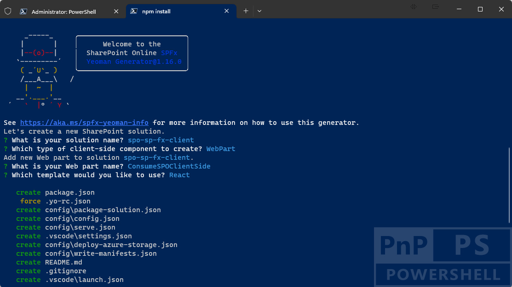

# Transforming SharePoint hosted add-ins to SharePoint Framework solutions

In the SharePoint Add-in model you used to create so called SharePoint-hosted add ins, which were applications hosted on SharePoint Online, with a dedicated app site automatically created by the SharePoint Add-in model infrastructure. In the SharePoint-hosted add-ins you used to consume SharePoint Online data either in the app site itself, or in the host site, via JavaScript SharePoint Object Model (JSOM).

In the modern development world of SharePoint Online, you can simply create client-side solutions with SharePoint Framework and start consuming SharePoint Online data relying on REST APIs and Microsoft Graph.

> [!IMPORTANT]
> This article refers to so called PnP components, samples and/or tooling which are open-source assets backed by an active community providing support for them. There is no SLA for open-source tool support from official Microsoft support channels. These components or samples are however using Microsoft supported out of the box APIs and features which are supported by Microsoft.

If you prefer, you can watch the following video, instead of reading the whole article, which you can still consider as a much more detailed reference.

[](https://youtu.be/OLN--qHnFDs)

## Creating a client-side solution with SharePoint Framework

Let's create a new SharePoint Framework solution that you will use to consume SharePoint Online data.

First of all, you need to scaffold the SharePoint Framework solution, so start a command prompt or a terminal window, create a folder, and from within the newly created folder run the following command.

> [!IMPORTANT]
> In order to being able to follow the illustrated procedure, you need to have SharePoint Framework installed on your development environment. You can find detailed instructions about how to set up your environment reading the document [Set up your SharePoint Framework development environment](https://learn.microsoft.com/en-us/sharepoint/dev/spfx/set-up-your-development-environment).


```console
yo @microsoft/sharepoint
```



Follow the prompts to scaffold a solution for a modern web part. Specifically, make the following choices, when prompted by the tool:

* What is your solution name? **spo-sp-fx-client**
* Which type of client-side component to create? **WebPart**
* What is your Web part name? **ConsumeSPOClientSide**
* Which template would you like to use? **React**

With the above answers, you decided to create a solution with name *spo-sp-fx-client*, in which there will be a web part with name *ConsumeSPOClientSide* and that will be based on React to render its User Experience.

The scaffolding tool will generate for you a new SharePoint Framework solution. When it's done you can simply open the current folder using your favorite code editor. If your favorite code editor is Microsoft Visual Studio Code, simply run the following command:

```console
code .
```

The main file, to start from is the *ConsumeSPOClientSideWebPart.ts*, under the *src\webparts\consumeSPOClientSide* folder. The file is based on TypeScript syntax, which is the one used by SharePoint Framework.

```TypeScript
import * as React from 'react';
import * as ReactDom from 'react-dom';
import { Version } from '@microsoft/sp-core-library';
import {
  IPropertyPaneConfiguration,
  PropertyPaneTextField
} from '@microsoft/sp-property-pane';
import { BaseClientSideWebPart } from '@microsoft/sp-webpart-base';
import { IReadonlyTheme } from '@microsoft/sp-component-base';

import * as strings from 'ConsumeSpoClientSideWebPartStrings';
import ConsumeSpoClientSide from './components/ConsumeSpoClientSide';
import { IConsumeSpoClientSideProps } from './components/IConsumeSpoClientSideProps';

export interface IConsumeSpoClientSideWebPartProps {
  description: string;
}

export default class ConsumeSpoClientSideWebPart extends BaseClientSideWebPart<IConsumeSpoClientSideWebPartProps> {

  private _isDarkTheme: boolean = false;
  private _environmentMessage: string = '';

  public render(): void {
    const element: React.ReactElement<IConsumeSpoClientSideProps> = React.createElement(
      ConsumeSpoClientSide,
      {
        description: this.properties.description,
        isDarkTheme: this._isDarkTheme,
        environmentMessage: this._environmentMessage,
        hasTeamsContext: !!this.context.sdks.microsoftTeams,
        userDisplayName: this.context.pageContext.user.displayName
      }
    );

    ReactDom.render(element, this.domElement);
  }

  protected onInit(): Promise<void> {
    return this._getEnvironmentMessage().then(message => {
      this._environmentMessage = message;
    });
  }

  // Here we intentionally removed some of the auto-generated code, for the sake of simplicity ...

  protected onDispose(): void {
    ReactDom.unmountComponentAtNode(this.domElement);
  }

  protected get dataVersion(): Version {
    return Version.parse('1.0');
  }

  protected getPropertyPaneConfiguration(): IPropertyPaneConfiguration {
    return {
      pages: [
        {
          header: {
            description: strings.PropertyPaneDescription
          },
          groups: [
            {
              groupName: strings.BasicGroupName,
              groupFields: [
                PropertyPaneTextField('description', {
                  label: strings.DescriptionFieldLabel
                })
              ]
            }
          ]
        }
      ]
    };
  }
}
```

As you can see, in the *render* method the Web Part creates an instance of a React component, with name *ConsumeSpoClientSide* and providing a bunch of configuration properties to the component itself.

The properties are defined in the file *src\webparts\consumeSPOClientSide\components\IConsumeSpoClientSideProps.ts*, while the actual React component is defined in the file *src\webparts\consumeSPOClientSide\components\ConsumeSpoClientSide.tsx*.

Now, let's assume that you want to create a web part to consume the list of documents in the default document library (Shared Documents) of the site where you use the web part. You can update the *IConsumeSpoClientSideProps.ts* to accept a couple of additional settings, like illustrated in the following code excerpt.

```TypeScript
import { SPHttpClient } from '@microsoft/sp-http';

export interface IConsumeSpoClientSideProps {
  description: string;
  isDarkTheme: boolean;
  environmentMessage: string;
  hasTeamsContext: boolean;
  userDisplayName: string;
  spHttpClient: SPHttpClient;
  webUrl: string;
}
```

The *spHttpClient* property of type `SPHttpClient`, imported from `@microsoft/sp-http`, represents a client object that you can use to consume SharePoint Online REST APIs from within your web part. The *webUrl* property is just the absolute URL of the web site where the web part is instantiated.

As such, the web part code will have to be updated in order to provide the two additional properties, like illustrated in the following code excerpt.

```TypeScript
import * as React from 'react';
import * as ReactDom from 'react-dom';
import { Version } from '@microsoft/sp-core-library';
import {
  IPropertyPaneConfiguration,
  PropertyPaneTextField
} from '@microsoft/sp-property-pane';
import { BaseClientSideWebPart } from '@microsoft/sp-webpart-base';
import { IReadonlyTheme } from '@microsoft/sp-component-base';

import * as strings from 'ConsumeSpoClientSideWebPartStrings';
import ConsumeSpoClientSide from './components/ConsumeSpoClientSide';
import { IConsumeSpoClientSideProps } from './components/IConsumeSpoClientSideProps';

import { SPHttpClient } from '@microsoft/sp-http';

export interface IConsumeSpoClientSideWebPartProps {
  description: string;
}

export default class ConsumeSpoClientSideWebPart extends BaseClientSideWebPart<IConsumeSpoClientSideWebPartProps> {

  private _isDarkTheme: boolean = false;
  private _environmentMessage: string = '';
  private _spHttpClient: SPHttpClient;

  public render(): void {
    const element: React.ReactElement<IConsumeSpoClientSideProps> = React.createElement(
      ConsumeSpoClientSide,
      {
        description: this.properties.description,
        isDarkTheme: this._isDarkTheme,
        environmentMessage: this._environmentMessage,
        hasTeamsContext: !!this.context.sdks.microsoftTeams,
        userDisplayName: this.context.pageContext.user.displayName,
        spHttpClient: this._spHttpClient,
        webUrl: this.context.pageContext.web.absoluteUrl
      }
    );

    ReactDom.render(element, this.domElement);
  }

  protected onInit(): Promise<void> {

    this._spHttpClient = this.context.spHttpClient;

    return this._getEnvironmentMessage().then(message => {
      this._environmentMessage = message;
    });
  }

  // Here we intentionally removed some of the auto-generated code, for the sake of simplicity ...
}
```

In the *onInit* method of the web part class, you get a referenc to an instance of the `SPHttpClient` type, so that you can provide it to the React component within the *render* method. Notice that in SharePoint Framework there is a *context* property available in any component and that you can use to get access to common infrastructural objects and services, like the SharePoint Online REST client object (*this.context.spHttpClient*).

Moreover, in the *render* method there is also the logic to retrieve the absolute URL of the current web still from the SharePoint Framework *context* using the *this.context.pageContext.web.absoluteUrl* syntax.

Now, let's focus on the React component. First of all, and for the sake of completeness, the React component should rely on a custom state object, which you should define creating a file with name *src\webparts\consumeSPOClientSide\components\IConsumeSpoClientSideState.ts* and with the following content.

```TypeScript
export interface IConsumeSpoClientSideState {
  documents: IDocument[];
}

export interface IDocument {
  Id: number;
  Title: string;
}
```

The above state allows to hold an array of items of type *IDocument* that will provide the *Id* and the *Title* of every document in the target document library.

Then, here you can see the code of the React component in order to consume SharePoint Online via REST APIs and to show the list of documents in the web part output.

```TypeScript
import * as React from 'react';
import styles from './ConsumeSpoClientSide.module.scss';
import { IConsumeSpoClientSideProps } from './IConsumeSpoClientSideProps';
import { IConsumeSpoClientSideState, IDocument } from './IConsumeSpoClientSideState';
import { escape } from '@microsoft/sp-lodash-subset';

import { SPHttpClient } from '@microsoft/sp-http';

export default class ConsumeSpoClientSide extends React.Component<IConsumeSpoClientSideProps, IConsumeSpoClientSideState> {

  constructor(props: IConsumeSpoClientSideProps) {
    super(props);

    this.state = {
      documents: []
    };
  }

  override async componentDidMount(): Promise<void> {
    await this._loadDocuments();
  }

  public render(): React.ReactElement<IConsumeSpoClientSideProps> {
    const {
      description,
      isDarkTheme,
      environmentMessage,
      hasTeamsContext,
      userDisplayName
    } = this.props;

    const {
      documents
    } = this.state;

    return (
      <section className={`${styles.consumeSpoClientSide} ${hasTeamsContext ? styles.teams : ''}`}>
        <div className={styles.welcome}>
          
          <h2>Well done, {escape(userDisplayName)}!</h2>
          <div>{environmentMessage}</div>
          <div>Web part property value: <strong>{escape(description)}</strong></div>
        </div>
        <div>
          <h3>Here is the list of documents:</h3>
          <ul>
            { documents.map(d => d.Title ? <li key={d.Id}>{d.Title}</li> : null) }
          </ul>
        </div>
      </section>
    );
  }

  private _loadDocuments = async () => {
    const apiResult: { value: IDocument[] } = await this.props.spHttpClient
      .get(
        `${this.props.webUrl}/_api/web/lists/getbytitle('Documents')/items')`,
        SPHttpClient.configurations.v1
      )
      .then((response: any) => {
        return response.json();
      });

      console.log(apiResult.value);

      this.setState({
        documents: apiResult.value
      })
    }
}
```

Notice that the React component declaration relies on the custom state definition (*IConsumeSpoClientSideState*). Then, in the *componentDidMount* method it loads the actual list of documents from SharePoint Online using the *_loadDocuments* asynchronous function.

The *_loadDocuments* function simply uses the *spHttpClient* object instance provided by the web part to make an HTTP GET request to a REST endpoint published by the current site, in order to retrieve the list of documents in the selected document library. The result is converted into an array of objects of type *IDocument* and stored in the *state* of the React component. As such, the *render* method of the component can render the list of retrieved documents.

If you like, instead of using low level REST APIs to consume SharePoint Online data, you can also rely on the [PnPjs](https://pnp.github.io/pnpjs/) open source library, which is also documented in the article [Upgrading your code from SharePoint JavaScript Object Model (JSOM) to Client-side code and PnPjs](./from-jsom-to-client-side.md).

## Recommended content

You can find additional information about this topic reading the following documents:

* [Set up your SharePoint Framework development environment](../spfx/set-up-your-development-environment)
* [Build your first SharePoint client-side web part (Hello World part 1)](../spfx/web-parts/get-started/build-a-hello-world-web-part)
* [PnPjs](https://pnp.github.io/pnpjs/)
