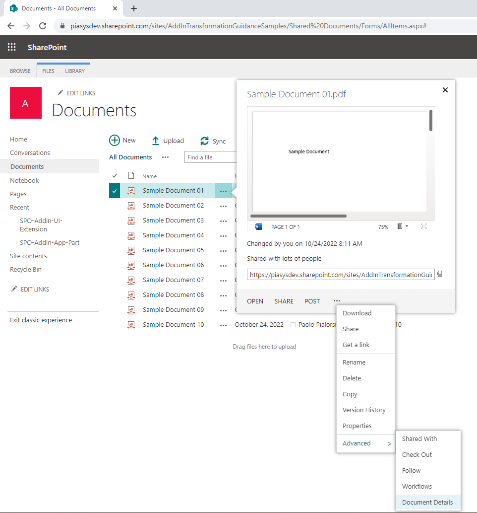
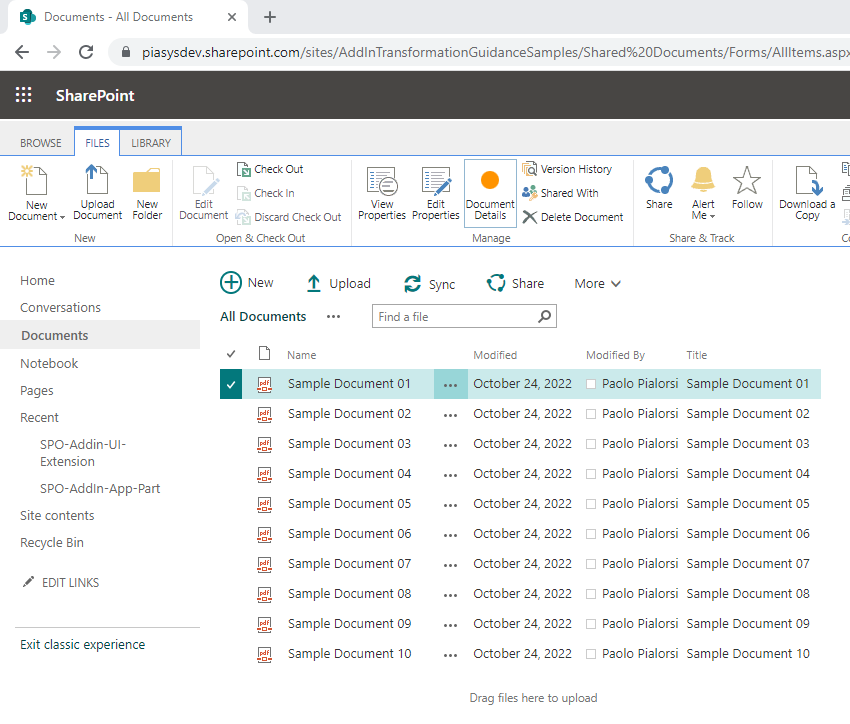
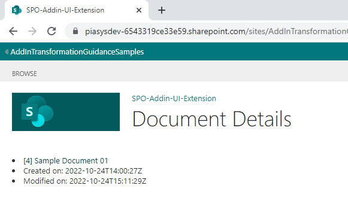
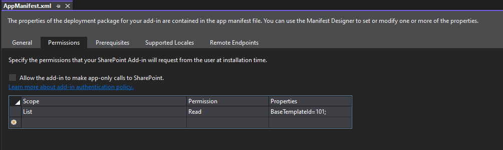
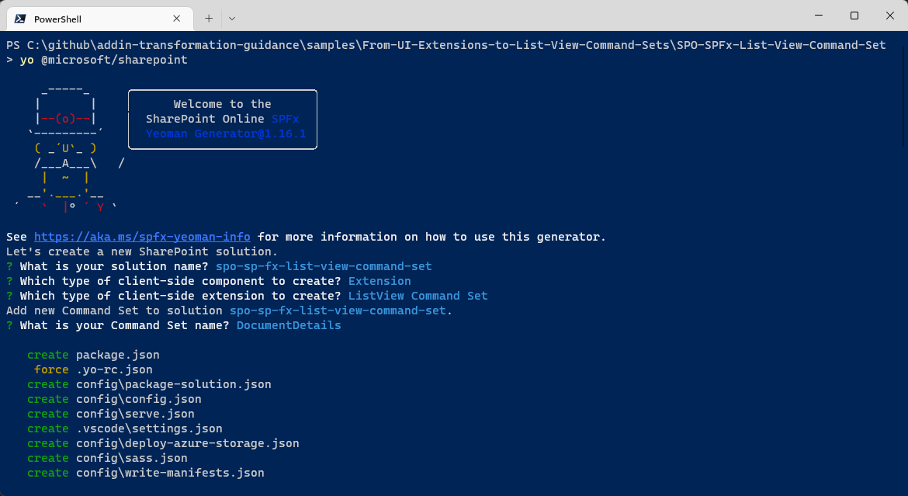
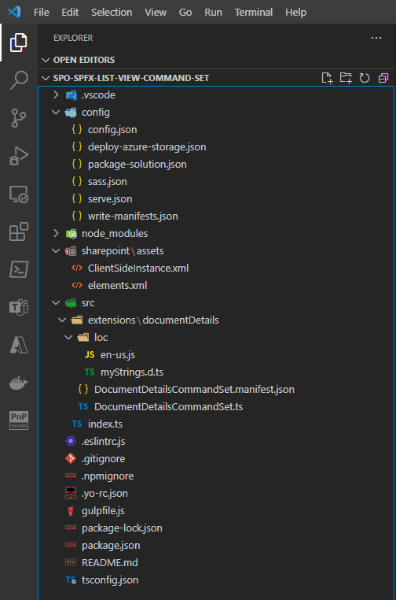
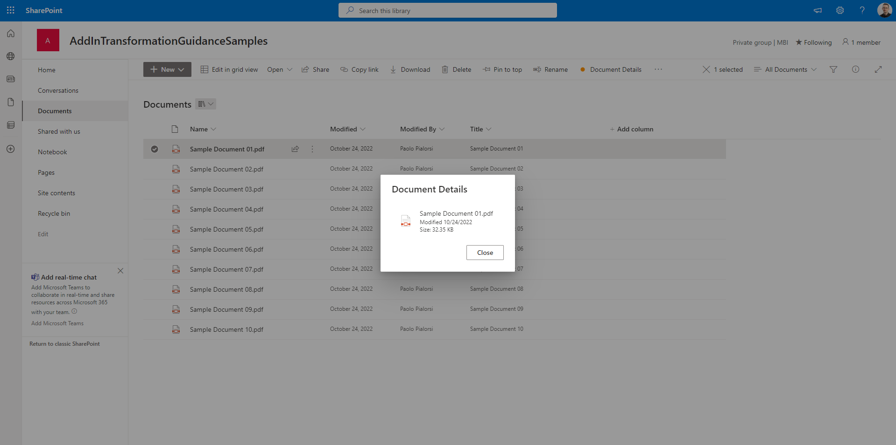

# From UI Extensions to SharePoint Framework ListView Command Sets

In the SharePoint Add-in model you are used to extending the ribbon bar and the ECB (Edit Control Block) menu of lists view and libraries by creating UI Extensions. In the new SharePoint Framework you can achieve the same result by creating the so called ListView Command Set.

In this article you can find detailed information about how to transform an already existing UI Extensions into a ListView Command Set.

If you prefer, you can watch the following video, instead of reading the whole article, which you can still consider as a much more detailed reference.

[](https://youtu.be/qbQ5QkzQOgQ)

> [!NOTE]
> You can find further details about creating a SharePoint Framework ListView Command Set by reading the document [Build your first ListView Command Set extension](https://learn.microsoft.com/en-us/sharepoint/dev/spfx/extensions/get-started/building-simple-cmdset-with-dialog-api).

## Transforming a UI Extension into a ListView Command Set

Imagine that you have a UI Extension to render a custom button in the command bar of a Document Library, as well as to add a custom menu item to the ECB menu of the same library. Let's assume also that you want to show the button and the ECB menu item just for document libraries and if and only if just one document is selected by the user.
The UI Extension will show you a page with detailed information about the selected file.
In the following screeshot you can see the UI of the UI Extension built with the SharePoint Add-in model when extending the ECB menu of the currently selected document in the SharePoint classic UI.



In the next screeshot you can see the UI of the UI Extension built with the SharePoint Add-in model when extending the ribbon of the document library in the SharePoint classic UI.



Lastly, in the following screeshot you can see the actual UI of the UI Extension in action, when showing the details of the selected document.



Now you want to transform the customization into a modern ListView Command Set built with SharePoint Framework.

### The SharePoint Add-in model solution to migrate from

In the following code excerpt you can see the actual implementation of the UI Extensions built with JavaScript code.

```JavaScript
var hostweburl;
var appweburl;
var clientContext;
var hostweb;
var documentsLibrary;
var libraryId;
var itemId;

// This code runs when the DOM is ready and creates a context object which is
// needed to use the SharePoint object model
$(document).ready(function () {
    hostweburl = decodeURIComponent(getQueryStringParameter("SPHostUrl"));
    appweburl = decodeURIComponent(getQueryStringParameter("SPAppWebUrl"));
    libraryId = decodeURIComponent(getQueryStringParameter("SPListId"));
    itemId = decodeURIComponent(getQueryStringParameter("SPListItemId"));

    if (libraryId !== 'undefined' && itemId !== 'undefined') {
        var scriptbase = hostweburl + "/_layouts/15/";
        $.getScript(scriptbase + "SP.RequestExecutor.js", execCrossDomainRequest);
    }
});

// Make the actual request for the document using the cross-domain Request Executor
function execCrossDomainRequest() {

    var itemUri = appweburl +
        "/_api/SP.AppContextSite(@target)/web/lists/GetById('" + libraryId + "')/Items(" + itemId + ")?$select=ID,Title,Created,Modified,ServerRedirectedEmbedUrl&@target='" + hostweburl + "'";

    console.log(itemUri);

    var executor = new SP.RequestExecutor(appweburl);

    // First request, to retrieve the form digest 
    executor.executeAsync({
        url: itemUri,
        method: "GET",
        headers: { "Accept": "application/json; odata=verbose" },
        success: function (data) {
            var jsonObject = JSON.parse(data.body);
            console.log(jsonObject);
            var document = jsonObject.d;
            showDocumentDetails(document);
        },
        error: function (data, errorCode, errorMessage) {
            var errMsg = "Error retrieving the document details: " + errorMessage;
            $("#error").text(errMsg);
            $("#error").show();
        }
    });
}

// In case of successful retrieval of the document
function showDocumentDetails(document) {
    $("#document").empty();

    if (document !== undefined) {

        var docId = document.ID;
        var docTitle = document.Title;
        var docCreated = document.Created;
        var docModified = document.Modified;
        var docUrl = document.ServerRedirectedEmbedUrl;

        $("#document").append('<ul>');
        $("#document").append('<li><a href="' + docUrl + '">[' + docId + '] ' + docTitle + '</a></li>');
        $("#document").append('<li>Created on: ' + docCreated + '</li>');
        $("#document").append('<li>Modified on: ' + docModified + '</li>');
        $("#document").append('</ul>');
    }
}

function getQueryStringParameter(paramToRetrieve) {
    var params =
        document.URL.split("?")[1].split("&");
    var strParams = "";
    for (var i = 0; i < params.length; i = i + 1) {
        var singleParam = params[i].split("=");
        if (singleParam[0] == paramToRetrieve)
            return singleParam[1];
    }
}
```

As you can see the code is fully based on client-side code (JavaScript) and relies on the SharePoint JavaScript Object Model to retrieve a reference to the current app site, the from the app site it executes with the SP.RemoteExecutor model a REST API call to read the target document properties from the host site. Once the file properties are retrieved, the sample shows the basic document details through a dynamically generate set of HTML elements.

The UI Extension to render the ECB menu item is then defined in an XML element file, relying on the *CustomAction* element of the SharePoint Feature Framework, with the following syntax.

```xml
<?xml version="1.0" encoding="utf-8"?>
<Elements xmlns="http://schemas.microsoft.com/sharepoint/">
  <CustomAction Id="8d267eab-0cc9-4abf-88fd-25e320f1202f.ShowDocumentDetailsMenuItem"
                RegistrationType="List"
                RegistrationId="101"
                Location="EditControlBlock"
                Sequence="10001"
                Title="Document Details">
    <!-- 
    Update the Url below to the page you want the custom action to use.
    Start the URL with the token ~remoteAppUrl if the page is in the
    associated web project, use ~appWebUrl if page is in the app project.
    -->
    <UrlAction Url="~appWebUrl/Pages/Default.aspx?{StandardTokens}&amp;SPListItemId={ItemId}&amp;SPListId={ListId}" />
  </CustomAction>
</Elements>
```

Notice that the custom element declares that the extension targets lists of type 101 (i.e. Document Library) via the *RegistrationType* and *RegistrationId* attributes. It also declares that the *Location* of the custom action is the *EditControlBlock* of the target list or library.

Likewise, the custom ribbon command is defined with another XML element file, still relying on the *CustomAction* element of the SharePoint Feature Framework, with the following syntax.

```xml
<?xml version="1.0" encoding="utf-8"?>
<Elements xmlns="http://schemas.microsoft.com/sharepoint/">
  <CustomAction Id="f453c11a-3ee4-4247-b520-107b80c79892.ShowDocumentDetailsCommand"
                RegistrationType="List"
                RegistrationId="101"
                Location="CommandUI.Ribbon"
                Sequence="10001"
                Title="Invoke &apos;ShowDocumentDetailsCommand&apos; action">
    <CommandUIExtension>
      <!-- 
      Update the UI definitions below with the controls and the command actions
      that you want to enable for the custom action.
      -->
      <CommandUIDefinitions>
        <CommandUIDefinition Location="Ribbon.Documents.Manage.Controls._children">
          <Button Id="Ribbon.Documents.Manage.ShowDocumentDetailsCommandButton"
                  Alt="Document Details"
                  Sequence="100"
                  Command="Invoke_ShowDocumentDetailsCommandButtonRequest"
                  LabelText="Document Details"
                  TemplateAlias="o1"
                  Image32by32="_layouts/15/images/placeholder32x32.png"
                  Image16by16="_layouts/15/images/placeholder16x16.png" />
        </CommandUIDefinition>
      </CommandUIDefinitions>
      <CommandUIHandlers>
        <CommandUIHandler Command="Invoke_ShowDocumentDetailsCommandButtonRequest"
                          CommandAction="~appWebUrl/Pages/Default.aspx?{StandardTokens}&amp;SPListItemId={SelectedItemId}&amp;SPListId={SelectedListId}"/>
      </CommandUIHandlers>
    </CommandUIExtension >
  </CustomAction>
</Elements>
```

This last element file declares another custom action that still targets the document libraries (*RegistrationType* = 'List' and *RegistrationId* = 101) but now with a *Location* value of *CommandUI.Ribbon* and the definition of the ribbon command via the *CommandUIExtension* element.

In order to work, the SharePoint Add-in model solution requires the Read permission for libraries (BaseTemplate=101) defined in its *AppManifest.xml* file. In the following screeshot you can see the configuration of the AppManifest.xml file.



### Creating a SharePoint Framework solution

Now let's create a new SharePoint Framework solution that you will use to transform the previous SharePoint Add-in model solution.

First of all, you need to scaffold the SharePoint Framework solution, so start a command prompt or a terminal window, create a folder, and from within the newly created folder run the following command.

> [!IMPORTANT]
> In order to being able to follow the illustrated procedure, you need to have SharePoint Framework installed on your development environment. You can find detailed instructions about how to set up your environment reading the document [Set up your SharePoint Framework development environment](https://learn.microsoft.com/en-us/sharepoint/dev/spfx/set-up-your-development-environment).


```PowerShell
yo @microsoft/sharepoint
```



Follow the prompts to scaffold a solution for a modern ListView Command Set. Specifically, make the following choices, when prompted by the tool:

* What is your solution name? **spo-sp-fx-list-view-command-set**
* Which type of client-side component to create? **Extension**
* Which type of client-side extension to create? **ListView Command Set**
* What is your Command Set name? **DocumentDetails**

With the above answers, you decided to create a solution with name *spo-sp-fx-list-view-command-set*, in which there will be a custom extension of type ListView Command Set with name *DocumentDetails*.

The scaffolding tool will generate for you a new SharePoint Framework solution. When it's done you can simply open the current folder using your favorite code editor. However, before opening the solution you will need to add a package to have an easy and better looking rendering of the UI of your extension. In fact, you are going to reference the MGT (Microsoft Graph Toolkit) library of components and the React framework by running the following commands:

```PowerShell
npm install @microsoft/mgt-spfx @microsoft/mgt-react react@17.0.1 react-dom@17.0.1 --save
npm install @types/react@17.0.45 @types/react-dom@17.0.17 --save-dev
```

In fact, by default the scaffolded solution for a SharePoint Framework ListView Command Set does not include the React packages, and it is up to you to choose to add them to the solution.

> [!NOTE]
> The Microsoft Graph Toolkit is a set of components to speed up the rendering of the UI of your client-side solutions, including SharePoint Framework solutions. It is not mandatory to use it in this sample solution, but it is an easy way to speed up your learning and development process. You can find detailed information about MGT reading the document [Microsoft Graph Toolkit overview](https://learn.microsoft.com/en-us/graph/toolkit/overview) and you can learn how to integrate MGT with SharePoint Framework reading the document [SharePoint Framework library for Microsoft Graph Toolkit](https://learn.microsoft.com/en-us/graph/toolkit/get-started/mgt-spfx).

Now you can open the solution in your favorite code editor. If your favorite code editor is Microsoft Visual Studio Code, simply run the following command:

```PowerShell
code .
```

In the following image, you can see the outline of the generated SharePoint Framework solution.



The main file, to start from is the *DocumentDetailsCommandSet.ts*, under the *src\extensions\documentDetails* folder. The file is based on TypeScript syntax, which is the one used by SharePoint Framework.

```TypeScript
import { Log } from '@microsoft/sp-core-library';
import {
  BaseListViewCommandSet,
  Command,
  IListViewCommandSetExecuteEventParameters,
  ListViewStateChangedEventArgs
} from '@microsoft/sp-listview-extensibility';
import { Dialog } from '@microsoft/sp-dialog';

/**
 * If your command set uses the ClientSideComponentProperties JSON input,
 * it will be deserialized into the BaseExtension.properties object.
 * You can define an interface to describe it.
 */
export interface IDocumentDetailsCommandSetProperties {
  // This is an example; replace with your own properties
  sampleTextOne: string;
  sampleTextTwo: string;
}

const LOG_SOURCE: string = 'DocumentDetailsCommandSet';

export default class DocumentDetailsCommandSet extends BaseListViewCommandSet<IDocumentDetailsCommandSetProperties> {

  public onInit(): Promise<void> {
    Log.info(LOG_SOURCE, 'Initialized DocumentDetailsCommandSet');

    // initial state of the command's visibility
    const compareOneCommand: Command = this.tryGetCommand('COMMAND_1');
    compareOneCommand.visible = false;

    this.context.listView.listViewStateChangedEvent.add(this, this._onListViewStateChanged);

    return Promise.resolve();
  }

  public onExecute(event: IListViewCommandSetExecuteEventParameters): void {
    switch (event.itemId) {
      case 'COMMAND_1':
        Dialog.alert(`${this.properties.sampleTextOne}`).catch(() => {
          /* handle error */
        });
        break;
      case 'COMMAND_2':
        Dialog.alert(`${this.properties.sampleTextTwo}`).catch(() => {
          /* handle error */
        });
        break;
      default:
        throw new Error('Unknown command');
    }
  }

  private _onListViewStateChanged = (args: ListViewStateChangedEventArgs): void => {
    Log.info(LOG_SOURCE, 'List view state changed');

    const compareOneCommand: Command = this.tryGetCommand('COMMAND_1');
    if (compareOneCommand) {
      // This command should be hidden unless exactly one row is selected.
      compareOneCommand.visible = this.context.listView.selectedRows?.length === 1;
    }

    // TODO: Add your logic here

    // You should call this.raiseOnChage() to update the command bar
    this.raiseOnChange();
  }
}
```

The code excerpt illustrated above shows the main code excerpts of the *DocumentDetailsCommandSet.ts* file.
First of all, you can notice that the Extension is declared as a TypeScript class with name *DocumentDetailsCommandSet*, which inherits from the base type `BaseListViewCommandSet<IDocumentDetailsCommandSetProperties>`.

The *BaseListViewCommandSet* type is provided by the base libraries of SharePoint Framework, while the interface *IDocumentDetailsCommandSetProperties* is defined just before the web part class declaration and it defines the configuration properties for your custom extension, if any.

In the *OnInit* method of the Extension, the code tries to retrieve a reference to a custom command extension with unique name of *COMMAND_1*. If the command exists, the code hides it as its initial status.

```TypeScript
// initial state of the command's visibility
const compareOneCommand: Command = this.tryGetCommand('COMMAND_1');
compareOneCommand.visible = false;
```

Right after that, there is registration of an event handler that takes care of any view state change of the target list or library view.

```TypeScript
this.context.listView.listViewStateChangedEvent.add(this, this._onListViewStateChanged);
```

In case of any change in the current view, the event handler verifies if there is one and only one item or document selected. If that is the case, the code shows the command in the UI.

```TypeScript
private _onListViewStateChanged = (args: ListViewStateChangedEventArgs): void => {
  Log.info(LOG_SOURCE, 'List view state changed');

  const compareOneCommand: Command = this.tryGetCommand('COMMAND_1');
  if (compareOneCommand) {
    // This command should be hidden unless exactly one row is selected.
    compareOneCommand.visible = this.context.listView.selectedRows?.length === 1;
  }

  // TODO: Add your logic here

  // You should call this.raiseOnChage() to update the command bar
  this.raiseOnChange();
}
```

Lastly, the source code defines an *onExecute* method that provides the actual implementation of the extension.

```TypeScript
  public onExecute(event: IListViewCommandSetExecuteEventParameters): void {
    switch (event.itemId) {
      case 'COMMAND_1':
        Dialog.alert(`${this.properties.sampleTextOne}`).catch(() => {
          /* handle error */
        });
        break;
      case 'COMMAND_2':
        Dialog.alert(`${this.properties.sampleTextTwo}`).catch(() => {
          /* handle error */
        });
        break;
      default:
        throw new Error('Unknown command');
    }
  }
```

When the *onExecute* method is invoked, the *event.itemId* property defines the unique name of the command that got invoked by the user and you can implement your extension business logic accordingly. The auto-generated code simply show a dialog alert in the browser. 

You might be wondering where the *COMMAND_1* is declared in the extension code. It is actually defined in a manifest file called *DocumentDetailsCommandSet.manifest.json*, which is available in the same folder of the extension. In the following code excerpt, you can see the scaffolded manifest.

```JSON
{
  "$schema": "https://developer.microsoft.com/json-schemas/spfx/command-set-extension-manifest.schema.json",

  "id": "1602bb8e-cc1d-4417-ba7a-cc1b1d7d7022",
  "alias": "DocumentDetailsCommandSet",
  "componentType": "Extension",
  "extensionType": "ListViewCommandSet",

  // The "*" signifies that the version should be taken from the package.json
  "version": "*",
  "manifestVersion": 2,

  // If true, the component can only be installed on sites where Custom Script is allowed.
  // Components that allow authors to embed arbitrary script code should set this to true.
  // https://support.office.com/en-us/article/Turn-scripting-capabilities-on-or-off-1f2c515f-5d7e-448a-9fd7-835da935584f
  "requiresCustomScript": false,

  "items": {
    "COMMAND_1": {
      "title": { "default": "Command One" },
      "iconImageUrl": "icons/request.png",
      "type": "command"
    },
    "COMMAND_2": {
      "title": { "default": "Command Two" },
      "iconImageUrl": "icons/cancel.png",
      "type": "command"
    }
  }
}
```

As you can see, the initial part of the manifest declares that we are defining a component of type *Extension*, with an extension type of *ListViewCommandSet*. Moreover, the manifest also declares a unique *id* for the component, by using a GUID. Most importantly, there is a section called *items* where the actual commands are defined. In the scaffolded manifest you can see there are two commands (*COMMAND_1* and *COMMAND_2*) with the definition of their title, icon image URL, and type that is always *command*.

The last important file of the solution is the *elements.xml* file, defined under the *sharepoint\assets* folder of the solution. Here you can see the content of the auto-generated file:

```XML
<?xml version="1.0" encoding="utf-8"?>
<Elements xmlns="http://schemas.microsoft.com/sharepoint/">
    <CustomAction
        Title="DocumentDetails"
        RegistrationId="100"
        RegistrationType="List"
        Location="ClientSideExtension.ListViewCommandSet.CommandBar"
        ClientSideComponentId="1602bb8e-cc1d-4417-ba7a-cc1b1d7d7022"
        ClientSideComponentProperties="{&quot;sampleTextOne&quot;:&quot;One item is selected in the list.&quot;, &quot;sampleTextTwo&quot;:&quot;This command is always visible.&quot;}">
    </CustomAction>
</Elements>
```

Interestingly, it is still a file based on the SharePoint Feature Framework, like it was with the UI Extension built with the SharePoint Add-in model. However, the custom action settings are now slightly different. There are still attributes like *RegistrationId* and *RegistrationType* to define the targe of the extension. There is also the *Location* attribute with a new value that targets the *ClientSideExtension.ListViewCommandSet.CommandBar*, meaning that the extension will be rendered in the command bar of the target view. 

The available options for this attribute in a SharePoint Framework ListView Command Set are:

* *ClientSideExtension.ListViewCommandSet.CommandBar*: to show the extension in the command bar.
* *ClientSideExtension.ListViewCommandSet.ContextMenu*: to show the extension in the ECB menu.
* *ClientSideExtension.ListViewCommandSet*: to show the extension in both the command bar and the ECB menu.

However, there are also a couple of new attributes:

* *ClientSideComponentId*: defines the unique ID of the extension to render, and maps to the *id* attribute defined in the manifest file that we discussed before.
* *ClientSideComponentProperties*: defines the custom configuration properties for the extension, if any. It is a string containing a JSON serialized object that represents an instance of the interface that declares the custom properties of the extension (in this example the interface is *IDocumentDetailsCommandSetProperties*).

### Building the actual SharePoint Framework ListView Command Set

Now that you have an overview of the solution, let's build the actual ListView Command Set to provide the document details functionality, transforming the old SharePoint Add-in model UI Extension.

First of all, edit the manifest file and replace its content with the following one.

```JSON
{
  "$schema": "https://developer.microsoft.com/json-schemas/spfx/command-set-extension-manifest.schema.json",

  "id": "1602bb8e-cc1d-4417-ba7a-cc1b1d7d7022",
  "alias": "DocumentDetailsCommandSet",
  "componentType": "Extension",
  "extensionType": "ListViewCommandSet",

  // The "*" signifies that the version should be taken from the package.json
  "version": "*",
  "manifestVersion": 2,

  // If true, the component can only be installed on sites where Custom Script is allowed.
  // Components that allow authors to embed arbitrary script code should set this to true.
  // https://support.office.com/en-us/article/Turn-scripting-capabilities-on-or-off-1f2c515f-5d7e-448a-9fd7-835da935584f
  "requiresCustomScript": false,

  "items": {
    "DOC_DETAILS": {
      "title": { "default": "Document Details" },
      "iconImageUrl": "data:image/png;base64,iVBORw0KGgoAAAANSUhEUgAAAFwAAABcCAYAAADj79JYAAAAA...AASUVORK5CYII=",
      "type": "command"
    }
  }
}
```

The updated manifest declares just one command, with unique name of *DOC_DETAILS*, with title 'Document Details', and with a custom icon image URL. Actually, the image is not a URL but a Base64 encoded image, in order to not have any dependency on external files. For the sake of simplicity, in the code excerpt the Base64 image is shortened.

Now, update the element file to show the ListView Command Set both in the command bar and in the ECB menu, by providing a value of *ClientSideExtension.ListViewCommandSet* in the *Location* attribute. Plus, remove the content of the *ClientSideComponentProperties* attribute, because the sample extension doesn't need any custom properties. Here you can see the new element file.

```XML
<?xml version="1.0" encoding="utf-8"?>
<Elements xmlns="http://schemas.microsoft.com/sharepoint/">
    <CustomAction
        Title="DocumentDetails"
        RegistrationId="100"
        RegistrationType="List"
        Location="ClientSideExtension.ListViewCommandSet"
        ClientSideComponentId="1602bb8e-cc1d-4417-ba7a-cc1b1d7d7022"
        ClientSideComponentProperties="">
    </CustomAction>
</Elements>
```

Next we'll update the actual implementation of the ListView Command Set by updating the *DocumentDetailsCommandSet.ts* file. First of all, replace the command unique name with the new one defined in the manifest. So, replace *COMMAND_1* with *DOC_DETAILS* in the *onInit*, *onExecute*, and *_onListViewStateChanged* methods and remove any logic related to the *COMMAND_2* extension, which does not exist anymore.

In the new SharePoint Framework implementation of the extension you will rely on the SharePoint Framework Dialog Framework to render a nice looking dialog window that will embed an MGT component to show detailed information about the selected file.

> [!NOTE]
> You can find further details about leveraging the SharePoint Framework Dialog Framework by reading the document [Use custom dialog boxes with SharePoint Framework Extensions](../spfx/extensions/guidance/using-custom-dialogs-with-spfx.md).

> [!NOTE]
> You can learn more about the *File* component of MGT by reading the document [File component in Microsoft Graph Toolkit](https://learn.microsoft.com/en-us/graph/toolkit/components/file).

Now, create a new folder structure *src\documentDetails\components\documentDetailsDialog* that you will use to contain a new React component file called *DocumentDetailsDialog.tsx*. Within the same new folder, create also another file called *IDocumentDetailsDialogProps.ts* that you will use to define the configuration properties for the dialog window.
In the following code excerpt you can see the definition of the interface defining the properties for the dialog.

```TypeScript
export interface IDocumentDetailsDialogProps {
    tenantName: string;
    siteId: string;
    webId: string;
    driveId: string;
    itemId: string;
    onClose: () => Promise<void>;
}
```

The set of properties of type *string* define the pointer to the document in Microsoft Graph through the *tenantName*, *siteId*, *webId*, *driveId*, and *itemId*. The last property defines a method that will be used to handle the closing of the dialog window. It is an asynchronous method with no return value (`Promise<void>`).

In the following code excerpt you can find the implementation of the dialog component.

```TypeScript
import * as React from 'react';
import * as ReactDOM from 'react-dom';
import { IDocumentDetailsDialogProps } from './IDocumentDetailsDialogProps';

import { BaseDialog, IDialogConfiguration } from '@microsoft/sp-dialog';
import {
    DefaultButton,
    DialogFooter,
    DialogContent
} from 'office-ui-fabric-react';

import { File } from '@microsoft/mgt-react/dist/es6/spfx';

class DocumentDetailsDialogContent extends
    React.Component<IDocumentDetailsDialogProps, {}> {

    public render(): JSX.Element {
        return (<div>
            <DialogContent
                title="Document Details"
                onDismiss={this.props.onClose}>

            <div>
                    <File siteId={`${this.props.tenantName},${this.props.siteId},${this.props.webId}`}
                        driveId={this.props.driveId} itemId={this.props.itemId} />
            </div>
            <DialogFooter>
                <DefaultButton text="Close"
                    title="Close" onClick={this.props.onClose} />
            </DialogFooter>
        </DialogContent>
    </div>);
    }
}

export default class DocumentDetailsDialog extends BaseDialog {

    /**
     * Constructor for the dialog window
     */
    constructor(public tenantName: string,
        public siteId: string, public webId: string,
        public driveId: string, public itemId: string) {
        super({isBlocking: true});
    }
  
    public render(): void {
        ReactDOM.render(<DocumentDetailsDialogContent
                tenantName={this.tenantName}
                siteId={this.siteId}
                webId={this.webId}
                driveId={this.driveId}
                itemId={this.itemId}
                onClose={this._close}
            />,
            this.domElement);
    }
  
    public getConfig(): IDialogConfiguration {
      return {
        isBlocking: true
      };
    }
  
    private _close = async (): Promise<void> => {
        ReactDOM.unmountComponentAtNode(this.domElement);
        await this.close();
    }
}
```

The main type is the *DocumentDetailsDialog* class, which is also the default export of the file. It inherits from `BaseDialog`, which is a type defined in the SharePoint Framework Dialog Framework (`@microsoft/sp-dialog`).

The public constructor of the dialog class accepts all the properties needed to target the selected file via Microsoft Graph. The *render* method simply creates an instance of a React component called *DocumentDetailsDialogContent* that is defined just before the dialog class. Within the dialog class, you can also find the definition of the *_close* method, which is used to close the dialog and unmount the resources allocated by React.

The *DocumentDetailsDialogContent* component is a really trivial React component that renders the `File` component of MGT and provides a "Close" button to close the dialog. 

The *DocumentDetailsDialog* component is instantiated in the *onExecute* method of the ListView Command Set. Moreover, the MGT library is initialized in the *onInit* method of the class by registering its global provider, relying on the types imported from `@microsoft/mgt-spfx`. In the following code excerpt you can see the updated *DocumentDetailsCommandSet.ts* file.

```TypeScript
import { Providers, SharePointProvider } from '@microsoft/mgt-spfx';
import { Log } from '@microsoft/sp-core-library';
import {
  BaseListViewCommandSet,
  Command,
  IListViewCommandSetExecuteEventParameters,
  ListViewStateChangedEventArgs
} from '@microsoft/sp-listview-extensibility';
import DocumentDetailsDialog from './components/documentDetailsDialog/DocumentDetailsDialog';

const LOG_SOURCE: string = 'DocumentDetailsCommandSet';

export default class DocumentDetailsCommandSet extends BaseListViewCommandSet<{}> {

  public onInit(): Promise<void> {
    Log.info(LOG_SOURCE, 'Initialized DocumentDetailsCommandSet');

    // Initialize MGT
    if (!Providers.globalProvider) {
      Providers.globalProvider = new SharePointProvider(this.context);
    }

    // initial state of the command's visibility
    const compareOneCommand: Command = this.tryGetCommand('DOC_DETAILS');
    compareOneCommand.visible = false;

    this.context.listView.listViewStateChangedEvent.add(this, this._onListViewStateChanged);

    return Promise.resolve();
  }

  public async onExecute(event: IListViewCommandSetExecuteEventParameters): Promise<void> {
    switch (event.itemId) {
      case 'DOC_DETAILS': {
        const tenantName: string = this.context.pageContext.site.absoluteUrl.substring(8,
          this.context.pageContext.site.absoluteUrl.indexOf('/', 8));
        const siteId: string = this.context.pageContext.site.id.toString();
        const webId: string = this.context.pageContext.web.id.toString();

        const spItemUrl: string = event.selectedRows[0].getValueByName(".spItemUrl");
        const driveId: string = spItemUrl.substring(spItemUrl.indexOf('drives/') + 7, spItemUrl.indexOf('items'));
        const itemId: string = spItemUrl.substring(spItemUrl.indexOf('items/') + 6, spItemUrl.indexOf('?'));

        await this._showDocumentDetailsDialog(
          tenantName, siteId, webId,
          driveId, itemId);
        break;
      }
      default:
        throw new Error('Unknown command');
    }
  }

  private _onListViewStateChanged = (args: ListViewStateChangedEventArgs): void => {
    Log.info(LOG_SOURCE, 'List view state changed');

    const compareOneCommand: Command = this.tryGetCommand('DOC_DETAILS');
    if (compareOneCommand) {
      // This command should be hidden unless exactly one row is selected.
      compareOneCommand.visible = this.context.listView.selectedRows?.length === 1;
    }

    // You should call this.raiseOnChage() to update the command bar
    this.raiseOnChange();
  }

  private _showDocumentDetailsDialog = async (tenantName: string,
      siteId: string, webId: string,
      driveId: string, itemId: string): Promise<void> => {
    const documentsDetailsDialog = new DocumentDetailsDialog(tenantName, siteId, webId, driveId, itemId);
    await documentsDetailsDialog.show();
  }
}
```

Notice also that in this revised implementation the *onExecute* method is defined as an asynchronous method.
In the following screenshot you can see the output of the ListView Command Set in a sample SharePoint document library.



## Recommended content

You can find additional information about this topic reading the following documents:
* [Build your first ListView Command Set extension](../spfx/extensions/get-started/building-simple-cmdset-with-dialog-api.md)
* [Use custom dialog boxes with SharePoint Framework Extensions](../spfx/extensions/guidance/using-custom-dialogs-with-spfx.md)