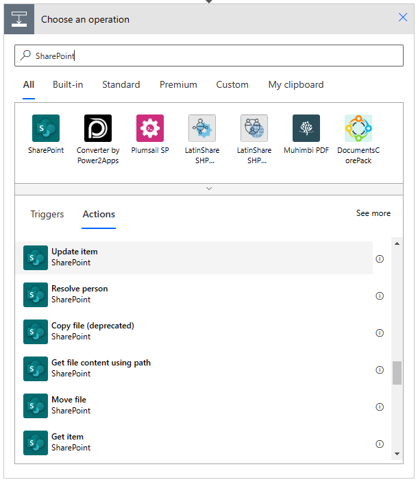

# From SharePoint Add-in model Workflow Apps to Microsoft Power Automate

With the SharePoint Add-in model you can create workflow apps running in a SharePoint-hosted add-in. You simply need to create a SharePoint Add-in model solution, choose to create a SharePoint-hosted app, and add an item of type Workflow to the project.

By default, the created workflow will run in the SharePoint-hosted app site, and will target lists or libraries in that site. If you configure the workflow properties to be an *"Integrated App"* you can also run the workflow in the host site, instead of the app site.

If you prefer, you can watch the following video, instead of reading the whole article, which you can still consider as a much more detailed reference.

> [!IMPORTANT]
> Starting with Visual Studio 2022, Workflow templates have been removed from SharePoint Add-in Projects.

With the SharePoint Add-in model you can create the following types of workflows:

* Sequential workflows
* Flowchart workflows
* State machine workflows

## A Sample SharePoint Add-in Sequential Workflow

In the following figure you can see how a SharePoint Add-in sequential workflow looks like in the Visual Studio designer.

The sample workflow goes through the following steps:

* Creates a simple approval task
* Evaluates the outcome of the approval task
* Updates the target item accordingly to the outcome of the approval task
* Sends and email with information about the workflow outcome

The target list of the workflow is a custom list of Orders with the following columns:

* Title: the out of the box title field of any SharePoint list item (single line of text)
* Customer: the name of the customer for the current order (single line of text)
* Amount: the amount of the order (currency)
* Approval Status: whether the order is approved or not (choice, can assume the values "Pending Approval", "Approved", or "Rejected")

In a SharePoint Add-in model solution, you could deploy the above list in the target site using the SharePoint Feature Framework.

As it used to be in the old school workflow engine of SharePoint, the workflow can store events and information in the Workflow History List, can rely on the Workflow Tasks List to assign tasks to users, and can leverage custom forms for tasks and for the workflow itself (initiation and association forms).

Moreover, every worfklow definition also provides a Workflow Status Page to see the current status of a workflow instance running on top of a target item or document.

It is a very basic but really common scenario, which relies on the out of the box capabilities of the SharePoint Add-in model.

## Converting the workflow into a Power Automate flow

Let's imagine that you want to replace the old SharePoint Add-in model workflow depicted in the previous section with a new Power Automate flow.

First of all, let's create a custom list of Orders with the same data structure described in the previous section. You can create it manually using the web browser, or you can rely on a PnP Provisioning template, like the one available in the samples related to this article ([orders.xml](https://github.com/pnp/addin-transformation-guidance/blob/main/samples/From-Workflow-Apps-to-Power-Automate/orders.xml)).

> [!IMPORTANT]
> If you want to learn more about the PnP Provisioning Engine, you can read the article [Understanding modern provisioning of artifacts](./Modern-Provisioning.md).

In order to create a Power Automate flow for the Orders list you can use the integrated UI of SharePoint Online, selecting the *"Integrate"* menu in the command bar and then *"Power Automate"* -> *"Create a flow"*, like it is illustrated in the following screenshot.

By clicking on the *"Create a flow"* command a new side panel shows up and from there you can choose to reuse one of the already available flow templates, like illustrated in the following screenshot.

For example, you could pick the *"Start approval when a new item is added"* flow template, and start from an already available flow that looks really close to what you need to create. You will be brought to the Power Automate console, where you can double-check the main features of the flow template that you selected and you can connect the Power Automate engine with the resources and services that you will need to run the actual flow process.

As you can see from the following screenshot, the flow template relies on SharePoint Online data, on Microsoft 365 Outlook, on Microsoft Teams Approvals, and on Microsoft 365 users.

If you click on the *"Continue"* button in the lower part of the screen, you consent the Power Automate engine to connect to and consume the Microsoft 365 workloads needed by the flow on your own behalf. 

> [!IMPORTANT]
> It is important to notice that by design Power Automate targets the so called Power Users (or Makers) and as such by default all the services are consumed by the user who is designing the flow. There is no concept of "user impersonation" or "elevation of privileges" like it was possible to do with the SharePoint Add-in workflow model. In certain scenarios, you can eventually make requests with an application-only token of an application registered in Azure Active Directory.

After connecting your account to the flow definition, you will be brought to the Power Automate flow designer, where you can already see an auto-generated flow that basically solves your needs. In fact there is a trigger condition of type "When a SharePoint item is created" that triggers a new flow instance for every new item in the list.

Upon creation of a new item, the flow creates an approval task with Microsoft Teams Approvals and it is up to you to define who the target assignee of the task is. In fact, if you press on the *"Save"* button before configuring the *"Assigned To"* property of the *"Start an approval"* action, you will see the exception illustrated in the following picture.

Aside from defining the assignee of the task, the flow is perfectly defined and ready to go. Whether the outcome of the approval task is *"Approve"* or *"Reject"* the conditional block in the flow definition will send an email to the creator of the item with the actual outcome. In case of any error while handling the approval task, the flow will send a notification email to yourself, as the creator of the flow.

The only missing part from the auto-generated flow is to set the Approval Status field of the target item. You can easily do that by clicking on the *"Add an action"* button both in the *"Yes"* and *"No"* branches of the condition. Let's start with the *"Yes"* branch.

In the "Choose an operation" box that will show up, you can filter by *"SharePoint"* and select to add an action of type *"Update item"* for SharePoint, like illustrated in the following screenshot.

First of all, you should rename the action with a proper description to keep your flow readable. Click on the three dots in the upper right corner of the action and select *"Rename"*. Then replace the default title *"Update item"* with something like *"Update item as Approved"*. Now, configure the following properties of the action:

* *"Site Address"*: it is the target site where the target list is.
* *"List Name"*: is the target list that contains the item to update.
* *"Id"*: is the Id of the item to update, and you can retrieve it dinamically.

To configure the *Id* of the target item, just click on the field and a dialog will show up. Through that dialog, you can choose a variable or a field already defined in the flow, or you can build a dynamic expression. In your scenario, the ID of the item that triggered the flow is what you are looking for.

When you use the *"Update item"* action, you always need to specify a value for all the mandatory fields and in the current scenario the *"Title"* is the only mandatory field that you will have to specify. Unless you want to change the title of the target item, you can simply choose to use the *"Title"* field of the action *"When a new item is created"*.

> [!NOTE]
> If you update an item multiple times through your flow, remember to always use the most recent values for the mandatory fields, eventually making an fresh new request for the item fields using the *"Get Item"* action, instead of always using the fields retrieved by the trigger condition.

In the following screenshot you can see the updated *"Yes"* branch with the *"Update item"* action to set the *"Approval Status"* field of the item as *"Approved"*.

You can apply exactly the same changes to the *"No"* branch, of course setting the *"Approval Status"* field of the item as *"Rejected"*. You can eventually click on the three dots in the upper right corner of the *"Update item as Approved"* action and select the *"Copy to my clipboard (Preview)"* command. Then, when you will click on *"Add an action"* in the *"No"* branch, you can select the *"My clipboard"* tab and paste the copied action.

Now, save the flow design by clicking on the *"Save"* button in the upper right side of the designer and, if you like, you can test it by pressing the *"Test"* button, near the *"Save"* button. Before doing that, be sure to have at least one item in the target list. If you test the flow, choose to test the flow *"Manually"* and you will see a nice UI showing you the status of the flow that is running, like illustrated in the following screenshot.

From an end user perspective, the assignee of the approval request will find a new approval task in Microsoft Teams Approvals, like illustrated in the following screenshot.

The assignee of the approval task can click on the pending request to open and approve or reject it. Notice that out of the box the tasks of Microsoft Teams Approvals can also be reassigned to another target user, if needed.

Whenever you want to monitor any flow that is running on top of a list item or document, from within the target list or library you can click on the *"Integrate"* command in the command bar and select *"Power Automate"* -> *"See your flows"* to go to the Power Automate dashboard. You will land onto the *"My flows"* page, that you can also reach browsing with your web browser to the [Power Automate portal](https://make.powerautomate.com/).

Clicking on the name of the flow that you want to dig into, you can see the history of executions (up to 28 days back), you can see all the details about the flow, and you can edit and update the flow definition. 

By clicking on any item in the history of executions, you can see how the flow was processed and you can dig into the input and output values for all of the executed actions.

## Building a Power Automate flow from scratch

Of course, you can also build a fresh new flow definition, without starting from an already existing template. If that is the case, you can simply go to the [Power Automate portal](https://make.powerautomate.com/) and choose to create a new flow.
As such, go the *"My flows"* page, select *"New flow"* in the command bar and choose to build an *"Automated cloud flow"*, like illustrated in the following screenshot.

A dialog will show up and allow you to select the trigger condition for the new flow. The trigger condition is what actually triggers the flow and from a SharePoint Online point of view can be:

* When a file is created in a folder (deprecated)
* When an item or a file is modified
* When an item is created
* When an item is deleted
* When a file is created (properties only)
* When an item is created or modified
* When a file is classified by a Microsoft Syntex model
* When a file is created or modified (properties only)
* When a file is deleted
* When a file is created or modified in a folder (deprecated)

The above names are self-explanatory, except maybe those with "(properties only)", which means that the trigger will give you the metadata columns of the file only, and not the file content, too. If you want to get the actual content of the file, you can do it yourself using a *"Get File Content"* action in the flow logic.

Choose a name for your new flow, select a trigger condition, and then you can start designing the flow like you did in the previous section.

When designing a new flow for SharePoint Online in Power Automate, you should keep into account that most of the activities that you used to have in the old SharePoint Add-in model workflows are also available in the new Power Automate model. You can find additional information and a mapping between the old activities and new actions reading the document [Guidance: Migrate from classic workflows to Power Automate flows in SharePoint](../business-apps/power-automate/guidance/migrate-from-classic-workflows-to-power-automate-flows.md).

However, there are few things that you should consider:

* With Power Automate you don't have the Workflow History List, which by the way had quite some limitations, and you should eventually rely on a custom SharePoint list or on a custom repository like a table in Microsoft Dataverse. However, you have the execution history (can go back to no more than 28 days in the past, due to GDPR privacy requirements).
* With Power Automate you don't have anymore the Workflow Tasks List, tight to your specific site or workflow solution, but you rely on the global tasks of Microsoft 365. As such you can benefit of the Microsoft Teams Approvals application in Microsoft Teams, as well as on the full integration between the Microsoft 365 workloads.
* Power Automate has been designed for power users and makers, not for ISVs willing to sell their solutions to multiple customers. As such, it is not always easy to share the same flow with multiple customers/tenants. There is an export/import functionality, but you will need to reconfigure all the connections when importing a flow into a different tenant.
* In Power Automate there is no out of the box automation and governance for managing flows and flows executions.
* In flows designed with Power Automate is not possibile to impersonate other users or to run code with elevated privileges. Eventually you can retrieve an OAuth access token from Azure AD and make low level HTTP requests to Microsoft Graph. 
* In Power Automate you don't have the capability to design state machine workflows or flowcharts, in fact every flow is like a sequential flow. Of course, using a proper design and having a good knowledge of Power Automate, you can define flows that behave like a state machine, for example using loops and conditions. Moreover, using Microsoft Visio you can design a flowchart, map the diagram to Power Automate triggers and actions and then export a BPMN (Business Process Model and Notation) into a Power Automate flow.

Generally speaking, despite the above small limitations, Power Automate is great tool for building workflows in Microsoft 365 and in SharePoint Online in particular. You should definitely stop using the SharePoint Add-in model workflows and you should move to Power Automate and the whole Power Platform.

## Recommended content 

You can find additional information about this topic reading the following documents:
* [Guidance: Migrate from classic workflows to Power Automate flows in SharePoint](../business-apps/power-automate/guidance/migrate-from-classic-workflows-to-power-automate-flows.md)
* [How to: State machines in Microsoft Flow](https://powerautomate.microsoft.com/en-us/blog/state-machines/)
* [Design flows with Microsoft Visio](https://learn.microsoft.com/en-us/power-automate/visio-flows)