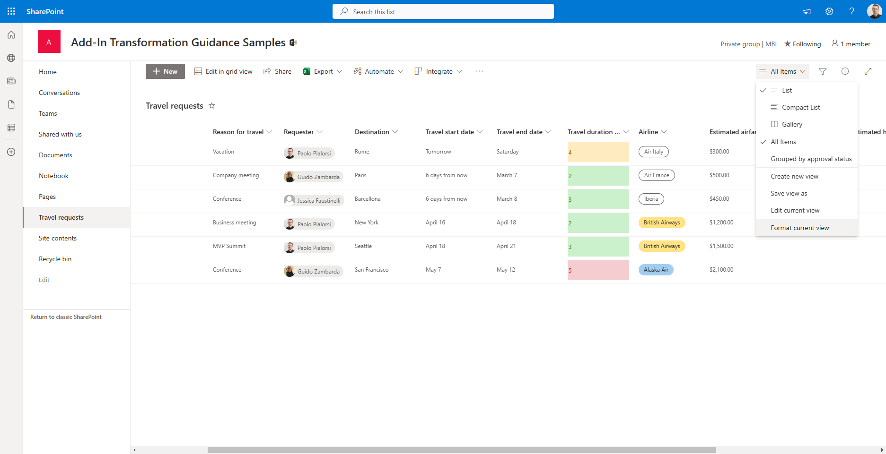

# Upgrading from XSLT views rendering to List Formatting

In the SharePoint classic world, you were used to customize the rendering of lists and libraries using XSLT (eXtensible Stylesheet Language for Transformation) and the *XsltListViewWebPart* control. Nowadays, in the modern world, you can achive better results relying on List Formatting.

If you prefer, you can watch the following video, instead of reading the whole article, which you can still consider as a much more detailed reference.

[](https://youtu.be/q-FolBYQDMM)

In fact, through List Formatting you can customize the rendering of a single field, via column formatting, or the rendering of a whole list view, via list view formatting. You can easily do that either using the web-based UI of SharePoint and a user-friendly designer, or writing your own custom JSON templates. Under the cover, the List Formatting will process client-side the rendering of your data, without impacting or changing the actual data, but simply applying a custom rendering template on top of it. 

Furthermore, the List Formatting can be applied to SharePoint lists and libraries, as well as to lists of Microsoft Lists, which under the cover relies on SharePoint Online. In this article you can learn how to leverage List Formatting in your solutions.

## Column Formatting

Column Formatting allows you to customize the rendering of a single field in a list or library. To learn how to use it, let's create a new list in a target site, for example using the *"Travel requests"* list template. The output will look like in the following screenshot.


### Column Formatting with the designer

Now, imagine that you want to customize the rendering of the *"Travel duration (days)"* column, to highlight the trips lasting the most. Click on the arrow just beside the name of the column, choose *"Column settings"* and then *"Format this column"*, like illustrated in the following screenshot, to activate the UI to customize the column rendering.


On the right side of the screen will show up a side panel, which you can use to customize the column formatting. Select *"Conditional Formatting"* and start customizing the rendering of the selected column.


Once selected, the option allows you to configure the rendering rules for the selected column.


You can create as many rules as you like. A conditional rendering rule can be a global one, not related to a specific condition, or can be specific when one or more conditions (equal or not equal to) are verified against one or more fields. For each rule, you can then define a custom rendering style. In the following screenshot you can see the basic UI to define a rule.


When you configure the rendering style you can simply choose one of the out of the box styles, or you can click on *"More styles"* and get access to a whole set of styling settings, like illustrated in the following screenshot.


As you can see a custom style can be made of many settings like font, text color, fill color, icon, icon color, and borders. In the following screenshot you can see a rule defined for the *"Travel duration (days)"* column, where durations between 1 and 3 days are "ok" and highlighted with green color, durations of 4 days are "risky" and highlighted with orange color, while durations of 5 days (the whole week) are considered too long and highlighted with red color.


As you have just seen, you can define such kind of rules simply using the web browser and the designer.

### Column Formatting with custom JSON template

However, what if you need to define more advanced rules? For example, what if you want to define a reference range of values for the *"Travel duration (days)"* column instead of explicit values? Or what if you want to define a completely custom rendering for your columns?

Luckily, you can click on the *"Advanced mode"* that you see in the lower part of the screen and start editing a JSON template at low level.

>[!NOTE]
>The JSON of the template is based on a schema defined by Microsoft and available at the [following url](https://developer.microsoft.com/json-schemas/sp/v2/column-formatting.schema.json) and you can find the details schema reference in the document [Formatting syntax reference](https://learn.microsoft.com/en-us/sharepoint/dev/declarative-customization/formatting-syntax-reference).


Interesting enough, when you choose to switch to the advanced mode, the JSON template will start showing you the JSON template of the actual conditional formatting that you have already defined. As such, you can start easy with the designer and, when you need more, you can switch to the advanced mode and continue from where you already were.

Even if it is is out of context for this article to dig into all the details of the JSON template syntax, it is useful to inspect the JSON generated for the *"Travel duration (days)"* column, which is illustrated in the following code excerpt.

```JSON
{
  "$schema": "https://developer.microsoft.com/json-schemas/sp/v2/column-formatting.schema.json",
  "elmType": "div",
  "style": {
    "box-sizing": "border-box",
    "padding": "0 2px",
    "overflow": "hidden",
    "text-overflow": "ellipsis"
  },
  "attributes": {
    "class": {
      "operator": ":",
      "operands": [
        {
          "operator": "||",
          "operands": [
            {
              "operator": "||",
              "operands": [
                {
                  "operator": "==",
                  "operands": [
                    "[$TravelDuration]",
                    "1"
                  ]
                },
                {
                  "operator": "==",
                  "operands": [
                    "[$TravelDuration]",
                    "2"
                  ]
                }
              ]
            },
            {
              "operator": "==",
              "operands": [
                "[$TravelDuration]",
                "3"
              ]
            }
          ]
        },
        "sp-css-backgroundColor-BgMintGreen sp-css-borderColor-MintGreenFont sp-field-fontSizeSmall sp-css-color-MintGreenFont",
        {
          "operator": ":",
          "operands": [
            {
              "operator": "==",
              "operands": [
                "[$TravelDuration]",
                "4"
              ]
            },
            "sp-css-backgroundColor-BgGold sp-css-borderColor-GoldFont sp-field-fontSizeSmall sp-css-color-GoldFont",
            {
              "operator": ":",
              "operands": [
                {
                  "operator": "==",
                  "operands": [
                    "[$TravelDuration]",
                    "5"
                  ]
                },
                "sp-css-backgroundColor-BgDustRose sp-css-borderColor-DustRoseFont sp-field-fontSizeSmall sp-css-color-DustRoseFont",
                ""
              ]
            }
          ]
        }
      ]
    }
  },
  "txtContent": "[$TravelDuration]"
}
```

The JSON template defines that the output will be a div HTML element with some pre-defined rendering styles.

```JSON
"elmType": "div",
"style": {
    "box-sizing": "border-box",
    "padding": "0 2px",
    "overflow": "hidden",
    "text-overflow": "ellipsis"
}
```

And then it defines a set of operators and operands to define all the rules (value equal to 1, 2, or 3; value 4; value 5) and the corresponding CSS style to apply when the rule condition is effective. Using the low level JSON template, instead of the web-based designer, you can even improve the quality and the maintainability of the template. For example, instead of listing all the values (1, 2, or 3) for the green style, you can simply declare a single rule for values lower or equal to 3 (&lt;= 3). The same applies to the red style, where you can declare that rule applies to any value greater than 5 (&gt;>5). In the following code excerpt you can read the revised JSON template.

```JSON
{
    "$schema": "https://developer.microsoft.com/json-schemas/sp/v2/column-formatting.schema.json",
    "elmType": "div",
    "style": {
      "box-sizing": "border-box",
      "padding": "0 2px",
      "overflow": "hidden",
      "text-overflow": "ellipsis"
    },
    "attributes": {
      "class": {
        "operator": ":",
        "operands": [
          {
            "operator": "<=",
            "operands": [
              "[$TravelDuration]",
              "3"
            ]
          },
          "sp-css-backgroundColor-BgMintGreen sp-css-borderColor-MintGreenFont sp-field-fontSizeSmall sp-css-color-MintGreenFont",
          {
            "operator": ":",
            "operands": [
              {
                "operator": "==",
                "operands": [
                  "[$TravelDuration]",
                  "4"
                ]
              },
              "sp-css-backgroundColor-BgGold sp-css-borderColor-GoldFont sp-field-fontSizeSmall sp-css-color-GoldFont",
              {
                "operator": ":",
                "operands": [
                  {
                    "operator": ">=",
                    "operands": [
                      "[$TravelDuration]",
                      "5"
                    ]
                  },
                  "sp-css-backgroundColor-BgDustRose sp-css-borderColor-DustRoseFont sp-field-fontSizeSmall sp-css-color-DustRoseFont",
                  ""
                ]
              }
            ]
          }
        ]
      }
    },
    "txtContent": "[$TravelDuration]"
}
```

This was a very simple and basic example, but you can build really complex rendering rules. For example, you can nest HTML elements inside the output of a column, or you can render custom images, etc.

>[!NOTE]
>You can find lot of useful samples about column formatting browsing the GitHub repository [SharePoint List Formatting Samples](https://github.com/pnp/List-Formatting) and specifically the [column formatting samples](https://github.com/pnp/List-Formatting/blob/master/column-samples/).

## List View Formatting

As like as you can customize the rendering of a single column, you can use List Formatting to customize the rendering of a whole view of a list or library.

In order to customize the list view of a list or library, you can simply click on the dropdown menu to choose the current view and select the option *"Format current view"*, as like as it is illustrated in the following screenshot.



Clicking on the menu item, you will activate a side panel on the right, through which you can choose to apply a very simple template to render *"Alternating row styles"*, or you can activate the *"Conditional formatting"* and create a more persolized formatting template. As like as it was with the column formatting, you can then define conditions and styling rules, which will now apply at row level, instead of column level.


Moreover, in the *"Choose layout"* dropdown you can choose to create a custom template of type *List*, which is the default one, or *Gallery*, which gives you a card-based output where you can customize the fields and the rendering of the cards.


When you select *Gallery* and you activate the *"Card designer"* by clicking on the *"Edit card"* command, you can choose the fields to show in the cards, their order, and some general configuration settings for the card.


If you want to do more, you can click on *"Advanced mode"* and define a fully customized JSON template, which will apply to the whole list, instead of targeting a single column.

>[!NOTE]
>You can find lot of useful samples about list view formatting browsing the GitHub repository [SharePoint List Formatting Samples](https://github.com/pnp/List-Formatting) and specifically the [list view formatting samples](https://github.com/pnp/List-Formatting/tree/master/view-samples).

## List Form Formatting

One more option that you have is to customize the form of a list or library, defining a custom header, footer, or body. In fact, if you are in a list you can simply display the properties of any item and then click on the *"Edit Form"* command in top right corner of the screen and select the *"Configure layout"* option, like illustrated in the following screenshot.


A side panel will show up on the right and you will be able to configure a custom JSON to customize the rendering of header, footer, or body. In the following screenshot you can see how the panel looks like.


The same behavior applies to document libraries, but in order to activate the formatting panel you have to select a document, click on the three dots (ECB menu), select More, and then Properties. From the document property pane you can then choose the *"Edit Form"* and the *"Configure layout"* option.

Now, let's see what kind of customizations you can apply using this capability. For the sake of simplicity, keep on using the "Travel requests" list created in the previous sections and edit the header of the list items. For example, let's assume that you want to replace the default header with a custom box that shows the requester's avatar and the destination of the trip. In the following screenshot you can see the output.


While in the following code excerpt you can see the JSON template to achive the above result.

```JSON
{
    "elmType": "div",
    "attributes": {
        "class": "ms-bgColor-themePrimary ms-fontColor-white ms-borderColor-neutralTertiary"
    },
    "style": {
        "width": "99%",
        "margin": "10px",
        "border": "1px solid",
        "padding": "10px"
    },
    "children": [
        {
            "elmType": "div",
            "style": {
                "display": "flex",
                "box-sizing": "border-box",
                "align-items": "center"
            },
            "children": [
                {
                    "elmType": "img",
                    "attributes": {
                      "src": "=getUserImage('[$Requester.email]','medium')"
                    },
                    "style": {
                      "border-radius": "50%",
                      "margin-bottom": "10px"
                    }
                  }
            ]
        },
        {
            "elmType": "div",
            "attributes": {
                "class": "ms-fontColor-white ms-fontWeight-bold ms-fontSize-24"
            },
            "style": {
                "box-sizing": "border-box",
                "width": "100%",
                "text-align": "left",
                "padding": "21px 12px",
                "overflow": "hidden"
            },
            "children": [
                {
                    "elmType": "div",
                    "txtContent": "='Travel request to ' + [$Destination.DisplayName]"
                }
            ]
        }
    ]
}
```

The JSON template defines an HTML DIV element with the *primary* color of the current theme as the background color, the *white* color for the text, and a solid border of 1 pixel.

```JSON
"elmType": "div",
"attributes": {
    "class": "ms-bgColor-themePrimary ms-fontColor-white ms-borderColor-neutralTertiary"
},
"style": {
    "width": "99%",
    "margin": "10px",
    "border": "1px solid",
    "padding": "10px"
}
```

Then there are two DIV elements as children of the above DIV. The first DIV on the left renders the image of the requester user.

```JSON
{
    "elmType": "div",
    "style": {
        "display": "flex",
        "box-sizing": "border-box",
        "align-items": "center"
    },
    "children": [
        {
            "elmType": "img",
            "attributes": {
              "src": "=getUserImage('[$Requester.email]','medium')"
            },
            "style": {
              "border-radius": "50%",
              "margin-bottom": "10px"
            }
          }
    ]
}
```

While the second DIV renders a custom string with the name of the destination.

```JSON
{
    "elmType": "div",
    "attributes": {
        "class": "ms-fontColor-white ms-fontWeight-bold ms-fontSize-24"
    },
    "style": {
        "box-sizing": "border-box",
        "width": "100%",
        "text-align": "left",
        "padding": "21px 12px",
        "overflow": "hidden"
    },
    "children": [
        {
            "elmType": "div",
            "txtContent": "='Travel request to ' + [$Destination.DisplayName]"
        }
    ]
}
```

Notice the syntax used to read properties of the current item, based on square brackets and the dollar ($) symbol to reference a field, eventually specifying detailed properties of the field, like the *email* for the *$Requester* or the *DisplayName* for the *$Destination*. Notice also that you can rely on custom functions like *getUserImage* to retrieve advanced information from the fields of the selected item.

The custom footer is customizable as like as the header, using exactly the same approach as before.

On the contrary, the body can be customized declaring one or more custom sections and one or more columns for each section. However, keep into account that a column can only be referenced in one section, and if you will not reference a column in any section, it will automatically show up in the last section. Likewise, new columns added to the list or library will be automatically listed in the last column.


In the following code excerpt you can see a JSON template for a body with a "More information" section, made of fields Title, Requester, and Destination, and another catch-all section with name "Others".

```JSON
{
    "sections": [
        {
            "displayname": "Main information",
            "fields": [
                "Title",
                "Requester",
                "Destination"
            ]
        },
        {
            "displayname": "Others",
            "fields": []
        }
    ]
}
```

Notice that every *section* object is made of a *displayname* and an array of *fields*.

## PnP Provisioning and JSON formatting

One last important thing to be aware of when working with List Formatting is that if you extract a site template or a list template using the PnP Provisioning Engine, the engine will also export any custom column formatting or list view formatting and store them in *CustomFormatter* attributes for columns or elements for views. As such, you can customize your columns and list views, export the customization, and apply it back to your production and/or customers' sites using a bunch of PowerShell scripting.

>[!NOTE]
>If you don't know what the PnP Provisioning Engine is or if you want to dig more into what it is, you can read the article [Understanding modern provisioning of artifacts](./Modern-Provisioning.md).

For example, here you can see the syntax with PnP PowerShell to extract a template from the *"Travel requests"* including the column and list view formatting templates.

```PowerShell
Connect-PnPOnline https://<source-tenant-name>.sharepoint.com/sites/<SourceSite>
Get-PnPSiteTemplate -Out .\travel-requests.xml -ListsToExtract "Travel requests" -Handlers Lists
```

While in the following code excerpt you can see how to apply the just extracted template onto a target site. 

```PowerShell
Connect-PnPOnline https://<target-tenant-name>.sharepoint.com/sites/<TargetSite>
Invoke-PnPSiteTemplate -Path .\travel-requests.xml
```

Notice that the extraction and the application of the template can even occur across different Microosft 365 tenants.

## Recommended content 

You can find additional information about this topic reading the following documents:

* [Use column formatting to customize SharePoint](../declarative-customization/column-formatting.md)
* [Use view formatting to customize SharePoint](../declarative-customization/view-formatting.md)
* [Configure the list form](../declarative-customization/list-form-configuration.md)
* [List Formatting Samples](https://pnp.github.io/List-Formatting/)
* [Formatting syntax reference](../declarative-customization/formatting-syntax-reference.md)
* [Advanced formatting concepts](../declarative-customization/formatting-advanced.md)

