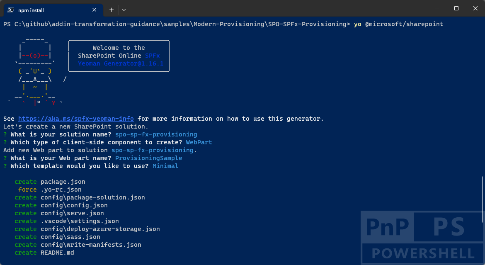
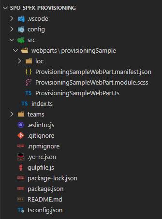

# Understanding modern provisioning of artifacts in Microsoft 365

In classic SharePoint and with the SharePoint Add-in model you were used to provision artifacts in SharePoint using the SharePoint Feature Framework. In modern SharePoint, you can still rely on the SharePoint Feature Framework, inside a SharePoint Framework solution, saving your investments. However, you can also rely on other options like for example using PnP PowerShell and the PnP Provisioning Engine.

In this article you can find detailed information about how to transform the provisioning of an already existing SharePoint Add-in Model based solution into a SharePoint Framework solution as well as how you can replace the SharePoint Feature Framework provisioning with the new and more powerful PnP Provisioning Engine.

[!INCLUDE [spfx-gulp-heft-migration-wip](../../includes/snippets/spfx-gulp-heft-migration-wip.md)]

> [!IMPORTANT]
> This article refers to so called PnP components, samples and/or tooling which are open-source assets backed by an active community providing support for them. There is no SLA for open-source tool support from official Microsoft support channels. These components or samples are however using Microsoft supported out of the box APIs and features which are supported by Microsoft.

If you prefer, you can watch the following video, instead of reading the whole article, which you can still consider as a much more detailed reference.

[](https://youtu.be/Y8-YSuSKjZA)

> [!NOTE]
> You can find further details about the SharePoint Feature Framework by reading the document [SharePoint Features schemas](../schema/sharepoint-features-schemas.md).

## The SharePoint Add-in model solution to migrate from

For example, imagine that you have a SharePoint Add-in model solution where you created a set of custom Site Columns and a custom Content Type that relies on those columns and that defines a *Customer* entity. In the following screenshot you can see how the solution looks like in Visual Studio.


As you can see, in the solution there are three custom columns (*CustomerCode*, *CustomerEmail*, *CustomerType*), a custom content type (*Customer*), and a custom list (*Customers*) based on the custom content type and that will be part of the provisioning of a feature named *Feature1*.

In the following code excerpt you can see the definition of the custom columns and of the content type:

```XML
<?xml version="1.0" encoding="utf-8"?>
<Elements xmlns="http://schemas.microsoft.com/sharepoint/">
  <Field
       ID="{ac7f1666-9943-4cc4-81cf-90589dcdc26e}"
       Name="CustomerCode"
       DisplayName="Customer Code"
       Type="Text"
       Required="FALSE"
       Group="PnP Columns">
  </Field>

  <Field
       ID="{6dcb6494-aa2c-423c-9a77-2dafd95ee2ae}"
       Name="CustomerEmail"
       DisplayName="Customer Email"
       Type="Text"
       Required="FALSE"
       Group="PnP Columns">
  </Field>

  <Field
       ID="{f8818d0d-d464-4268-bff4-19b307616002}"
       Name="CustomerType"
       DisplayName="Customer Type"
       Type="Choice"
       Required="FALSE"
       Group="PnP Columns">
    <CHOICES>
      <CHOICE>Government</CHOICE>
      <CHOICE>Small Business</CHOICE>
      <CHOICE>Medium Business</CHOICE>
      <CHOICE>Enterprise</CHOICE>
      <CHOICE>Non-Profit</CHOICE>
    </CHOICES>
  </Field>

  <!-- Parent ContentType: Item (0x01) -->
  <ContentType ID="0x01006F716FA02F3F485BA83E3CE5BD9EB06A" Name="Customer" Group="PnP Content Types" Description="Custom content type to define a Customer item" Inherits="TRUE" Version="0">
    <FieldRefs>
      <FieldRef ID="{ac7f1666-9943-4cc4-81cf-90589dcdc26e}" DisplayName="Customer Code" Required="TRUE" Name="CustomerCode" />
      <FieldRef ID="{6dcb6494-aa2c-423c-9a77-2dafd95ee2ae}" DisplayName="Customer Email" Required="FALSE" Name="CustomerEmail" />
      <FieldRef ID="{f8818d0d-d464-4268-bff4-19b307616002}" DisplayName="Customer Type" Required="TRUE" Name="CustomerType" />
    </FieldRefs>
  </ContentType>
</Elements>
```

While in the following code excerpt you can see the definition of the custom list template for the list of *Customers*.

```XML
<?xml version="1.0" encoding="utf-8"?>
<Elements xmlns="http://schemas.microsoft.com/sharepoint/">
    <!-- Do not change the value of the Name attribute below. If it does not match the folder name of the List project item, an error will occur when the project is run. -->
    <ListTemplate
        Name="Customers"
        Type="100"
        BaseType="0"
        OnQuickLaunch="TRUE"
        SecurityBits="11"
        Sequence="410"
        DisplayName="Customers"
        Description="My List Definition"
        Image="/_layouts/15/images/itgen.png"/>
</Elements>
```

Lastly, in the following code excerpt you can see the definition of a list instance of the custom list of customers.

```XML
<?xml version="1.0" encoding="utf-8"?>
<Elements xmlns="http://schemas.microsoft.com/sharepoint/">
  <ListInstance Title="Customers" OnQuickLaunch="TRUE" TemplateType="100" Url="Lists/Customers" Description="List of Customers"></ListInstance>
</Elements>
```

Inside Visual Studio, you also have a graphical designer that allows you to define the structure of the content type and of the list, as well as of the custom feature.
Once you will deploy the SharePoint Add-in solution onto a target SharePoint site collection, you will find the artifacts provisioned in the SharePoint-hosted site of the SharePoint Add-in.

The main limitations of the just described technique are the following ones:

* The artifacts are deployed in the SharePoint-hosted site and not in the actual site collection that you extended with your solution. In case you want to provisiong the artifacts in the actual site collection, you should rely on other techniques like remote provisioning (that we will cover later in this article).
* If you will remove the SharePoint Add-in solution from the target site, all the artifacts and the related content will be removed, too. You can eventually implement some custom logic, via SharePoint Remote Event Receivers, to preserve data, but it will be a not trivial effort.
* In case you need to do maintenance of your artifacts, you need to keep into account that the SharePoint Feature Framework was mainly designed for the initial provisioning, but it is not really good on maintaining the provisioned artifacts during the lifecycle of your solution.

## Provisioning artifacts with a SharePoint Framework

Now, let's move to the new SharePoint Framework and see how you can provision the same artifacts, but with a definitely better result.

First of all, you need to scaffold the SharePoint Framework solution, so start a command prompt or a terminal window, create a folder, and from within the newly created folder run the following command.

> [!IMPORTANT]
> In order to being able to follow the illustrated procedure, you need to have SharePoint Framework installed on your development environment. You can find detailed instructions about how to set up your environment reading the document [Set up your SharePoint Framework development environment](../spfx/set-up-your-development-environment.md).

```PowerShell
yo @microsoft/sharepoint
```



Follow the prompts to scaffold a solution for a modern web part. Specifically, make the following choices, when prompted by the tool:

* What is your solution name? **spo-sp-fx-provisioning**
* Which type of client-side component to create? **WebPart**
* What is your Web part name? **ProvisioningSample**
* Which template would you like to use? **Minimal**

With the above answers, you decided to create a solution with name *spo-sp-fx-provisioning*, in which there will be a web part with name *ProvisioningSample* and that will be based on the Minimal template to render its User Experience. Basically, it will simply have a really minimal web part based on JavaScript, HTML, and SCSS code.

The scaffolding tool will generate for you a new SharePoint Framework solution. When it's done you can simply open the current folder using your favorite code editor. If your favorite code editor is Microsoft Visual Studio Code, simply run the following command:

```PowerShell
code .
```

In the following image, you can see the outline of the generated SharePoint Framework solution.



Under the root folder of the scaffolded solution create a folder with name *sharepoint* and a subfolder with name *assets*. Inside the *assets* folder you can now create an *elements.xml* file and a *schema.xml* file. In the *elements.xml* file you can copy the artifacts defintions that you created in the SharePoint Add-in solution using the SharePoint Feature Framework syntax. Here follows an example of the content of the *elements.xml* file.

```XML
<?xml version="1.0" encoding="utf-8"?>
<Elements xmlns="http://schemas.microsoft.com/sharepoint/">
  <Field
       ID="{ac7f1666-9943-4cc4-81cf-90589dcdc26e}"
       Name="CustomerCode"
       DisplayName="Customer Code"
       Type="Text"
       Required="FALSE"
       Group="PnP Columns">
  </Field>

  <Field
       ID="{6dcb6494-aa2c-423c-9a77-2dafd95ee2ae}"
       Name="CustomerEmail"
       DisplayName="Customer Email"
       Type="Text"
       Required="FALSE"
       Group="PnP Columns">
  </Field>

  <Field
       ID="{f8818d0d-d464-4268-bff4-19b307616002}"
       Name="CustomerType"
       DisplayName="Customer Type"
       Type="Choice"
       Required="FALSE"
       Group="PnP Columns">
    <CHOICES>
      <CHOICE>Government</CHOICE>
      <CHOICE>Small Business</CHOICE>
      <CHOICE>Medium Business</CHOICE>
      <CHOICE>Enterprise</CHOICE>
      <CHOICE>Non-Profit</CHOICE>
    </CHOICES>
  </Field>

  <!-- Parent ContentType: Item (0x01) -->
  <ContentType ID="0x01006F716FA02F3F485BA83E3CE5BD9EB06A" Name="Customer" Group="PnP Content Types" Description="Custom content type to define a Customer item" Inherits="TRUE" Version="0">
    <FieldRefs>
      <FieldRef ID="{ac7f1666-9943-4cc4-81cf-90589dcdc26e}" DisplayName="Customer Code" Required="TRUE" Name="CustomerCode" />
      <FieldRef ID="{6dcb6494-aa2c-423c-9a77-2dafd95ee2ae}" DisplayName="Customer Email" Required="FALSE" Name="CustomerEmail" />
      <FieldRef ID="{f8818d0d-d464-4268-bff4-19b307616002}" DisplayName="Customer Type" Required="TRUE" Name="CustomerType" />
    </FieldRefs>
  </ContentType>

  <ListInstance
    CustomSchema="schema.xml"
    FeatureId="00bfea71-de22-43b2-a848-c05709900100"
    Title="Customers"
    Description="List of Customers"
    TemplateType="100"
    OnQuickLaunch="TRUE"
    Url="Lists/Customers">
  </ListInstance>

</Elements>
```

The only difference, compared with the SharePoint Add-in solution, is that the *ListInstance* element is defined in the same *elements.xml* file where the fields and the content type are defined. Moreover, in the SharePoint Framework solution, the *ListInstance* element specifies a *FeatureId* (with value *00bfea71-de22-43b2-a848-c05709900100*), which defines that you are provisioning a custom list.

In the following code excerpt, you can see the content of the sample *schema.xml* file.

```XML
<List xmlns:ows="Microsoft SharePoint" Title="Customers" EnableContentTypes="TRUE"
    FolderCreation="FALSE" Direction="$Resources:Direction;" Url="Lists/Customers"
    BaseType="0" xmlns="http://schemas.microsoft.com/sharepoint/">
    <MetaData>
      <ContentTypes>
        <ContentTypeRef ID="0x01006F716FA02F3F485BA83E3CE5BD9EB06A" />
      </ContentTypes>
      <Fields></Fields>
      <Views>
        <View BaseViewID="1" Type="HTML" WebPartZoneID="Main" DisplayName="$Resources:core,objectiv_schema_mwsidcamlidC24;"
            DefaultView="TRUE" MobileView="TRUE" MobileDefaultView="TRUE" SetupPath="pages\viewpage.aspx"
            ImageUrl="/_layouts/images/generic.png" Url="AllItems.aspx">
          <XslLink Default="TRUE">main.xsl</XslLink>
          <JSLink>clienttemplates.js</JSLink>
          <RowLimit Paged="TRUE">30</RowLimit>
          <Toolbar Type="Standard" />
          <ViewFields>
            <FieldRef Name="LinkTitle"></FieldRef>
            <FieldRef Name="CustomerCode"></FieldRef>
            <FieldRef Name="CustomerEmail"></FieldRef>
            <FieldRef Name="CustomerType"></FieldRef>
          </ViewFields>
          <Query>
            <OrderBy>
              <FieldRef Name="ID" />
            </OrderBy>
          </Query>
        </View>
      </Views>
      <Forms>
        <Form Type="DisplayForm" Url="DispForm.aspx" SetupPath="pages\form.aspx" WebPartZoneID="Main" />
        <Form Type="EditForm" Url="EditForm.aspx" SetupPath="pages\form.aspx" WebPartZoneID="Main" />
        <Form Type="NewForm" Url="NewForm.aspx" SetupPath="pages\form.aspx" WebPartZoneID="Main" />
      </Forms>
    </MetaData>
</List>
```

As you can see, the file defines the schema of the custom list of *Customers*, choosing the fields to show in the *AllItems.aspx* default view, and referencing the custom content type of the customer.

Now, you simply need to add a reference to these files in the *package-solution.json* file of the SharePoint Framework solution. You can find that file under the *config* folder of the solution. The automatically scaffolded file looks like the following excerpt.

```JSON
{
  "$schema": "https://developer.microsoft.com/json-schemas/spfx-build/package-solution.schema.json",
  "solution": {
    "name": "spo-sp-fx-provisioning-client-side-solution",
    "id": "de2d1a39-600d-435a-8440-48381d5e797e",
    "version": "1.0.0.0",
    "includeClientSideAssets": true,
    "skipFeatureDeployment": true,
    "isDomainIsolated": false,
    "developer": {
      "name": "",
      "websiteUrl": "",
      "privacyUrl": "",
      "termsOfUseUrl": "",
      "mpnId": "Undefined-1.16.1"
    },
    "metadata": {
      "shortDescription": {
        "default": "spo-sp-fx-provisioning description"
      },
      "longDescription": {
        "default": "spo-sp-fx-provisioning description"
      },
      "screenshotPaths": [],
      "videoUrl": "",
      "categories": []
    },
    "features": [
      {
        "title": "spo-sp-fx-provisioning Feature",
        "description": "The feature that activates elements of the spo-sp-fx-provisioning solution.",
        "id": "4e275c1d-519f-4560-8883-11418c83ea6a",
        "version": "1.0.0.0"
      }
    ]
  },
  "paths": {
    "zippedPackage": "solution/spo-sp-fx-provisioning.sppkg"
  }
}
```

There is a *features* property, which is an array of feature objects. You can extend the definition of that feature replacing it with the following code.

```JSON
"features": [
  {
    "title": "spo-sp-fx-provisioning Feature",
    "description": "The feature that activates elements of the spo-sp-fx-provisioning solution.",
    "id": "4e275c1d-519f-4560-8883-11418c83ea6a",
    "version": "1.0.0.0",
    "assets": {
      "elementManifests": [
        "elements.xml"
      ],
      "elementFiles":[
        "schema.xml"
      ]
    }
  }
]
```

The *assets* property references both the *elements.xml* and the *schema.xml* files. You also need to update the value of the *skipFeatureDeployment* attribute to *false*, which will make your solution able to deploy custom features and it will also disable the capability to globally deploy the solution at tenant level.

> [!NOTE]
> You can learn more about the *skipFeatureDeployment* attribute by reading the document [Tenant-scoped solution deployment for SharePoint Framework solutions](../spfx/tenant-scoped-deployment.md).

Now build and package the SharePoint Framework solution running the following command in the terminal window from within the solution folder.

```PowerShell
gulp bundle --ship && gulp package-solution --ship
```

The above command builds, bundles, and packages the solution into an .SPPKG file that will be saved under the *sharepoint/solution* folder of the solution. Now, upload the generated *sharepoint/solution/spo-sp-fx-provisioning.sppkg* file into the App Catalog of your tenant, or in the local App Catalog of a Site Collection.

> [!NOTE]
> To learn more about the Site Colection local App Catalog you can read the document [Use the site collection app catalog](../general-development/site-collection-app-catalog.md).

Open or create a new Site Collection and browse to the *"Site Contents"* page. Click on the *"New -> App"* command and select the application package that you just deployed in the App Catalog. Go back to the *"Site Contents"* page and you will find a new list with name *Customers*, which will be created accordingly to the artifacts defined in the *elements.xml* and *schema.xml* files.

It is interesting and important to notice that the artifacts provisioned by the SharePoint Framework solution are now defined in the actual site that you extended and not in an app-related site. Moreover, if you will remove the custom solution from the site, your data structure and content will stay alive and you will not loose any important data.

However, as like as it was with the SharePoint Add-in Model provisioning, in case you will need to maintain the artifacts, every now and then during the lifecycle of your project, you will have to struggle a bit.

## Provisioning Artifacts with the PnP Provisioning Engine

In order to have the best provisioning experience, with full set of capabilities, maintenance, and lifecycle management you should rely on the so called "remote provisioning". The remote provisioning model relies on using custom code that creates and maintains the artifacts on the target environment. You can write your own custom code, using the SharePoint Client Object Model, or the SharePoint REST APIs, or the Microsoft Graph, or any other technique of your choice.

However, the Microsoft 365 & Power Platform Community (also known as Microsoft 365 PnP) created a provisioning engine that internally relies on remote provisioning, but from a consumer point of view simply relies on a XML provisioning file and a bunch of PowerShell commands. This engine is commonly referred as the "PnP Provisioning Engine" and to use it you simply need to install PowerShell Core and the PnP.PowerShell module.

> [!NOTE]
> To setup the PnP PowerShell module in PowerShell Core you can follow the instructions provided in the document [PnP PowerShell](https://pnp.github.io/powershell/).

> [!IMPORTANT]
> The PnP Provisioning Engine can also be programmatically used from a custom application of your own, writte in Microsoft .NET. You can find additional details by reading the document [Introducing the PnP provisioning Engine](../solution-guidance/introducing-the-pnp-provisioning-engine.md).

To provision artifacts using the PnP Provisioning Engine and PnP PowerShell, you can create an XML provisioning template with a structure like the following one.

```XML
<?xml version="1.0" encoding="utf-8"?>
<pnp:Provisioning xmlns:pnp="http://schemas.dev.office.com/PnP/2022/09/ProvisioningSchema">
  <pnp:Preferences Generator="PnP.Framework, Version=1.11.2.0, Culture=neutral, PublicKeyToken=0d501f89f11b748c" />
  <pnp:Templates ID="CONTAINER-TEMPLATE-C42C0644EDAD4821A31A0576D43FC721">
    <pnp:ProvisioningTemplate ID="TEMPLATE-C42C0644EDAD4821A31A0576D43FC721" Version="1" BaseSiteTemplate="GROUP#0" Scope="RootSite">
      <pnp:SiteFields>
        <Field ID="{f8818d0d-d464-4268-bff4-19b307616002}" Name="CustomerType" DisplayName="Customer Type" Type="Choice" Required="FALSE" Group="PnP Columns" SourceID="{e0c4f842-d65c-4d47-a829-49d10b674777}" StaticName="CustomerType">
          <CHOICES>
            <CHOICE>Government</CHOICE>
            <CHOICE>Small Business</CHOICE>
            <CHOICE>Medium Business</CHOICE>
            <CHOICE>Enterprise</CHOICE>
            <CHOICE>Non-Profit</CHOICE>
          </CHOICES>
        </Field>
        <Field ID="{ac7f1666-9943-4cc4-81cf-90589dcdc26e}" Name="CustomerCode" DisplayName="Customer Code" Type="Text" Required="FALSE" Group="PnP Columns" SourceID="{e0c4f842-d65c-4d47-a829-49d10b674777}" StaticName="CustomerCode"></Field>
        <Field ID="{6dcb6494-aa2c-423c-9a77-2dafd95ee2ae}" Name="CustomerEmail" DisplayName="Customer Email" Type="Text" Required="FALSE" Group="PnP Columns" SourceID="{e0c4f842-d65c-4d47-a829-49d10b674777}" StaticName="CustomerEmail"></Field>
      </pnp:SiteFields>
      <pnp:ContentTypes>
        <pnp:ContentType DisplayFormClientSideComponentId="" DisplayFormClientSideComponentProperties="" NewFormClientSideComponentProperties="" EditFormClientSideComponentId="" EditFormClientSideComponentProperties="" ID="0x01006F716FA02F3F485BA83E3CE5BD9EB06A" Name="Customer" Description="Custom content type to define a Customer item" Group="PnP Content Types" NewFormUrl="" EditFormUrl="" DisplayFormUrl="" UpdateChildren="false">
          <pnp:FieldRefs>
            <pnp:FieldRef ID="fa564e0f-0c70-4ab9-b863-0177e6ddd247" Name="Title" Required="true" UpdateChildren="true" />
            <pnp:FieldRef ID="ac7f1666-9943-4cc4-81cf-90589dcdc26e" Name="CustomerCode" Required="true" UpdateChildren="true" />
            <pnp:FieldRef ID="6dcb6494-aa2c-423c-9a77-2dafd95ee2ae" Name="CustomerEmail" UpdateChildren="true" />
            <pnp:FieldRef ID="f8818d0d-d464-4268-bff4-19b307616002" Name="CustomerType" Required="true" UpdateChildren="true" />
          </pnp:FieldRefs>
        </pnp:ContentType>
      </pnp:ContentTypes>
      <pnp:Lists>
        <pnp:ListInstance Title="Customers" Description="List of Customers" DocumentTemplate="" TemplateType="100" Url="Lists/Customers" MinorVersionLimit="0" MaxVersionLimit="0" DraftVersionVisibility="0" TemplateFeatureID="00bfea71-de22-43b2-a848-c05709900100" ContentTypesEnabled="true" EnableFolderCreation="false" DefaultDisplayFormUrl="{site}/Lists/Customers/DispForm.aspx" DefaultEditFormUrl="{site}/Lists/Customers/EditForm.aspx" DefaultNewFormUrl="{site}/Lists/Customers/NewForm.aspx" ImageUrl="/_layouts/15/images/itgen.png?rev=47" IrmExpire="false" IrmReject="false" IsApplicationList="false" ValidationFormula="" ValidationMessage="">
          <pnp:ContentTypeBindings>
            <pnp:ContentTypeBinding ContentTypeID="0x01006F716FA02F3F485BA83E3CE5BD9EB06A" Default="true" />
          </pnp:ContentTypeBindings>
          <pnp:Views>
            <View Name="{2EA9DA9A-4506-4C93-8CCF-0AADB3DD5F82}" DefaultView="TRUE" MobileView="TRUE" MobileDefaultView="TRUE" Type="HTML" DisplayName="All Items" Url="{site}/Lists/Customers/AllItems.aspx" Level="1" BaseViewID="1" ContentTypeID="0x" ImageUrl="/_layouts/15/images/generic.png?rev=47">
              <Query>
                <OrderBy>
                  <FieldRef Name="ID" />
                </OrderBy>
              </Query>
              <ViewFields>
                <FieldRef Name="LinkTitle" />
                <FieldRef Name="CustomerCode" />
                <FieldRef Name="CustomerEmail" />
                <FieldRef Name="CustomerType" />
              </ViewFields>
              <RowLimit Paged="TRUE">30</RowLimit>
              <JSLink>clienttemplates.js</JSLink>
            </View>
          </pnp:Views>
          <pnp:FieldRefs>
            <pnp:FieldRef ID="fa564e0f-0c70-4ab9-b863-0177e6ddd247" Name="Title" Required="true" DisplayName="Title" />
            <pnp:FieldRef ID="ac7f1666-9943-4cc4-81cf-90589dcdc26e" Name="CustomerCode" Required="true" DisplayName="Customer Code" />
            <pnp:FieldRef ID="6dcb6494-aa2c-423c-9a77-2dafd95ee2ae" Name="CustomerEmail" DisplayName="Customer Email" />
            <pnp:FieldRef ID="f8818d0d-d464-4268-bff4-19b307616002" Name="CustomerType" Required="true" DisplayName="Customer Type" />
          </pnp:FieldRefs>
        </pnp:ListInstance>
      </pnp:Lists>
    </pnp:ProvisioningTemplate>
  </pnp:Templates>
</pnp:Provisioning>
```

The XML defines the artifacts using a syntax that looks really close to the SharePoint Feature Framework. In fact, the template defines three custom fields (*CustomerType*, *CustomerCode*, *CustomerEMail*), a custom content type (*Customer*), and a custom list (*Customers*).

You can apply the template onto a target site, without the need to create a SharePoint Add-in solution or a SharePoint Framework solution, simply by using the following PnP PowerShell cmdlets:

```PowerShell
Connect-PnPOnline https://<tenant-name>.sharepoint.com/sites/<TargetSite>
Invoke-PnPSiteTemplate -Path .\template.xml
```

The *Connect-PnPOnline* cmdlet opens a connection with the target site, while the *Invoke-PnPSiteTemplate* cmdlet does the actual provisioning and internally relies on the PnP Framework library, which implements the PnP Provisioning Engine.

> [!NOTE]
> You can find further information about the PnP Framework library in the document [PnP Framework documentation](https://pnp.github.io/pnpframework/) or by reading the article [Upgrading your code from SharePoint Client Side Object Model (CSOM) to the PnP Libraries](./From-CSOM-to-PnP-Libraries.md).

What makes this approach the best for provisioning artifacts is that with remote provisioning, and specifically with the PnP Provisioning Engine, you can also maintain your information architecture and artifacts on the go. If you update the XML provisioning template and you invoke the *Invoke-PnPSiteTemplate* cmdlet multiple times, the engine will take care of updating the target site with the latest definition of the artifacts, applying delta changes and synchronozing the data structure on the target site with the latest release of the template. From a maintenance point of view, this is definitely a killer feature.

One more thing to highlight is that with the PnP Provisioning Engine you can also graphically design your artifacts, using the web browser and a source template site. Once you have defined your artifacts in the template site, still using PnP PowerShell, you can easily extract the XML provisioning template from the site using the following PowerShell cmdlets:

```PowerShell
Connect-PnPOnline https://<tenant-name>.sharepoint.com/sites/<SourceSite>
Get-PnPSiteTemplate -Out .\template.xml
```

The above script will extract a template with the whole data structure defintion of your source template site. However, if you want to extract just a subset of artifacts like for example custom site columns, custom content types, and an hypotethical list of *Customers* that you visually designed, you can use the following PowerShell cmdlets:

```PowerShell
Connect-PnPOnline https://<tenant-name>.sharepoint.com/sites/<SourceSite>
Get-PnPSiteTemplate -Out .\template.xml -ListsToExtract "Customers" -Handlers Fields,ContentTypes,Lists
```

Now you have plenty of options to automate and synchronize the provisioning of artifacts using the PnP Provisioning Engine and PnP PowerShell.

## Recommended content

You can find additional information about this topic reading the following documents:

* [Provision SharePoint assets from your SharePoint client-side web part](../spfx/web-parts/get-started/provision-sp-assets-from-package.md)
* [Tenant-scoped solution deployment for SharePoint Framework solutions](../spfx/tenant-scoped-deployment.md)
* [Use the site collection app catalog](../general-development/site-collection-app-catalog.md)
* [PnP PowerShell](https://pnp.github.io/powershell/)
* [Introducing the PnP provisioning Engine](../solution-guidance/introducing-the-pnp-provisioning-engine.md)
