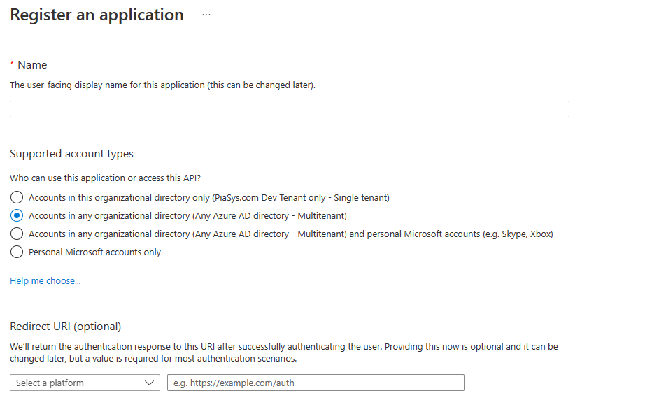
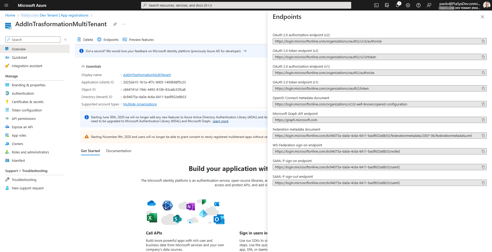
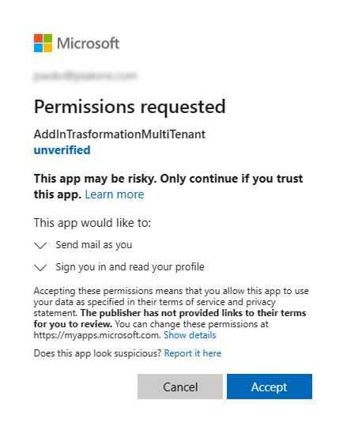
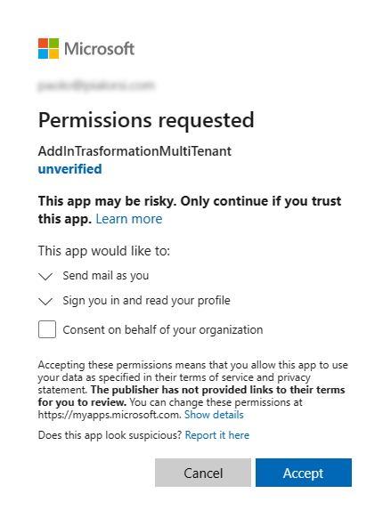
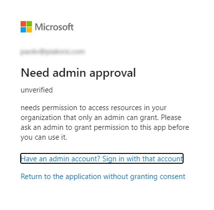
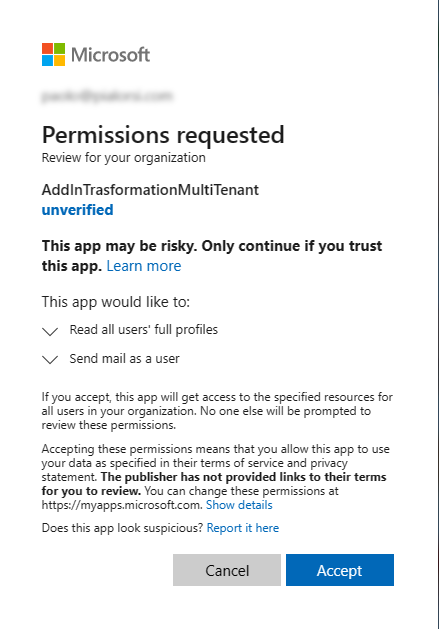
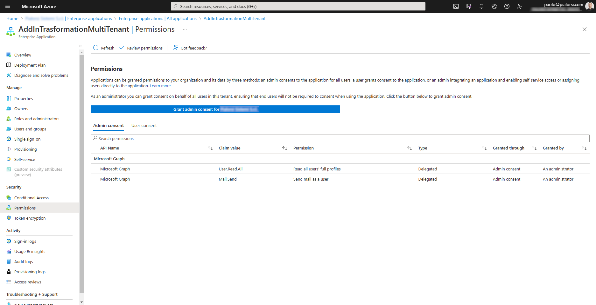
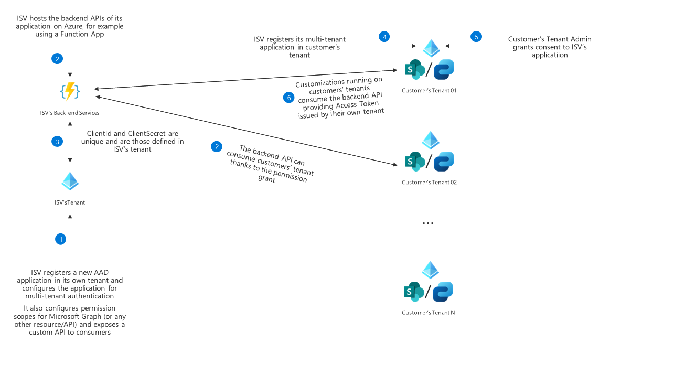

# Building Multi-tenant applications for SharePoint Online

A really common use-case when developing applications for SharePoint Online is the need to create reusable solutions that can be installed and shared across multiple tenants. Could be that you are simply developing a solution for an enterprise organization with a multi-tenant topology, or that you are building a solution targeting a multi-geo tenant, or simply that you are an ISV and you plan to sell your solution to multiple customers and as such your solution will need to handle multiple tenants with proper isolation and security boundaries.

In the SharePoint Add-in model there wasn't a real concept of multi-tenant solution, but you could create a provider-hosted application and in the provider-hosted code you could handle different target tenants and application identities when talking with Azure Access Control Service (ACS) to retrieve a token to consume SharePoint Online.

> [!IMPORTANT]
> This article refers to so called PnP components, samples and/or tooling which are open-source assets backed by an active community providing support for them. There is no SLA for open-source tool support from official Microsoft support channels. These components or samples are however using Microsoft supported out of the box APIs and features which are supported by Microsoft.

If you prefer, you can watch the following video, instead of reading the whole article, which you can still consider as a much more detailed reference.

[](https://youtu.be/iq8iMXaTpBQ)

## Registering Multi-tenant applications in Azure Active Directory

Nowadays, with SharePoint Framework you can easily build the UI/UX of your solutions regardless if the solutions are single-tenant or multi-tenant and you should have a back-end infrastructure, for example hosted on Microsoft Azure, to provide the actual business logic for your solution. The back-end infrastructure should be implemented using SharePoint REST APIs and/or Microsoft Graph and should rely on an Azure Active Directory registered application.

In the article [Upgrading SharePoint applications from Azure Access Control Service to Azure Active Directory](./from-acs-to-aad-apps.md) you can find additional details about how to migrate an application from Azure ACS to Azure AD. However, when you want to create a multi-tenant solution you need to keep into account some additional information.

When creating a multi-tenant application you need to register the corresponding Azure AD application as a multi-tenant one. In order to do that, you can choose the *"Accounts in any organizational directory (Any Azure AD directory - Multitenant)"* option in the *"Supported account types"* section, while manually registering the application in the Azure Portal, like you can see in the following screenshot.



When you choose such an option, the Azure AD application can target any Azure Active Directory (and Microsoft 365) tenant, as long as your application will be granted proper permission in the target tenant. In fact, if you open the *"Endpoints"* panel of an application registered as multi-tenant while in the Azure Portal, you can see that all the URLs of the OAuth and OpenID Connect endpoints will have the *organizations* keyword instead of an explicit tenant ID, because the application can target any organization and not just a specific tenant.



Now, when you configure specific permissions for your application using the *API Permissions* page, the permissions will be granted to the application within the current tenant, but you can also request users or administrators of other tenants to grant the same permissions to your application in their own tenants. In the following screenshot you can see an application with two delegated permissions granted in the current tenant:

- Mail.Send: allows the application to send email messages on behalf of the current user. It requires user or admin consent.
- User.Read.All: allows the application to read the whole list of users in the tenant on behalf of the current user. It requires admin consent


> [!NOTE]
> You can find additional details about delegated permission in the article [Understanding Azure Active Directory and OAuth 2.0 in the context of SharePoint Online modern development](./understanding-aad-and-oauth-for-spo-modern.md).

Now, imagine that you want to use the same application to consume data on tenants other than the one where you registered the multi-tenant application. Azure Active Directory allows to ask consent to users or admins, so that they can grant permissions to your application in their own tenants. The user consent requires you to go through the token request and authorization flow. As such, when the application will need to retrieve an Access Token to work on behalf of the current user, the very first time that it will happen, the user will be prompted to consent the permission to your app. 

In the following screenshot you can see how the consent UI looks like.



In order to get such a page, for example you can configure the application for web authentication and send the user to a URL like the following one:

```TEXT
https://login.microsoftonline.com/{tenant-id}/oauth2/authorize?client_id={client-id}&response_type=code&redirect_uri={redirect-uri}&response_mode=query&scope={scope}
```

Where {tenant-id} for a multi-tenant application can be *organizations*, {client-id} has to be the value of the *"Application (client) ID"* property of the application in the *Overview* panel in Azure Active Directory, the {redirect-uri} is one of the URLs that you configured in the *Authentication* panel of the application, and {scope} represents the permissions scopes that you want to retrieve the authorization for. Just to make an example, in a real scenario the authorization URL for a multi-tenant application could be something like the following one.

```TEXT
https://login.microsoftonline.com/organizations/oauth2/authorize?client_id=2025da15-1b1a-4f7c-8005-1400b88f5c33&response_type=code&redirect_uri=https://pnp.github.io/&response_mode=query&scope=https%3A%2F%2Fgraph.microsoft.com%2Fmail.send
```

In case the user requesting the above URL is a tenant admin, the UI will be slightly different. The admin user can consent the permissions to the whole tenant on behalf of the organization.



If any of the requested permissions requires a tenant admin approval, like for example the *User.Read.All* permission scope, then a tenant admin will be required in order to consent the application access to a target tenant. As such, if you will browse to the *authorize* URL with a regular user, who is not a tenant admin, you will see an UI like the following one.



The message clearly instructs the user to ask to a tenant admin to approve the permissions requests at tenant level.

A tenant admin will be able to browse to the same URL as before, or to a specific admin consent URL like the following one.

```TEXT
https://login.microsoftonline.com/{tenant-id}/adminconsent?client_id={client-id}&redirect_uri={redirect-uri}
```

The {tenant-id} argument for a multi-tenant application can be *organizations*, {client-id} has to be the value of the *"Application (client) ID"* property of the application in the *Overview* panel in Azure Active Directory. You could also specify a return URL, as long as it is properly configured in the *Authentication* panel of the application, or you can skip it and the browser, after the consent, will be redirected to a redirect URL configured for the application. Just to make an example, in a real scenario the admin consent URL for a multi-tenant application could be something like the following one.

```TEXT
https://login.microsoftonline.com/organizations/adminconsent?client_id=2025da15-1b1a-4f7c-8005-1400b88f5c33&redirect_uri=https://pnp.github.io/
```

In the following screenshot, you can see what kind of UI a tenant admin will see.



From a target tenant point of view, once the grant of permissions is sucessfully completed, the multi-tenant application will show up in the list of *"Enterprise Applications"* in Azure Active Directory.



> [!NOTE]
> You can find further information about the Azure AD consent flows by reading the article [Consent experience for applications in Azure Active Directory](/azure/active-directory/develop/application-consent-experience).

## Handling Multi-tenant applications in SharePoint Framework

Imagine that you need to build a SharePoint Framework solution that relies on a back-end API and you want your solution to be multi-tenant, for example because you are planning to sell it through the Microsoft AppSource store.

> [!NOTE]
> Microsoft AppSource is the official marketplace for Microsoft 365, Microsoft Power Platform, and Microsoft Dynamics 365 offered by Microsoft at the following URL: [https://appsource.microsoft.com/](https://appsource.microsoft.com/).

Based on what you have just seen in this article, in order to achieve the just described goal you are supposed to register an Azure Active Directory application configured for multi-tenant authentication and to request your customers to consent permissions to your application in every target tenant.

In the following diagram you can see how the registration and consent flow should work.



Here are the main steps of the registration and consent flow:

1. The ISV registers a new Azure AD application in its own tenant and configures the application for multi-tenant authentication.
It also configures permission scopes for Microsoft Graph (or any other resource/API) and exposes a custom API to consumers
1. ISV hosts the backend APIs of its application on Azure, for example using a Function App, or on any other cloud hosting provider.
1. *ClientId* and *ClientSecret* of the Azure AD application are unique and are those defined in ISV’s tenant.
1. ISV registers its multi-tenant application in customer’s tenant.
1. Customer’s Tenant admin grants consent to ISV’s application.
1. Customizations running on customers’ tenants consume the backend API providing Access Token issued by their own tenant.
1. The backend API can consume customers’ tenant thanks to the permission grant.

While registering and hosting a multi-tenant application (steps 1, 2, and 3) is trivial, registering and consenting the app in every target tenant (steps 4 and 5) can be a challenge. That's why Microsoft in SharePoint Framework, since version 1.15, introduced the capability to automate the multi-tenant registration and consent of an application.

When you consume back-end APIs in SharePoint Framework using the `AadHttpClient` object, you should also configure in the *package-solution.json* file of the solution the permissions that your SPFx solution will need. Here you can see a sample *package-solution.json* file taken from a [reference solution](https://github.com/pnp/spfx-reference-scenarios/tree/main/samples/ace-pnp-contoso-orders) available on GitHub.

```JSON
{
  "$schema": "https://developer.microsoft.com/json-schemas/spfx-build/package-solution.schema.json",
  "solution": {
    "name": "contoso-orders-client-side-solution",
    "id": "093eebef-9dbb-4b13-ba09-4da180bceb6d",
    "version": "1.0.0.0",
    "includeClientSideAssets": true,
    "skipFeatureDeployment": true,
    "isDomainIsolated": false,
    "developer": {
      "name": "Microsoft 365 PnP",
      "websiteUrl": "https://aka.ms/m365pnp",
      "privacyUrl": "",
      "termsOfUseUrl": "",
      "mpnId": "Undefined-1.13.0"
    },
    "webApiPermissionRequests": [
      {
        "resource": "PnP.Contoso.Orders",
        "scope": "Orders.FullControl"
      }
    ],
    "metadata": {
      "shortDescription": {
        "default": "PnP Contoso Orders sample"
      },
      "longDescription": {
        "default": "PnP Contoso Orders sample"
      },
      "screenshotPaths": [],
      "videoUrl": "",
      "categories": []
    }
  },
  "paths": {
    "zippedPackage": "solution/contoso-orders.sppkg"
  }
}
```

In the above excerpt, the *webApiPermissionRequests* section of the configuration file declares that the solution needs the permission scope with name *Orders.FullControl* provided by the Azure AD application with name *PnP.Contoso.Orders*. Practically speaking, the *PnP.Contoso.Orders* represents the multi-tenant back-end application that the SharePoint Framework solution is willing to consume and that should be registered in the target tenants, while the *Orders.FullControl* scope is the permission that tenant admins should grant in their tenants prior to being able to consume the back-end API.

> [!NOTE]
> You can dig into consuming external APIs in SharePoint Framework by reading the articles [Connect to Azure AD-secured APIs in SharePoint Framework solutions](../spfx/use-aadhttpclient.md) and [Consume multi-tenant enterprise APIs secured with Azure AD in SharePoint Framework](..spfx/use-aadhttpclient-enterpriseapi-multitenant.md).

One option, as already illustrated in this article, would be to provide the admin consent URL to a tenant admin of a target tenant and to follow the manual consent flow. Another and better option that you have, since SharePoint Framework 1.15, is to enrich the *webApiPermissionRequests* section of the *package-solution.json* file like in the following code excerpt.

```JSON
"webApiPermissionRequests": [
    {
    "appId": "a47390a4-f0cb-42ee-b3de-0a0af6e44f2d",
    "replyUrl": "https://aka.ms/m365pnp",
    "resource": "PnP.Contoso.Orders",
    "scope": "Orders.FullControl"
    }
],
```

Notice the new properties *appId* and *replyUrl*, which respectively define the unique ID of the application to consent on the target tenant, and the URL where you want the user to be redirected once the consent flow is completed. Again, practically speaking the above properties define what we used to provide in the admin consent URL: {client-id} and {redirect-uri}.

By settings the above properties, when a user deploys such a SharePoint Framework solution in the tenant App Catalog and approves the permission requests for the custom package, SharePoint Online will first ask the admin user to register the multi-tenant application in the target tenant and to consent the needed permissions, and then will allow the admin user to approve the permission requests of the SharePoint Framework solution. The registration, consent and grant flow will be fully integrated in the SharePoint Framework solution deployment flow, without the need to share any admin consent URLs with the target tenant admins.

## Recommended content 

You can find additional information about this topic reading the following documents:

* [Tenancies and deployment scopes for SharePoint Add-ins](../sp-add-ins/tenancies-and-deployment-scopes-for-sharepoint-add-ins.md)
* [Consent experience for applications in Azure Active Directory](/azure/active-directory/develop/application-consent-experience)
* [Microsoft identity platform and OAuth 2.0 authorization code flow](/azure/active-directory/develop/v2-oauth2-auth-code-flow)
* [Connect to Azure AD-secured APIs in SharePoint Framework solutions](../spfx/use-aadhttpclient.md)
* [Consume multi-tenant enterprise APIs secured with Azure AD in SharePoint Framework](../spfx/use-aadhttpclient-enterpriseapi-multitenant.md)
* [Building ISV offering for Microsoft Viva with SPFx ACEs and multi-tenant APIs hosted in Azure](https://www.youtube.com/watch?v=6VEYD11m0TA)
* [Consume a multi-tenant API within a set of Microsoft Viva Connections Adaptive Card Extensions (ACEs)](https://github.com/pnp/spfx-reference-scenarios/tree/main/samples/ace-pnp-contoso-orders)
