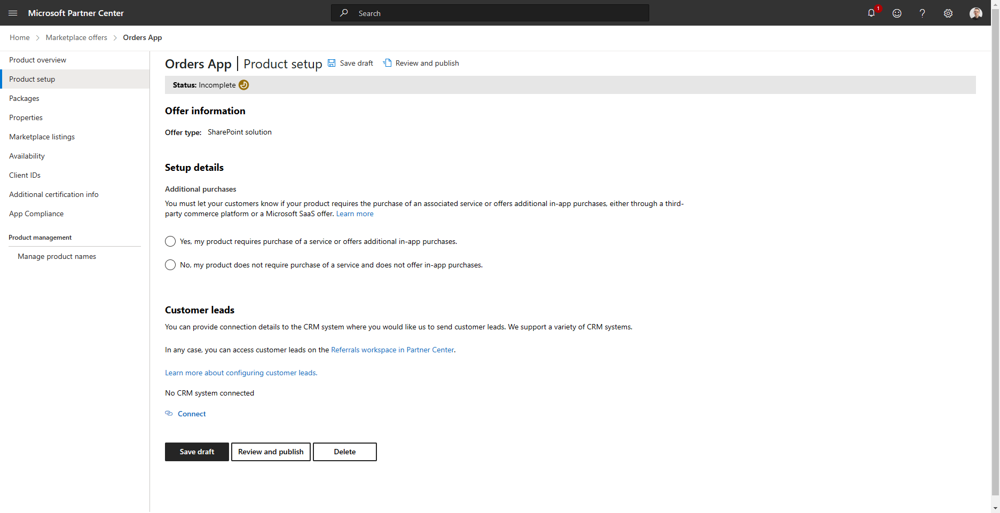

# Publishing modern SharePoint applications on Microsoft AppSource

In this article, you will learn how to publish on the Microsoft 365 Store (via [Microsoft AppSource](https://appsource.microsoft.com/)) a modern solution built with SharePoint Framework. Your SharePoint Framework solution can target SharePoint Online only, or also Microsoft Teams. In the latter case, the application will show up in the Microsoft Teams gallery through the SharePoint Online tenant App Catalog.

If you prefer, you can watch the following video, instead of reading the whole article, which you can still consider a much more detailed reference.

> [!VIDEO https://youtu.be/_z-q787tGrQ]

## How to publish an application on the marketplace

First of all, you need to make sure that you are a member of the Microsoft Partner Network (MPN). If you are not a registered member, you can enroll through the following link: [https://aka.ms/joinmarketplace](https://aka.ms/joinmarketplace). To be able to sell your products on the marketplace, you will also need to provide a payout profile, and a tax profile, and to compile the billing profile. The process will require a review and approval phase on the Microsoft side.

Once you are a registered partner, you have to complete the onboarding process for the *"Office Store"* program. Click on the gear icon in the upper right corner of the *"Partner Center"* website and select *"Account Settings"*. Choose *"Program"* in the menu on the right side of the page and then *"Other Programs"* to see the available programs to enroll. Select the program with the name *"Office Store"* and start the enrollment process.

Once you are enrolled in the *"Office Store"* program (it can take up to 48 hours) you should be able to find the *"Office Store"* program in your Partner Center dashboard, under [*"Account settings"* -> *"Programs"* -> *"Registered programs"*](https://partner.microsoft.com/dashboard/account/v3/settings/programs).

You can now move to the [*"Marketplace"*](https://partner.microsoft.com/dashboard/marketplace-offers/overview) section of the *"Partner Center"*, which you can find under the *"Home"* page of the *"Partner Center"* web site, and from there you should choose to target the *"Office store"* and create a *"New offer"* of type *"SharePoint solution"*.

Provide a name for your application, check that the name is unique and available, associate the product with a publisher, and save it. For the sake of making an example, imagine that you are going to publish a solution with the name *"Orders App"*, like illustrated in the following screenshot.

Now, you are ready to go through the registration steps for your SharePoint solution. Specifically, you have to provide information about the *"Product setup"*. The information includes a flag to specify if your product includes in-app purchases or associated services that require an additional purchase. You can also configure a connection to a CRM (Customer Relationship Management) system to send customer leads to.

Then, you can upload the actual packages of your solution, through a dedicated page called *"Packages"*.

The next step is the one to define the *"Properties"* of the solution. This includes information about the product category, the target industries, the legal information like the license contract, a link to the EULA (End User License Agreement), and the documentation link.

You can now define the *"Marketplace listings"* for your solution. In this section, you can define the supported languages.

The next step is the *"Availability"* one, where you can configure the target markets and the date of release of your solution. In fact, you can prepare your solution on the Office Store and schedule the release for a future date.

In case your solution relies on Azure Access Control Service (ACS), you can configure the Client IDs of those applications, including a *"Friendly name"*, an *"App domain"*, an *"App redirect URL"*, and you can eventually generate a *"Client Secret"* through the *"Client IDs"* section. Clearly, for modern SharePoint Online solutions, you shouldn't rely on Azure ACS but on Azure Active Directory registered applications.

It is now time to provide *"Additional Certification Info"* useful to test your solution. Through this step, you can provide information useful for testing, screenshots, and additional PDF documentation. This information is not shown to customers but is used for testing purposes only. 

You can now go through a *"Publisher Attestation"*, which is voluntary, and allows you to complete a self-assessment of your app's security, data handling, and compliance practices.

The last and optional step *"Manage product names"* allows you to reserve additional names for your solution, in case you want to use different names based on the target language or to change your product's name in the future.

Once you are done with loading all the requested information, you can submit your solution for validation. You can submit the solution from the *"Product overview"* page, where you can review your app's information and click on the *"Review and publish"* button. 

Clicking on the button will prompt you with a report of all the provided information and about any missing data. You can also provide additional notes for the certification of your solution and you can configure the notification targets for the submission status notifications. 

Once you will publish your solution, it will go through a certification process that is described in the following section.

## Solution Certification

Before submitting the solution through the certification process, it is highly suggested that you validate your application against the validation checklist so that the app will pass the approval process. You can find the list of validation checks in the document [Prepare your SharePoint Framework application for publishing to the Marketplace](../spfx/publish-to-marketplace-checklist.md).

In the checklist, just for the sake of making an example, you will find checks like:

- Use the SharePoint Framework v1.11 or newer
- Test application in both root and non-root sites
- Test application in the required browsers
- The application must only manipulate the DOM element provided through the `domElement` property
- Don't use the names of other Microsoft products in your solution's name
- Supporting end users to inject scripts is not allowed
- Don't include malicious code
- etc.

Your application will go through a certification process, and it is better and time-saving for you to validate all the checks before submitting your application. You should also make sure you read, review, and comply with the [Microsoft 365 policies for SharePoint Framework solutions](/legal/marketplace/certification-policies#1170-sharepoint-framework-solutions).

Once you've gone through the offer registration process and your solution is certified and validated, your offering will become ready and available on the marketplace on the availability date that you configured.

## Recommended content

You can find additional information about this topic by reading the following documents:

* [Prepare your SharePoint Framework application for publishing to the Marketplace](../spfx/publish-to-marketplace-checklist.md)
* [Microsoft 365 policies for SharePoint Framework solutions](/legal/marketplace/certification-policies#1170-sharepoint-framework-solutions)
* [Join the Microsoft Marketplace](https://aka.ms/joinmarketplace)
* [Microsoft Business Applications Independent Software Vendor (ISV) Connect Program onboarding guide](/azure/marketplace/business-applications-isv-program)
* [Store step-by-step submission guide](/azure/marketplace/add-in-submission-guide)
