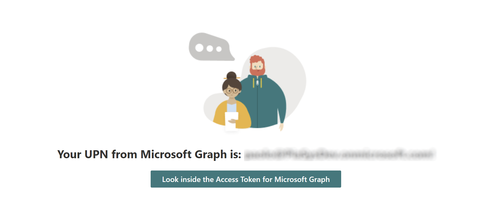

# Understanding Azure Active Directory and OAuth 2.0 in the context of SharePoint Online modern development

Authentication and Authorization play a key role in any development platform. In the fields of SharePoint Online modern development Azure Active Directory (AzureAD) and the Open Authorization 2.0 (OAuth 2.0) protocol are key elements of the security infrastructure.

In fact, Azure Active Directory sits under the cover of every Microsoft 365 tenant and handles authentication and authorization requirements when accessing native services, as well as custom developed applications. OAuth 2.0 is the industry protocol used to authorize access to native workloads and custom developed applications.

> [!IMPORTANT]
> This article refers to so called PnP components, samples and/or tooling which are open-source assets backed by an active community providing support for them. There is no SLA for open-source tool support from official Microsoft support channels. These components or samples are however using Microsoft supported out of the box APIs and features which are supported by Microsoft.

If you prefer, you can watch the following video, instead of reading the whole article, which you can still consider as a much more detailed reference.

## Understanding the role of AzureAD and OAuth 2.0 in SharePoint Framework

In Microsoft SharePoint Online, when developing SharePoint Framework (SPFx) solutions, you can consume Microsoft Graph, as well as any other third-party APIs relying on OAuth 2.0 and Azure Active Directory. Specifically, and by default, in SharePoint Framework any external API can be consumed either via _MSGraphClient_ or _AadHttpClient_ and leveraging a pre-defined Azure Active Directory application with name "SharePoint Online Client Extensibility Web Application Principal". 

> [!NOTE]
> For further details about consuming Microsoft Graph from within a SharePoint Framework solution you can read the article ["Use the MSGraphClientV3 to connect to Microsoft Graph"](../spfx/use-msgraph.md). For further details about consuming any other third-party APIs from within SharePoint Framework you can read the article ["Connect to Azure AD-secured APIs in SharePoint Framework solutions"](../spfx/use-aadhttpclient.md).

> [!IMPORTANT]
> There are scenarios where you need to have a dedicated and isolated access to a target API. In such scenario, you can rely on the Domain Isolated configuration for your SharePoint Framework solution. You can find additional details about the Domain Isolated scenario reading the article ["Isolated web parts"](../web-parts/isolated-web-parts.md).

The "SharePoint Online Client Extensibility Web Application Principal" application is pre-registered by Microsoft SharePoint Online in any Microsoft 365 tenant and allows all the SharePoint Framework solutions to share a unique application to access both Microsoft Graph and any other third-party APIs. In this article, you will understand what the role of Azure Active Directory and OAuth 2.0 in the SharePoint Framework context is.

## Understanding Access Tokens

In order to consume any API registered in Azure Active Directory and secured with OAuth 2.0 you need to provide an Access Token, which by definition is an opaque string used to protect a resource. With Azure Active Directory, as well as with many other vendor-specific identity platforms, the Access Token is a JSON Web Token (JWT) that contains a set of claims. Claims are assertions about a subject described by the Access Token and where the assertions are guaranteed to be true because the token is digitally signed by the issuer (Azure Active Directory in this context) and the recipient of the token trusts the issuer.

> [!NOTE]
> You can find additional information about the Open Authorization 2.0 protocol reading its specification ["The OAuth 2.0 Authorization Framework"](https://datatracker.ietf.org/doc/html/rfc6749). You can also find additional information about the JWT token format for Access Tokens reading the document ["JSON Web Token (JWT) profile for OAuth 2.0 Acccess Tokens"](https://www.rfc-editor.org/rfc/rfc9068).

An Access Token is provided to the target API/service through a HTTP Authorization header and specifically, in the fields of Azure Active Directory, it is an Authorization token of type _Bearer_.

> [!NOTE]
> In case you are wondering what "Bearer" means and why you need to specify the Bearer type before the actual Access Token value in the Authorization header, you can read the specification ["The OAuth 2.0 Authorization Framework: Bearer Token Usage"](https://www.rfc-editor.org/rfc/rfc6750).

### Delegated vs Application permissions scopes

One of the main information described by an Access Token are the permissions granted in order to consume the target API/service.

There are two main flavors of permissions in Access Tokens:

- **Delegated**: are tokens that allow consuming a target API/service acting as the signed-in user.
- **Application**: are tokens that allow consuming a target API/service with an application identity, without a signed-in user. Typical scenarios are background tasks, daemons, etc.

When using Delegated permissions in Access Tokens, the permissions scopes associate with the token will be the result of the intersection of the permission of the signed-in user and the permissions of the application consuming the API/service. It means that, even if potentially the user can have high-level permissions (Read and Write email messages for example), if the application is registered in Azure Active Directory with low-level permissions (Read only for email messages for example), the resulting permissions granted to the application will be the intersection of both user and application permissions (i.e. Read only for email messages in the current example).

In order for the tokens to be issued and fully effective, there must be either an explicit user's consent, for those permissions related to personal resources of the current user, or a tenant admin's consent, for those permissions related to tenant-wide resources.

When using Application permissions in Access Tokens, tipically the permissions granted require a tenant admin's consent because such an application will then gain access to target resources tenant-wide, and as such an admin approval is required.

In SharePoint Framework solutions, you will only get Access Tokens with Delegated permissions, meaning that you will only consume Microsoft Graph and any other API/services acting as the signed-in user.

### Understanding SharePoint Framework Access Tokens and Delegated permissions scopes

In order to better understand the role and the format of an Access Token you can play with the sample ["Consuming Microsoft Graph from SharePoint Framework"](https://github.com/pnp/addin-transformation-guidance/tree/main/samples/Understanding-AAD-OAuth-for-SPFx/Consuming-MSGraph-from-SPFx) related to this article. In the following screenshot you can see the user interface of the sample.

The sample Web Part relies on the ["jwt.ms"](https://jwt.ms) web site provided by Microsoft, where you can inspect the content of an Access Token.

Running the sample web part in the SharePoint Framework Workbench and pressing the "Look inside the Access Token for Microsoft Graph" button you will be brought to the jwt.ms web site where you can see the content of your Access Token. In the following screenshot you can see the output of the jwt.ms web site for a sample Access Token.

Inside every JWT Access Token there are claims, and here you can find a list of the most important ones for an Access Token issued to a SharePoint Framework client with Delegated permission scopes:

- aud: the target audience for the token, meaning the API/service that the token has been issued for.
- iss: the issuer of the token, which is the Azure Active Directory tenant that issued it.
- iat: stands for "issued at time" and represents the point in time when the token was issued.
- nbf: stands for "not before time" and represents the point in time before when the token must not be accepted by the target audience.
- exp: stands for "expiration time" and represents the point in time after when the token must not be accepted by the target audience.
- app_displayname: the name of the application for which the token has been issued (the consumer application for the target audience).
- name: the full name of the user that the token relates to.
- scp: the Delegated permissions scopes associated with the current Access Token.
- upn: the User Principal Name of the user that the token relates to. 

If you are consuming the Microsoft Graph, like in the above sample, the _aud_ claim will describe the Microsoft Graph (https://graph.microsoft.com). If you are consuming a third-party API/service the _aud_ claim will describe that target API. Notice that the *app_displayname* claim, for a SharePoint Framework solution, is "SharePoint Online Client Extensibility Web Application Principal", which is precisely the application that this article was referring to in the introduction. 

> [!NOTE]
> For a Domain Isolated solution, the *app_displayname* claim will be the one of a dedicated application registered for you in Azure Active Directory by the SharePoint Online services.

On the client side, meaning in SharePoint Framework, you should never rely on the actual content of the Access Token. The provided sample is just for the sake of understanding how the security model works. However, in a common scenario, you can simply benefit of the out of the box capabilities of SharePoint Framework, which hides from you all the plumbing of consuming external APIs from within your code.

On the service side, if you are consuming Microsoft Graph, it will be responsibility of Microsoft to evaluate the provided Access Token and to authorize (or deny) access to the requeste API endpoint. In case you are consuming a third-party API/service that you implemented, you can either rely on the configuration options of Microsoft Azure, if you are hosting the service on Microsoft Azure, or you can rely for example on the Microsoft Authentication Library (MSAL) and the Microsoft.Identity.Web library to validate and authorize the tokens.

> [!NOTE]
> You can find additional information about the Microsoft Authentication Library reading ["Overview of the Microsoft Authentication Library (MSAL)"](https://learn.microsoft.com/en-us/azure/active-directory/develop/msal-overview). You can find further details about the Microsoft.Identity.Web library reading the article ["Microsoft Identity Web authentication library"](https://learn.microsoft.com/en-us/azure/active-directory/develop/microsoft-identity-web).

## Recommended content

You can find additional information about this topic reading the following documents:

* ["Connect to Azure AD-secured APIs in SharePoint Framework solutions"](../spfx/use-aadhttpclient.md)
* ["Isolated web parts"](../spfx/web-parts/isolated-web-parts.md)
* ["Overview of the Microsoft Authentication Library (MSAL)"](https://learn.microsoft.com/en-us/azure/active-directory/develop/msal-overview)
* ["Microsoft Identity Web authentication library"](https://learn.microsoft.com/en-us/azure/active-directory/develop/microsoft-identity-web)