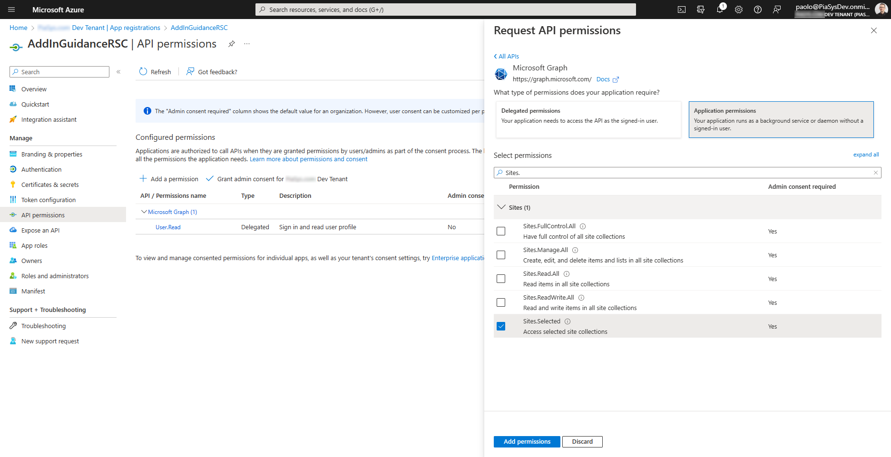
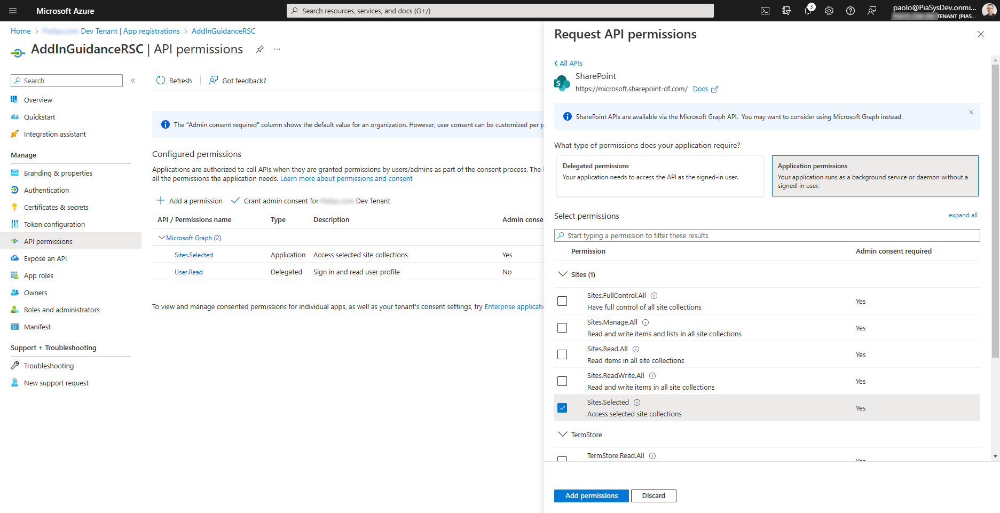

# Understanding Resource Specific Consent for Microsoft Graph and SharePoint Online

Historically in Microsoft SharePoint, both on-premises and online, there has been the capability to register applications in Azure Access Control Services (ACS) with granular permissions targeting specific site collections only. Through this technique, you were able to authorize a custom application to read, write, manage, or have full control on specific site collections with application-only permissions.

ACS isn't however anymore the best option to manage application registration and security for SharePoint. You should rely on Microsoft Entra (formerly Azure Active Directory) application registration and OAuth. By default, when you register an application in Microsoft Entra, and you can configure Microsoft Graph application permissions like *Sites.Read.All*, *Sites.ReadWrite.All*, *Sites.Manage.All*, or *Sites.FullControl.All*, which are permission that targets all the site collections in the target tenant, as the *All* word implies in the name of the permission scopes.

The *All* target isn't always welcomed by customers, in particular by enterprise customers with thousands of site collections, willing to have more granular permissions, being able to select the target site collections where the application should have read, write, manage, or full control permissions.

> [!IMPORTANT]
> This article refers to so called PnP components, samples and/or tooling which are open-source assets backed by an active community providing support for them. There is no SLA for open-source tool support from official Microsoft support channels. These components or samples are however using Microsoft-supported out-of-the-box APIs and features that are supported by Microsoft.

If you prefer, you can watch the following video, instead of reading the whole article, which you can still consider as a much more detailed reference.

[](https://youtu.be/94eJAsAm1Kg)

> [!NOTE]
> You can learn more about registering applications in Microsoft Entra instead of relying on Azure ACS by reading the article [Upgrading SharePoint applications from Azure Access Control Service to Microsoft Entra](./From-ACS-to-AAD-apps.md).

With Resource Specific Consent (RSC) you can register applications in Microsoft Entra and grant them application-only permissions that can target specific site collections only, like you used to do with ACS. In this article, you're going to learn how to benefit of this capability.

## Registering an application with Resource Specific Consent permissions

To register a Microsoft Entra application with RSC permission, you simply need to register a regular application in Microsoft Entra. However, when you configure the API permissions of the application, instead of selecting any of the *Sites.&lt;something&gt;.All* application permissions for Microsoft Graph, you need to choose the *Sites.Selected* application permission, as illustrated in the following screenshot.



Then, a tenant admin, which can eventually still be you, will have to grant the *Sites.Selected* application permission to the application.

There's also a *Sites.Selected* application permission for SharePoint Online, in case you want to consume SharePoint Online via REST APIs, instead of consuming SharePoint Online via Microsoft Graph. In the following screenshot, you can see how the *Sites.Selected* permission for SharePoint Online looks like in Microsoft Entra.



## Granting permissions to a specific Site Collection

Once the *Sites.Selected* application permission is assigned and granted, the application still can't access any target site collection. In order to be able to access any target site, you'll need a tenant global admin or an application with *Sites.FullControl.All* application permission to grant explicit permissions for the selected target sites.

### Granting permissions via Microsoft Graph

To grant permissions to the selected target sites, you can use a Microsoft Graph API POST request, targeting the following URL:

```TEXT
https://graph.microsoft.com/v1.0/sites/{siteId}/permissions
```

Where the {siteId} is the Microsoft Graph unique ID of the target site collection, with a format like the following one:

```TEXT
contoso.sharepoint.com,5a58bb09-1fba-41c1-8125-69da264370a0,9f2ec1da-0be4-4a74-9254-973f0add78fd
```

The body of the HTTP POST request should have a structure like the following code excerpt.

```JSON
{
  "roles": ["{role}"],
  "grantedToIdentities": [{
    "application": {
      "id": "{clientId}",
      "displayName": "{application-name}"
    }
  }]
}
```

Where {role} can be any of the following values, or an array of any of the following values:

* read: provides the ability to read the metadata and contents of the item.
* write: provides the ability to read and modify the metadata and contents of the item.
* manage: provides the ability to read and modify the metadata and contents of the item and to manage the site.
* fullcontrol: provides full control on the site and its content.

The {client-id} attribute is the actual client ID of the Microsoft Entra application, and {application-name} is a description for the application.

The response that you'll get back from Microsoft Graph will look like the following JSON file.

```JSON
{
  "@odata.context": "https://graph.microsoft.com/v1.0/$metadata#sites('contoso.sharepoint.com,5a58bb09-1fba-41c1-8125-69da264370a0,9f2ec1da-0be4-4a74-9254-973f0add78fd')/permissions/$entity",
  "id": "aTowaS50fG1zLnNwLmV4dHxlMDBiNWUzZi0yMzI1LTQ3MWQtOTljZi1iOGM5ZDlmNDU2N2FANmM5NDA3NWEtZGEwYS00YzZhLTg0MTEtYmFkZjY1MmU4YjUz",
  "roles": [
    "write"
  ],
  "grantedToIdentitiesV2": [
    {
      "application": {
        "displayName": "AddInGuidanceRSC",
        "id": "e00b5e3f-2325-471d-99cf-b8c9d9f4567a"
      }
    }
  ],
  "grantedToIdentities": [
    {
      "application": {
        "displayName": "AddInGuidanceRSC",
        "id": "e00b5e3f-2325-471d-99cf-b8c9d9f4567a"
      }
    }
  ]
}
```

Notice that the *id* property in the response represents the unique ID to identify the custom-assigned permission. Using that ID, you can also manage already assigned selected permissions using REST and making GET, PATCH, or DELETE requests targeting the *permissions/{permission-id}* endpoint of the target site collection, where {permission-id} represents the unique ID of the permission.

Clearly, you can also choose to use the Microsoft Graph SDK to manage the permissions, instead of relying on low-level HTTP requests.

### Granting permissions via PnP PowerShell

To grant and manage permissions to the selected target sites, you can also use a set of PnP PowerShell cmdlets:

* *[Grant-PnPAzureAdAppSitePermission](https://pnp.github.io/powershell/cmdlets/Grant-PnPAzureADAppSitePermission.html)*: adds permissions for a given Microsoft Entra application registration.
* *[Get-PnPAzureAdAppSitePermission](https://pnp.github.io/powershell/cmdlets/Get-PnPAzureADAppSitePermission.html)*: returns Microsoft Entra App permissions for a site.
* *[Set-PnPAzureAdAppSitePermission](https://pnp.github.io/powershell/cmdlets/Set-PnPAzureADAppSitePermission.html)*: updates permissions for a given Microsoft Entra application registration.
* *[Revoke-PnPAzureAdAppSitePermission](https://pnp.github.io/powershell/cmdlets/Revoke-PnPAzureADAppSitePermission.html)*: revokes permissions for a given app.

For example, if you want to grant *write* permission to a target application for a selected site, you can use the following PowerShell syntax:

```PowerShell
Grant-PnPAzureADAppSitePermission -AppId {client-id} -DisplayName {display-name} -Permissions <Read|Write|Manage|FullControl> -Site {site-object}
```

As it was with the Microsoft Graph endpoint, the {client-id} argument is the client ID of the Microsoft Entra application, and {display-name} is a description for the application. The *Permissions* argument can be one or more of the following values:

* Read: provides the ability to read the metadata and contents of the item.
* Write: provides the ability to read and modify the metadata and contents of the item.
* Manage: provides the ability to read and modify the metadata and contents of the item and to manage the site.
* FullControl: provides full control on the site and its content.

The {site-object} value can be a site object retrieved using the *Get-PnPSite* cmdlet, or can be omitted to target as the selected site the one to which you're connected with *Connect-PnPOnline* cmdlet.

The output of such a command will look like the following one, in the PowerShell console.

```PowerShell
Id    : aTowaS50fG1zLnNwLmV4dHxlMDBiNWUzZi0yMzI1LTQ3MWQtOTljZi1iOGM5ZDlmNDU2N2FANmM5NDA3NWEtZGEwYS00YzZhLTg0MTEtYmFkZjY
        1MmU4YjUz
Roles : {fullcontrol}
Apps  : {AddInGuidanceRSC, e00b5e3f-2325-471d-99cf-b8c9d9f4567a}
```

Notice that the cmdlet returns the granted permission and the unique *Id* of the permission object.

In case you want to update a permission assignment for a selected site, you can use a PowerShell syntax like the following one:

```PowerShell
Set-PnPAzureADAppSitePermission -PermissionId {permission-id} -Permissions <Read|Write|Manage|FullControl>
```

Where the {permission-id} argument is the *Id* that you've got back when invoking the *Grant-PnPAzureADAppSitePermission* cmdlet.

If you want to revoke a permission grant from a selected site, you can use the *Revoke-PnPAzureADAppSitePermission* cmdlet with the following syntax.

```PowerShell
Revoke-PnPAzureADAppSitePermission -PermissionId {permission-id}
```

> [!NOTE]
> In the samples folder associated with this article, you can find a [sample PowerShell script](https://github.com/pnp/addin-transformation-guidance/blob/main/samples/Understanding-RSC-for-MSGraph-and-SharePoint-Online/SitesSelectedDemo/GenerateAzureCertificate.ps1) that illustrates how to use the PnP PowerShell cmdlets for RSC.

## Consuming the target Site Collection

Once you have registered a Microsoft Entra application with *Sites.Selected* application permission, either with Microsoft Graph, or with SharePoint Online, or with both you can then start consuming the selected site collections according to the granted permissions.

You need to request an application-only access token from Microsoft Entra and start consuming the selected site collections. If you'll target a site, for which your application has been granted permissions, you'll successfully make it happen. If you'll target any other site collection, for which your application hasn't been granted permissions, your code will fail and you'll see an "Access denied" exception.

If you want to learn more about how to consume SharePoint Online via SharePoint REST API or via Microsoft Graph using an application-only token, you can read the section [Consuming SharePoint Online in app-only mode via an Azure AD registered application](./from-acs-to-aad-apps.md#consuming-sharepoint-online-in-app-only-mode-via-an-azure-ad-registered-application) of the article [Upgrading SharePoint applications from Azure Access Control Service to Microsoft Entra](./From-ACS-to-AAD-apps.md).

> [!NOTE]
> In the samples folder associated with this article, you can find a [sample .NET 6 console application](https://github.com/pnp/addin-transformation-guidance/tree/main/samples/Understanding-RSC-for-MSGraph-and-SharePoint-Online/SitesSelectedDemo/SitesSelected.ConsumerApp) that illustrates how to consume SharePoint Online sites leveraging the RSC model.

## Recommended content

You can find additional information about this article by reading the following documents:

* [Upgrading SharePoint applications from Azure Access Control Service to Microsoft Entra](./From-ACS-to-AAD-apps.md)
* [Permission resource type](/graph/api/resources/permission)
* [Controlling app access on a specific SharePoint site collections is now available in Microsoft Graph](https://devblogs.microsoft.com/microsoft365dev/controlling-app-access-on-specific-sharepoint-site-collections/)
