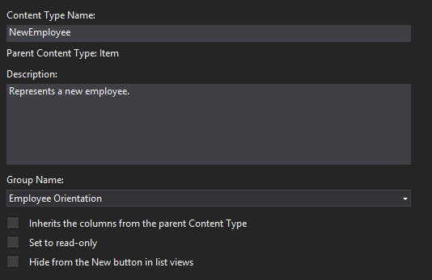
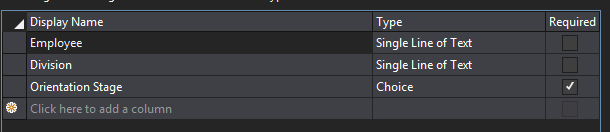

# Add a custom content type to a SharePoint-hosted SharePoint Add-in
Learn how to include custom content types in an SharePoint Add-ins.
 

 **Note**  The name "apps for SharePoint" is changing to "SharePoint Add-ins". During the transition, the documentation and the UI of some SharePoint products and Visual Studio tools might still use the term "apps for SharePoint". For details, see  [New name for apps for Office and SharePoint](new-name-for-apps-for-sharepoint.md#bk_newname).
 

This is the fourth in a series of articles about the basics of developing SharePoint-hosted SharePoint Add-ins. You should first be familiar with  [SharePoint Add-ins](sharepoint-add-ins.md) and the other articles in this series:
 

-  [Get started creating SharePoint-hosted SharePoint Add-ins](get-started-creating-sharepoint-hosted-sharepoint-add-ins.md)
    
 
-  [Deploy and install a SharePoint-hosted SharePoint Add-in](deploy-and-install-a-sharepoint-hosted-sharepoint-add-in.md)
    
 
-  [Add custom columns to a SharePoint-hostedSharePoint Add-in](add-custom-columns-to-a-sharepoint-hostedsharepoint-add-in.md)
    
 

 **Note**  If you have been working through this series about SharePoint-hosted add-ins, then you have a Visual Studio solution that you can use to continue with this topic. You can also download the repository at  [SharePoint_SP-hosted_Add-Ins_Tutorials](https://github.com/OfficeDev/SharePoint_SP-hosted_Add-Ins_Tutorials) and open the BeforeContentType.sln file.
 

In this article you add a custom content type to the Employee Orientation SharePoint Add-in.
 

## Create the custom content type

1. In  **Solution Explorer**, right-click the project and choose  **Add** > **New Folder**. Name the folder Content Types.
    
 
2. Right-click the new folder and choose  **Add** > **New Item**. The  **Add New Item** dialog box opens to the **Office/SharePoint** node..
    
 
3. Choose  **Content Type** and give it the nameNewEmployee, and then choose  **Add**. When prompted by the wizard to select the base content type, choose  **Item**, and then choose  **Finish**.
    
 
4. If the content type designer does not automatically open, choose the  **NewEmployee** content type in **Solution Explorer** to open it.
    
 
5. Open the  **Content Type** tab in the designer and fill the text boxes as follows:
    
      -  **Content Type Name**: NewEmployee
    
 
  -  **Description**: Represents a new employee.
    
 
  -  **Group Name**: Employee Orientation
    
 
6. Verify that  *none*  of the check boxes on the tab are selected. The check box for **Inherits the columns from the parent Content Type** may be selected by default. *Be sure to clear it.*  The tab should now look like the following:
    
    **Content Type Tab**

  
 
 
7. Open the  **Columns** tab in the designer.
     
8. In the gird, choose  **Click here to add a column** to open a drop down list of columns, and add the **Division** column. It is listed in the drop-down list by its display name: **Division**. Do the same for the  **Orientation Stage** column. (If they are not listed, you may not have started with the correct Visual Studio solution. Start with BeforeContentType.sln.) When your are finished the grid should look like the following:
    
    **Columns Tab**

    
 
 
9. Save the file and close the designer.
    
 
10. The next step requires that you work directly in the raw XML for the content type, so in  **Solution Explorer**, choose the elements.xml file child of the  **NewEmployee** content type.
    
 
11. There are already  **FieldRef** elements in the file for the two columns that you added. Add **FieldRef** elements for two built-in SharePoint columns as peers of the two that are already there. The following is the markup for the elements. *You must use these same GUIDs for the ID attribute because these are built-in field types with fixed IDs.*  Add these *above*  the two **FieldRef** elements for the custom site columns.
    
```
  <FieldRef Name="LinkTitle" ID="{82642ec8-ef9b-478f-acf9-31f7d45fbc31}" DisplayName="Employee" />
<FieldRef Name="Title" ID="{fa564e0f-0c70-4ab9-b863-0177e6ddd247}" DisplayName="Employee" />
```


    Note that we have given these fields a custom display name:  **Employee**.
    
 
12. Save and close the file.
    
 
13. Expand the  **Lists** node in **Solution Explorer** and choose **NewEmployeeOrientation** to open the list type designer.
    
 
14. Open the  **Columns** tab in the designer, and then choose the **Content Types** button.
    
 
15. In the  **Content Type Settings** dialog box, add the **NewEmployee** content type.
    
 
16. Choose the  **NewEmployee** content type in the list of types, and choose the **Set as Default** button.
    
 
17. Choose the  **Item** content type, right-click the small arrowhead that appears to the left of the content type name, and then choose **Delete**.
    
 
18. Repeat the preceding step for the  **Folder** content type, so **NewEmployee** is the only content type listed. The dialog box should now look like the following:
    
    **Content Type Settings dialog box**

    
 
19.  Choose **OK** to close the dialog box, and then save and close the file.
    
20. Open the schema.xml file.
    
21. Find the  **Fields** element. It should have three **Field** elements: **Title**, Division, and OrientationStage. (These elements may be on a single line in this generated file. If so, separate them with line breaks.)
 
22. Leave the file open and in  **Solution Explorer**, expand the  **Site Columns** folder and theDivision node, and then open the elements.xml file forDivision. The  **Field** element forDivision in schema.xml should exactly duplicate the **Field** element in theDivision elements.xml. If there is not an exact match, copy the **Field** element from the site column elements.xml file and paste it in place of the mismatched **Field** element in the schema.xml file. Then close the element.xml file.
    
23. Open the elements.xml file for OrientationStage. Here, too, there must be an exact match of the  **Field** elements in the two files forOrientationStage, including all child elements, such as the  **CHOICES** and **MAPPINGS** elements. If there isn't, copy the **Field** in the elements.xml file and paste it in place of the mismatched **Field** element in the schema.xml file. Then close the element.xml file.
 
24. Still in the schema.xml file, in the  **View** element whose **BaseViewID** value is "1", find the child **ViewFields** element and then add the following two **FieldRef** elements as children of it. They may already be there, but missing an **ID** attribute. If so, add the ID attribute.
    
```
  <FieldRef Name="Division" ID="{GUID from the Field element}" />
<FieldRef Name="OrientationStage" ID="{GUID from the Field element}" />

```

25. Replace the two placeholder  **ID** attribute values with the GUIDs from the corresponding **Field** elements in the **ContentType** element for **NewEmployee** that is earlier in the schema.xml file. Don't forget the framing braces "{}".
    
    The  **ViewFields** for the "1" **View** should look like this. (Your GUIDs may be different.)
    


```
  <ViewFields>
   <FieldRef Name="LinkTitle" ID="{82642ec8-ef9b-478f-acf9-31f7d45fbc31}" DisplayName="Employee" />
   <FieldRef Name="Division" ID="{509d2d67-9a96-4596-9b3b-58449cdcc6ff}" />
   <FieldRef Name="OrientationStage" ID="{38a3b54c-acf3-4ddf-b748-55c7c28d4cc2}" />        
</ViewFields>
```

26. Still in the schema.xml file, find the  **View** element whose **BaseViewID** value is "0". find the **ViewFields** element with in it.
    
 
27. Copy the whole of the  **ViewFields** section from View "1" over the **ViewFields** section of View "0". The two views should now have identical **ViewFields** sections.
    
 
28. Save and close the schema.xml file.
    
 
29. In the  **Lists** folder, expand both the **NewEmployeeOrientation** node and its child list instance **NewEmployeesInSeattle**. You should be able to clearly see and distinguish the elements.xml for the template from the elements.xml for the instance. Open the one for the instance. 
    
 
30. Add two  **Field** elements to the first **Row** element, so that the **Row** element looks like the following.
    
```
  
<Row>
  <Field Name="Title">Tom Higginbotham</Field>
  <Field Name="Division">Manufacturing</Field>
  <Field Name="OrientationStage">Tour of building</Field>
</Row>
   
```

31. Save and close the file.
    
 

## Run and test the add-in

1. Use the F5 key to deploy and run your add-in. Visual Studio makes a temporary installation of the add-in on your test SharePoint site and immediately runs the add-in. 
     
2. When the add-in's default page opens, choose the  **New Employees in Seattle** link to open the custom list instance.
 
3. The list page opens and the Division andOrientationStage columns are on it. It is not necessary for a user to add them manually because they are part of the list's content type. The top item has the data you added.
    
    **New Employees in Seattle list**

     
 
4. Try adding new items to the list and editing existing items.
    
 
5. To end the debugging session, close the browser window or stop debugging in Visual Studio. Each time that you press F5, Visual Studio will retract the previous version of the add-in and install the latest one.
    
 
6. You will work with this add-in and Visual Studio solution in other articles, and it's a good practice to retract the add-in one last time when you are done working with it for a while. Right-click the project in  **Solution Explorer** and choose **Retract**.

## 
<a name="Nextsteps"> </a>

In the next article in this series, you'll add a list view Web Part to the default page of the SharePoint Add-in:  [Add a Web Part to a page in a SharePoint-hosted SharePoint Add-in](add-a-web-part-to-a-page-in-a-sharepoint-hosted-sharepoint-add-in.md).
