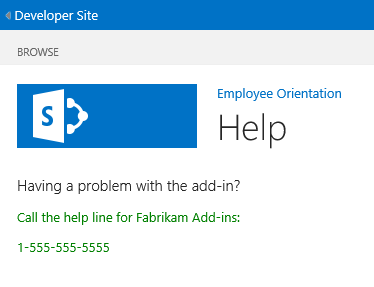

# Add a custom page and style to a SharePoint-hosted SharePoint Add-in

Learn how to include a custom page and CSS file in a SharePoint Add-in.
 
> [!NOTE]
> The name "apps for SharePoint" is changing to "SharePoint Add-ins." During the transition, the documentation and the UI of some SharePoint products and Visual Studio tools might still use the term "apps for SharePoint." For details, see [New name for apps for SharePoint](new-name-for-apps-for-sharepoint.md#bk_newname).

This is the seventh in a series of articles about the basics of developing SharePoint-hosted SharePoint Add-ins. You should first be familiar with [SharePoint Add-ins](sharepoint-add-ins.md) and the previous articles in this series:

-  [Get started creating SharePoint-hosted SharePoint Add-ins](get-started-creating-sharepoint-hosted-sharepoint-add-ins.md)

-  [Deploy and install a SharePoint-hosted SharePoint Add-in](deploy-and-install-a-sharepoint-hosted-sharepoint-add-in.md)

-  [Add custom columns to a SharePoint-hosted SharePoint Add-in](add-custom-columns-to-a-sharepoint-hosted-sharepoint-add-in.md)

-  [Add a custom content type to a SharePoint-hosted SharePoint Add-in](add-a-custom-content-type-to-a-sharepoint-hosted-sharepoint-add-in.md)

-  [Add a Web Part to a page in a SharePoint-hosted SharePoint Add-in](add-a-web-part-to-a-page-in-a-sharepoint-hosted-sharepoint-add-in.md)

-  [Add a workflow to a SharePoint-hosted SharePoint Add-in](add-a-workflow-to-a-sharepoint-hosted-sharepoint-add-in.md)
    
> [!NOTE]
> If you have been working through this series about SharePoint-hosted add-ins, you have a Visual Studio solution that you can use to continue with this topic. You can also download the repository at [SharePoint_SP-hosted_Add-Ins_Tutorials](https://github.com/OfficeDev/SharePoint_SP-hosted_Add-Ins_Tutorials) and open the BeforePage.sln file.

In this article, you add a help page to the Employee Orientation SharePoint Add-in and configure it to use a custom CSS stylesheet. 

## Add a page

1. In **Solution Explorer**, right-click the **Pages** folder and select **Add** > **New Item**. The **Add New Item** dialog opens to the **Office/SharePoint** node.

2. Select **Page** and give it the name **Help.aspx**. 

3. Find the two **asp:Content** elements in the file, and add the following third **asp:Content** markup in between them.
    
    ```HTML
      <asp:Content ContentPlaceHolderID="PlaceHolderPageTitleInTitleArea" runat="server">
        Help
      </asp:Content> 
    ```

4. Find the **asp:Content** element with the ID of **PlaceholderAdditionalPageHead**, and add the following markup to it.
    
    ```HTML
      <link rel="Stylesheet" type="text/css" href="../Content/App.css" />
    ```

5. Find the **asp:Content** element with the ID of **PlaceHolderMain**, and remove any child elements in it.

6. Add the following as content to the same **asp:Content** element.
    
    ```HTML
      <H3>Having a problem with the add-in?</H3>
      <p>Call the help line for Fabrikam Add-ins:</p>
      <p>1-555-555-5555</p>
    ```

7. Save and close the file.

8. Open the Default.aspx file.

9. Find the **asp:Content** element with the ID of **PlaceHolderMain**, and then add the following markup to the end of it. 
    
    ```HTML
      <p><asp:HyperLink runat="server" NavigateUrl="JavaScript:window.location = _spPageContextInfo.webAbsoluteUrl + '/Pages/Help.aspx';" 
        Text="Get help for the Employee Orientation add-in" /></p>
    ```

10. Save and close the file.

## Add a style class to the stylesheet

1. In **Solution Explorer**, open the app.css file in the **Contents** folder, and then add the following line to the file.
    
    ```
      p {color: green;}
    ```

2. Save and close the file.

## Run and test the add-in

1. Use the F5 key to deploy and run your add-in. Visual Studio makes a temporary installation of the add-in on your test SharePoint site and immediately runs the add-in. 

2. When the add-in's default page opens, select the **Get help for the Employee Orientation add-in** link to open the **Help** page.
    
   Your custom page opens and the two lines that you put in <p> tags are green.

   *Figure 1. Help page*

   

3. To end the debugging session, close the browser window or stop debugging in Visual Studio. Each time that you select F5, Visual Studio will retract the previous version of the add-in and install the latest one.

4. You will work with this add-in and Visual Studio solution in other articles, and it's a good practice to retract the add-in one last time when you are done working with it for a while. Right-click the project in **Solution Explorer** and select **Retract**.

## Next steps
<a name="Nextsteps"> </a>

In the next article in this series, you'll [add custom client-side rendering to a SharePoint-hosted SharePoint Add-in](add-custom-client-side-rendering-to-a-sharepoint-hosted-sharepoint-add-in.md).
 

 

