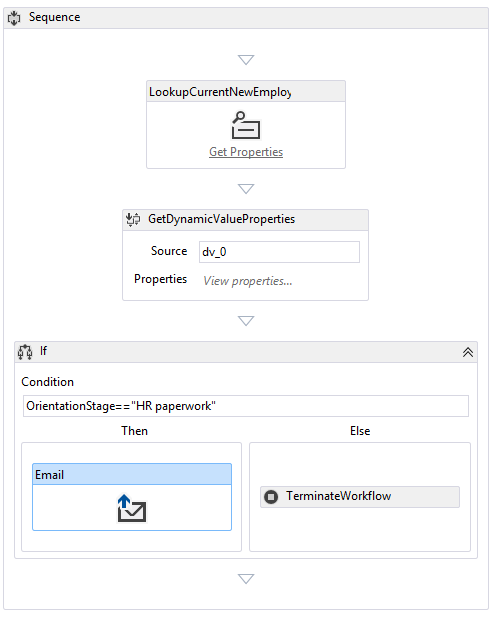

# Add a workflow to a SharePoint-hosted SharePoint Add-in
Learn how to include a workflow in a SharePoint Add-in.
 
> **Note**  The name "apps for SharePoint" is changing to "SharePoint Add-ins". During the transition, the documentation and the UI of some SharePoint products and Visual Studio tools might still use the term "apps for SharePoint". For details, see  [New name for apps for Office and SharePoint](new-name-for-apps-for-sharepoint.md#bk_newname).
 
This is the sixth in a series of articles about the basics of developing SharePoint-hosted SharePoint Add-ins. You should first be familiar with  [SharePoint Add-ins](sharepoint-add-ins.md) and the previous articles in this series:
 
-  [Get started creating SharePoint-hosted SharePoint Add-ins](get-started-creating-sharepoint-hosted-sharepoint-add-ins.md)
   
-  [Deploy and install a SharePoint-hosted SharePoint Add-in](deploy-and-install-a-sharepoint-hosted-sharepoint-add-in.md)
    
-  [Add custom columns to a SharePoint-hostedSharePoint Add-in](add-custom-columns-to-a-sharepoint-hostedsharepoint-add-in.md)
    
-  [Add a custom content type to a SharePoint-hostedSharePoint Add-in](add-a-custom-content-type-to-a-sharepoint-hostedsharepoint-add-in.md)
    
-  [Add a Web Part to a page in a SharePoint-hosted SharePoint Add-in](add-a-web-part-to-a-page-in-a-sharepoint-hosted-sharepoint-add-in.md)

> **Note**  If you have been working through this series about SharePoint-hosted add-ins, then you have a Visual Studio solution that you can use to continue with this topic. You can also download the repository at  [SharePoint_SP-hosted_Add-Ins_Tutorials](https://github.com/OfficeDev/SharePoint_SP-hosted_Add-Ins_Tutorials) and open the BeforeWorkflow.sln file.

In this article you add a workflow the Employee Orientation SharePoint Add-in that notifies the Human Resources (HR) department that a new employee is ready to fill out the HR paperwork.

## Add a workflow to an add-in

1. In **Solution Explorer**, right-click the project and select **Add** > **New Folder**. Name the folder Workflows.
    
2. Right-click the new folder and select **Add** > **New Item**. The **Add New Item** dialog opens to the **Office/SharePoint** node.
    
3. Select **Workflow** and give it the name **HR_Intake**. When prompted to select the type of workflow, select **List Workflow**, and then select **Next**. 
 
4. On the next page of the wizard, enable the **Yes, associate ...** option, and then set the drop-down controls to the following values:
    
   -  **The library or list to associate your workflow with**: New Employees in Seattle
   -  **The history list**: `<create new>`
   -  **The Task list**: `<create new>`

5. Click  **Next**.
    
6. On the last page of the wizard, enable *only* the option to start the workflow automatically when an item is *changed*.
    
7. Select **Finish**.
    
   The Office Developer Tools for Visual Studio then does the following:
      - Creates an HR_Intake workflow in the **Workflow** folder, with a child Workflow.xaml file that is open in the workflow designer.
      - Creates a **WorkflowTaskList** list instance where tasks that are part of the workflow are created and updated.
      - Creates a **WorkflowHistoryList** list instance, which is a log of the various steps in each execution of the workflow as they occur.
    
8. Drag the two new list instances into the  **Lists** folder.
    
## Design the workflow

The workflow sends an email to notify an HR staffer that the new employee has finished the  **Tour of building** stage of orientation and is ready to fill out the HR intake paperwork. Any change in an existing item on theNew Employees in Seattle list triggers the workflow, but the workflow does nothing unless theOrientation Stage field of the list item is set toHR paperwork. If it is, then an email is sent to an HR staffer and a task for that employee will be added to the  **WorkflowTaskList**. 

> **Note**  At various times when designing your workflow, a blue diamond symbol with an exclamation mark in it (  ) will appear on one or more items in the workflow designer. These report temporary errors. (Hover the cursor over the symbol to see a brief message, or look in the Visual Studio  **Error List** for details.) These are side effects of the incompleteness of the workflow. They should all be gone when you have finished this procedure.

1. Open the  **Toolbox** pane in Visual Studio, expand the **SP - List** node, and then drag **LookupSPListItem** into the **Sequence** in the designer.
    
2. Select the  **LookupSPListItem** so that its properties appear in the Visual Studio **Properties** pane. Set the following properties to these values:
    
   -  **ItemID:** (current item)
   -  **ListID:** (current list)
   -  **DisplayName:** LookupCurrentNewEmployee

   The  **Properties** pane should now look like the following:
   
    *Properties pane of LookupSPListItem*

    
 

   Click anywhere outside the pane to save your changes and the designer surface should now look like this.
    
   *Sequence in the workflow designer*

   

3. Click the **Get Properties** link inside the (newly renamed) LookupCurrentNewEmployee activity in the designer. This adds a **GetDynamicValueProperties** activity to the sequence.
    
4. Click the **Define…** text in the **GetDynamicValueProperties** activity. This will open the **Properties** dialog.
    
5. Set the **Entity Type** to **List Item of** _list_instance_name_, where _list_instance_name_ is **New Employees in Seattle**.
    
6. In the **Path** column, click the top cell and then choose **Orientation Stage** from the drop-down.
 
7. Click the cell below it, and then choose **Title (Title)** from the drop-down.
 
8. Click **Populate Variables**. This will create variables named **OrientationStage** and **Title** and assign each of the values of the corresponding fields in the current item of the **New Employees in Seattle** list. The **Properties** dialog should now look like the following:
    
   *Properties dialog of workflow activity*

   
 

9. Choose **OK**. The designer surface should now look like the following:
    
   *Workflow designer*

   

10. Open the **Toolbox** pane in Visual Studio, expand the **Control Flow** node, and then drag **If** into the bottom of the **Sequence** below the **GetDynamicValueProperties**.
 
11. In the **Condition** box of the **If**, enter **OrientationStage=="HR paperwork"**.
    
12. Open the **Toolbox** pane in Visual Studio, expand the **SP - Utilities** node, and then drag **Email** into the **Then** box of the **If** activity.
    
13. Select the  **Email** activity. In the **Properties** pane, set the values of the **Body**, **Subject**, and **To** properties. In each case, choose the callout button, **. . .**, for the property and use the  **Expression Editor** that opens to set the property's value as in the following table. These are C# string expressions, so use quotation marks exactly as shown. The `Title` here is a variable that you assigned earlier to the **Title** field of the list item (which holds the name of the employee).
    
    -  **Body:** `Title + " is waiting in the lobby to fill out benefits and employment forms."`
    -  **Subject:** `Title + " is ready for HR paperwork"`
    -  **To:** `new System.Collections.ObjectModel.Collection<string>() {"your_O365_email"}`
    
    Replace the placeholder, *your_O365_email*, with the identity that you use to sign in to your Office 365 developer account, such as `*alias*@*O365domain*.sharepoint.com`. This is a C# string so it must be in quotation marks.
    
14. Open the **Toolbox** pane in Visual Studio, expand the **Runtime** node, and then drag **TerminateWorkflow** into the **Else** box of the **If** activity.
    
15. Select the  **TerminateWorkflow** activity and in the **Properties** pane, set the **Reason** to the following, *including the quotation marks*: `"Not at HR paperwork stage."`. The designer should now look the following:
    
    *Workflow designer when the workflow is complete*

    
 

## Run and test the add-in

1. Use the F5 key to deploy and run your add-in. Visual Studio makes a temporary installation of the add-in on your test SharePoint site and immediately runs the add-in. The Workflow Manager's  **Test Service Host** console also opens.
    
2. When the add-in's default page opens, open one of the items for editing, and set the value of Orientation Stage toHR paperwork. 
    
   In the  **Test Service Host** console, an indication appears that the workflow has started. Shortly after, there is an indication that the workflow has completed. The following is an example:
 
   *Service Test Host console*

   
 
   > **Note**  If the  **Test Service Host** console does not open, you may need to enable workflow debugging. Right-click the project name in **Solution Explorer** and choose **Properties**. Open the  **SharePoint** tab on the **Properties** pane and check the box for **Enable Workflow debugging**.

3. Navigate to the email inbox (Outlook) of your Office 365 developer account. There is an email with the subject "*Employee* is ready for HR paperwork" where *Employee* is the name of the employee whose item you edited. The body of the email says "*Employee* is waiting in the lobby to fill out benefits and employment forms." The following is an example:
    
   *Email sent by workflow*

   

   > [!Tip]
   > If the workflow begins but never completes, and the email is not sent, try ending the debugging session and trying F5 again a few times before you conclude there is something wrong in your code. Sometimes the problem is in SharePoint Online. If you are still having problems, try adding a content type called **ListFieldsContentType**, if there isn't one already, to the **ContentTypes** section of the schema.xml file. The following is an example of the markup: 
   > `<ContentType ID="0x0100781dd48170b94fdc9706313c82b3d04c" Name="ListFieldsContentType" Hidden="TRUE">` `</ContentType>`
   > Copy the whole of the **FieldRefs** section of the **NewEmployee** content type into this new content type. Save the project, retract, and try F5 again.

4. To end the debugging session, close the browser window or stop debugging in Visual Studio. Each time that you press F5, Visual Studio will retract the previous version of the add-in and install the latest one.
    
5. You will work with this add-in and Visual Studio solution in other articles, and it's a good practice to retract the add-in one last time when you are done working with it for a while. Right-click the project in **Solution Explorer** and choose **Retract**.
    

## Next steps

In the next article in this series, you'll add a custom page and style to the SharePoint Add-in:  [Add a custom page and style to a SharePoint-hosted SharePoint Add-in](add-a-custom-page-and-style-to-a-sharepoint-hosted-sharepoint-add-in.md).
 

 

