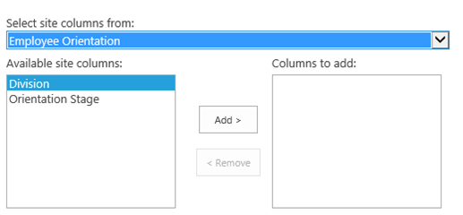

# Add custom columns to a SharePoint-hostedSharePoint Add-in
Learn how to include custom columns in an SharePoint Add-ins.
 

 **Note**  The name "apps for SharePoint" is changing to "SharePoint Add-ins". During the transition, the documentation and the UI of some SharePoint products and Visual Studio tools might still use the term "apps for SharePoint". For details, see  [New name for apps for Office and SharePoint](new-name-for-apps-for-sharepoint.md#bk_newname).
 

This is the third in a series of articles about the basics of developing SharePoint-hosted SharePoint Add-ins. You should first be familiar with  [SharePoint Add-ins](sharepoint-add-ins.md) and the pervious articles in this series:
 

-  [Get started creating SharePoint-hosted SharePoint Add-ins](get-started-creating-sharepoint-hosted-sharepoint-add-ins.md)
    
 
-  [Deploy and install a SharePoint-hosted SharePoint Add-in](deploy-and-install-a-sharepoint-hosted-sharepoint-add-in.md)
    
 

 **Note**  If you have been working through this series about SharePoint-hosted add-ins, then you have a Visual Studio solution that you can use to continue with this topic. You can also download the repository at  [SharePoint_SP-hosted_Add-Ins_Tutorials](https://github.com/OfficeDev/SharePoint_SP-hosted_Add-Ins_Tutorials) and open the BeforeColumns.sln file.
 

In this article we get back to coding by adding some site columns to the Employee Orientation SharePoint Add-in.
 

## Create custom column types


 

 

1. In  **Solution Explorer**, right-click the project and choose  **Add** > **New Folder**. Name the folder Site Columns.
    
 
2. Right-click the new folder and choose  **Add** > **New Item**. The  **Add New Item** dialog opens to the **Office/SharePoint** node.
    
 
3. Choose  **Site Column**, give it the name Division, and choose  **Add**.
    
 
4. In the elements.xml file for the new site column, edit the  **Field** element so that it has the attributes and values shown in the following example, except that *you should  **not** change the GUID*  for the **ID** attribute from the value that Visual Studio generated for it, *so be careful if you are using copy-and-paste*  .
    
  ```
  <Field ID="{generated GUID}" 
       Name="Division" 
       Title="Division" 
       DisplayName="Division" 
       Description="The division of the company where the employee works." 
       Group="Employee Orientation" 
       Type="Text" 
       Required ="FALSE">
</Field>
  ```

5. Add another  **Site Column** to the same folder namedOrientationStage.
    
 
6. In the elements.xml file for the new site column, edit the  **Field** element so that it has the attributes and values shown in the following example, except that you should not change the GUID for the **ID** attribute from the value that Visual Studio generated for it.
    
  ```
  <Field ID="{generated GUID}" 
       Name="OrientationStage" 
       Title="OrientationStage"
       DisplayName="Orientation Stage" 
       Group="Employee Orientation" 
       Description="The current orientation stage of the employee." 
       Type="Choice"
       Required ="TRUE">
</Field>
  ```

7. Because this is a Choice field, you must specify the possible choices and the order in which they should appear in the drop-down list when a user is making a choice. And because it is a required field, you must specify a default value. Add the following child markup to the  **Field** element.
    
  ```
  <CHOICES>
      <CHOICE>Not Started</CHOICE>
      <CHOICE>Tour of building</CHOICE>
      <CHOICE>HR paperwork</CHOICE>
      <CHOICE>Corporate network access</CHOICE>
      <CHOICE>Completed</CHOICE>
</CHOICES>
<MAPPINGS>
      <MAPPING Value="1">Not Started</MAPPING>
      <MAPPING Value="2">Tour of building</MAPPING>
      <MAPPING Value="3">HR paperwork</MAPPING>
      <MAPPING Value="4">Corp network access</MAPPING>
      <MAPPING Value="5">Completed</MAPPING>
</MAPPINGS>
<Default>Not Started</Default>
  ```

8. Save all files.
    
 

## Run the add-in and test the columns


 

 

1. Use the F5 key to deploy and run your add-in. Visual Studio makes a temporary installation of the add-in on your test SharePoint site and immediately runs the add-in. 
    
 
2. When the add-in's default page opens, choose the  **New Employees in Seattle** link to open the custom list instance.
    
 
3. Open the list's  **Settings** page and add the two columns to it with these steps.
    
      1. Click the callout button,  **· · ·**, just above the list, and then choose  **Create View**.
    
 
  2. The  **View Type** page opens, with the breadcrumb structure **Settings > View Type** near the top. Click the **Settings** breadcrumb.
    
    **Steps to open the list settings page**

 

     
 

    
    
 
  3. On the  **Settings** page, open the **Add from existing site columns** link on the left about halfway down the page.
    
    **List settings page**

 

     
 

    
    
 
  4. On the  **Add Columns from Site Columns** page, choose **Employee Orientation** on the **Select site columns from** drop down list.
    
    **Add Columsn from Site Columns page**

 

     
 

    
    
 
  5. Add the  **Division** and **OrientationStage** columns to the **Columns to add** box.
    
 
  6. Choose  **OK** to return to the **Settings** page, and then click the **New Employees in Seattle** breadcrumb near the top of the page.
    
 
4. The new columns are now on the list. Add a new item to the list. On the edit form, the  **Orientation Stage** field will already have the default valueNot Started. (The existing items will be blank in this field because they were created before the field was on the list.)
    
    **The list with new columns**

 

     
 

    
    
 
5. To end the debugging session, close the browser window or stop debugging in Visual Studio. Each time that you press F5, Visual Studio will retract the previous version of the add-in and install the latest one.
    
 
6. You will work with this add-in and Visual Studio solution in other articles, and it's a good practice to retract the add-in one last time when you are done working with it for a while. Right-click the project in  **Solution Explorer** and choose **Retract**.
    
 

## 
<a name="Nextsteps"> </a>

You don't really want your users to have to manually add the custom columns to the list, so in the next article in this series, you'll create a custom content type that includes the custom columns and is automatically associated with the New Employees list template:  [Add a custom content type to a SharePoint-hostedSharePoint Add-in](add-a-custom-content-type-to-a-sharepoint-hostedsharepoint-add-in.md). 
 

 

